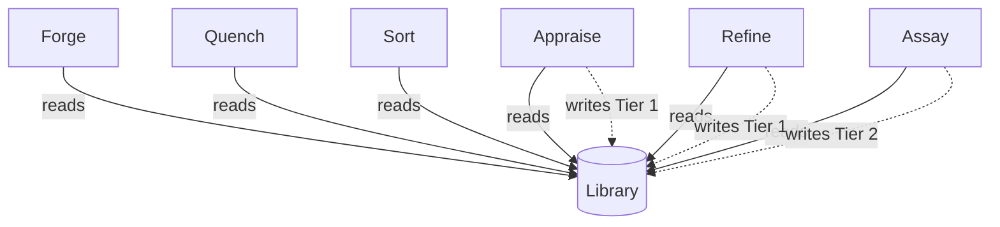
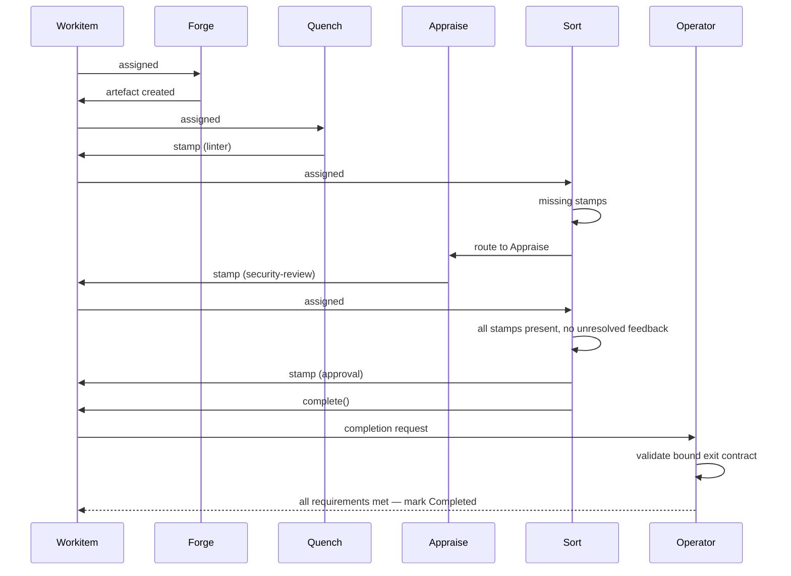
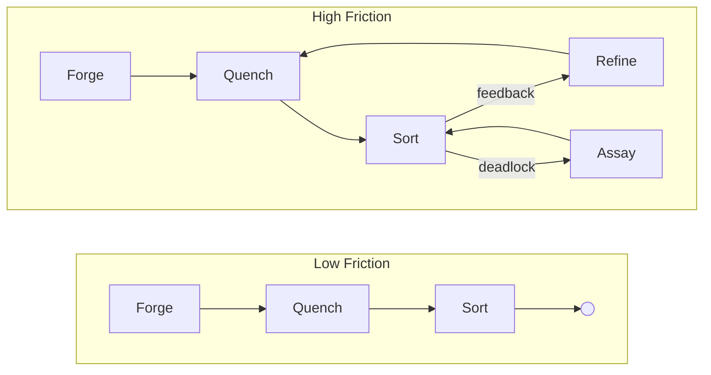

# Foundry Flow: Conceptual Overview

## What is Foundry Flow?

Foundry Flow is a governed workflow runtime on Kubernetes. It orchestrates work through adversarial cycles of creation, validation, review, and refinement — producing artefacts that carry cryptographic proof of every check they passed.

The core premise is simple: all agents are fallible. The framework verifies execution regardless of the agent's nature — human, AI, or deterministic. Every action is recorded, every decision is traceable, and every output carries a verifiable record of the governance it survived.

---

## Foundational Axioms

**Assume Unreliability.** All agents — human or AI — are fallible. The framework provides a safety harness. Trust intent, verify execution. Competent actors are protected from systemic complexity and their own blind spots.

**Make Work Auditable.** Every action, decision, and review becomes an immutable, traceable record. If it happened, there is a record.

**Make the Cost Visible.** Friction is a first-class, quantifiable signal exposing the real-time cost of bad systems — whether the actors are human, AI, or both. The Friction Ledger quantifies governance cost as actionable, real-time data.

**Quality is Fixed, Cost is Variable.** Work cannot leave a Flow until its artefacts carry the required stamps. The standard is non-negotiable. What the framework measures is the cost of achieving it. If that cost is too high, the system — the laws, the topology, the nodes — needs to change.

---

## Core Concepts

**Flow** — A self-contained runtime in a single Kubernetes namespace. One namespace, one Flow. All state, storage, governance, and execution live within the boundary.

**[Workitem](./02-data-model.md#workitems)** — The unit of work. A Workitem carries state and references artefacts managed by the [Archivist](../02-flow/04-system-services.md). Feedback, stamps, and version history live in the Archivist, scoped to artefact `id` and tagged to specific versions.

**[Node](../03-node/00-overview.md)** — A stateless worker. Node pods persist for efficiency (model loading, connection pools), but execution state is rebuilt from the Workitem and Archivist each time. A node that sees a Workitem for the second time treats it as a stranger.

**[Artefact](./02-data-model.md#artefacts)** — A governed output. Versioned, content-addressed, and stored in the Archivist. An artefact could be a document, a code file, a data model — anything the Flow produces.

**[Passport](./02-data-model.md#passports-and-stamps)** — The collection of [stamps](#stamps) on an artefact version. A passport tracks which stamp requirements have been satisfied for a specific content hash.

### Stamps

A **stamp** is a named governance checkpoint on an artefact's passport. Each stamp records:

- The **stamp name** — which checkpoint this satisfies (e.g. "linter", "security-review", "approval").
- The **node** that applied it (for audit).
- The **content hash** of the artefact at stamp time.
- A **cryptographic signature** and certificate chain.

Stamp names are defined by the GovernedArtefact CRD — the artefact declares which stamps it requires. The Flow grants nodes permission to apply specific named stamps via the FoundryNode CRD's capabilities. The system treats all stamps identically; the semantic meaning of a stamp name is a convention chosen by the Flow Architect.

Stamps are write-once per artefact version. If two different nodes need to sign off independently, the Flow Architect defines two different stamps. Stamps are version-specific: if the artefact content changes, existing stamps remain with the old version and the new version starts with no stamps.

**[Feedback](./02-data-model.md#feedback)** — Structured annotations on artefacts. Threaded, with forced-choice resolution: when addressing contradictory feedback, a node must either cite existing law or propose a novel argument. Every disagreement is explicit and justified.

**[Law](./02-data-model.md#laws)** — A governance rule with a textual **goal** — what it enforces, stops, or ensures. A law can carry one or more **representations** (prose, formal logic, executable code, or anything else), all expressing the same goal. The [Library](../02-flow/04-system-services.md) stores them all with equal indifference.

---

## The Foundry Cycle

The Foundry Cycle is the reference arrangement of node types in a governed workflow. Real deployments adapt it to their context — the node types are a vocabulary, and the topology is shaped by what the work requires. The pattern drives unreliable agents to produce artefacts that are provably compliant with a body of governance, through an adversarial loop of creation, validation, review, and refinement.

The standard library includes configurable reference implementations for each node type as container images. Flow Architects can extend them, adapt them, or implement completely custom nodes.

### Node Types

**Forge** creates the initial artefact. Before generation, it reads the Flow's [constitution](#laws-and-the-library) — the full body of applicable law, filtered by artefact kind — and seeds it into its context, so the creator knows the rules before it starts. Forge reads laws exclusively; writing laws belongs to downstream nodes.

**Quench** performs deterministic validation. It queries the constitution for executable representations of applicable laws — formal logic, constraint schemas, compiled checks — and runs them against the artefact to verify deterministic compliance before it reaches the more expensive review stage. Quench is optional — topologies that rely exclusively on non-deterministic review can omit it.

**Appraise** conducts subjective review. It reads the Flow's constitution for the applicable artefact kind and orchestrates a panel of specialist reviewers (AI agents, human reviewers, or both) who evaluate the artefact against it. Appraise intentionally preserves contradictions in its feedback — resolving them is Refine's job. In the reference arrangement, Appraise has the `WRITE:law/finding` capability and can record Tier 1 Findings.

**Sort** is the central routing hub. Granted the `READ:flow` capability, it reads the Flow configuration to discover which nodes can provide which stamps, then applies deliberately simple logic:

1. Is there unresolved feedback that is not deadlocked? Route to **Refine**.
2. Is feedback deadlocked (arguing in circles)? Route to **Assay**.
3. Missing required stamps? Route to the node configured to provide them (Appraise, in the reference arrangement).
4. All feedback resolved, all required stamps present? Stamp **approval**, call `complete()`, and let the Operator validate the bound exit contract before marking **Done**.

Sort is a gate. It evaluates state, consults the Flow config for routing targets, and, in the reference arrangement, acts as the exit-bound node: it stamps approval when the passport is complete and all feedback is resolved, then calls `complete()`.

**Refine** addresses feedback. It reads the Flow's constitution for the applicable artefact kind, reviews the consolidated (potentially contradictory) feedback, produces a new artefact version, and must address every item — marking each as *actioned* or *Won't Fix*. A Won't Fix requires a structured justification: either a citation of existing law or a novel argument proposing new reasoning. In the reference arrangement, Refine has the `WRITE:law/finding` capability and can record Tier 1 Findings.

**Assay** is the judiciary. It is invoked only when feedback deadlocks — when the same point has been argued back and forth beyond a threshold. Assay deliberates (potentially via a multi-agent jury), examines the investigative history, and resolves the dispute by minting Tier 2 Rulings (binding precedent) — the ceiling of its judicial authority. For Tier 3 conflicts, Assay drafts a proposal for human ratification. For Tiers 4-5, Assay files an appeal to the [Governance Flow](./03-governance.md).

Assay is built into the runtime — every Flow includes it — and Sort routes Workitems to it when disputes require judicial review.

### Cycle Flow

```mermaid
flowchart LR
    Start(( )) --> Forge
    Forge --> Quench
    Quench --> Sort

    Sort -->|unresolved (not deadlocked)| Refine
    Sort -->|needs review| Appraise
    Sort -->|deadlock| Assay
    Sort -->|all clear| Done(( ))

    Appraise --> Sort
    Refine --> Quench
    Assay --> Sort
```

In the reference arrangement, Refine routes back through Quench — deterministic validation runs again on the revised artefact. Topologies without Quench route Refine directly to Sort. Assay routes back through Sort, which re-evaluates the state after the ruling.

### Law Authority

All nodes in the cycle can **read** laws from the Library. Only some can **write**:



Forge reads laws for context seeding. Quench and Sort are read-only consumers. Appraise and Refine can record Tier 1 Findings (emergent patterns) — any node granted the `WRITE:law/finding` capability can do the same. Assay alone mints Tier 2 Rulings (binding precedent). Its full [authority ceiling](./03-governance.md#assays-authority-ceiling) is constitutionally bounded.

---

## The Governance Model

### Laws and the Library

A Flow's Library is its collective body of law — its constitution. Every law the Flow has ever discovered, enacted, or inherited lives here.

Each law has a **goal** — a plain-language statement of what it enforces, stops, or ensures — and one or more **representations**: prose, formal logic, executable code, or any other format. The Library stores all representations as part of a single law object with equal indifference. It cares only that a law exists and has a goal; interpretation belongs to the nodes that consume it.

Nodes query the Library for laws that apply to the artefact they are working on and request representations they can interpret. A review node reads prose and applies judgement. A validation node reads formal logic and runs a solver. Different nodes consume different representations of the same law through their own lens. The Library is one body of law; execution is eye of the beholder.

### Law Tiers

Laws are tiered by authority and lifecycle:

| Tier | Name | Source | Lifecycle |
|------|------|--------|-----------|
| 1 | **Finding** | Nodes (Appraise, Refine in the reference arrangement) | Ephemeral. Decays if uncited, promoted if heavily used. |
| 2 | **Ruling** | Assay Node | Binding precedent. Minted when disputes are resolved. |
| 3 | **Local Statute** | Flow Architect | Local policy. Human-administered or via local legislative cycle. |
| 4 | **State Constitution** | [Governance Flow](./03-governance.md) | Organisational policy. Applies to all Flows in the Governance Flow's instance. |
| 5 | **Federal Accord** | Federation | Cross-organisation. Synchronised from upstream Federal authorities. |

Tier 1 Findings are the raw material. They emerge from work — a reviewer notices a pattern, a refiner articulates a principle. If a Finding proves useful (cited frequently across Workitems), it can be promoted to a Tier 2 Ruling through the Assay Node. The [Citation Processor](../02-flow/04-system-services.md) tracks this usage — which laws are cited, by which nodes, and whether they generate compliance or resistance — driving the promotion lifecycle and surfacing toxic laws that generate disproportionate friction.

The system naturally hardens soft rules into strict ones. A Tier 1 Finding begins as prose and, when promoted, can acquire additional [representations](./02-data-model.md#representations) — formal logic, executable validators — through [Codification Services](../02-flow/04-system-services.md). Authority increases through the tier system; enforceability increases through representation.

### The Governance Flow

Tiers 1 and 2 emerge from within a Flow. Tier 3 is the Flow's own legislative authority. Tiers 4 and 5 arrive from above.

A standalone Flow (no Governance Flow) manages its own Tier 3 Local Statutes as CRDs applied by an administrator. Tiers 4 and 5 do not exist in this configuration.

Under a Governance Flow, the [Governance Flow](./03-governance.md) is a dedicated Flow whose governed artefacts are the laws themselves. It produces Tier 4 State Constitution laws through the same Foundry Cycle (Forge, Quench, Appraise, Sort, Refine, Assay) as any other Flow, and synchronises Tier 5 Federal Accords from upstream authorities. Sibling Flows receive these laws via their Librarians, ensuring every Flow in the organisation operates under a consistent body of higher-tier governance.

The Governance Flow also serves as the **State Root Certificate Authority**. It issues intermediate CA certificates to each Sibling Flow's Operator, establishing a shared trust hierarchy. Any stamp produced by any node in any sibling Flow is cryptographically verifiable by tracing the certificate chain back to the State Root.

---

## Verifiable Outcomes

The system verifies that work was done correctly. Deterministically.

### Passports and Stamps

As a Workitem moves through the cycle, nodes apply [stamps](#stamps) to the artefact's passport. Each stamp binds a governance checkpoint to a specific content hash with a cryptographic signature, making it independently verifiable. If the artefact content changes, existing stamps remain with the old version — governance starts over for the new content.

### Exit Contracts

Exit contracts are defined per governed artefact kind. For each kind, a contract specifies a list of required stamp names; an empty list means artefacts of that kind must be present but carry no specific stamps. A code artefact might require stamps named "linter", "security-review", and "approval". A log artefact might only need to exist. If a Workitem carries multiple artefacts of a required kind, all of them must satisfy that kind's requirement. The Flow grants nodes permission to apply specific named stamps via the FoundryNode CRD's capabilities. At the border, the exit-bound node calls `complete()`, and the Operator checks the bound exit contract against each required kind. If any requirement is unsatisfied, the Workitem cannot exit. When completion triggers cross-flow export, only artefacts whose kinds are listed in the bound exit contract are exported.



An artefact that exits a Flow carries cryptographic proof of every governance checkpoint it passed. Quality is proved.

---

## Friction

Friction is systemic heat. As Workitems move through a Flow, they generate friction everywhere they touch — bumping into nodes, bouncing off laws, looping through rework cycles, waiting on reviewers, escalating to the judiciary. Every interaction has a cost, and the system tracks it.

The Friction Ledger captures where and why heat builds up. A Workitem that flows smoothly generates low friction. One that thrashes — looping between Refine and Sort, escalating to Assay, timing out on a human reviewer — generates high friction. The ledger records the source: which nodes, which laws, which topology paths.



This gives organisations a quantifiable, real-time signal for dysfunction. The [Flow Monitor](../02-flow/04-system-services.md) aggregates friction data and tags it to its source — laws, nodes, topology paths — so it can be queried across every dimension. Which laws generate the most heat? Which nodes are bottlenecks? Where in the topology do Workitems thrash? Governance cost becomes data — quantified, attributable, and actionable.
