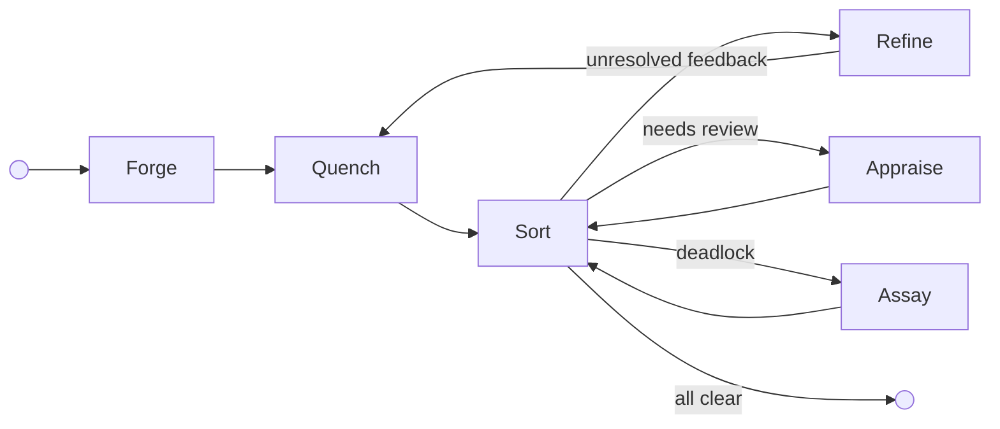
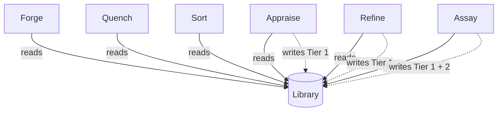
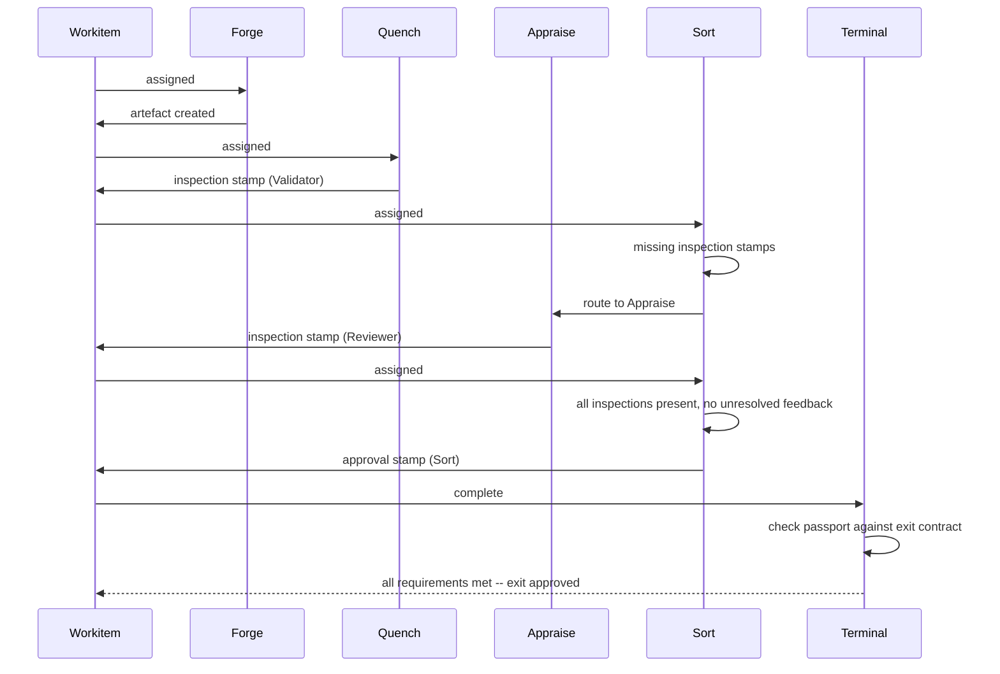
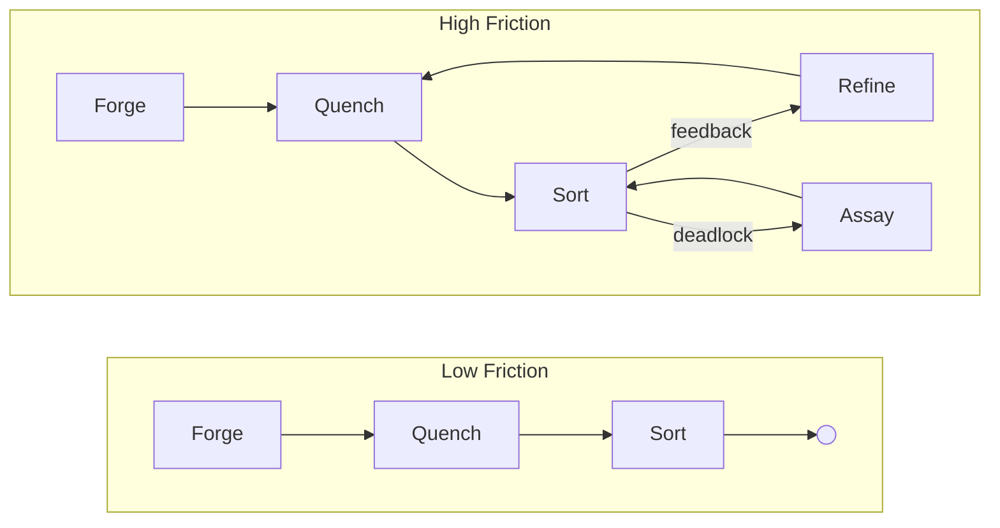

# Foundry Flow: Conceptual Overview

## What is Foundry Flow?

Foundry Flow is a governed workflow runtime on Kubernetes. It orchestrates work through structured cycles of creation, validation, review, and refinement -- producing artefacts that carry cryptographic proof of every check they passed.

The core premise is simple: all agents are fallible. Human reviewers miss things. AI models hallucinate. Compilers have edge cases. Foundry Flow replaces invisible trust with auditable proof. Every action is recorded, every decision is traceable, and every output carries a verifiable record of the governance it survived.

The system uses a legal and constitutional metaphor throughout its design. Governance rules are called *laws*. Disputes go to a *judiciary*. Precedent accumulates. This is a structural choice -- the metaphor maps cleanly onto the problem of governing unreliable agents at scale.

---

## Foundational Principles

**Assume Unreliability.** All agents -- human or AI -- are fallible. The framework provides a safety harness. Trust intent, verify execution. Competent actors are protected from systemic complexity and their own blind spots.

**Make Work Auditable.** Every action, decision, and review becomes an immutable, traceable record. Invisible trust-based processes are replaced with verifiable proof. If it happened, there is a record.

**Make the Cost Visible.** Friction is a first-class, quantifiable signal exposing the real-time cost of bad systems -- whether the actors are human, AI, or both. The Friction Ledger transforms abstract complaints about bureaucracy into actionable data.

**Quality is Fixed, Cost is Variable.** Work cannot leave a Flow until its artefacts carry the required stamps. The standard is non-negotiable. What the framework measures is the cost of achieving it. If that cost is too high, the system -- the laws, the topology, the nodes -- needs to change, not the standard.

---

## Core Concepts

**Flow** -- A self-contained runtime in a single Kubernetes namespace. One namespace, one Flow. All state, storage, governance, and execution live within the boundary.

**Workitem** -- The unit of work. A Workitem carries state, feedback, and an audit trail as it moves through the Flow. It *references* artefacts stored separately by the Archivist.

**Node** -- A stateless worker. Node pods persist for efficiency (model loading, connection pools), but execution state is rebuilt from the Workitem and Archivist each time. A node that sees a Workitem for the second time treats it as a stranger.

**Artefact** -- A governed output. Versioned, content-addressed, and stored in the Archivist. An artefact could be a document, a code file, a data model -- anything the Flow produces.

**Passport** -- The verification record attached to an artefact. A passport tracks which roles have stamped this artefact and for which version.

**Stamp** -- A mark left on a passport by a node. Two types:
- **Inspection** -- "I have checked this." Records that the node examined this version.
- **Approval** -- "I consider this valid." Certifies the artefact meets governance requirements from this role's perspective. Requires law citations.

Stamps carry a **role** -- the capacity in which the node stamped (e.g. "Validator", "Reviewer"). Roles are defined by the exit contract and granted to nodes by the Flow. Stamps are version-specific: if the artefact changes, the stamp no longer applies.

**Feedback** -- Structured annotations on artefacts. Threaded, with forced-choice resolution: when addressing contradictory feedback, a node must either cite existing law or propose a novel argument. Every disagreement is explicit and justified.

**Law** -- A governance rule in the Flow's Library. Laws can hold prose, formal logic, executable code, or anything else. The Library stores them all with equal indifference.

---

## The Foundry Cycle

The Foundry Cycle is the canonical arrangement of node types in a governed workflow. It drives unreliable agents to produce artefacts that are provably compliant with a body of governance, through an adversarial loop of creation, validation, review, and refinement.

### Node Types

**Forge** creates the initial artefact. Before generation, it queries the Library for applicable laws and seeds them into its context. This eliminates the "blind node" problem -- the creator knows the rules before it starts. Forge reads laws exclusively; writing laws belongs to downstream nodes.

**Quench** performs deterministic validation. It runs objective checks -- compilers, solvers, structural validators -- to catch fundamentally broken work before it reaches the more expensive review stage. Quench is optional and may be skipped for creative or ideation work.

**Appraise** conducts subjective review. It orchestrates a panel of specialist reviewers (AI agents, human reviewers, or both) who evaluate the artefact against applicable laws. Appraise intentionally preserves contradictions in its feedback -- resolving them is Refine's job. Can write Tier 1 Findings.

**Sort** is the central routing hub. Its logic is deliberately simple:
1. Is there unresolved feedback? Route to **Refine**.
2. Is feedback deadlocked (arguing in circles)? Route to **Assay**.
3. Has the artefact been reviewed? If missing required inspection stamps, route to **Appraise**.
4. All feedback resolved, all inspection stamps present? Stamp **approval** and **Done**.

Sort is a gate. It evaluates state, routes when work is incomplete, and stamps approval when the passport carries the required inspection stamps and all feedback is resolved.

**Refine** addresses feedback. It reads the consolidated (potentially contradictory) feedback, produces a new artefact version, and must resolve every item -- marking each as *actioned* or *wont-fix*. A *wont-fix* requires a structured justification: either a citation of existing law or a novel argument proposing new reasoning. Can write Tier 1 Findings.

**Assay** is the judiciary. It is invoked only when feedback deadlocks -- when the same point has been argued back and forth beyond a threshold. Assay deliberates (potentially via a multi-agent jury), examines the investigative history, and resolves the dispute. It can write Tier 1 Findings and Tier 2 Rulings (binding precedent).

### Cycle Flow

Refine always routes back through Quench -- deterministic validation runs again on the revised artefact. Assay routes back through Sort, which re-evaluates the state after the ruling.

### Law Authority

All nodes in the cycle can **read** laws from the Library. Only some can **write**:

Forge reads laws for context seeding. Quench and Sort are read-only consumers. Appraise and Refine can record Tier 1 Findings (emergent patterns). Assay alone can mint Tier 2 Rulings (binding precedent).

---

## The Governance Model

### Laws and the Library

A Flow's Library is its collective body of law -- its constitution. Every law the Flow has ever discovered, enacted, or inherited lives here.

Laws can be subjective, objective, or both. A subjective law might be a prose description: "the tone should feel welcoming." An objective law might be a formal constraint: "the output must contain exactly three sections." Both are first-class citizens. The Library stores them with equal indifference -- it cares only that a law exists, and leaves interpretation to the nodes that consume it.

Nodes query the Library for laws that apply to the artefact they are working on and interpret them through their own lens. A review node reads prose and applies judgement. A validation node reads formal logic and runs a solver. The same rule can exist in both forms, and different nodes will each use the version they understand. The Library is one body of law; execution is eye of the beholder.

### Law Tiers

Laws are tiered by authority and lifecycle:

| Tier | Name | Source | Lifecycle |
|------|------|--------|-----------|
| 1 | **Finding** | Nodes (Appraise, Refine, Assay) | Ephemeral. Decays if uncited, promoted if heavily used. |
| 2 | **Ruling** | Assay Node | Binding precedent. Minted when disputes are resolved. |
| 3 | Statute | Governance Flow | Organisational policy. Covered in [Governance Concepts](./03-governance.md). |
| 4 | Federal | Federal authority | Cross-organisation. Covered in [Governance Concepts](./03-governance.md). |

Tier 1 Findings are the raw material. They emerge from work -- a reviewer notices a pattern, a refiner articulates a principle. If a Finding proves useful (cited frequently across Workitems), it can be promoted to a Tier 2 Ruling through the Assay Node.

The system naturally hardens soft rules into strict ones. A vague Tier 1 Finding -- "this feels wrong" -- that keeps causing friction can be codified into a deterministic Tier 2 Ruling that is mathematically enforceable. What starts as a subjective vibe becomes objective physics.

---

## Verifiable Outcomes

The system verifies that work was done correctly. Deterministically.

### Passports and Stamps

As a Workitem moves through the cycle, nodes stamp the artefact's passport. Each stamp records:
- The **role** the node stamped as (the capacity granted to it by the Flow).
- The **type**: inspection or approval.
- The **content hash** of the artefact at stamp time.
- A **cryptographic signature** and certificate chain.

Inspection stamps record that a node examined the artefact. Approval stamps certify it meets requirements -- and must cite the specific laws that were satisfied. If the artefact content changes after a stamp, the hash no longer matches and the stamp is invalidated. Governance starts over for the new version.

### Terminal Contracts

The exit contract is defined per governed artefact. For each artefact the Flow produces, the contract specifies what the passport must carry: a set of required stamps (each with a role and type), or simply that the artefact must be present. A code artefact might require approval stamps from "Validator" and "Security Auditor". A log artefact might only need to exist. The Flow grants nodes permission to stamp as the required roles. At the border, the terminal contract checks each artefact's passport against its requirements. If any requirement is unsatisfied, the Workitem cannot exit.

An artefact that exits a Flow carries cryptographic proof of every check it passed and every role that signed off. Quality is proved.

---

## Friction

Friction is systemic heat. As Workitems move through a Flow, they generate friction everywhere they touch -- bumping into nodes, bouncing off laws, looping through rework cycles, waiting on reviewers, escalating to the judiciary. Every interaction has a cost, and the system tracks it.

The Friction Ledger captures where and why heat builds up. A Workitem that flows smoothly generates low friction. One that thrashes -- looping between Refine and Sort, escalating to Assay, timing out on a human reviewer -- generates high friction. The ledger records the source: which nodes, which laws, which topology paths.

This gives organisations a quantifiable, real-time signal for dysfunction. Friction data is tagged to its source -- laws, nodes, topology paths -- so it can be aggregated and queried. Which laws generate the most heat? Which nodes are bottlenecks? Where in the topology do Workitems thrash? "Bureaucracy" and "technical debt" stop being complaints and become data.
