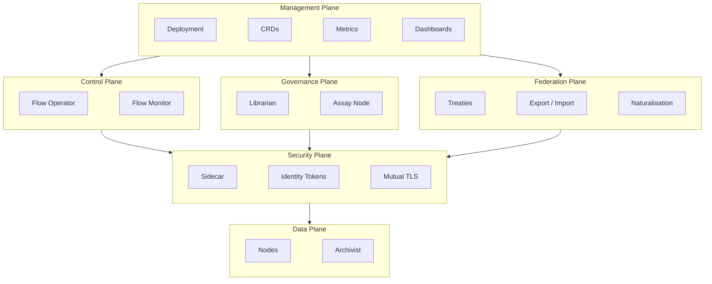

# Architecture

A [Flow](./00-overview.md) is a self-contained runtime in a single Kubernetes namespace. One namespace, one Flow. All state, storage, governance, and execution live within the boundary. The namespace is the sovereignty line — nothing enters or leaves without crossing a guarded border.

The internal structure separates into distinct planes, each owning a single concern.

---

## Architectural Planes

### Management Plane

Configuration, lifecycle, and observability. Configuration resources define the Flow's desired state, a metrics pipeline provides monitoring and dashboards, and retention policies handle housekeeping.

A Flow is deployed as a single unit. One deployment creates one namespace, installs the CRDs, deploys the [Flow Operator](../02-flow/01-operator.md) and [system services](../02-flow/04-system-services.md), and applies the singleton `FoundryFlow` configuration resource. Everything the Flow needs ships together, avoiding partial deployment states.

### Control Plane

Work assignment and routing decisions. The [Flow Operator](../02-flow/01-operator.md) is the Control Plane's central component — a state router that watches [Workitem](./02-data-model.md#workitems) CRDs, assigns them to [Nodes](../03-node/00-overview.md), and validates the terminal contract at the exit boundary. The [Thrash Guard](./02-data-model.md#thrash-guard) is part of the Operator's assignment logic — it tracks per-node visit counts on each Workitem and fails any Workitem whose total visit count across all nodes exceeds the configured threshold before it consumes unbounded resources.

The [Flow Monitor](../02-flow/04-system-services.md) aggregates telemetry from all components — metrics, distributed traces, audit events, and [friction](./00-overview.md) reports.

The Control Plane makes routing decisions but never executes work. It reads state and moves Workitems; Nodes do the rest.

### Data Plane

Where work happens. The Data Plane contains the [Nodes](../03-node/00-overview.md) that execute logic and the [Archivist](../02-flow/04-system-services.md) that manages artefact lifecycle — version history, [passport stamps](./02-data-model.md#passports-and-stamps), [feedback](./02-data-model.md#feedback), and raw content bytes.

Nodes are stateless workers — their pods persist for efficiency (model loading, connection pools), but execution state is rebuilt from the Workitem and Archivist on every assignment. A Node that sees a Workitem for the second time treats it as a stranger. The Workitem CRD carries artefact references (`id` and `kind`); the full version history, stamps, and feedback live in the Archivist.

Nodes have direct, uninhibited network access to external services. Network security is an infrastructure concern delegated to Kubernetes NetworkPolicies or service mesh configurations.

### Security Plane

Identity, authentication, and cryptographic trust. The Security Plane cross-cuts all other planes — a concern that runs through each of them, present wherever identity, authentication, or trust is exercised.

Its primary agent is the [Sidecar](../03-node/01-sidecar.md), injected into every Node pod. The Sidecar holds all credentials; the Node container itself is credential-free. Every authenticated request between a Node and the Flow's services passes through the Sidecar, which brokers identity on the Node's behalf.

[Passport stamps](./02-data-model.md#passports-and-stamps) are the Security Plane's output. When a Node stamps an artefact, the Sidecar computes the content hash, signs it with the Node's private key, and attaches the full certificate chain. The stamp is cryptographically bound to the artefact's content — if the content changes, the stamp is invalidated. Terminal contract verification traces each stamp's certificate chain back to the Flow's trust root.

Network reachability does not imply authorization. A pod that can reach a service still requires valid credentials to use it.

### Governance Plane

The legal lifecycle. The Governance Plane manages the discovery, enforcement, and evolution of [law](./02-data-model.md#laws) within the Flow.

The [Librarian](../02-flow/04-system-services.md) manages the Flow's body of [law](./02-data-model.md#laws) — storing, embedding, and serving laws to Nodes that query for applicable governance. The [Citation Processor](../02-flow/04-system-services.md) tracks which laws are actually used: how often they are cited, by which Nodes, and whether they generate compliance or resistance. This citation data drives law promotion (a heavily-cited Tier 1 Finding can be promoted to a Tier 2 Ruling) and identifies toxic laws that generate disproportionate [friction](./00-overview.md#friction).

The [Assay Node](./00-overview.md) provides judicial review. When feedback deadlocks — the same point argued back and forth beyond a threshold — Assay deliberates the dispute and issues a binding ruling. Precedent accumulates in the Library, and future Workitems are governed by it.

Tiers 1, 2, and 3 are local — they emerge from work within the Flow or from the Flow's own legislative authority. Tiers 4 and 5 arrive from the [Governance Flow](./03-governance.md), synchronised into each Flow's Library as organisational and federal policy. The Library stores all tiers with equal indifference; nodes query and interpret them the same way regardless of origin.

Laws are discovered, not just configured. Constitutional resistance is measurable. Judicial review is built in.

### Federation Plane

Cross-flow trust and collaboration. Flows are sovereign — a Workitem belongs to its namespace and cannot be moved. When work needs to cross a Flow boundary, it is exported from one Flow and imported into another as a new Workitem, with a full chain-of-custody reset at the border.

Cross-flow relationships are governed by distinct trust models:

**Federated trust** operates through the [Governance Flow](./03-governance.md). The Governance Flow acts as the State Root Certificate Authority, issuing intermediate CA certificates to each Sibling Flow's Operator. All Flows in the organisation share a common trust root, and any stamp from any sibling is cryptographically verifiable by tracing the certificate chain to the State Root. The Governance Flow also publishes Tier 4 State Constitution laws and synchronises Tier 5 Federal Accords, ensuring all sibling Flows operate under consistent higher-tier governance.

**Treaty-based trust** enables collaboration between Flows that do not share a Governance Flow — typically across organisational boundaries. A [Treaty](../02-flow/06-cross-flow.md) is a bilateral agreement between two Flows that permits Workitem export in one direction. The agreement is bilateral (both Flows consent to the terms), but the resulting trust is unidirectional — a treaty allowing Flow A to export to Flow B does not allow Flow B to export to Flow A. Two-way exchange requires two separate treaties. The receiving Flow pins the foreign Flow's CA certificate and whitelists specific node identities that may sign export bundles.

In both models, foreign stamps are preserved for audit but carry no local authority. The importing Flow applies a naturalisation stamp and begins a new chain of custody under its own trust root. Details of the export-import protocol are covered in [Cross-Flow Collaboration](../02-flow/06-cross-flow.md).

---

## Responsibility Boundaries

Each concern in the system maps to exactly one plane. When a Node executes work, it operates in the Data Plane. When the result needs routing, the Control Plane decides where it goes. When a law is cited, the Governance Plane records it. When a stamp is applied, the Security Plane signs it.

| Concern | Plane | Handler |
|---------|-------|---------|
| Work execution | Data | Node pods |
| Routing decisions | Control | Flow Operator |
| Artefact lifecycle | Data | Archivist |
| Law lifecycle | Governance | Librarian |
| Citation tracking | Governance | Citation Processor |
| Dispute resolution | Governance | Assay Node |
| Authentication | Security | Sidecar |
| Cryptographic stamps | Security | Sidecar |
| Telemetry and audit | Control | Flow Monitor |
| Cross-flow transfer | Federation | Export / Import |
| Tier 4/5 law authority | Federation | Governance Flow |
| Configuration and deployment | Management | CRDs, deployment tooling |

---

## Design Decisions

### One Namespace, One Flow

A Flow occupies exactly one Kubernetes namespace. The namespace is the isolation boundary — all CRDs, services, secrets, and storage are scoped to it. This is a singleton pattern: one deployment creates one namespace creates one Flow. There is no sharing of namespace resources between Flows and no multi-tenant namespace.

The namespace boundary also defines data sovereignty. Workitems, artefacts, and laws belong to their Flow. Cross-flow collaboration happens through the Federation Plane's export-import protocol, never through shared state.

### Sequential Processing

A Workitem is assigned to exactly one Node at a time. The `currentAssignee` field on the Workitem is a scalar, not a list — atomic ownership prevents race conditions in state transitions. The Operator's routing loop is linear: read state, pick a target, assign, wait for completion, repeat.

The Flow is a relay race. One baton, one runner.

When parallel execution is needed within a single step (querying multiple reviewers, running multiple validators), the Node handles it internally. A "fat node" can orchestrate concurrent work within its execution boundary — from the Flow's perspective, it is still one assignment.

### Stateless Workers

Node pods are persistent Kubernetes Deployments. They boot once, load expensive infrastructure (LLM model weights, connection pools, SDK caches), and process many Workitems over their lifetime. This eliminates cold-start latency.

But execution state is ephemeral. Each Workitem assignment starts fresh — the Node reads all context from the Workitem CRD and fetches artefact content from the Archivist. If a Workitem loops back to the same Node type after visiting other Nodes, it may land on a different pod replica. The Node has no memory of having seen it before.

Infrastructure state (the machinery) persists. Session state (the work) does not. Every Workitem is a stranger.

### Data Gravity

Workitems are immutable residents of their namespace. They do not move between Flows — they are copied. The [export-import protocol](../02-flow/06-cross-flow.md) creates a new Workitem in the receiving Flow with its own lifecycle, its own chain of custody, and its own governance. The original Workitem remains in its home Flow, completed.

Artefact content lives in the Archivist as content-addressed blobs. The Workitem CRD carries only artefact references — `id` and `kind` — enough for routing and terminal contract checks without carrying the full provenance. Version history, passport stamps, and feedback live in the Archivist's database, queryable through the [SDK](../03-node/02-sdk-core.md).

### Hybrid Persistence

State is split across storage layers, each chosen for its access pattern.

| Layer | Storage | Data | Access Pattern |
|-------|---------|------|----------------|
| State | CRDs | Workitems, Laws, FoundryFlow config, FoundryNode config | Watch-driven, strongly consistent |
| Governance Query | Embedded database — Librarian | Embeddings | Analytical, vector similarity search |
| Citation Tracking | Embedded database — Citation Processor | Citation ledger | Analytical, aggregation queries |
| Telemetry | Metrics pipeline — Flow Monitor | Friction Ledger, workitem lifecycle metrics, node health | Time-series queries, alerting |
| Artefact Provenance | Embedded database — Archivist | Artefact version history, passport stamps, feedback | Relational queries, lifecycle tracking |
| Blobs | Content-addressed store — Archivist | Artefact content (raw bytes) | Content-addressed read/write |

CRDs provide the watch-driven consistency the Operator needs for state transitions. The Librarian's embedded database provides the query capabilities needed for law embeddings and similarity search. The Citation Processor maintains its own embedded database for the citation ledger — tracking how often laws are cited and by which nodes. The Flow Monitor aggregates friction reports from nodes into time-series metrics and emits audit events to stdout as structured JSON for log aggregation — the Friction Ledger is a conceptual view over this data, queryable through dashboards. The Archivist's database stores all artefact provenance — version history, stamps, and feedback — as a single queryable layer. The Archivist's content-addressed store holds raw content bytes where they are cheap and durable.

### Zero-Trust Security

Every Node pod runs with a Sidecar that holds its cryptographic identity. The Node container has no credentials — it cannot authenticate to any Flow service directly. All authenticated communication passes through the Sidecar, which brokers identity on the Node's behalf using platform-native credentials and, in federated deployments, mutual TLS certificates.

In federated deployments, the trust chain is hierarchical: the [Governance Flow](./03-governance.md) holds the State Root CA and issues intermediate CA certificates to each Sibling Flow's Operator, which in turn issues mutual TLS certificates to its Node Sidecars. The resulting chain — Sidecar, Sibling Operator CA, State Root CA — makes every stamp verifiable across the entire organisation.

Passport stamps carry the Sidecar's signature and certificate chain, making them independently verifiable. The terminal contract checks stamps by validating the cryptographic chain — not by trusting the network path the Workitem travelled.

The Security Plane's presence in the Data Plane is the Sidecar. Its presence in the Governance Plane is the signed stamp. Its presence in the Control Plane is the authenticated API call. Security is a material that runs through every plane.
