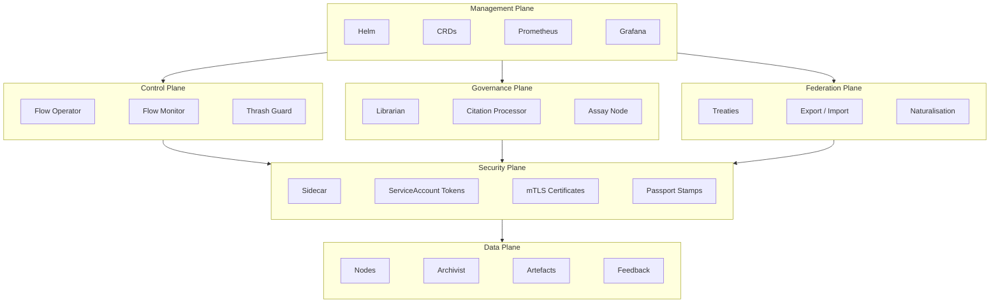

# Architecture

A [Flow](./00-overview.md) is a self-contained runtime in a single Kubernetes namespace. One namespace, one Flow. All state, storage, governance, and execution live within the boundary. The namespace is the sovereignty line — nothing enters or leaves without crossing a guarded border.

The internal structure separates into six planes, each owning a distinct concern. Four of them — Management, Control, Data, and Security — are standard infrastructure. The fifth, the Governance Plane, is what makes Foundry Flow a governed runtime. The sixth, the Federation Plane, extends trust across Flow boundaries.

---

## The Six Planes

### Management Plane

Configuration, lifecycle, and observability. This is the standard Kubernetes operational surface — Helm charts for deployment, CRDs for declarative state, Prometheus and Grafana for monitoring, retention policies for housekeeping.

A Flow is deployed as a single Helm release. One release creates one namespace, installs the CRDs, deploys the [Flow Operator](../02-flow/01-operator.md) and [system services](../02-flow/04-system-services.md), and applies the singleton `FoundryFlow` configuration resource. Everything the Flow needs ships together, avoiding partial deployment states.

### Control Plane

Work assignment and routing decisions. The [Flow Operator](../02-flow/01-operator.md) is the Control Plane's central component — a state router that watches [Workitem](./00-overview.md) CRDs, assigns them to [Nodes](./00-overview.md), and enforces the terminal contract at the exit boundary.

The [Flow Monitor](../02-flow/04-system-services.md) aggregates telemetry from all components — metrics, distributed traces, audit events, and [friction](./00-overview.md) reports. The Thrash Guard detects Workitems stuck in rework loops and fails them before they consume unbounded resources.

The Control Plane makes routing decisions but never executes work. It reads state and moves Workitems; Nodes do the rest.

### Data Plane

Where work happens. The Data Plane contains the [Nodes](./00-overview.md) that execute logic, the [Archivist](../02-flow/04-system-services.md) that stores artefact content, and the artefacts and feedback records themselves.

Nodes are stateless workers — their pods persist for efficiency (model loading, connection pools), but execution state is rebuilt from the Workitem and Archivist on every assignment. A Node that sees a Workitem for the second time treats it as a stranger. Large outputs are stored in the Archivist as content-addressed blobs; metadata and references travel with the Workitem CRD.

Nodes have direct, uninhibited network access to external services. Network security is an infrastructure concern delegated to Kubernetes NetworkPolicies or service mesh configurations.

### Security Plane

Identity, authentication, and cryptographic trust. The Security Plane cross-cuts all other planes — it is not a layer that sits beside them but a concern that runs through each of them.

Its primary agent is the [Sidecar](../03-node/01-sidecar.md), injected into every Node pod. The Sidecar holds all credentials; the Node container itself is credential-free. Every authenticated request between a Node and the Flow's services passes through the Sidecar, which brokers identity on the Node's behalf.

[Passport stamps](./00-overview.md) are the Security Plane's output. When a Node stamps an artefact, the Sidecar computes the content hash, signs it with the Node's private key, and attaches the full certificate chain. The stamp is cryptographically bound to the artefact's content — if the content changes, the stamp is invalidated. Terminal contract verification traces each stamp's certificate chain back to the Flow's trust root.

Network reachability does not imply authorization. A pod that can reach a service still requires valid credentials to use it.

### Governance Plane

The legal lifecycle. Standard workflow systems provide the four planes above. The Governance Plane is what makes Foundry Flow a governed runtime.

The [Librarian](../02-flow/04-system-services.md) manages the Flow's body of [law](./00-overview.md) — storing, embedding, and serving laws to Nodes that query for applicable governance. The Citation Processor tracks which laws are actually used: how often they are cited, by which Nodes, and whether they generate compliance or resistance. This citation data drives law promotion (a heavily-cited Tier 1 Finding can be promoted to a Tier 2 Ruling) and identifies toxic laws that generate disproportionate [friction](./00-overview.md).

The [Assay Node](./00-overview.md) provides judicial review. When feedback deadlocks — the same point argued back and forth beyond a threshold — Assay deliberates the dispute and issues a binding ruling. Precedent accumulates in the Library, and future Workitems are governed by it.

Laws are discovered, not just configured. Constitutional resistance is measurable. Judicial review is built in.

### Federation Plane

Cross-flow trust and collaboration. Flows are sovereign — a Workitem belongs to its namespace and cannot be moved. When work needs to cross a Flow boundary, it is exported from one Flow and imported into another as a new Workitem, with a full chain-of-custody reset at the border.

[Treaties](../02-flow/06-cross-flow.md) govern which foreign Flows a receiving Flow will accept work from. A Treaty is a unilateral import permit: the receiver pins the foreign Flow's CA certificate and whitelists specific node identities that may sign export bundles. Trust is asymmetric — A trusting B does not imply B trusts A.

Foreign stamps are preserved for audit but carry no local authority. The importing Flow applies a naturalisation stamp and begins a new chain of custody under its own trust root. Details of the export-import protocol and trust model are covered in [Cross-Flow Collaboration](../02-flow/06-cross-flow.md).

---

## Responsibility Boundaries

Each concern in the system maps to exactly one plane. When a Node executes work, it operates in the Data Plane. When the result needs routing, the Control Plane decides where it goes. When a law is cited, the Governance Plane records it. When a stamp is applied, the Security Plane signs it.

| Concern | Plane | Handler |
|---------|-------|---------|
| Work execution | Data | Node pods |
| Routing decisions | Control | Flow Operator |
| Artefact storage | Data | Archivist |
| Law lifecycle | Governance | Librarian |
| Citation tracking | Governance | Citation Processor |
| Dispute resolution | Governance | Assay Node |
| Authentication | Security | Sidecar |
| Cryptographic stamps | Security | Sidecar |
| Telemetry and audit | Control | Flow Monitor |
| Cross-flow transfer | Federation | Export / Import |
| Configuration and deployment | Management | Helm, CRDs |

---

## Design Decisions

### One Namespace, One Flow

A Flow occupies exactly one Kubernetes namespace. The namespace is the isolation boundary — all CRDs, services, secrets, and storage are scoped to it. This is a singleton pattern: one Helm release creates one namespace creates one Flow. There is no sharing of namespace resources between Flows and no multi-tenant namespace.

The namespace boundary also defines data sovereignty. Workitems, artefacts, and laws belong to their Flow. Cross-flow collaboration happens through the Federation Plane's export-import protocol, never through shared state.

### Sequential Processing

A Workitem is assigned to exactly one Node at a time. The `currentAssignee` field on the Workitem is a scalar, not a list — atomic ownership prevents race conditions in state transitions. The Operator's routing loop is linear: read state, pick a target, assign, wait for completion, repeat.

The Flow is a relay race, not a scrum. One baton, one runner.

When parallel execution is needed within a single step (querying multiple reviewers, running multiple validators), the Node handles it internally. A "fat node" can orchestrate concurrent work within its execution boundary — from the Flow's perspective, it is still one assignment.

### Stateless Workers

Node pods are persistent Kubernetes Deployments. They boot once, load expensive infrastructure (LLM model weights, connection pools, SDK caches), and process many Workitems over their lifetime. This eliminates cold-start latency.

But execution state is ephemeral. Each Workitem assignment starts fresh — the Node reads all context from the Workitem CRD and fetches artefact content from the Archivist. If a Workitem loops back to the same Node type after visiting other Nodes, it may land on a different pod replica. The Node has no memory of having seen it before.

Infrastructure state (the machinery) persists. Session state (the work) does not. Every Workitem is a stranger.

### Data Gravity

Workitems are immutable residents of their namespace. They do not move between Flows — they are copied. The export-import protocol creates a new Workitem in the receiving Flow with its own lifecycle, its own chain of custody, and its own governance. The original Workitem remains in its home Flow, completed.

Artefact content lives in the Archivist as content-addressed blobs. Artefact metadata — hashes, version numbers, passport stamps — travels with the Workitem CRD. Large content is stored once and referenced by hash; it is never duplicated within a Flow.

### Hybrid Persistence

State is split across three storage layers, each chosen for its access pattern.

| Layer | Technology | Data | Access Pattern |
|-------|------------|------|----------------|
| State | etcd (CRDs) | Workitems, Laws, FoundryFlow config, FoundryNode config | Watch-driven, strongly consistent |
| Query | SQLite (sqlite-vec) | Embeddings, citation ledger, friction ledger | Analytical, vector similarity search |
| Blobs | PVC (Archivist) | Artefact content (bytes) | Content-addressed read/write |

etcd provides the watch-driven consistency the Operator needs for state transitions. SQLite provides the query capabilities the Librarian and Flow Monitor need for embeddings, citation tracking, and friction aggregation. The Archivist's PVC (or pluggable cloud backend) stores raw artefact bytes where they are cheap and durable.

### Zero-Trust Security

Every Node pod runs with a Sidecar that holds its cryptographic identity. The Node container has no credentials — it cannot authenticate to any Flow service directly. All authenticated communication passes through the Sidecar, which brokers requests using its ServiceAccount token (or, in federated deployments, its mTLS certificate issued by the Flow Operator acting as an Intermediate CA).

Passport stamps carry the Sidecar's signature and certificate chain, making them independently verifiable. The terminal contract checks stamps by validating the cryptographic chain — not by trusting the network path the Workitem travelled.

The Security Plane's presence in the Data Plane is the Sidecar. Its presence in the Governance Plane is the signed stamp. Its presence in the Control Plane is the authenticated API call. Security is not a layer — it is a material that runs through every plane.
