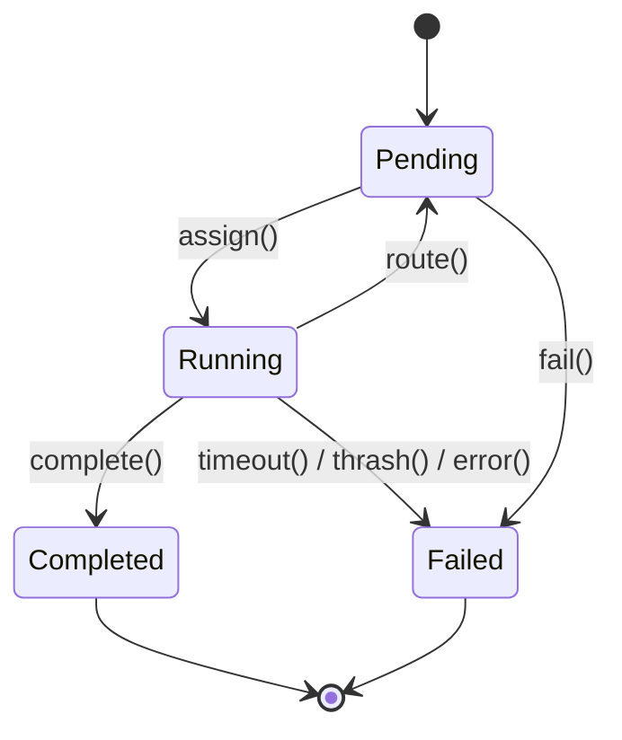
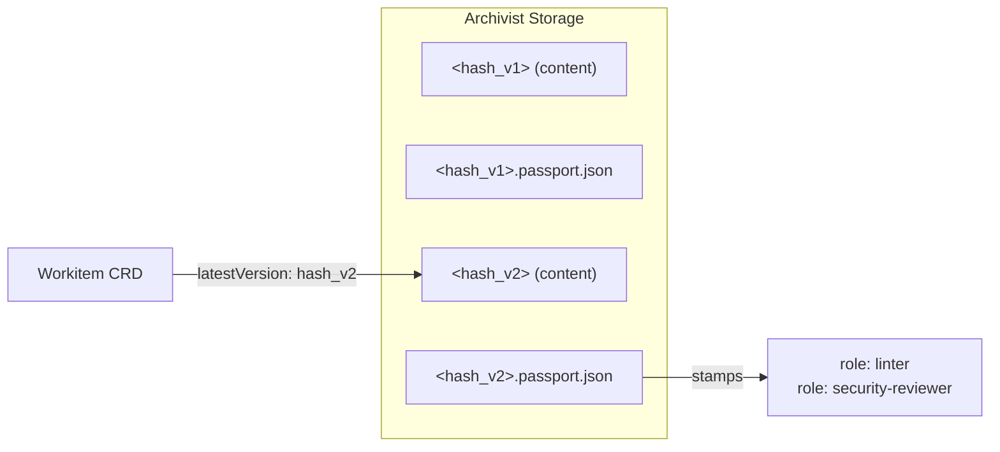
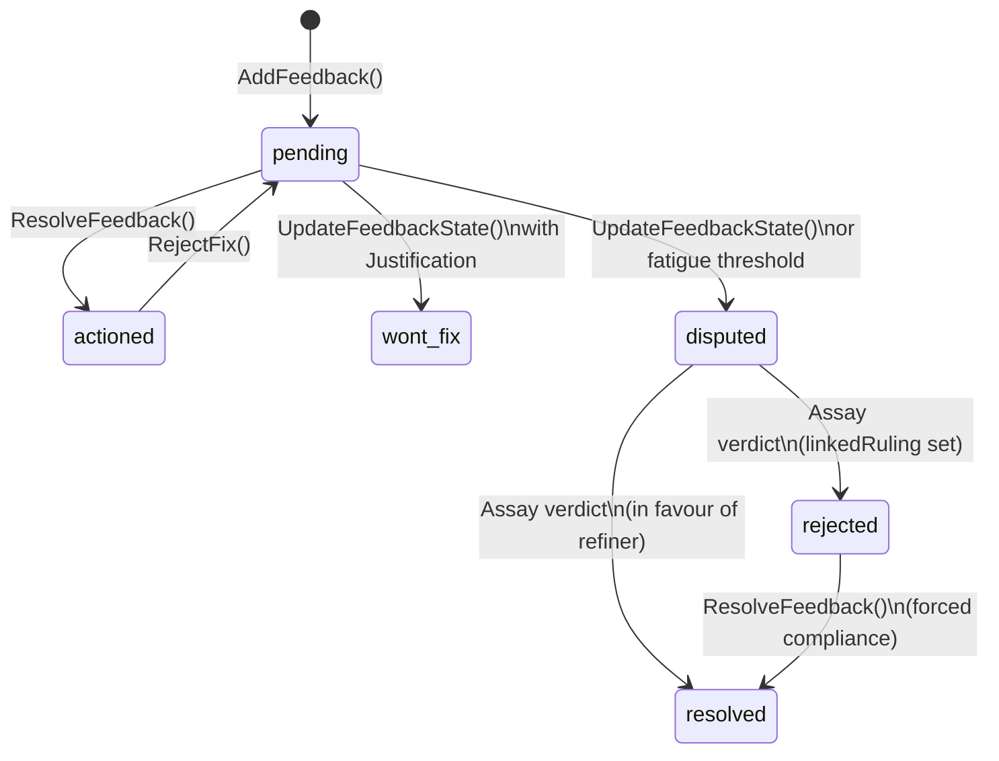

# Data Model

A [Flow](./00-overview.md) has four primary data objects: Workitems, Artefacts, Feedback, and Laws. The [conceptual overview](./00-overview.md) introduced them at a glance. The [architecture](./01-architecture.md) placed them on planes. What follows is the detail — structure, lifecycle, relationships, and the rules that govern mutation.

---

## Workitems

The [Workitem](./00-overview.md) CRD is the authoritative record of work state. [Nodes](./00-overview.md) are stateless — they read state from the CRD at the start of each assignment and write mutations back to it. Everything a node needs to know about a piece of work lives on the Workitem or is reachable from it.

### Structure

A Workitem's structure splits into `spec` and `status`.

`spec` is immutable. It is set at creation by the [Flow Operator](../02-flow/01-operator.md) and never changes. It carries the Workitem's type, intent, priority, and application context — the inputs that define what work needs doing.

`status` is the mutable working surface. As the Workitem moves through the Flow, nodes store artefacts, leave feedback, and return routing instructions. The Operator updates the assignment and lifecycle state. Every mutation to `status` follows strict ownership rules:

| Field | Owner | Mutability | Description |
|-------|-------|------------|-------------|
| `spec.*` | Operator | Immutable | Set at creation |
| `status.state` | Operator | System-managed | Computed from assignment lifecycle |
| `status.currentAssignee` | Operator | System-managed | The node currently processing this Workitem |
| `status.previousAssignee` | Operator | System-managed | The node that last processed this Workitem |
| `status.artefacts[]` | [Sidecar](../03-node/01-sidecar.md) | Append-only | Artefact references, updated via `StoreArtefact` |
| `status.feedback[]` | Sidecar | Append/Update | Feedback items, updated via feedback operations |
| `status.routingInstruction` | Sidecar | Overwrite | Set when the node returns a result |
| `status.guestbook` | Sidecar | Increment-only | Per-node visit counters |

The `currentAssignee` field is a scalar, not a list. A Workitem is assigned to exactly one node at a time — atomic ownership prevents race conditions in state transitions. The Flow is a relay race: one baton, one runner.

### WorkitemType

A WorkitemType defines the shape of a Workitem's `spec` fields as a JSON Schema. It specifies which fields are required, their types, and any constraints.

```yaml
apiVersion: flow.gideas.io/v1
kind: WorkItemType
metadata:
  name: petition-v1
spec:
  schema:
    properties:
      intent:
        type: string
        description: "What the petitioner wants to achieve"
      priority:
        type: string
        enum: ["low", "medium", "high"]
      requestedBy:
        type: string
    required:
      - intent
```

WorkitemTypes are shared across Flows. A Flow's entry contract specifies which WorkitemTypes it accepts.

### Context

The Workitem carries a `context` map — key-value string pairs for application-specific metadata. Keys starting with an underscore are reserved for system use. User-defined keys carry whatever domain context nodes need to do their work.

### Lifecycle



| State | Description |
|-------|-------------|
| **Pending** | Waiting for assignment or queued between nodes |
| **Running** | Assigned to a node, actively processing |
| **Completed** | Terminal contract satisfied, work is done |
| **Failed** | Timeout, thrash detection, explicit failure, or system error |

State transitions have guard conditions:

| From | To | Trigger | Guard Conditions |
|------|-----|---------|------------------|
| Pending | Running | `assign()` | Node is ready; node has capacity |
| Running | Pending | `route()` | Node returns routing instruction; target node exists; no thrash detected |
| Running | Completed | `complete()` | Node returns `Complete()`; terminal contract satisfied |
| Running | Failed | `timeout()` | `lastActivityAt` exceeds configured timeout |
| Running | Failed | `thrash()` | Total guestbook visits exceed `maxVisits` |
| Running | Failed | `error()` | Node returns explicit failure, handler panic, or validation error |
| Pending | Failed | `fail()` | No available nodes for extended period, or system error |

Both **Completed** and **Failed** are terminal. Once a Workitem enters either state, no further transitions are possible. The CRD remains in etcd for the configured retention period (default 30 days) before garbage collection.

### Routing Instructions

When a node finishes processing, it returns a routing instruction that tells the Operator where the Workitem goes next. The [Sidecar](../03-node/01-sidecar.md) writes this to the Workitem CRD; the Operator consumes it.

| Type | Description |
|------|-------------|
| `route_to_output` | Route via a named output channel defined on the [FoundryNode](../02-flow/03-nodes-external.md) |
| `route_to` | Route directly to a specific node by name |
| `complete` | Signal terminal completion — triggers terminal contract validation |

### Guestbook

The guestbook is a map of node names to visit counts. Each time a Workitem is assigned to a node, that node's counter increments. The guestbook is hidden from nodes — it is infrastructure, not semantic context.

Its purpose is thrash detection. When the sum of all guestbook entries exceeds `maxVisits`, the Operator fails the Workitem with `THRASH_DETECTED`. This catches infrastructure-level loops — a Workitem bouncing endlessly between nodes regardless of the reason.

Thrash detection (guestbook) and fatigue detection ([feedback](#feedback) history depth) are separate mechanisms with different signals:

| Detection | Signal | Source | Response |
|-----------|--------|--------|----------|
| Thrash | Total visits across all nodes | Guestbook | Fail workitem |
| Fatigue | History depth on a single feedback item | Feedback | Escalate to [Assay](./00-overview.md) |

### Terminal Contracts

A terminal contract defines what a Workitem must carry to exit the Flow. Terminal contracts are declared on the [FoundryFlow](../04-reference/crds.md) CRD, not on the Workitem itself.

Each contract has a name and a list of artefact requirements. An artefact requirement references a [GovernedArtefact](#governed-artefacts) by kind and specifies a required state:

| State | Validation |
|-------|------------|
| `present` | The artefact exists (has a `latestVersion`). Stamps are not checked. |
| `valid` | The artefact exists **and** its passport carries stamps satisfying every entry in the GovernedArtefact's `requiredStamps` (matching both role and type). |

The validation model is strictly binary. A terminal contract asks "is it present?" or "is it valid?" — it never specifies a subset of stamps. Governance defines what "valid" means (the GovernedArtefact CRD). The terminal contract just checks whether that definition is satisfied. This prevents shadow governance — validity requirements defined in routing topology rather than in governance declarations.

Different exit paths use different contracts:

```yaml
terminalContracts:
  - name: "approved"
    requiredArtefacts:
      - kind: "petition-draft"
        state: "valid"
      - kind: "audit-log"
        state: "present"

  - name: "rejected"
    requiredArtefacts:
      - kind: "petition-draft"
        state: "present"
      - kind: "rejection-report"
        state: "present"
```

The "approved" path requires a fully validated petition draft. The "rejected" path archives whatever exists — a draft that failed governance is still preserved, just not certified.

Entry contracts work similarly: the FoundryFlow CRD can specify which WorkitemTypes are accepted and which artefacts must be present at entry.

---

## Artefacts

An [artefact](./00-overview.md) is a governed output — a document, a code file, a data model, anything the Flow produces. Artefact content is stored as content-addressed bytes in the [Archivist](../02-flow/04-system-services.md). Artefact metadata — hashes, version history, references — travels with the Workitem CRD.

The split is deliberate. Metadata is small and watch-driven (etcd). Content is large and read/write (Archivist). The Workitem CRD stays under etcd's 1.5MB limit while artefacts themselves can be arbitrarily large.

### Content Addressing and Versioning

Every artefact version is identified by its SHA256 content hash. When a node stores content, the [Sidecar](../03-node/01-sidecar.md) computes the hash and the [Archivist](../02-flow/04-system-services.md) persists the bytes. If the content is identical to an existing version, no new version is created — the hash matches and the store is a no-op.

The Workitem CRD tracks the version history as an `ArtefactRef`:

```yaml
artefacts:
  - kind: "petition-draft"
    name: "petition_draft.md"
    latestVersion: "sha256:def456..."
    versions:
      - hash: "sha256:abc123..."
        createdAt: "2026-01-04T14:20:00Z"
        createdByNode: "forge-node"
      - hash: "sha256:def456..."
        createdAt: "2026-01-04T14:45:00Z"
        createdByNode: "refine-node"
```

`latestVersion` always points to the current content hash. The `versions` array provides an append-only audit trail of who created which version and when.

### Artefact Isolation

Artefacts are strictly isolated per-Workitem. Every byte of content belongs to exactly one Workitem. There is no cross-Workitem access. This is enforced at three layers:

| Layer | Enforcement |
|-------|-------------|
| Storage layout | Physical path: `<workitem_id>/<kind>/<name>/<hash>` — the Workitem ID is the root |
| SDK | No `targetWorkitemID` parameter exists — the SDK auto-injects the current Workitem context |
| Sidecar | Context is bound to the leased Workitem — requests for unowned IDs are rejected |

When nodes need shared reference material (templates, schemas, boilerplate), the content is injected rather than shared:

| Pattern | Storage | Use Case |
|---------|---------|----------|
| Container image | Baked into the node container at build time | Immutable templates, versioned with code |
| ConfigMap | Mounted to the node via Kubernetes volume | Environment-specific, managed by GitOps |
| Injection | Entry node calls `StoreArtefact()` to copy into the Workitem | Creates a unique, governed copy |

### Governed Artefacts

A GovernedArtefact CRD defines the validity requirements for an artefact kind. It specifies the [stamps](#passports-and-stamps) the artefact must carry — each requirement names a role and a stamp type:

```yaml
apiVersion: flow.gideas.io/v1
kind: GovernedArtefact
metadata:
  name: petition-draft
spec:
  requiredStamps:
    - role: "linter"
      type: "inspection"
    - role: "security-reviewer"
      type: "inspection"
    - role: "legal-reviewer"
      type: "inspection"
    - role: "sort"
      type: "approval"
```

An artefact is **valid** if and only if its passport contains a stamp matching every entry in `requiredStamps` — the correct role *and* the correct type. An artefact is **present** if it exists, regardless of stamps.

The terminal contract specifies both the role and the type required for each artefact. Inspection stamps record that a role examined the artefact. Approval stamps certify it meets governance requirements and require law citations. Both are independently required — an inspection stamp from "linter" does not satisfy a requirement for an approval stamp from "linter", and vice versa.

Validation is role-based, not identity-based. The specific node that stamped is recorded for audit, but governance checks verify that the required role *and* type are present. This enables horizontal scaling (multiple node replicas with the same role stamp interchangeably) and cross-Flow trust (a stamp from a node in another Flow is valid if it carries the right role and its certificate chain traces back to a shared trust root).

### Passports and Stamps

Every artefact version has a passport — a collection of [stamps](./00-overview.md) stored alongside its content in the [Archivist](../02-flow/04-system-services.md) as `<hash>.passport.json`. Content and provenance travel together.



The passport is a **role-centric map**. Role is the unique key. If two different nodes stamp the same artefact as the same role, the second stamp overwrites the first (Last-Write-Wins). Governance cares that the role was satisfied, not which specific node satisfied it. Overwritten stamps are not preserved in the passport — the full stamp history is reconstructable from the telemetry audit log.

**Stamp types:**

| Type | Purpose | Law Citations |
|------|---------|---------------|
| **Inspection** | Records that a node examined this artefact version | Not required |
| **Approval** | Certifies the artefact meets governance requirements from this role's perspective | Required |

**Stamp fields:**

| Field | Type | Description |
|-------|------|-------------|
| `role` | string | Primary key — the role being asserted |
| `type` | enum | `inspection` or `approval` |
| `node` | string | Node name (for audit) |
| `timestamp` | datetime | When the stamp was created |
| `hash` | string | Content hash of the artefact at stamp time |
| `signature` | bytes | RSA signature over `hash\|\|type\|\|role\|\|timestamp` |
| `certificateChain` | []string | PEM-encoded certificates: `[node_cert, operator_cert, state_root]` |
| `laws` | []LawCitation | Law citations (required for `approval` type) |

Stamps are cryptographically bound to the artefact's content through the `hash` field. The signature covers the hash along with the stamp's identity fields, making it independently verifiable by tracing the certificate chain back to the Flow's trust root (or, in federated deployments, to the State Root CA).

**Version binding:** Stamps always target the latest version at the time of stamping. When new content is stored (producing a new hash), the old passport remains with the old version. The new version starts with an empty passport. All prior stamps are invalidated — governance starts over for the new content. This is not a penalty; it is an invariant. A stamp certifies specific bytes. Different bytes require new certification.

**Capability enforcement:** The Sidecar enforces capabilities before allowing stamp operations:

| Capability | Required For |
|------------|-------------|
| `INSPECT:artefact/<kind>` | Inspection stamps |
| `APPROVE:artefact/<kind>` | Approval stamps |
| `READ:artefact/<kind>` | Fetching artefact content |
| `WRITE:artefact/<kind>` | Storing artefact content |

---

## Feedback

[Feedback](./00-overview.md) is threaded, artefact-scoped, and adversarial by design. It is not a comment thread. It is a structured protocol that forces every disagreement into the open and demands justification for every refusal.

### Structure

A feedback item targets a specific artefact kind on the current Workitem. It carries a severity, a current state, a message, and a history of every action taken on it.

| Field | Type | Description |
|-------|------|-------------|
| `id` | string | Unique identifier (e.g., `fb-101`) |
| `target` | string | Artefact kind being critiqued |
| `source` | string | Node that created the feedback |
| `severity` | enum | `LOW`, `MEDIUM`, `HIGH`, `CRITICAL` |
| `state` | enum | Current lifecycle state |
| `message` | string | Feedback content (max 1024 characters) |
| `linkedRuling` | string | Ruling ID if [Assay](./00-overview.md) has rendered a verdict |
| `history` | []FeedbackEvent | Chronological record of actions |
| `justification` | Justification | Legal basis if state is `wont-fix` |

Severity signals urgency, not authority:

| Severity | Description |
|----------|-------------|
| `LOW` | Minor style or preference issue |
| `MEDIUM` | Quality issue that should be addressed |
| `HIGH` | Functional or security concern — must be addressed |
| `CRITICAL` | Blocking issue, potential data loss |

Each feedback event in the history records who acted, in what role, what action they took, and what they said. The history is append-only — it is the investigative record of the debate.

### Feedback Lifecycle



| State | Description |
|-------|-------------|
| **pending** | Issue raised, not yet addressed |
| **actioned** | Refine node addressed it (fix applied) |
| **wont-fix** | Refine node refused with structured justification |
| **disputed** | Escalated to Assay — history depth exceeded threshold, or explicitly escalated |
| **rejected** | Assay ruled against the refiner — a judicial mandate with a `linkedRuling` |
| **resolved** | Closed — either Assay ruled in favour of the refiner, or the refiner complied with a rejection |

The cycle between `pending` and `actioned` is the normal adversarial loop. Appraise raises an issue. Refine fixes it and marks it `actioned`. On the next review pass, Appraise either accepts the fix (the item stays `actioned`) or calls `RejectFix()`, which pushes it back to `pending` with a new history entry explaining why the fix was insufficient.

From [Sort's](./00-overview.md) perspective, only `pending` and `disputed` feedback is unresolved. Feedback in any other state — `actioned`, `wont-fix`, `resolved` — does not block the Workitem. Sort checks for unresolved feedback *after* all required inspection stamps are present; if none remains, it stamps approval.

### Forced-Choice Justification

When a node marks feedback as `wont-fix`, it must provide a structured justification:

| Type | Fields | Meaning |
|------|--------|---------|
| `citation` | `citationIds[]` | "Existing law supports my position." The node cites specific laws that justify refusing the feedback. |
| `novel_argument` | `argument` | "Here is a new argument." The node proposes reasoning that does not yet exist in the Library. |

There is no third option. A node cannot silently dismiss feedback. Every refusal creates a traceable record — either a link to existing governance or a new argument that can itself become governance (a Tier 1 Finding) if it proves valuable.

### Fatigue Detection and Escalation

Each round of review-and-refine appends entries to the feedback item's `history` array. When the history depth on a single feedback item exceeds the configured `maxFeedbackDepth`, [Sort](./00-overview.md) transitions the item to `disputed` and routes the Workitem to [Assay](./00-overview.md).

The check is semantic, not mechanical. It asks: "Are we arguing in circles about *this specific point*?" A Workitem can have dozens of feedback items cycling normally while a single contentious item triggers escalation.

### Contempt Guard

Once Assay renders a verdict and sets a `linkedRuling` on a feedback item, that item is under judicial mandate. The [Sidecar](../03-node/01-sidecar.md) enforces finality: the only valid transition from `rejected` is to `resolved` via `ResolveFeedback()`. Any other state change — including `wont-fix` — returns `CONTEMPT_VIOLATION`. The ruling is not a suggestion. The only path forward is compliance.

This is the enforcement mechanism that gives Assay's rulings teeth. Without the Contempt Guard, a node could endlessly refuse judicial mandates. With it, rulings are terminal.

### Message Limits

Feedback messages are capped at 1024 characters. For detailed analysis that exceeds this limit, nodes use the Store & Link pattern: store the full analysis as an artefact (`StoreArtefact()`), then reference it in the feedback message. The artefact carries the detail; the feedback carries the pointer.

---

## Laws

A [law](./00-overview.md) is a typed container. The [Librarian](../02-flow/04-system-services.md) stores Python scripts next to SMT-LIB equations next to prose style guides, with the same indifference a filesystem shows to all file types. The content is a blob of bytes. The label is a MIME type. Execution is eye of the beholder — nodes query for laws they can interpret and consume them through their own lens.

### The Polymorphic Envelope

The Law CRD is a generic container:

| Field | Type | Description |
|-------|------|-------------|
| `spec.type` | string | MIME type of the content |
| `spec.content` | string | The law itself — prose, formal logic, executable code, anything |
| `spec.tier` | int | Authority tier (1-5) |
| `spec.appliesTo` | string | Artefact kind this law governs |

The MIME type determines which nodes can consume the law. Nodes query the [Librarian](../02-flow/04-system-services.md) for laws matching the artefact they are working on, filtered by content types they understand:

| MIME Type | Content | Consumed By |
|-----------|---------|-------------|
| `text/markdown` | Subjective rules — prose descriptions, style guides, tone requirements | [Appraise](./00-overview.md) nodes (injected into LLM prompts) |
| `application/smt-lib` | Deterministic constraints — formal logic solvable by an SMT engine | [Quench](./00-overview.md) nodes (fed to Z3 or similar solver) |
| `application/python` | Executable validation — Python functions that return pass/fail | Quench nodes (executed in a sandbox) |

The design is infinitely extensible. Any MIME type is valid. If an organisation needs laws defined as musical scores, they upload laws with `type: audio/midi` and deploy a node that queries for `audio/midi` and knows how to interpret it. The system imposes no fixed vocabulary of law types.

A single governance rule can exist simultaneously as prose and as formal logic. An [Appraise](./00-overview.md) node reads the prose and applies judgement. A [Quench](./00-overview.md) node reads the formal logic and runs a solver. Both are consuming the same rule through different lenses. The [Library](../02-flow/04-system-services.md) is one body of law; execution is interpretation.

### Law Groups

Laws can be linked by a shared `spec.group` identifier (format: `lg-XXXX`). A group ties together the **spirit** (prose description) and the **letter** (formal logic) of the same governance rule:

```yaml
# Spirit — consumed by Appraise (LLM prompt injection)
apiVersion: flow.gideas.io/v1
kind: Law
metadata:
  name: l-002-no-sausage-text
spec:
  tier: 2
  type: "text/markdown"
  content: "Poetry must not reference processed meats."
  group: "lg-7729"
  appliesTo: "poetry"

---

# Letter — consumed by Quench (SMT solver)
apiVersion: flow.gideas.io/v1
kind: Law
metadata:
  name: l-002-no-sausage-code
spec:
  tier: 2
  type: "application/smt-lib"
  content: |
    (assert (not (str.contains artefact "sausage")))
  group: "lg-7729"
  appliesTo: "poetry"
```

Laws in the same group share a lifecycle. Repealing one repeals all laws with the matching group ID. Querying by group returns all representations of the rule.

This is how governance hardens. A vague Tier 1 Finding — "this feels wrong" — starts as `text/markdown`. When it causes enough [friction](./00-overview.md) to trigger judicial review, [Assay](./00-overview.md) can codify it: the spirit stays as context for subjective review, and a new letter is minted as `application/smt-lib` for deterministic enforcement. What started as a vibe becomes physics. Both representations live in the same group, governed by the same lifecycle.

### Law Tiers

The [overview](./00-overview.md) introduced the five law tiers. Here is how they work in practice — their scope, authority boundaries, and decay behaviour:

| Tier | Name | Scope | Source | Lifecycle |
|------|------|-------|--------|-----------|
| 1 | **Finding** | Single Flow | Nodes ([Appraise](./00-overview.md), [Refine](./00-overview.md), [Assay](./00-overview.md)) | Ephemeral. Default TTL of 30 days. Decays if uncited, promoted to Tier 2 if heavily used. |
| 2 | **Ruling** | Single Flow | [Assay](./00-overview.md) Node | Binding precedent. Default TTL of 90 days. Requires a formal review hearing before retirement. |
| 3 | **Local Statute** | Single Flow | Flow Operator (human-administered or local legislative cycle) | Persistent. No automatic decay. |
| 4 | **State Constitution** | All Flows in a Governor instance | [Governance Flow](./03-governance.md) | Organisational policy. Pushed to all sibling Flows. No local decay. |
| 5 | **Federal Accord** | All instances in the network | Federation | Cross-organisation. Synchronised from upstream Federal authorities. |

Supremacy is absolute — higher tier always wins, with no upward override. A Tier 3 Local Statute cannot override a Tier 4 State Constitution law, regardless of when either was created.

Tier 1 Findings are the raw material of governance. They emerge from work — a reviewer notices a pattern, a refiner articulates a principle. Findings that prove useful (cited frequently across Workitems) accumulate citation data tracked by the [Citation Processor](../02-flow/04-system-services.md), which can trigger promotion to Tier 2. Findings that go uncited expire at their TTL.

Tier 2 Rulings are binding precedent. They are minted when Assay resolves a dispute, consolidating the arguments into a durable law. Rulings have longer TTLs than Findings and require a formal review hearing before retirement.

Tier 3 Local Statutes are the Flow's own legislative authority. For standalone Flows (no Governor), these are CRDs applied by an administrator. Under a Governor, the local legislative cycle can also produce them.

Tiers 4 and 5 arrive from above. A standalone Flow has no Tiers 4 or 5 — they require a [Governor](./03-governance.md) and Federation respectively. The [Governance Flow](./03-governance.md) produces Tier 4 State Constitution laws through the same [Foundry Cycle](./00-overview.md) as any other Flow (its governed artefacts are the laws themselves), and synchronises Tier 5 Federal Accords from upstream authorities.

The full integration protocol — how higher-tier laws are pushed to Flows, how conflicts are detected and resolved, and how escalation works across tiers — is covered in [Governance](./03-governance.md).

### Scoping

The `spec.appliesTo` field scopes a law to a specific artefact kind. When a node queries the [Librarian](../02-flow/04-system-services.md) for applicable laws, the results are filtered by the artefact the node is working on.

The Operator auto-syncs key spec fields to `metadata.labels` for Kubernetes-native filtering:

| Label | Source | Purpose |
|-------|--------|---------|
| `flow.gideas.io/tier` | `spec.tier` | Filter by law tier |
| `flow.gideas.io/applies-to` | `spec.appliesTo` | Filter by target artefact kind |
| `flow.gideas.io/group` | `spec.group` | Find related laws in the same group |
| `flow.gideas.io/type` | `spec.type` (sanitised) | Filter by content type |

MIME types are sanitised for label compatibility: `application/smt-lib` becomes `application.smt-lib`.

The [Librarian's](../02-flow/04-system-services.md) embedding pipeline, citation tracking, and law lifecycle state machine are covered in [System Services](../02-flow/04-system-services.md). [Codification Services](../02-flow/04-system-services.md) — the translation layer that converts natural language verdicts into formal logic — are also detailed there.
