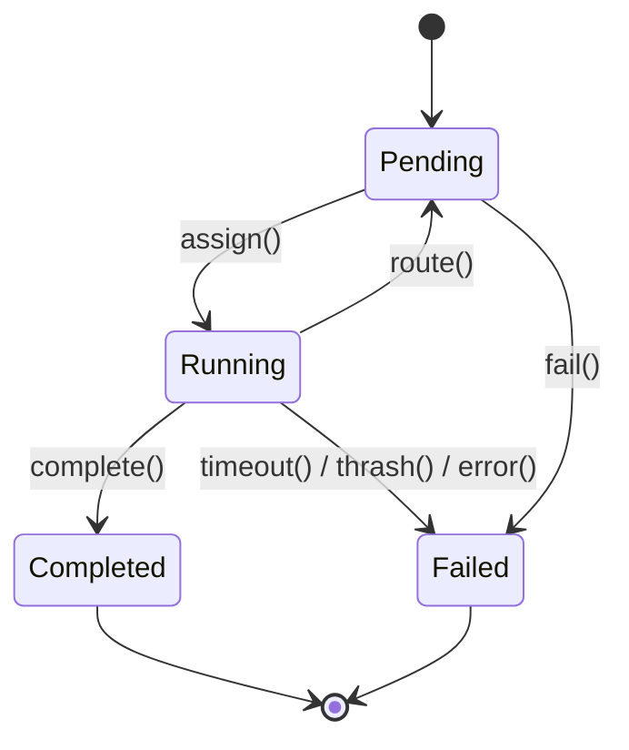
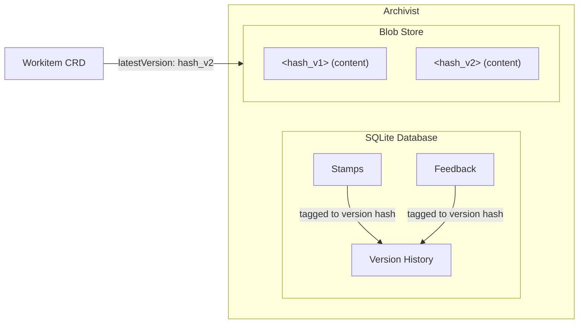

# Data Model

---

## Workitems

The [Workitem](./00-overview.md) CRD is the authoritative record of work state. [Nodes](./00-overview.md) are stateless — they read state from the CRD at the start of each assignment and write mutations back to it. Everything a node needs to know about a piece of work lives on the Workitem or is reachable from it.

### Structure

A Workitem's structure splits into `spec` and `status`.

`spec` is immutable. It is set at creation by the [Flow Operator](../02-flow/01-operator.md) and never changes. It carries the Workitem's type, intent, priority, and application context — the inputs that define what work needs doing.

`status` is the mutable working surface. As the Workitem moves through the Flow, nodes store artefacts, leave feedback, and return routing instructions. The Operator updates the assignment and lifecycle state. Every mutation to `status` follows strict ownership rules:

| Field | Owner | Mutability | Description |
|-------|-------|------------|-------------|
| `spec.*` | Operator | Immutable | Set at creation |
| `status.state` | Operator | System-managed | Computed from assignment lifecycle |
| `status.currentAssignee` | Operator | System-managed | The node currently processing this Workitem |
| `status.previousAssignee` | Operator | System-managed | The node that last processed this Workitem |
| `status.artefacts[]` | [Sidecar](../03-node/01-sidecar.md) | Append-only | Slim artefact references (kind + `latestVersion` hash) |
| `status.routingInstruction` | Sidecar | Overwrite | Set when the node returns a result |
| `status.guestbook` | Sidecar | Increment-only | Per-node visit counters |

The `currentAssignee` field is a scalar, not a list. A Workitem is assigned to exactly one node at a time — atomic ownership prevents race conditions in state transitions. The Flow is a relay race: one baton, one runner.

### WorkitemType

A WorkitemType defines the shape of a Workitem's `spec` fields as a JSON Schema. It specifies which fields are required, their types, and any constraints.

```yaml
apiVersion: flow.gideas.io/v1
kind: WorkitemType
metadata:
  name: petition-v1
spec:
  schema:
    properties:
      intent:
        type: string
        description: "What the petitioner wants to achieve"
      priority:
        type: string
        enum: ["low", "medium", "high"]
      requestedBy:
        type: string
    required:
      - intent
```

WorkitemTypes are shared across Flows. A Flow's entry contract specifies which WorkitemTypes it accepts.

### Context

The Workitem carries a `context` map — key-value string pairs for application-specific metadata. Keys starting with an underscore are reserved for system use. User-defined keys carry whatever domain context nodes need to do their work.

### Lifecycle



| State | Description |
|-------|-------------|
| **Pending** | Waiting for assignment or queued between nodes |
| **Running** | Assigned to a node, actively processing |
| **Completed** | Terminal contract satisfied, work is done |
| **Failed** | Timeout, thrash detection, explicit failure, or system error |

State transitions have guard conditions:

| From | To | Trigger | Guard Conditions |
|------|-----|---------|------------------|
| Pending | Running | `assign()` | Node is ready; node has capacity |
| Running | Pending | `route()` | Node returns routing instruction; target node exists; no thrash detected |
| Running | Completed | `complete()` | Node returns `Complete()`; terminal contract satisfied |
| Running | Failed | `timeout()` | `lastActivityAt` exceeds configured timeout |
| Running | Failed | `thrash()` | Total guestbook visits exceed `maxVisits` |
| Running | Failed | `error()` | Node returns explicit failure, handler panic, or validation error |
| Pending | Failed | `fail()` | No available nodes for extended period, or system error |

Both **Completed** and **Failed** are terminal. Once a Workitem enters either state, no further transitions are possible. The CRD remains in etcd for the configured retention period (default 30 days) before garbage collection.

### Routing Instructions

When a node finishes processing, it returns a routing instruction that tells the Operator where the Workitem goes next. The [Sidecar](../03-node/01-sidecar.md) writes this to the Workitem CRD; the Operator consumes it.

| Type | Description |
|------|-------------|
| `route_to_output` | Route via a named output channel defined on the [FoundryNode](../02-flow/03-nodes-external.md) |
| `route_to` | Route directly to a specific node by name |
| `complete` | Signal terminal completion — triggers terminal contract validation |

### Guestbook

The guestbook is a map of node names to visit counts. Each time a Workitem is assigned to a node, that node's counter increments. The guestbook is hidden from nodes — it is infrastructure, not semantic context.

Its purpose is thrash detection. When the sum of all guestbook entries exceeds `maxVisits`, the Operator fails the Workitem with `THRASH_DETECTED`. This catches infrastructure-level loops — a Workitem bouncing endlessly between nodes regardless of the reason.

Thrash detection (guestbook) and fatigue detection ([feedback](#feedback) history depth) are separate mechanisms with different signals:

| Detection | Signal | Source | Response |
|-----------|--------|--------|----------|
| Thrash | Total visits across all nodes | Guestbook | Fail workitem |
| Fatigue | History depth on a single feedback item | Feedback | Escalate to [Assay](./00-overview.md) |

### Terminal Contracts

A terminal contract defines what a Workitem must carry to exit the Flow. Terminal contracts are declared on the [FoundryFlow](../04-reference/crds.md) CRD, not on the Workitem itself.

Each contract has a name and a list of artefact requirements. An artefact requirement references a [GovernedArtefact](#governed-artefacts) by kind and specifies a required state:

| State | Validation |
|-------|------------|
| `present` | The artefact exists (has a `latestVersion`). Stamps are not checked. |
| `valid` | The artefact exists **and** its passport carries every stamp listed in the GovernedArtefact's `requiredStamps`. |

The validation model is strictly binary. A terminal contract asks "is it present?" or "is it valid?" — it never specifies a subset of stamps. Governance defines what "valid" means (the GovernedArtefact CRD). The terminal contract just checks whether that definition is satisfied. This prevents shadow governance — validity requirements defined in routing topology rather than in governance declarations.

Different exit paths use different contracts:

```yaml
terminalContracts:
  - name: "approved"
    requiredArtefacts:
      - kind: "petition-draft"
        state: "valid"
      - kind: "audit-log"
        state: "present"

  - name: "rejected"
    requiredArtefacts:
      - kind: "petition-draft"
        state: "present"
      - kind: "rejection-report"
        state: "present"
```

The "approved" path requires a fully validated petition draft. The "rejected" path archives whatever exists — a draft that failed governance is still preserved, just not certified.

Entry contracts work similarly: the FoundryFlow CRD can specify which WorkitemTypes are accepted and which artefacts must be present at entry.

---

## Artefacts

An [artefact](./00-overview.md) is a governed output — a document, a code file, a data model, anything the Flow produces. The [Archivist](../02-flow/04-system-services.md) is the single source of truth for all artefact data: version history, [passport stamps](#passports-and-stamps), and [feedback](#feedback) live in the Archivist's SQLite database, while raw content bytes are stored in a content-addressed blob store (PVC or cloud object storage).

The Workitem CRD carries only a slim artefact reference — kind and `latestVersion` hash — enough for the Operator to know what exists without carrying the full history. This keeps the CRD well within etcd's 1.5MB limit regardless of version count, feedback depth, or stamp accumulation.

The [SDK](../03-node/02-sdk-core.md) exposes an Artefact object that provides access to all artefact data through the [Sidecar](../03-node/01-sidecar.md): `workitem.getArtefact("haiku")` returns an object with methods like `getLatestVersion()`, `getVersion(hash)`, `getFeedback()`, `hasUnresolvedFeedback()`, `getPassport()`. Nodes never interact with the Archivist directly.

### Content Addressing and Versioning

Every artefact version is identified by its SHA256 content hash. When a node stores content, the [Sidecar](../03-node/01-sidecar.md) computes the hash and the [Archivist](../02-flow/04-system-services.md) persists the bytes. If the content is identical to an existing version, no new version is created — the hash matches and the store is a no-op.

The Workitem CRD tracks each artefact as a slim reference:

```yaml
artefacts:
  - kind: "petition-draft"
    latestVersion: "sha256:def456..."
```

`latestVersion` always points to the current content hash. The full version history — every prior hash, who created it, and when — is stored in the Archivist's SQLite database and queryable through the [SDK](../03-node/02-sdk-core.md).

### Artefact Isolation

Artefacts are strictly isolated per-Workitem. Every byte of content belongs to exactly one Workitem. There is no cross-Workitem access. This is enforced at three layers:

| Layer | Enforcement |
|-------|-------------|
| Storage layout | Physical path: `<workitem_id>/<kind>/<name>/<hash>` — the Workitem ID is the root |
| SDK | No `targetWorkitemID` parameter exists — the SDK auto-injects the current Workitem context |
| Sidecar | Context is bound to the leased Workitem — requests for unowned IDs are rejected |

When nodes need shared reference material (templates, schemas, boilerplate), the content is injected rather than shared:

| Pattern | Storage | Use Case |
|---------|---------|----------|
| Container image | Baked into the node container at build time | Immutable templates, versioned with code |
| ConfigMap | Mounted to the node via Kubernetes volume | Environment-specific, managed by GitOps |
| Injection | Entry node calls `StoreArtefact()` to copy into the Workitem | Creates a unique, governed copy |

### Governed Artefacts

A GovernedArtefact CRD defines the validity requirements for an artefact kind. It specifies the named [stamps](#passports-and-stamps) the artefact must carry:

```yaml
apiVersion: flow.gideas.io/v1
kind: GovernedArtefact
metadata:
  name: petition-draft
spec:
  requiredStamps:
    - "linter"
    - "security-review"
    - "legal-review"
    - "approval"
```

An artefact is **valid** if and only if its passport contains a stamp for every name listed in `requiredStamps`, each bound to the current content hash. An artefact is **present** if it exists, regardless of stamps.

The GovernedArtefact CRD defines what stamps are required — the demand side. The [FoundryNode](../02-flow/03-nodes-external.md) CRD (managed by the [Flow Operator](../02-flow/01-operator.md)) defines which nodes are authorised to apply each stamp — the supply side. The `STAMP:artefact/<kind>/<stamp-name>` capability grants a node permission to apply a specific named stamp to a specific artefact kind. The system treats all stamps identically; the semantic meaning of a stamp name is a convention chosen by the Flow Architect.

Validation is stamp-based, not identity-based. The specific node that applied a stamp is recorded for audit, but governance checks verify that the required stamp names are present. This enables horizontal scaling — multiple nodes can be authorised to apply the same stamp (though only one can apply it per artefact version, since stamps are write-once) — and cross-Flow trust (a stamp from a node in another Flow is valid if its certificate chain traces back to a shared trust root).

### Passports and Stamps

Every governed [artefact](#artefacts) carries stamps in the [Archivist's](../02-flow/04-system-services.md) SQLite database, scoped to Workitem ID and artefact kind — the same storage layer as [feedback](#feedback) and version history. Each stamp is tagged with the artefact version hash it was recorded against. When new content is stored (producing a new hash), existing stamps remain with the old version. The new version starts with no stamps — governance certification begins fresh for the new content. Nodes access stamps through the [SDK](../03-node/02-sdk-core.md) Artefact object (`artefact.getPassport()`, `artefact.getStamps()`), routed via the [Sidecar](../03-node/01-sidecar.md) to the Archivist.



A stamp is uniquely keyed by its **name** — the governance checkpoint it represents. Stamps are write-once per artefact version: once a named stamp has been applied to a specific content hash, a second node attempting to apply the same stamp name to the same version receives an error. If two different nodes need to sign off independently, the Flow Architect defines two different stamps.

**Stamp fields:**

| Field | Type | Description |
|-------|------|-------------|
| `name` | string | The governance checkpoint being satisfied (e.g. "linter", "security-review", "approval") |
| `node` | string | Node name (for audit) |
| `timestamp` | datetime | When the stamp was created |
| `hash` | string | Content hash of the artefact at stamp time |
| `signature` | bytes | RSA signature covering the content hash and stamp identity fields. Serialization format defined in [CRD Reference](../04-reference/crds.md). |
| `certificateChain` | []string | PEM-encoded certificates: `[node_cert, operator_cert, state_root]` |
| `laws` | []LawCitation | Laws cited during the assessment that produced this stamp |

Stamps are cryptographically bound to the artefact's content through the `hash` field. The signature covers the hash along with the stamp's identity fields, making it independently verifiable by tracing the certificate chain back to the Flow's trust root (or, in federated deployments, to the State Root CA). A stamp certifies specific bytes. Different bytes require new certification.

**Capability enforcement:** The [Sidecar](../03-node/01-sidecar.md) enforces capabilities before allowing stamp and artefact operations:

| Capability | Required For |
|------------|-------------|
| `STAMP:artefact/<kind>/<stamp-name>` | Applying a named stamp |
| `READ:artefact/<kind>` | Fetching artefact content |
| `WRITE:artefact/<kind>` | Storing artefact content |

---

## Feedback

[Feedback](./00-overview.md) is threaded, artefact-scoped, and adversarial by design. A structured protocol forces every disagreement into the open and demands justification for every refusal.

Feedback lives in the [Archivist's](../02-flow/04-system-services.md) SQLite database, scoped to Workitem ID and artefact kind. Each feedback item is tagged with the artefact version hash it was raised against. All feedback is preserved across versions — when new content is stored, existing feedback remains queryable and relevant. Nodes access feedback through the [SDK](../03-node/02-sdk-core.md) Artefact object (`artefact.getFeedback()`, `artefact.hasUnresolvedFeedback()`), routed via the [Sidecar](../03-node/01-sidecar.md) to the Archivist.

### Structure

A feedback item targets a specific artefact kind on the current Workitem. It carries a severity, a current state, a message, and a history of every action taken on it.

| Field | Type | Description |
|-------|------|-------------|
| `id` | string | Unique identifier (e.g., `fb-101`) |
| `target` | string | Artefact kind being critiqued |
| `source` | string | Node that created the feedback |
| `severity` | enum | `LOW`, `MEDIUM`, `HIGH`, `CRITICAL` |
| `state` | enum | Current lifecycle state |
| `message` | string | Feedback content (max 1024 characters) |
| `linkedRuling` | string | Ruling ID if [Assay](./00-overview.md) has rendered a verdict |
| `history` | []FeedbackEvent | Chronological record of actions |
| `justification` | Justification | Legal basis if state is `wont-fix` |

Severity signals urgency, not authority:

| Severity | Description |
|----------|-------------|
| `LOW` | Minor style or preference issue |
| `MEDIUM` | Quality issue that should be addressed |
| `HIGH` | Functional or security concern — must be addressed |
| `CRITICAL` | Blocking issue, potential data loss |

Each feedback event in the history records who acted, what action they took, and what they said. The history is append-only — it is the investigative record of the debate.

### Feedback Lifecycle

```mermaid
stateDiagram-v2
    [*] --> new : AddFeedback()

    new --> actioned : ResolveFeedback()
    new --> wont_fix : RefuseFeedback()\nwith Justification

    actioned --> resolved : AcceptFix()
    actioned --> rejected : RejectFix()

    wont_fix --> resolved : AcceptRefusal()
    wont_fix --> rejected : RejectRefusal()
    wont_fix --> deadlocked : Sort detects\nexcessive depth

    rejected --> actioned : ResolveFeedback()
    rejected --> deadlocked : Sort detects\nexcessive depth

    deadlocked --> wont_fix : Assay verdict\n(favours Refine;\nlinkedRuling set)
    deadlocked --> rejected : Assay verdict\n(favours Appraise;\nlinkedRuling set)

    resolved --> [*]
```



| State | Description |
|-------|-------------|
| **new** | Feedback raised, not yet addressed |
| **actioned** | Refine addressed the issue (fix applied) |
| **wont-fix** | Refine refused with structured justification |
| **rejected** | Reviewer rejected the fix or refusal |
| **deadlocked** | Sort detected excessive feedback depth — escalated to Assay |
| **resolved** | Closed — final state |

| From | To | Actor | Trigger |
|------|----|-------|---------|
| — | **new** | System | `AddFeedback()` |
| new | actioned | Refine | `ResolveFeedback()` — applies a fix |
| new | wont-fix | Refine | `RefuseFeedback()` — with structured justification |
| actioned | resolved | Appraise | `AcceptFix()` — fix is adequate |
| actioned | rejected | Appraise | `RejectFix()` — fix is inadequate |
| wont-fix | resolved | Appraise | `AcceptRefusal()` — refusal is justified |
| wont-fix | rejected | Appraise | `RejectRefusal()` — refusal is unjustified |
| wont-fix | deadlocked | Sort | Feedback depth exceeds `maxFeedbackDepth` |
| rejected | actioned | Refine | `ResolveFeedback()` — complies with rejection |
| rejected | deadlocked | Sort | Feedback depth exceeds `maxFeedbackDepth` |
| deadlocked | wont-fix | Assay | Verdict favours Refine — `linkedRuling` set, cites Tier 2 Ruling |
| deadlocked | rejected | Assay | Verdict favours Appraise — `linkedRuling` set, cites Tier 2 Ruling |

Refine makes the first move: fix the issue (`actioned`) or refuse it (`wont-fix`). Appraise reviews the response and either accepts (`resolved`) or rejects (`rejected`). A rejected item returns to Refine for compliance.

When the feedback history depth on a single item exceeds the configured `maxFeedbackDepth`, Sort transitions the item to `deadlocked` and routes the Workitem to Assay. Assay examines the investigative history, retires the conflicting laws, and mints a new Tier 2 Ruling that consolidates the decision. The feedback item's `linkedRuling` field is set to this Ruling regardless of which side Assay favours. The Contempt Guard then enforces finality — the losing side must accept the verdict.

From [Sort's](./00-overview.md) perspective, only `resolved` feedback is settled. Feedback in any other state — `new`, `actioned`, `wont-fix`, `rejected`, `deadlocked` — is unresolved and blocks the Workitem. An `actioned` item still needs reviewer verification; a `wont-fix` still needs reviewer acceptance or dispute. The adversarial loop runs until every feedback item reaches `resolved`.

In the [reference arrangement](./00-overview.md), Sort reads the Flow configuration to determine which nodes can provide which stamps, then evaluates the Workitem's governance state and routes accordingly — unresolved feedback routes toward refinement, deadlocked feedback toward judicial review, and missing stamps toward the node configured to provide them. When all required stamps are present and all feedback is resolved, Sort applies the "approval" stamp. In the reference arrangement Sort is the only node that applies the "approval" stamp, but any stamp can be granted to any node by the Flow Architect.

### Forced-Choice Justification

When a node marks feedback as `wont-fix`, it must provide a structured justification:

| Type | Fields | Meaning |
|------|--------|---------|
| `citation` | `citationIds[]` | "Existing law supports my position." The node cites specific laws that justify refusing the feedback. |
| `novel_argument` | `argument` | "Here is a new argument." The node proposes reasoning that does not yet exist in the Library. |

There is no third option. A node cannot silently dismiss feedback. Every refusal creates a traceable record — either a link to existing governance or a new argument that can itself become governance (a Tier 1 Finding) if it proves valuable.

### Fatigue Detection and Escalation

Each round of review-and-refine appends entries to the feedback item's `history` array. When the history depth on a single feedback item exceeds the configured `maxFeedbackDepth`, [Sort](./00-overview.md) transitions the item to `deadlocked` and routes the Workitem to [Assay](./00-overview.md).

The threshold applies per feedback item, not per Workitem. A Workitem can have dozens of feedback items cycling normally while a single contentious item triggers escalation.

### Contempt Guard

Once Assay renders a verdict and sets a `linkedRuling` on a feedback item, that item is under judicial mandate. The [Sidecar](../03-node/01-sidecar.md) enforces finality in both directions:

- A `wont-fix` with a `linkedRuling` (Assay agreed with Refine) cannot be moved to `rejected` by Appraise. The only valid transition is to `resolved` via `AcceptRefusal()`.
- A `rejected` with a `linkedRuling` (Assay agreed with Appraise) cannot be moved to `wont-fix` or `deadlocked`. The only valid transition is to `actioned` via `ResolveFeedback()`, followed by acceptance to `resolved`.

Any other state change returns `CONTEMPT_VIOLATION`. The ruling is not a suggestion. The losing side must accept the verdict.

### Message Limits

Feedback messages are capped at 1024 characters. For detailed analysis that exceeds this limit, nodes use the Store & Link pattern: store the full analysis as an artefact (`StoreArtefact()`), then reference it in the feedback message. The artefact carries the detail; the feedback carries the pointer.

---

## Laws

A [law](./00-overview.md) is a governance rule with a clear **goal** — a plain-language statement of what it enforces, stops, or ensures. The goal is the law's identity. Everything else about a law — its representations, its tier, its lifecycle — exists in service of that goal.

### Representations

A law can have multiple **representations**: different ways of expressing the same goal. A prose description, a formal logic constraint, an executable validator — these are all projections of the same intent. The [Librarian](../02-flow/04-system-services.md) stores them all as part of a single law object. Nodes query for representations they can interpret: a review node reads prose, a validation node runs formal logic. Different nodes consume different representations of the same rule through their own lens.

Representations are not independent rules. They must all enforce the same goal. A prose representation that says "poetry must not reference processed meats" and a formal logic representation that checks for the string "sausage" are two faces of the same law. Adding, removing, or modifying any representation produces a new version of the law (identified by its content hash). The full version history is preserved.

Governance hardens through representations. A Tier 1 Finding starts as prose — a reviewer noticed a pattern and articulated it. If the Finding proves durable enough to be promoted to a Tier 2 Ruling, [Codification Services](../02-flow/04-system-services.md) can translate the goal into formal logic, adding a deterministic representation alongside the original prose. The goal stays the same; enforceability increases.

### Law Tiers

Laws are tiered by authority and lifecycle:

| Tier | Name | Scope | Source | Lifecycle |
|------|------|-------|--------|-----------|
| 1 | **Finding** | Single Flow | Nodes ([Appraise](./00-overview.md), [Refine](./00-overview.md), [Assay](./00-overview.md)) | Ephemeral. Default TTL of 30 days. Decays if uncited, promoted to Tier 2 if heavily used. |
| 2 | **Ruling** | Single Flow | [Assay](./00-overview.md) Node | Binding precedent. Default TTL of 90 days. Requires a formal [review hearing](./03-governance.md#decay-and-retirement) before retirement. |
| 3 | **Local Statute** | Single Flow | Flow Operator (human-administered or local legislative cycle) | Persistent. No automatic decay. |
| 4 | **State Constitution** | All Flows in a Governor instance | [Governance Flow](./03-governance.md) | Organisational policy. Pushed to all sibling Flows. No local decay. |
| 5 | **Federal Accord** | All instances in the network | Federation | Cross-organisation. Synchronised from upstream Federal authorities. |

Supremacy is absolute — higher tier always wins, with no upward override. A Tier 3 Local Statute cannot override a Tier 4 State Constitution law, regardless of when either was created.

Tier 1 Findings are the raw material of governance. They emerge from work — a reviewer notices a pattern, a refiner articulates a principle. Findings that prove useful (cited frequently across Workitems) accumulate citation data tracked by the [Citation Processor](../02-flow/04-system-services.md), which can trigger promotion to Tier 2. Findings that go uncited expire at their TTL.

Tier 2 Rulings are binding precedent. They are minted when Assay resolves a dispute, consolidating the arguments into a durable law. Rulings have longer TTLs than Findings and require a formal [review hearing](./03-governance.md#decay-and-retirement) before retirement.

Tier 3 Local Statutes are the Flow's own legislative authority. For standalone Flows (no Governor), these are CRDs applied by an administrator. Under a Governor, the local legislative cycle can also produce them.

Tiers 4 and 5 arrive from above. A standalone Flow has no Tiers 4 or 5 — they require a [Governor](./03-governance.md) and Federation respectively. The [Governance Flow](./03-governance.md) produces Tier 4 State Constitution laws through the same [Foundry Cycle](./00-overview.md) as any other Flow (its governed artefacts are the laws themselves), and synchronises Tier 5 Federal Accords from upstream authorities.

The full integration protocol — how higher-tier laws are pushed to Flows, how conflicts are detected and resolved, and how escalation works across tiers — is covered in [Governance](./03-governance.md).

### Scoping

Each law specifies which artefact kind it governs. When a node queries the [Librarian](../02-flow/04-system-services.md) for applicable laws, the results are filtered by the artefact the node is working on and by the representation types the node can interpret.

The Librarian's embedding pipeline, citation tracking, and law lifecycle state machine are covered in [System Services](../02-flow/04-system-services.md). The CRD structure is defined in the [CRD Reference](../04-reference/crds.md).
