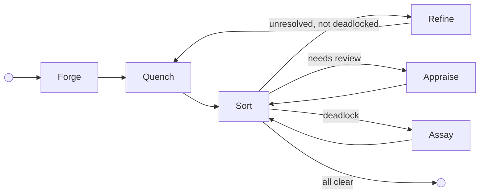
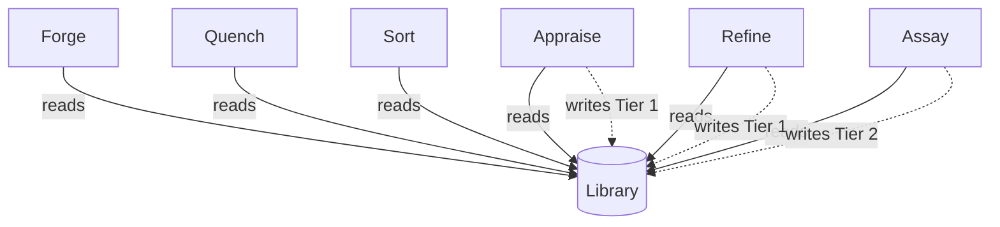

# The Foundry Cycle

The Foundry Cycle is the reference arrangement — a standard pattern of node roles that demonstrates how adversarial cycles of creation, validation, review, and refinement drive unreliable agents to produce artefacts that are provably compliant with a body of governance. It is not the only way to structure a Flow. It is the way the standard library structures one, and the pattern [Flow Architects](../05-reference/glossary.md#flow-architect) are expected to adapt to their specific problem space.

The standard library provides configurable reference implementations for each node role as container images. [Flow Architects](../05-reference/glossary.md#flow-architect) can extend them, adapt them, merge responsibilities across fewer nodes, split them across more, or implement completely custom nodes. The platform enforces behaviour through [capabilities and configuration](../02-flow/05-configuration.md) — not node names. A node named "Validator" that holds the same capabilities as the reference Sort node behaves identically from the platform's perspective.

Assay is the exception. It is a standard runtime component present in every Flow, not a swappable reference implementation. [Flow Architects](../05-reference/glossary.md#flow-architect) do not choose whether to include it.

---

## Node Roles

### Forge (Creator)

Forge creates the initial artefact. Before generation, it reads the Flow's [Library](../02-flow/04-system-services.md#librarian) of applicable [law](./03-data-model.md#laws), filtered by artefact kind, and seeds it into its context — so the creator knows the rules before it starts. In the reference arrangement, Forge reads laws exclusively; it does not write them. The platform enforces this through capability grants: a node without a `WRITE:law/tierN` capability grant cannot write laws regardless of its role.

### Quench (Deterministic Validator)

Quench performs deterministic validation. It queries the law body for executable [representations](./03-data-model.md#representations) — formal logic, constraint schemas, compiled checks — and runs them against the artefact to verify deterministic compliance before it reaches the more expensive review stage. In the reference arrangement, Quench can apply deterministic validation stamps (e.g., "linter") when granted the appropriate `STAMP` capability. Quench is optional. Topologies that rely exclusively on non-deterministic review can omit it, routing directly from Forge to the gate node.

### Appraise (Reviewer)

Appraise conducts subjective review. It reads the applicable laws for the artefact kind and orchestrates a panel of specialist reviewers (AI agents, human reviewers, or both) who evaluate the artefact against them. Appraise intentionally preserves contradictions in its feedback — resolving them is Refine's job. In the reference arrangement, Appraise holds the `WRITE:law/tier1` capability and can record Tier 1 [Findings](./03-data-model.md#law-tiers) — emergent patterns observed during review.

### Sort (Gate)

Sort is the central routing hub. It evaluates governance state and routes. Granted the `READ:flow` capability, Sort reads the [Flow configuration](../02-flow/05-configuration.md) to discover which nodes can provide which [stamps](./03-data-model.md#passports-and-stamps), then applies its routing rules:

1. Is there unresolved [feedback](./03-data-model.md#feedback) that is not deadlocked? Route to **Refine**.
2. Is feedback deadlocked (arguing in circles)? Route to **Assay**.
3. Missing required stamps? Route to the node configured to provide them (Appraise, in the reference arrangement).
4. All feedback resolved, all required stamps present? Stamp **approval**, call `complete()`, and let the [Operator](../02-flow/01-operator.md) validate the bound [exit contract](./03-data-model.md#entry-and-exit-contracts) before marking **Done**.

Sort is a gate. It evaluates state, consults the Flow config for routing targets, and — in the reference arrangement for governed artefact processing — acts as the exit-bound node: it stamps approval when the passport is complete and all feedback is resolved, then calls `complete()`.

Sort queries artefact state through the [SDK](../04-sdk/01-sdk-core.md) — `artefact.hasUnresolvedFeedback()`, `artefact.getStamps()` — the same interface available to every node. The `READ:flow` capability that enables topology discovery is a platform mechanism; any node granted this capability can query stamp-to-node mappings.

### Refine (Refiner)

Refine addresses feedback. It reads the applicable laws for the artefact kind, reviews the consolidated (potentially contradictory) feedback, produces a new artefact version, and must address every item — marking each as *actioned* or *Won't Fix*. A Won't Fix requires a structured [justification](./03-data-model.md#forced-choice-justification): either a citation of existing law or a novel argument proposing new reasoning. In the reference arrangement, Refine holds the `WRITE:law/tier1` capability and can record Tier 1 Findings.

### Assay (Judiciary — Standard Component)

Assay is the judiciary. It is built into the runtime as a standard component — every Flow includes it, and Flow Architects do not choose whether to include it.

Assay is invoked for deadlocked feedback disputes and for review hearings triggered by friction thresholds or TTL expiry. It deliberates (potentially via a multi-agent jury), examines the investigative history, and resolves disputes by minting Tier 2 Rulings (binding precedent). Assay holds the `WRITE:law/tier2` capability — Tier 2 Rulings are both the floor and the ceiling of its judicial authority, and the ceiling grant also covers Tier 1. Assay does not write Tier 1 Findings by convention; its role is judicial, not observational. For Tier 3 conflicts, Assay drafts a proposal for human ratification. For Tiers 4-5, Assay files an appeal to the [Governance Flow](./04-governance.md). Its full [authority ceiling](./04-governance.md#assays-authority-ceiling) is constitutionally bounded.

---

## Cycle Topology

In the reference arrangement, Refine routes back through Quench — deterministic validation runs again on the revised artefact. Topologies without Quench route Refine directly to Sort (or to whatever gate node the Flow Architect has configured). Deadlock-escalated governed-work assignments route back through Sort after Assay adjudication, while review-hearing [Workitems](./03-data-model.md#workitems) are self-contained at Assay.

---

## Law Authority in the Cycle

All nodes in the cycle can **read** laws from the Library. Only some can **write**:

Forge reads laws for context seeding. Quench and Sort are read-only consumers. Appraise and Refine can record Tier 1 Findings (emergent patterns) — any node granted the `WRITE:law/tier1` capability can do the same, regardless of whether it bears one of these names. Assay holds `WRITE:law/tier2` and mints Tier 2 Rulings (binding precedent). Its [authority ceiling](./04-governance.md#assays-authority-ceiling) is constitutionally bounded.

The underlying platform mechanism is capability-gated law access. Law read and write permissions are granted per node through the FoundryNode CRD. The reference arrangement maps these capabilities to specific roles, but a custom topology can distribute them differently.

---

## Adapting the Arrangement

The reference arrangement is a starting point. [Flow Architects](../05-reference/glossary.md#flow-architect) adapt it to their context:

- **Add nodes.** A topology might insert a "Translate" node between Forge and Quench, or add a second review stage with different stamp authority.
- **Merge responsibilities.** A simple topology might combine validation and review into a single node that holds both deterministic and non-deterministic capabilities.
- **Split gate nodes.** A complex topology might use separate gate nodes for feedback routing and stamp verification.
- **Replace reference implementations.** The standard library containers are configurable, but a Flow Architect can implement entirely custom nodes that fulfil the same platform contracts.
- **Omit optional nodes.** Quench is optional. Topologies without deterministic validation omit it entirely.

The platform enforces behaviour through capabilities, contracts, and Operator validation — not through node names or a fixed topology. A Flow that uses none of the reference node names but grants the same capabilities and binds the same contracts produces identical governance outcomes.
