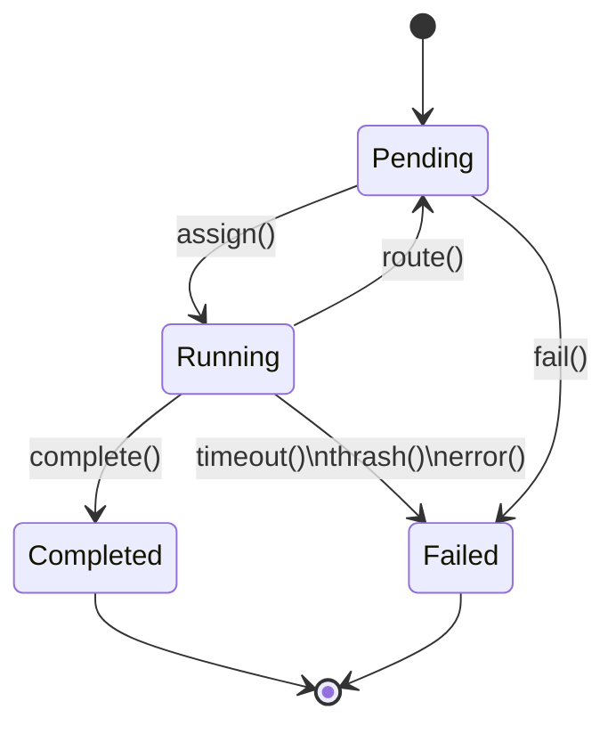
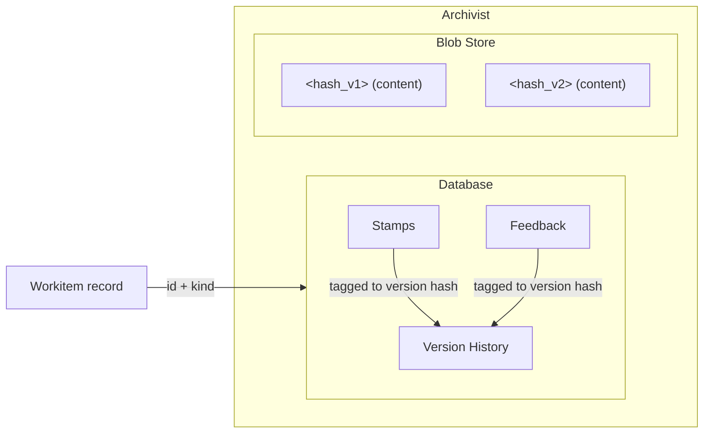

# Data Model

---

## Workitems

The [Workitem](./00-overview.md) record is the authoritative surface for work state (persisted as a Kubernetes CRD in the runtime). [Nodes](./00-overview.md) are stateless and execute through SDK abstractions, with runtime mutation requests mediated by the [Sidecar](../03-node/01-sidecar.md) and persisted by the [Flow Operator](../02-flow/01-operator.md). Everything a node needs to know about a piece of work is exposed through the SDK surface for its current assignment.

### Structure

A Workitem separates an immutable declaration surface from a mutable runtime surface. In Kubernetes persistence these map to CRD `spec` and `status`, but nodes consume them through SDK abstractions rather than field paths.

The declaration surface is immutable. It is set at creation by the [Flow Operator](../02-flow/01-operator.md) and never changes. It carries fixed orchestration metadata required by runtime scheduling and audit. Domain meaning lives in governed artefacts.

The runtime surface is the mutable working surface. As the Workitem moves through the Flow, nodes issue SDK actions, the Sidecar mediates authenticated service calls, and runtime services authorise and apply state changes within their authority boundaries. Feedback, stamps, and version history are persisted in the Archivist and queried through the SDK. Runtime ownership remains strict:

| Surface | Owner | Mutability | Description |
|---------|-------|------------|-------------|
| Declaration metadata | Operator | Immutable | Set at Workitem creation |
| Lifecycle state | Operator | System-managed | Computed from assignment lifecycle |
| Assignment ownership | Operator | System-managed | Current assignee and prior assignee tracking |
| Artefact references | [Flow Operator](../02-flow/01-operator.md) | Add new `id` only; existing `id` immutable | Stable artefact references (`id` + `kind`) |
| Routing outcome | [Flow Operator](../02-flow/01-operator.md) | Overwrite | Set from Sidecar-submitted node result |
| Thrash counters | Operator | Increment-only | Per-node visit counters |

Assignment is scalar, not a fan-out list. A Workitem is assigned to exactly one node at a time — atomic ownership prevents race conditions in state transitions. The Flow is a relay race: one baton, one runner.

### Lifecycle



| State | Description |
|-------|-------------|
| **Pending** | Waiting for assignment or queued between nodes |
| **Running** | Assigned to a node, actively processing |
| **Completed** | Exit contract satisfied, work is done |
| **Failed** | Timeout, thrash detection, explicit failure, or system error |

State transitions have guard conditions:

| From | To | Trigger | Guard Conditions |
|------|-----|---------|------------------|
| Pending | Running | `assign()` | Node is ready; node has capacity |
| Running | Pending | `route()` | Node returns routing instruction; target node exists; no thrash detected |
| Running | Completed | `complete()` | Node returns `complete()`; bound exit contract satisfied |
| Running | Failed | `timeout()` | `lastActivityAt` exceeds configured timeout |
| Running | Failed | `thrash()` | Total Thrash Guard visits exceed `maxVisits` |
| Running | Failed | `error()` | Node returns explicit failure, handler panic, or validation error |
| Pending | Failed | `fail()` | No available nodes for extended period, or system error |

Both **Completed** and **Failed** are terminal. Once a Workitem enters either state, no further transitions are possible. Runtime records are retained for the configured retention period before garbage collection.

### Routing Instructions

When a node finishes processing, it returns a routing instruction that tells the Operator where the Workitem goes next. The [Sidecar](../03-node/01-sidecar.md) submits the node result, and the Operator validates and persists the routing instruction on the Workitem.

| Type | Description |
|------|-------------|
| `route_to_output` | Route via a named output channel defined on the [FoundryNode](../02-flow/03-nodes-external.md) |
| `route_to` | Route directly to a specific node by name |
| `complete` | Signal exit completion — triggers exit contract validation |

### Thrash Guard

The Thrash Guard is a map of node names to visit counts on each Workitem. Each time a Workitem is assigned to a node, that node's counter increments. The Thrash Guard is hidden from nodes — it is infrastructure, not semantic context.

When the sum of all Thrash Guard entries exceeds `maxVisits`, the Operator fails the Workitem with `THRASH_DETECTED`. This catches infrastructure-level loops — a Workitem bouncing endlessly between nodes regardless of the reason. The per-node breakdown aids diagnostics — identifying which nodes a Workitem visited most — while the aggregate sum is the enforcement trigger.

| Detection | Signal | Source | Response |
|-----------|--------|--------|----------|
| Thrash | Total visits across all nodes | Thrash Guard | Fail Workitem |
| Fatigue | History depth on a single feedback item | Feedback | Escalate to [Assay](./02-foundry-cycle.md#assay-judiciary--standard-component) |

### Entry and Exit Contracts

Entry and exit contracts define what a Workitem must carry at lifecycle boundaries. Entry contracts gate admission into a Flow lifecycle. Exit contracts gate completion.

Flow configuration declares both contract types on [FoundryFlow](../05-reference/crds.md) (`entryContracts`, `exitContracts`) and uses one shared shape. Workitem admission always resolves through a bound entry contract: the admitting node for local creation, configured `importNode` for cross-flow import, and Assay's hearing entry binding for review-hearing processing. A node bound to an exit contract can call `complete()` only when that contract is satisfied.

Each contract is keyed by artefact kind. For each required kind, the contract lists the required stamp names:

| Requirement | Validation |
|-------------|------------|
| `[]` | Artefacts of that kind must be present (at least one version exists in the Archivist). No stamp names are required. |
| `['stamp-a', 'stamp-b']` | Artefacts of that kind must be present and each artefact's passport must carry all listed stamp names on its current version. |

A contract with no artefact keys imposes no artefact requirements.

If a Workitem contains multiple artefacts of a required kind, all of them must satisfy that kind's requirement.

Entry and exit contracts use the same requirement model. For example, an entry contract might require that artefacts of a given kind are present, while an exit contract might additionally require that specific named stamps have been applied to each artefact of that kind. A contract can also impose no artefact requirements at all — meaning the Workitem can complete without carrying governed artefacts. The contract structure is defined in the [Flow Configuration](../02-flow/05-configuration.md) and the [CRD Reference](../05-reference/crds.md).

When exit completion triggers cross-flow export, only artefact kinds listed in the bound exit contract are exported. An empty contract exports no artefacts (metadata only).

---

## Artefacts

An [artefact](./00-overview.md) is a governed output — a document, a code file, a data model, anything the Flow produces. The [Archivist](../02-flow/04-system-services.md) is the single source of truth for all artefact data: version history, [passport stamps](#passports-and-stamps), and [feedback](#feedback) live in the Archivist's database, while raw content bytes are stored in a content-addressed blob store.

The Workitem record carries only artefact references — an `id` and `kind` for each artefact — enough for the Operator to know what exists and for the Archivist to locate the full record. Version history, stamps, and feedback live exclusively in the Archivist, keeping the control-plane record lightweight regardless of version count, feedback depth, or stamp accumulation.

The [SDK](../04-sdk/01-sdk-core.md) exposes an Artefact object that provides access to all artefact data through the [Sidecar](../03-node/01-sidecar.md). Nodes query artefacts by ID or by kind, and the SDK routes all requests to the Archivist. Nodes never interact with the Archivist directly.

### Content Addressing and Versioning

Every artefact version is identified by its content hash. When a node stores content, the [Sidecar](../03-node/01-sidecar.md) computes the hash and the [Archivist](../02-flow/04-system-services.md) persists the bytes. If the content is identical to an existing version, no new version is created — the hash matches and the store is a no-op.

The Workitem tracks each artefact as a stable reference:

```yaml
artefacts:
  - id: "art-001"
    kind: "petition-draft"
  - id: "art-002"
    kind: "audit-log"
```

The `id` uniquely identifies the artefact within the Workitem and is the key the Archivist uses to locate the full record. Multiple artefacts of the same kind are supported — each with its own `id`. For a given `id`, `kind` is immutable and the Workitem reference remains stable. Updates to that artefact produce new version hashes in the Archivist (or no-op when content is unchanged). The full version history — every prior hash, who created it, and when — is stored in the Archivist's database and queryable through the [SDK](../04-sdk/01-sdk-core.md).

### Artefact Isolation

Artefacts are strictly isolated per-Workitem. Every byte of content belongs to exactly one Workitem. There is no cross-Workitem access. This is enforced at three layers:

| Layer | Enforcement |
|-------|-------------|
| Storage layout | Physical isolation: content is partitioned by Workitem — cross-Workitem access is structurally impossible at the storage layer |
| SDK | No `targetWorkitemID` parameter exists — the SDK auto-scopes requests to the current Workitem |
| Runtime services | Access is authorised against current Workitem state and node identity — requests for foreign IDs are rejected |

When nodes need shared reference material (templates, schemas, boilerplate), the content is injected rather than shared:

| Pattern | Timing | Use Case |
|---------|--------|----------|
| Build-time bundling | Packaged with the node | Immutable templates, versioned with code |
| Deploy-time configuration | Provided at deployment | Environment-specific settings, managed by deployment tooling |
| Runtime injection | Admitting node stores content as a governed artefact in the Workitem | Creates a unique, governed copy |

### Governed Artefacts

A GovernedArtefact CRD declares the stamp vocabulary for an artefact kind — the set of stamp names that are meaningful for that kind. For example, a `petition-draft` kind might declare stamps like "linter", "security-review", "legal-review", and "approval". The CRD structure is defined in the [CRD Reference](../05-reference/crds.md).

The `stamps` field defines which stamp names exist for this artefact kind — not which stamps are required at any particular boundary. [Entry and exit contracts](#entry-and-exit-contracts) define which of these stamps are required at each lifecycle boundary. An artefact is **present** if it exists in the Archivist, regardless of stamps.

Entry and exit contracts select from the GovernedArtefact's vocabulary. A contract can require all stamps, a subset, or none (presence only with an empty list). The [Operator](../02-flow/01-operator.md) enforces contracts at boundary checks — it does not enforce the GovernedArtefact's full vocabulary as a blanket requirement.

The GovernedArtefact CRD declares the stamp vocabulary — which stamp names are meaningful for a kind. The [FoundryNode](../02-flow/03-nodes-external.md) CRD (configured by the Flow Architect) defines which nodes are authorised to apply each stamp — the supply side. Capability grants control which nodes can apply which stamps to which artefact kinds. The system treats all stamps identically; the semantic meaning of a stamp name is a convention chosen by the Flow Architect.

Validation is stamp-based, not identity-based. The specific node that applied a stamp is recorded for audit, but governance checks verify that the required stamp names are present. This enables horizontal scaling — multiple nodes can be authorised to apply the same stamp (though only one can apply it per artefact version, since stamps are write-once) — and topology-aware cross-Flow trust. In sibling Flows that share a State Root, imported stamps are authoritative once the certificate chain validates. In Treaty/non-sibling crossings, imported stamps remain provenance only until the receiving Flow naturalises and applies its own local checks.

### Passports and Stamps

Every governed [artefact](#artefacts) carries stamps in the [Archivist's](../02-flow/04-system-services.md) database, scoped to Workitem ID and artefact `id` — the same storage layer as [feedback](#feedback) and version history. Each stamp is tagged with the artefact version hash it was recorded against. When new content is stored (producing a new hash), existing stamps remain with the old version. The new version starts with no stamps — governance certification begins fresh for the new content. Nodes access stamps through the [SDK](../04-sdk/01-sdk-core.md) Artefact object (`artefact.getPassport()`, `artefact.getStamps()`), routed via the [Sidecar](../03-node/01-sidecar.md) to the Archivist.



A stamp is uniquely keyed by its **name** — the governance checkpoint it represents. Stamps are write-once per artefact version: once a named stamp has been applied to a specific content hash, a second node attempting to apply the same stamp name to the same version receives an error. If two different nodes need to sign off independently, the Flow Architect defines two different stamps.

A stamp records:

- The **name** of the governance checkpoint being satisfied (e.g. "linter", "security-review", "approval")
- The **node** that applied it (for audit)
- The **content hash** of the artefact at stamp time
- A **cryptographic signature** and **certificate chain** binding the stamp to the content
- The **laws cited** during the assessment that produced the stamp

The precise field schema is defined in the [CRD Reference](../05-reference/crds.md).

Stamps are cryptographically bound to the artefact's content through the `hash` field. The signature covers the hash along with the stamp's identity fields, making it independently verifiable by tracing the certificate chain back to the Flow's trust root (or, in federated deployments, to the State Root CA). A stamp certifies specific bytes. Different bytes require new certification.

**Capability authorisation:** Runtime services authorise capability-scoped operations using node identity mediated by the [Sidecar](../03-node/01-sidecar.md). Capabilities gate what a node can do: applying named stamps, reading and writing artefact content, and reading Flow configuration. Capability grant syntax is defined in the [Flow Configuration](../02-flow/05-configuration.md) and [Nodes](../02-flow/03-nodes-external.md).

---

## Feedback

[Feedback](./00-overview.md) is threaded, artefact-scoped, and adversarial by design. A structured protocol forces every disagreement into the open and demands justification for every refusal.

Feedback lives in the [Archivist's](../02-flow/04-system-services.md) database, scoped to Workitem ID and artefact `id`. Each feedback item is tagged with the artefact version hash it was raised against. All feedback is preserved across versions — when new content is stored, existing feedback remains queryable and relevant. Nodes access feedback through the [SDK](../04-sdk/01-sdk-core.md) Artefact object (`artefact.getFeedback()`, `artefact.hasUnresolvedFeedback()`), routed via the [Sidecar](../03-node/01-sidecar.md) to the Archivist.

### Structure

A feedback item carries a severity, a current state, a message, and a history of every action taken on it.

| Field | Type | Description |
|-------|------|-------------|
| `id` | string | Unique identifier (e.g., `fb-101`) |
| `source` | string | Node that created the feedback |
| `severity` | enum | `LOW`, `MEDIUM`, `HIGH`, `CRITICAL` |
| `state` | enum | Current lifecycle state |
| `message` | string | Feedback content (max 1024 characters) |
| `linkedRuling` | string | Ruling ID if [Assay](./02-foundry-cycle.md#assay-judiciary--standard-component) has rendered a verdict |
| `history` | []FeedbackEvent | Chronological record of actions |
| `justification` | Justification | Legal basis if state is `wont_fix` (display label "Won't Fix") |

Severity signals urgency, not authority:

| Severity | Description |
|----------|-------------|
| `LOW` | Minor style or preference issue |
| `MEDIUM` | Quality issue that should be addressed |
| `HIGH` | Functional or security concern — must be addressed |
| `CRITICAL` | Blocking issue, potential data loss |

Each feedback event in the history records who acted, what action they took, and what they said. The history is append-only — it is the investigative record of the debate.

| Canonical token | Display label |
|-----------------|---------------|
| `new` | New |
| `actioned` | Actioned |
| `wont_fix` | Won't Fix |
| `rejected` | Rejected |
| `deadlocked` | Deadlocked |
| `resolved` | Resolved |

### Feedback Lifecycle

```mermaid
stateDiagram-v2
    [*] --> new : AddFeedback()

    new --> actioned : ResolveFeedback()
    new --> wont_fix : RefuseFeedback()\nwith Justification

    actioned --> resolved : AcceptFix()
    actioned --> rejected : RejectFix()

    wont_fix --> resolved : AcceptRefusal()
    wont_fix --> rejected : RejectRefusal()
    wont_fix --> deadlocked : Gate node detects\nexcessive depth

    rejected --> actioned : ResolveFeedback()
    rejected --> deadlocked : Gate node detects\nexcessive depth

    deadlocked --> wont_fix : Assay verdict\n(favours refiner;\nlinkedRuling set)
    deadlocked --> rejected : Assay verdict\n(favours reviewer;\nlinkedRuling set)

    resolved --> [*]
```



| State | Description |
|-------|-------------|
| **new** | Feedback raised, not yet addressed |
| **actioned** | Refining node addressed the issue (fix applied) |
| **wont_fix** | Refining node refused with structured justification (display label "Won't Fix") |
| **rejected** | Reviewing node rejected the fix or refusal |
| **deadlocked** | Gate node detected excessive feedback depth — escalated to Assay |
| **resolved** | Closed — final state |

| From | To | Actor | Trigger |
|------|----|-------|---------|
| — | **new** | System | `AddFeedback()` |
| new | actioned | Refining node | `ResolveFeedback()` — applies a fix |
| new | `wont_fix` | Refining node | `RefuseFeedback()` — with structured justification |
| actioned | resolved | Reviewing node | `AcceptFix()` — fix is adequate |
| actioned | rejected | Reviewing node | `RejectFix()` — fix is inadequate |
| `wont_fix` | resolved | Reviewing node | `AcceptRefusal()` — refusal is justified |
| `wont_fix` | rejected | Reviewing node | `RejectRefusal()` — refusal is unjustified |
| `wont_fix` | deadlocked | Gate node | Feedback depth exceeds `maxFeedbackDepth` |
| rejected | actioned | Refining node | `ResolveFeedback()` — complies with rejection |
| rejected | deadlocked | Gate node | Feedback depth exceeds `maxFeedbackDepth` |
| deadlocked | `wont_fix` | Assay | Verdict favours refiner — `linkedRuling` set, cites Tier 2 Ruling |
| deadlocked | rejected | Assay | Verdict favours reviewer — `linkedRuling` set, cites Tier 2 Ruling |

These are the only permitted transitions. The Archivist rejects any state change not listed above.

In the [reference arrangement](./02-foundry-cycle.md), the refining node is [Refine](./02-foundry-cycle.md#refine-refiner), the reviewing node is [Appraise](./02-foundry-cycle.md#appraise-reviewer), and the gate node is [Sort](./02-foundry-cycle.md#sort-gate). Any node granted the appropriate capabilities can perform these roles in a custom topology.

The refining node makes the first move: fix the issue (`actioned`) or refuse it (`wont_fix`, display label "Won't Fix"). The reviewing node evaluates the response and either accepts (`resolved`) or rejects (`rejected`). A rejected item returns to the refining node for compliance — re-refusal is not permitted. If the refining node's subsequent fix is again rejected, the cycle continues until either the reviewer accepts or the gate node detects fatigue and escalates to Assay.

When the feedback history depth on a single item exceeds the configured `maxFeedbackDepth`, the gate node transitions the item to `deadlocked` and routes the Workitem to Assay. Assay examines the investigative history, retires the conflicting laws, and mints a new Tier 2 Ruling that consolidates the decision. The feedback item's `linkedRuling` field is set to this Ruling regardless of which side Assay favours. The Contempt Guard then enforces finality — the losing side must accept the verdict.

From the gate node's perspective, only `resolved` feedback is settled. Feedback in any other state — `new`, `actioned`, `wont_fix`, `rejected`, `deadlocked` — is unresolved and blocks the Workitem. An `actioned` item still needs reviewer verification; a `wont_fix` state still needs reviewer acceptance or dispute. The adversarial loop runs until every feedback item reaches `resolved`.

In the [reference arrangement](./02-foundry-cycle.md), the gate node ([Sort](./02-foundry-cycle.md#sort-gate)) reads the Flow configuration to determine which nodes can provide which stamps, then evaluates the Workitem's governance state and routes accordingly — unresolved non-deadlocked feedback routes toward refinement, deadlocked feedback toward judicial review, and missing stamps toward the node configured to provide them. Sort queries artefact state through the [SDK](../04-sdk/01-sdk-core.md) — `artefact.hasUnresolvedFeedback()`, `artefact.getStamps()` — the same interface available to every node. When all required stamps are present and all feedback is resolved, Sort applies the "approval" stamp. In the reference arrangement Sort is the only node that applies the "approval" stamp, but any stamp can be granted to any node by the Flow Architect.

### Forced-Choice Justification

When a node marks feedback as `wont_fix` (display label "Won't Fix"), it must provide a structured justification:

| Type | Fields | Meaning |
|------|--------|---------|
| `citation` | `citationIds[]` | "Existing law supports my position." The node cites specific laws that justify refusing the feedback. |
| `novel_argument` | `argument` | "Here is a new argument." The node proposes reasoning that does not yet exist in the Library. |

Every refusal creates a traceable record — either a link to existing governance or a new argument that can itself become governance (a Tier 1 Finding) if it proves valuable.

### Fatigue Detection and Escalation

Each round of review-and-refine appends entries to the feedback item's `history` array. When the history depth on a single feedback item exceeds the configured `maxFeedbackDepth`, the gate node transitions the item to `deadlocked` and routes the Workitem to [Assay](./02-foundry-cycle.md#assay-judiciary--standard-component). In the [reference arrangement](./02-foundry-cycle.md), this gate role is performed by [Sort](./02-foundry-cycle.md#sort-gate).

The threshold applies per feedback item, not per Workitem. A Workitem can have dozens of feedback items cycling normally while a single contentious item triggers escalation.

### Contempt Guard

Once Assay renders a verdict and sets a `linkedRuling` on a feedback item, that item is under judicial mandate. The [Archivist](../02-flow/04-system-services.md) enforces finality in both directions:

- A `wont_fix` with a `linkedRuling` (Assay agreed with the refining node) cannot be moved to `rejected` by the reviewing node. The only valid transition is to `resolved` via `AcceptRefusal()`.
- A `rejected` with a `linkedRuling` (Assay agreed with the reviewing node) cannot be moved to `wont_fix` or `deadlocked`. The only valid transition is to `actioned` via `ResolveFeedback()`, followed by acceptance to `resolved`.

Any other state change returns `CONTEMPT_VIOLATION`. The ruling is not a suggestion. The losing side must accept the verdict.

### Message Limits

Feedback messages are capped at 1024 characters. For detailed analysis that exceeds this limit, nodes use the Store & Link pattern: store the full analysis as an artefact (`StoreArtefact()`), then reference it in the feedback message. The artefact carries the detail; the feedback carries the pointer.

### Friction

Nodes emit [friction](./00-overview.md#friction) through the [SDK](../04-sdk/06-sdk-telemetry.md) at any point during execution. What a node reports — and whether it reports at all — is a decision made by the node implementor. The feedback lifecycle described here is a natural source of friction signals, but the [Friction Ledger](./00-overview.md#friction) records only what nodes choose to emit.

---

## Laws

A [law](./00-overview.md) is a governance rule with a clear **goal** — a plain-language statement of what it enforces, stops, or ensures. The goal is the law's identity. Everything else about a law — its representations, its tier, its lifecycle — exists in service of that goal.

### Representations

A law can have multiple **representations**: different ways of expressing the same goal. A prose description, a formal logic constraint, an executable validator — these are all projections of the same intent. The [Librarian](../02-flow/04-system-services.md) stores them all as part of a single law object. Nodes query for representations they can interpret: a review node reads prose, a validation node runs formal logic. Different nodes consume different representations of the same rule through their own lens.

Representations are not independent rules. They must all enforce the same goal. A prose representation that says "poetry must not reference processed meats" and a formal logic representation that checks for the string "sausage" are two faces of the same law. Adding, removing, or modifying any representation produces a new version of the law (identified by its content hash). The full version history is preserved.

Governance hardens through representations. A Tier 1 Finding starts as prose — a reviewer noticed a pattern and articulated it. If the Finding proves durable enough to be promoted to a Tier 2 Ruling, specialised [translation services](../02-flow/04-system-services.md#codification-services) can translate the goal into formal logic, adding a deterministic representation alongside the original prose. The goal stays the same; enforceability increases.

### Law Tiers

Laws are tiered by authority and lifecycle:

| Tier | Name | Scope | Source | Lifecycle |
|------|------|-------|--------|-----------|
| 1 | **Finding** | Single Flow | Nodes (any with `WRITE:law/finding` capability; [Appraise](./02-foundry-cycle.md#appraise-reviewer) and [Refine](./02-foundry-cycle.md#refine-refiner) in the reference arrangement) | Ephemeral. Configurable TTL. Decays if uncited, promoted to Tier 2 if heavily used. |
| 2 | **Ruling** | Single Flow | [Assay](./02-foundry-cycle.md#assay-judiciary--standard-component) node | Binding precedent. Configurable TTL. Requires a formal [review hearing](./04-governance.md#decay-and-retirement) before retirement. |
| 3 | **Local Statute** | Single Flow | Flow Architect (human-administered or local legislative cycle) | Persistent. No automatic decay. |
| 4 | **State Constitution** | All Flows in a Governance Flow instance | [Governance Flow](./04-governance.md) | Organisational policy. Pushed to all sibling Flows. No local decay. |
| 5 | **Federal Accord** | All instances in the network | Federation | Cross-organisation. Synchronised from upstream Federal authorities. |

Supremacy is absolute — higher tier always wins, with no upward override. A Tier 3 Local Statute cannot override a Tier 4 State Constitution law, regardless of when either was created.

Tier 1 Findings are the raw material of governance. They emerge from work — a reviewer notices a pattern, a refiner articulates a principle. Findings that prove useful (cited frequently across Workitems) accumulate citation data tracked by the [Citation Processor](../02-flow/04-system-services.md), which can trigger promotion to Tier 2. Findings that go uncited expire at their TTL.

Tier 2 Rulings are binding precedent. They are minted when Assay resolves a dispute, consolidating the arguments into a durable law. Rulings have longer TTLs than Findings and require a formal [review hearing](./04-governance.md#decay-and-retirement) before retirement.

Tier 3 Local Statutes are the Flow's own legislative authority. For standalone Flows (no Governance Flow), these are CRDs applied by an administrator. Under a Governance Flow, the local legislative cycle can also produce them.

Tiers 4 and 5 arrive from above. A standalone Flow has no Tiers 4 or 5 — they require a [Governance Flow](./04-governance.md) and Federation respectively. The [Governance Flow](./04-governance.md) produces Tier 4 State Constitution laws through the same [Foundry Cycle](./00-overview.md) as any other Flow (its governed artefacts are the laws themselves), and synchronises Tier 5 Federal Accords from upstream authorities.

The full integration protocol — how higher-tier laws are pushed to Flows, how conflicts are detected and resolved, and how escalation works across tiers — is covered in [Governance](./04-governance.md).

### Scoping

Each law specifies which artefact kind it governs. When a node queries the [Librarian](../02-flow/04-system-services.md) for applicable laws, the results are filtered by the artefact the node is working on and by the representation types the node can interpret.
