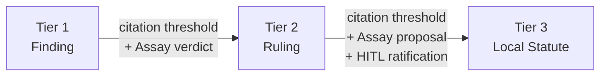
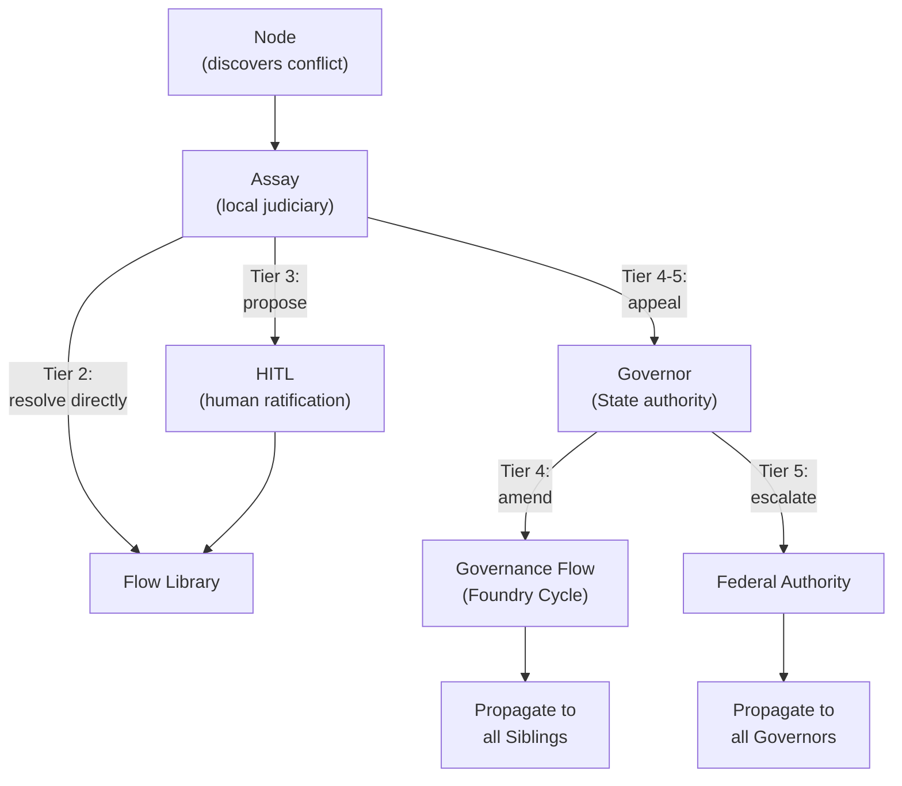

# Governance

A [Flow](./00-overview.md) is a sovereign micro-state. It has a body of [law](./02-data-model.md#laws), a [judiciary](./00-overview.md) that resolves disputes, and a legislative authority that codifies policy. Governance is the runtime's constitutional structure.

---

## The Legal Metaphor

Each branch of government has a clear institutional counterpart in the runtime.

| Authority | Function | Institutional Counterpart |
|--------|----------|--------------------------|
| **Common Law** | Establishes norms through practice | Nodes with `WRITE:law/finding` capability ([Appraise](./00-overview.md), [Refine](./00-overview.md) in the reference arrangement) — Tier 1 [Findings](./02-data-model.md#law-tiers) |
| **Judiciary** | Resolves disputes, codifies precedent | [Assay](./00-overview.md) node — Tier 2 [Rulings](./02-data-model.md#law-tiers) |
| **Legislature** | Enacts statute through ratified process | Flow Operator (Tier 3), [Governance Flow](#the-governance-flow) (Tier 4), Federation (Tier 5) |
| **Executive** | Enforces compliance | [Sort](./00-overview.md) node, [Terminal Contract](./02-data-model.md#terminal-contracts), [Sidecar](../03-node/01-sidecar.md) |

Law hardens through these branches in sequence. Nodes observe patterns during work and record [Findings](./02-data-model.md#law-tiers) — common law that emerges from practice. When Findings conflict or accumulate enough citation weight, [Assay](./00-overview.md) adjudicates and codifies the result as a binding Tier 2 Ruling — precedent forged through judicial process. Rulings that prove durable can be proposed as Tier 3 statutes, but statute requires human ratification. The executive enforces whatever law exists at each tier, without interpretation. These boundaries are constitutional — each branch has authority the others cannot exercise.

---

## Standalone Governance

A standalone Flow (no [Governor](#the-governor)) manages its own governance through complementary mechanisms.

### Organic Discovery (Tiers 1–2)

Laws emerge from work. When a node encounters a situation that warrants a rule — a pattern, a constraint, a quality standard — it records a Tier 1 Finding through the [SDK](../03-node/02-sdk-core.md). Findings are ephemeral. They carry a default TTL of 30 days and decay if uncited. The [Citation Processor](../02-flow/04-system-services.md) tracks usage: how often each law is cited, by which nodes, and whether those citations are compliant (the law functioned as a guardrail) or conflicting (the law forced a correction).

Findings that prove useful — cited frequently across [Workitems](./02-data-model.md#workitems) — accumulate citation data that can trigger a **review hearing**. The [Librarian](../02-flow/04-system-services.md) detects when a Finding crosses a configurable citation threshold and triggers creation of a ReviewHearing Workitem, routed to the [Assay](./00-overview.md) node.

Assay evaluates the Finding's history and renders a verdict:

| Verdict | Effect |
|---------|--------|
| **Promote** | Finding is minted as a Tier 2 Ruling — binding precedent with a 90-day TTL |
| **Retain** | Finding's TTL is reset. It continues as Tier 1. |

A Finding that is neither cited enough to trigger promotion nor cited at all will expire at its TTL and enter a [TTL-expiry hearing](#decay-and-retirement). Governance hardens organically: rules that matter survive; rules that don't, disappear.

### Administered Policy (Tier 3)

Tier 3 Local Statutes are the Flow's own legislative authority. For standalone Flows, these are [Law CRDs](./02-data-model.md#laws) applied by an administrator — typically via Helm manifests or GitOps. They have no automatic decay.

The [Librarian](../02-flow/04-system-services.md) indexes externally applied Law CRDs and makes them available for queries and conflict detection. A law is not active until indexing is complete — conflict detection is a hard prerequisite, not a lazy background task.

### Judicial Review (Assay)

The [Assay](./00-overview.md) node is the judiciary. It is invoked when governance reaches an impasse:

1. **Feedback deadlock.** When a [feedback](./02-data-model.md#feedback) item's history depth exceeds the configured `maxFeedbackDepth`, [Sort](./00-overview.md) transitions the item to `deadlocked` and routes the Workitem to Assay. Assay examines the investigative history — the forced-choice justifications, the citations, the novel arguments — retires the conflicting laws, and mints a new Tier 2 Ruling that consolidates the decision. The feedback item's `linkedRuling` is set to this Ruling regardless of which side Assay favours.

2. **Review hearing.** When a law's citation count or TTL triggers a review, Assay renders a verdict. Citation-threshold hearings use [Promote / Retain](#organic-discovery-tiers-12). TTL-expiry hearings use tier-specific verdicts: [Retire / Promote](#decay-and-retirement) for Tier 1, [Demote / Promote](#decay-and-retirement) for Tier 2.

Assay's verdicts are enforced by the [Contempt Guard](./02-data-model.md#contempt-guard). Once a ruling is linked to a feedback item, the losing side must accept the verdict — the Sidecar blocks any transition that contradicts the ruling.

---

## Precedent

Precedent is the mechanism by which governance hardens over time. A Tier 1 Finding is soft — it decays, it can be ignored at the cost of friction. A Tier 2 Ruling is binding — it was forged in adversarial review, and its authority derives from the judicial process that produced it.

### Promotion

The promotion path runs upward through the tiers:



Tier 1 to Tier 2 is automatic upon Assay's verdict. Tier 2 to Tier 3 is never automatic — Assay can propose a statute, but a human must ratify it. This boundary is absolute. Statutes auto-retire conflicting lower-tier laws, and that power requires human judgement.

Promotion is also where governance can harden in *form*, not just authority. Assay decides what a Ruling should say, but it is a judge, not a scribe — it may not know the formal syntax required to express the rule as executable logic. [Codification Services](../02-flow/04-system-services.md) bridge this gap: ephemeral, specialised containers that translate a verdict's intent into the appropriate format. When promoted, a Finding can gain new [representations](./02-data-model.md#representations) — formal logic alongside the original prose — increasing enforceability without changing its goal.

### Decay and Retirement

Laws below Tier 3 decay if uncited. When a law's TTL expires, the Librarian triggers creation of a ReviewHearing Workitem rather than deleting the law silently. Assay evaluates the case and renders a tier-specific verdict:

**Tier 1 Finding — TTL expiry:**

| Verdict | Effect |
|---------|--------|
| **Retire** | Finding is deleted. History preserved in the audit log. |
| **Promote** | Finding is minted as a Tier 2 Ruling (90-day TTL). |

**Tier 2 Ruling — TTL expiry:**

| Verdict | Effect |
|---------|--------|
| **Demote** | Ruling drops to Tier 1 Finding (fresh 30-day TTL). Citation history does not carry over. |
| **Promote** | Assay petitions for Tier 3 Statute (HITL ratification required). |

No law dies silently. Every expiry is a hearing. Every hearing produces either a renewed mandate or a deliberate retirement.

Retired laws are deleted as CRDs. The full history — creation, citations, conflicts, retirement — is preserved in the audit log.

### Conflict Resolution During Work

When nodes cite conflicting laws during Workitem processing — not at integration time, but during the adversarial loop — resolution depends on the tiers involved:

| Conflict | Resolution |
|----------|------------|
| **Tier 1 vs Tier 2** (or vice versa) | Supremacy informs the outcome. Assay mints a new Tier 2 Ruling. Originals retired. |
| **Same tier** (Tier 1 vs Tier 1, or Tier 2 vs Tier 2) | Assay resolves and drafts a new Tier 2 Ruling consolidating the conflicting laws. Originals retired. |
| **Tier 1–2 vs Tier 3** | The lower-tier law is retired. If the conflict reveals ambiguity or a gap in the Tier 3 statute, Assay petitions HITL with a proposed clarification or amendment. |
| **Tier 3 vs Tier 3** | Assay drafts a *proposal* for a consolidated Tier 3 statute. HITL approves or rejects. |
| **Tier 4 or Tier 5 involvement** | Assay files an *appeal* to the [Governor](#the-governor) via the Librarian gRPC channel. |

### Assay's Authority Ceiling

Assay's power is constitutionally bounded:

| Tier range | Authority | Action |
|------------|-----------|--------|
| Tier 2 | **Resolve** | Full judicial authority. Can retire, consolidate, and mint new Tier 2 Rulings. |
| Tier 3 | **Propose** | Drafts a proposal. HITL approves or rejects. |
| Tier 4–5 | **Appeal** | Files an appeal to the Governor. Cannot directly modify. |

When a human rejects Assay's Tier 3 proposal, the conflicting statutes remain active. Assay issues a one-time Tier 2 Ruling to resolve the immediate Workitem dispute. Every future Workitem that hits the same conflict generates another Assay invocation, another Tier 2 Ruling, and more [friction](./00-overview.md#friction). The system does not force the humans' hand. It measures the cost of the decision until someone acts.

---

## The Governor

The Governor is a dedicated [Flow Operator](../02-flow/01-operator.md) that runs in its own Kubernetes namespace (`governance-flow`). It serves constitutionally distinct functions.

### State Root Certificate Authority

The Governor holds the self-signed Root CA keypair for the State trust hierarchy. It issues intermediate CA certificates to each Sibling Flow's Operator, establishing a hub-and-spoke trust model:

```text
Governor (Root CA)
  ├─ Flow A Operator (Intermediate CA)
  │   ├─ Forge Node (Leaf)
  │   └─ Quench Node (Leaf)
  ├─ Flow B Operator (Intermediate CA)
  │   ├─ Deploy Node (Leaf)
  │   └─ Monitor Node (Leaf)
  └─ Flow C Operator (Intermediate CA)
      └─ Optimize Node (Leaf)
```

Sibling Flows share a common trust root. A [stamp](./02-data-model.md#passports-and-stamps) produced by any node in any sibling is cryptographically verifiable by tracing the certificate chain back to the State Root — without direct peer relationships between the siblings. This eliminates N-squared scaling: adding a new sibling requires a single certificate exchange with the Governor, not reconfiguration of every existing Flow.

Sibling Operators bootstrap trust through the **Annexation Protocol**: a Certificate Signing Request handshake that anchors the Sibling's intermediate CA to the State Root. Details of the Annexation Protocol, key management providers, and certificate lifecycle are covered in [Flow Operator](../02-flow/01-operator.md).

### Legislator (Tier 4 Authority)

The Governor runs the **Governance Flow** — a Flow whose governed [artefacts](./02-data-model.md#artefacts) are laws. It is subject to the same [Foundry Cycle](./00-overview.md#the-foundry-cycle) as any other Flow: Forge drafts legislation, Quench validates formal constraints, Appraise reviews for consistency with existing law, Sort gates the process, Refine addresses feedback, and Assay resolves disputes.

The legislative process follows the standard cycle with one critical addition: a HITL gate at Sort. No Tier 4 State Constitution law is enacted without human ratification. The ratified law is minted as a Law CRD and published to all Sibling Flows.

The Governor holds exclusive write authority for Tier 4 laws. Sibling Flows consume them as read-only.

### Diplomat (Federation Gateway)

The Governor maintains persistent gRPC connections to upstream Federal authorities. It pulls Tier 5 Federal Accord packages on a configurable schedule, verifies signatures, and integrates them into the State Library. If two Federal authorities publish conflicting laws, the Governor rejects the sync and emits an alert — manual resolution is required.

After syncing, the Governor publishes a State Library snapshot containing all Tier 4 State Constitution laws and Tier 5 Federal Accords. Sibling Flows' [Librarians](../02-flow/04-system-services.md) consume this snapshot to stay current with higher-tier governance.

---

## The Governance Flow

The Governance Flow is a Flow. It uses the same runtime, the same CRDs, the same node types. Its distinguishing feature is its subject matter: its Workitems are petitions for legislative action, and its governed artefacts are law drafts that, when approved, become binding Tier 4 State Constitution laws.

### Inputs

Petitions arrive from multiple sources:

| Source | Petition Type | Example |
|--------|--------------|---------|
| Sibling Flow (Assay appeal) | Conflict resolution | "Tier 4 law X conflicts with operational needs — request amendment or clarification" |
| Sibling Flow (promotion) | Cross-Flow pattern with State-wide relevance | "Pattern P observed across multiple Flows — propose as Tier 4 State Constitution" |
| Human administrator | Policy change | "All Flows must enforce code coverage thresholds" |

### Processing

The petition enters the standard Foundry Cycle. Forge drafts the law. Quench validates formal constraints against existing Tier 4 laws. Appraise reviews for consistency, unintended consequences, and conflicts with existing governance. Sort gates — and at the Sort gate, a human legislative authority reviews and ratifies.

The output is a new or amended Tier 4 Law CRD, published to all Sibling Flows via the State Library snapshot.

### Self-Governance

The Governance Flow is itself governed. Its own Tier 3 statutes define how legislation is drafted, what quorum is required for ratification, and what review standards apply. This is recursive but finite — the Governance Flow's internal laws are administered by the Governor's operator, not produced by another Governance Flow.

---

## Law Integration Protocol

When higher-tier laws are pushed to a Sibling Flow — via Librarian-to-Librarian gRPC — the receiving [Librarian](../02-flow/04-system-services.md) runs a two-stage conflict check before integration.

### Stage 1: Semantic Search

The Librarian queries its semantic index for all existing laws above a configurable similarity threshold. This finds laws that are *semantically related* to the incoming law — potential conflicts, overlaps, or redundancies.

### Stage 2: LLM Conflict Evaluation

Each candidate from the semantic search is evaluated by an LLM for actual contradiction. Semantic similarity does not always mean conflict. Two laws about code style may be related but compatible. The LLM determines whether there is a genuine contradiction.

### Resolution by Tier

If a conflict is confirmed, resolution depends on the tier of the conflicting local law:

| Conflicting Local Law | Resolution |
|-----------------------|------------|
| **Tier 1 or Tier 2** | Immediate retirement. The lower-tier law is replaced by the incoming higher-tier law. No human intervention. The CRD is deleted; history is preserved in the audit log. |
| **Tier 3** | Integration paused. HITL notification. Supremacy is not optional — the local statute *must* change — but the Flow can request a **grace period**. |

### Grace Period

The grace period is a formalised exemption. It acknowledges that organisations need time to adapt — the same way a team might need runway to upgrade a dependency when architecture mandates a new version. Foundry Flow makes this formal and trackable.

During the grace period:

- The **old Tier 3 law remains enforced** in the Flow's Library
- The **incoming higher-tier law is queued but not active**
- The exemption has a **deadline** and is fully auditable

When the grace period expires:

- The incoming law is **integrated automatically**
- The conflicting Tier 3 law is **retired** (CRD deleted, audit log retained)
- If the Flow has not adapted, its work **starts failing governance checks** — Workitems cannot exit if they violate the now-active higher-tier law

The [terminal contract](./02-data-model.md#terminal-contracts) enforces compliance organically. [Friction](./00-overview.md#friction) spikes, and the data tells the story.

---

## Escalation Across Boundaries

Escalation is the mechanism by which conflicts that exceed a Flow's judicial authority reach the institutions that can resolve them.

### Flow to Governor

When a Sibling Flow's [Assay](./00-overview.md) node encounters a conflict involving Tier 4 or Tier 5 laws, it files an **appeal** — a cross-Flow message via the Librarian gRPC channel — to the Governor.

- **Tier 4 conflict:** The Governor can repeal or amend its own Tier 4 laws to resolve the issue. The amendment enters the Governance Flow's Foundry Cycle and, if ratified, propagates to all sibling Flows.
- **Tier 5 conflict:** The Governor escalates the appeal to the relevant Federal authority.

### Governor to Federation

Federal authorities operate their own Governance Flows — full Foundry Cycle deployments whose governed artefacts are Tier 5 Federal Accords. When a Governor appeals a Tier 5 conflict, the Federal authority deliberates and produces one of two outcomes:

| Outcome | Effect |
|---------|--------|
| **Global amendment** | The Federal authority ratifies an update to the Tier 5 package. The amendment propagates to all subscribing Governors. |
| **Exemption** | The Federal authority issues a time-boxed risk acceptance. The exemption carries a mandatory expiry. On expiry, the law integrates automatically and the exemption lapses. |

### The Escalation Chain



Each level of the chain has bounded authority. No institution can exceed its constitutional ceiling. Nodes raise issues. Assay adjudicates within its tier. The Governor legislates within the State. The Federation legislates across States. The escalation path is a routing protocol, not a request for permission — it sends the conflict to the institution with the authority to resolve it.

---

## Standalone vs Federated

| Capability | Standalone Flow | Federated Flow (under Governor) |
|------------|----------------|--------------------------------|
| **Law tiers** | Tiers 1, 2, 3 | Tiers 1, 2, 3, 4, 5 |
| **Tier 3 authority** | Administrator (CRDs via GitOps) | Administrator or local legislative cycle |
| **Tier 4–5** | Do not exist | Published by Governor / Federation |
| **Trust root** | Flow Operator (self-signed) | State Root CA (Governor) |
| **Cross-Flow stamps** | Invalid — chain of custody resets at boundary | Valid if certificate chain traces to shared State Root |
| **Escalation ceiling** | Assay resolves at Tier 2, proposes Tier 3, no higher | Assay appeals to Governor for Tier 4–5 |

A standalone Flow is fully self-contained. It can be deployed, operated, and governed without any external dependency. Federation adds higher-tier governance and cross-Flow trust, but the core governance model — organic discovery, judicial review, administered policy — is identical in both configurations.

---

## Treaties

[Treaties](../02-flow/06-cross-flow.md) enable collaboration between Flows that do not share a Governor — typically across organisational boundaries. Where Federation provides implicit trust through a shared Root CA, a Treaty provides explicit trust through a bilateral agreement with unidirectional execution. Two-way exchange requires two separate Treaties.

The governance implication is **naturalisation**: when a [Workitem](./02-data-model.md#workitems) crosses a Treaty boundary, foreign [stamps](./02-data-model.md#passports-and-stamps) are preserved for audit but carry no local authority. The importing Flow applies a naturalisation stamp and begins a new chain of custody under its own trust root. The structural details and the full export-import protocol are covered in [Cross-Flow Collaboration](../02-flow/06-cross-flow.md).

---

## Friction as Governance Signal

The [Friction Ledger](./00-overview.md#friction) is governance's economic conscience. It separates **compliance** (citing a law as a guardrail — zero friction) from **resistance** (fighting a law's enforcement — escalating friction).

Friction accumulates exponentially. A law cited for context seeding generates zero friction — it is doing its job. A law that blocks an artefact generates friction that compounds on each repeat conflict. Judicial hearings and unplanned human escalations amplify the signal further. The result is a heatmap of **toxic laws** (high resistance, exponential penalties) versus **foundational laws** (high usage, zero friction).

The Friction Ledger is law-attributable and tier-attributable. A team lead sees their local friction — which of *their* rules generate the most heat. A compliance officer sees the federated friction — which Tier 4 State Constitution laws generate the most resistance across the organisation. Every layer of governance carries a measurable price tag.

Friction data feeds back into the governance process. Laws that generate disproportionate friction surface for review. Patterns of constitutional resistance point to laws that need amendment, consolidation, or repeal. The system surfaces the cost of its own governance, creating pressure toward improvement.
