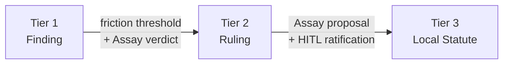
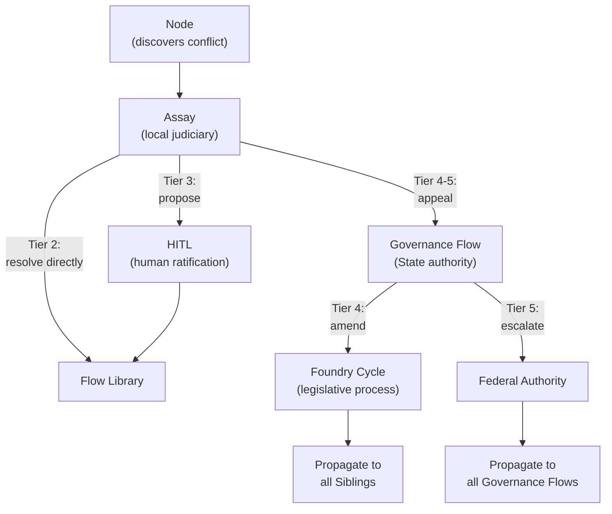

# Governance

A [Flow](./00-overview.md) is a sovereign micro-state. It has a body of [law](./03-data-model.md#laws), a [judiciary](./02-foundry-cycle.md#assay-judiciary--standard-component) that resolves disputes, and a legislative authority that codifies policy. Governance is the runtime's constitutional structure.

---

## The Legal Metaphor

| Authority | Function | Institutional Counterpart |
|--------|----------|--------------------------|
| **Common Law** | Establishes norms through practice | Nodes with `WRITE:law/finding` capability ([Appraise](./02-foundry-cycle.md#appraise-reviewer), [Refine](./02-foundry-cycle.md#refine-refiner) in the reference arrangement) — Tier 1 [Findings](./03-data-model.md#law-tiers) |
| **Judiciary** | Resolves disputes, codifies precedent | [Assay](./02-foundry-cycle.md#assay-judiciary--standard-component) node — Tier 2 [Rulings](./03-data-model.md#law-tiers) |
| **Legislature** | Enacts statute through ratified process | Flow Architect (Tier 3), [Governance Flow](#the-governance-flow) (Tier 4), Federation (Tier 5) |
| **Executive** | Enforces compliance | Gate node ([Sort](./02-foundry-cycle.md#sort-gate) in the reference arrangement), [Exit Contract](./03-data-model.md#entry-and-exit-contracts), [Sidecar](../03-node/01-sidecar.md) |

Law hardens through these branches in sequence. Nodes observe patterns during work and record [Findings](./03-data-model.md#law-tiers) — common law that emerges from practice. When Findings conflict or accumulate enough citation weight, [Assay](./02-foundry-cycle.md#assay-judiciary--standard-component) adjudicates and codifies the result as a binding Tier 2 Ruling — precedent forged through judicial process. Rulings that prove durable can be proposed as Tier 3 statutes, but statute requires human ratification. The executive enforces whatever law exists at each tier, without interpretation.

---

## Standalone Governance

A standalone Flow (no [Governance Flow](#the-governance-flow)) manages its own governance through complementary mechanisms.

### Organic Discovery (Tiers 1–2)

Laws emerge from work. When a node encounters a situation that warrants a rule — a pattern, a constraint, a quality standard — it records a Tier 1 Finding through the [SDK](../04-sdk/01-sdk-core.md). Findings are ephemeral. They carry a configurable TTL and decay if unused. Nodes that use a law [cite](../04-sdk/03-sdk-legal.md#citation) it through the SDK, which records a low-magnitude [friction](./00-overview.md#friction) event attributed to that law. The [Flow Monitor](../02-flow/04-system-services.md#flow-monitor-and-friction-surface) aggregates these events, and the [Librarian](../02-flow/04-system-services.md) periodically queries the accumulated friction on each law.

Findings that prove useful — cited frequently across [Workitems](./03-data-model.md#workitems) — accumulate friction that can trigger a **review hearing**. The [Librarian](../02-flow/04-system-services.md) detects when a Finding's friction crosses a configurable threshold and triggers creation of a Workitem for review-hearing processing, routed to the [Assay](./02-foundry-cycle.md#assay-judiciary--standard-component) node.

Assay evaluates the Finding's friction level and goal, and renders a verdict:

| Verdict | Effect |
|---------|--------|
| **Promote** | Finding is minted as a Tier 2 Ruling — binding precedent with a configurable TTL |

A Finding that does not accumulate enough friction to trigger promotion will expire at its TTL and enter a [TTL-proximity hearing](#decay-and-retirement).

### Administered Policy (Tier 3)

Tier 3 Local Statutes are the Flow's own legislative authority. For standalone Flows, these are [laws](./03-data-model.md#laws) applied by an administrator — typically via declarative configuration. They have no automatic decay.

The [Librarian](../02-flow/04-system-services.md) admits externally applied laws into the active law body only after governance checks complete. Integration sequencing and activation mechanics are defined in [System Services](../02-flow/04-system-services.md).

### Judicial Review (Assay)

The [Assay](./02-foundry-cycle.md#assay-judiciary--standard-component) node is the judiciary. It is invoked when governance reaches an impasse:

1. **Feedback deadlock.** When a [feedback](./03-data-model.md#feedback) item's history depth exceeds the configured `maxFeedbackDepth`, the gate node (in the [reference arrangement](./02-foundry-cycle.md), [Sort](./02-foundry-cycle.md#sort-gate)) transitions the item to `deadlocked` and routes the Workitem to Assay. Assay examines the investigative history — the forced-choice justifications, the citations, the novel arguments — retires the conflicting laws, and mints a new Tier 2 Ruling that consolidates the decision. The feedback item's `linkedRuling` is set to this Ruling regardless of which side Assay favours.

    Assay's deliberation is itself a friction source. Each jury round emits [friction](./03-data-model.md#friction) with magnitude = depth ^ (round + 1), where depth is the feedback depth at escalation. A depth-5 item costs 25 on the first jury round, 125 on the second, 625 on the third. If Assay cannot resolve the dispute and escalates to human intervention, a single friction event is emitted with magnitude = depth ^ (rounds * 2) — a depth-5 item after 3 jury rounds produces 15,625. The cost curve ensures that disputes reaching Assay are visibly expensive, and disputes reaching humans are dramatically so.

2. **Review hearing.** When a law's friction level or TTL triggers a review, Assay renders a verdict. Friction-threshold hearings for Tier 1 use [Promote](#organic-discovery-tiers-12). TTL-proximity hearings use tier-specific verdicts: [Retire / Promote](#decay-and-retirement) for Tier 1, [Demote / Promote](#decay-and-retirement) for Tier 2. Hearings use standard Workitems with explicit governed artefacts, including a `lawId` reference for the law under review. They do not introduce a Workitem subtype or a `spec.type` discriminator. Hearing Workitems are self-contained at Assay.

Assay's verdicts are enforced by the [Contempt Guard](./03-data-model.md#contempt-guard). Once a ruling is linked to a feedback item, the losing side must accept the verdict — [Archivist](../02-flow/04-system-services.md) rejects contradictory transitions with `CONTEMPT_VIOLATION`.

---

## Precedent

Precedent is the mechanism by which governance hardens over time. A Tier 1 Finding is soft — it decays, it can be ignored at the cost of friction. A Tier 2 Ruling is binding — it was forged in adversarial review, and its authority derives from the judicial process that produced it.

### Promotion

The promotion path runs upward through the tiers:



Tier 1 to Tier 2 is automatic upon Assay's verdict. Tier 2 to Tier 3 is never automatic — Assay can propose a statute, but a human must ratify it. This boundary is absolute. Statutes auto-retire conflicting lower-tier laws, and that power requires human judgement.

Promotion is also where governance can harden in *form*, not just authority. When promoted, a Finding can gain new [representations](./03-data-model.md#representations) — for example, formal logic alongside the original prose — increasing enforceability without changing its goal. Representation lifecycle responsibilities — including specialised [translation services](../02-flow/04-system-services.md#codification-services) that translate goals into formal representations — are defined in [System Services](../02-flow/04-system-services.md).

### Decay and Retirement

Laws below Tier 3 decay if unused. When a law enters a configurable window before its TTL expiry, the [Librarian](../02-flow/04-system-services.md) triggers creation of a Workitem for review-hearing processing rather than letting the law expire silently. Assay evaluates the case — considering the law's accumulated [friction](./00-overview.md#friction) (queried from the [Flow Monitor](../02-flow/04-system-services.md#flow-monitor-and-friction-surface)) and the law's goal — and renders a tier-specific verdict:

**Tier 1 Finding — TTL expiry:**

| Verdict | Effect |
|---------|--------|
| **Retire** | Finding is deleted. History preserved in the audit log. |
| **Promote** | Finding is minted as a Tier 2 Ruling. |

**Tier 2 Ruling — TTL expiry:**

| Verdict | Effect |
|---------|--------|
| **Demote** | Ruling drops to Tier 1 Finding (fresh TTL). |
| **Promote** | Assay petitions for Tier 3 Statute (HITL ratification required). |

Every hearing produces either a renewed mandate or a deliberate retirement. There is no TTL reset — hearings are decisive.

Retired laws are deleted. The full history — creation, citations, conflicts, retirement — is preserved in the audit log.

### Conflict Resolution During Work

When nodes cite conflicting laws during Workitem processing — not at integration time, but during the adversarial loop — the conflict is routed to [Assay](./02-foundry-cycle.md#assay-judiciary--standard-component) for judicial review. Supremacy heavily informs the outcome but does not bypass deliberation. Resolution depends on the tiers involved:

| Conflict | Resolution |
|----------|------------|
| **Tier 1 vs Tier 2** (cross-tier) | Assay deliberates. Supremacy heavily informs the outcome — the higher-tier law carries greater authority — but Assay still adjudicates. Assay mints a new Tier 2 Ruling consolidating the surviving position. Originals retired. |
| **Same tier** (Tier 1 vs Tier 1, or Tier 2 vs Tier 2) | Assay resolves and drafts a new Tier 2 Ruling consolidating the conflicting laws. Originals retired. |
| **Tier 1–2 vs Tier 3** | The lower-tier law is retired. If the conflict reveals ambiguity or a gap in the Tier 3 statute, Assay petitions HITL with a proposed clarification or amendment. |
| **Tier 3 vs Tier 3** | Assay drafts a *proposal* for a consolidated Tier 3 statute and petitions HITL. On rejection, the conflict persists — every future Workitem that encounters the same conflict generates another HITL escalation and more friction until the humans act. |
| **Tier 4 or Tier 5 involvement** | Assay files an *appeal* to the [Governance Flow](#the-governance-flow) via the Librarian. |

### Assay's Authority Ceiling

Assay's power is constitutionally bounded:

| Tier range | Authority | Action |
|------------|-----------|--------|
| Tier 1 | **None** | Assay does not write Tier 1 Findings. Tier 2 is both the floor and the ceiling of its judicial authority. |
| Tier 2 | **Resolve** | Full judicial authority. Can retire, consolidate, and mint new Tier 2 Rulings. |
| Tier 3 | **Propose** | Drafts a proposal. HITL approves or rejects. |
| Tier 4–5 | **Appeal** | Files an appeal to the Governance Flow. Cannot directly modify. |

When a human rejects Assay's Tier 3 proposal, the conflicting statutes remain active. Every future Workitem that hits the same conflict generates another Assay invocation, another HITL escalation, and more [friction](./00-overview.md#friction). The system does not force the humans' hand. It measures the cost of the decision until someone acts.

---

## The Governance Flow

The Governance Flow is a dedicated, pre-configured [Flow](./00-overview.md) that runs in its own namespace. It uses the same runtime, the same CRDs, and the same operator as any other Flow, but its purpose is constitutional: creating and managing state law, and integrating federal authorities.

### State Root Certificate Authority

The Governance Flow holds the self-signed Root CA keypair for the State trust hierarchy. It issues intermediate CA certificates to each Sibling Flow's Operator, establishing a hub-and-spoke trust model:

```text
Governance Flow (Root CA)
  ├─ Flow A Operator (Intermediate CA)
  │   ├─ Forge Node (Leaf)
  │   └─ Quench Node (Leaf)
  ├─ Flow B Operator (Intermediate CA)
  │   ├─ Deploy Node (Leaf)
  │   └─ Monitor Node (Leaf)
  └─ Flow C Operator (Intermediate CA)
      └─ Optimize Node (Leaf)
```

Sibling Flows share a common trust root. A [stamp](./03-data-model.md#passports-and-stamps) produced by any node in any sibling is cryptographically verifiable by tracing the certificate chain back to the State Root — without direct peer relationships between the siblings. This eliminates N-squared scaling: adding a new sibling requires a single certificate exchange with the Governance Flow, not reconfiguration of every existing Flow.

Sibling Operators bootstrap trust by anchoring each Sibling's intermediate CA to the State Root. Operator-level onboarding, key management, and certificate lifecycle details are covered in [Flow Operator](../02-flow/01-operator.md).

### Legislator (Tier 4 Authority)

The Governance Flow's governed [artefacts](./03-data-model.md#artefacts) are laws. It is subject to the same [Foundry Cycle](./02-foundry-cycle.md) as any other Flow — creation, validation, review, and refinement of law drafts, with Assay resolving disputes.

The legislative process follows the standard cycle with one critical addition: a HITL gate at the exit node. No Tier 4 State Constitution law is enacted without human ratification. The ratified law is minted as a Law CRD and published to all Sibling Flows.

The Governance Flow holds exclusive write authority for Tier 4 laws. Sibling Flows consume them as read-only.

### Diplomat (Federation Gateway)

The Governance Flow maintains persistent connections to upstream Federal authorities. It pulls Tier 5 Federal Accord packages on a configurable schedule, verifies signatures, and integrates them into the State Library. If two Federal authorities publish conflicting laws, the conflict is flagged for manual resolution, and the Governance Flow halts integration of the conflicting package until the contradiction is resolved at the Federal level.

After syncing, the Governance Flow publishes a State Library snapshot containing all Tier 4 State Constitution laws and Tier 5 Federal Accords. Sibling Flows' [Librarians](../02-flow/04-system-services.md) consume this snapshot to stay current with higher-tier governance.

---

### Legislative Process

The Governance Flow's Workitems are petitions for legislative action, and its governed artefacts are law drafts that, when approved, become binding Tier 4 State Constitution laws.

#### Inputs

Petitions arrive from multiple sources:

| Source | Petition Type | Example |
|--------|--------------|---------|
| Sibling Flow (Assay appeal) | Conflict resolution | "Tier 4 law X conflicts with operational needs — request amendment or clarification" |
| Sibling Flow (promotion) | Cross-Flow pattern with State-wide relevance | "Pattern P observed across multiple Flows — propose as Tier 4 State Constitution" |
| Human administrator | Policy change | "All Flows must enforce code coverage thresholds" |

#### Processing

The petition enters the standard [Foundry Cycle](./02-foundry-cycle.md). The creating node drafts the law. Validation checks formal constraints against existing Tier 4 laws. Review evaluates consistency, unintended consequences, and conflicts with existing governance. The gate node applies a HITL checkpoint — a human legislative authority reviews and ratifies before the law is enacted.

The output is a new or amended Tier 4 Law CRD, published to all Sibling Flows via the State Library snapshot.

#### Self-Governance

The Governance Flow is itself governed. Its own Tier 3 statutes define how legislation is drafted, what quorum is required for ratification, and what review standards apply. This is recursive but finite — the Governance Flow's internal laws are administered by its own Flow Architect, not produced by another Governance Flow.

---

## Law Integration Protocol

When higher-tier laws are pushed to a Sibling Flow — via Librarian-to-Librarian replication — the receiving [Librarian](../02-flow/04-system-services.md) runs a two-stage conflict check before integration.

### Stage 1: Semantic Search

The Librarian queries its semantic index for all existing laws above a configurable similarity threshold. This finds laws that are *semantically related* to the incoming law — potential conflicts, overlaps, or redundancies.

### Stage 2: Conflict Evaluation

Each candidate from the semantic search is evaluated by an LLM for actual contradiction. Semantic similarity does not always mean conflict. Two laws about code style may be related but compatible. The LLM determines whether there is a genuine contradiction.

### Resolution by Tier

If a conflict is confirmed, resolution depends on the tier of the conflicting local law:

| Conflicting Local Law | Resolution |
|-----------------------|------------|
| **Tier 1 or Tier 2** | Immediate retirement. The lower-tier law is replaced by the incoming higher-tier law. No human intervention. The local law is retired; history is preserved in the audit log. |
| **Tier 3** | Integration paused. HITL notification. Supremacy is not optional — the local statute *must* change — but the Flow can request a **grace period**. |

### Grace Period

The grace period is a formalised exemption. It acknowledges that organisations need time to adapt — the same way a team might need runway to upgrade a dependency when architecture mandates a new version. Foundry Flow makes this formal and trackable.

During the grace period:

- The **old Tier 3 law remains enforced** in the Flow's Library
- The **incoming higher-tier law is queued but not active**
- The exemption has a **deadline** and is fully auditable

When the grace period expires:

- The incoming law is **integrated automatically**
- The conflicting Tier 3 law is **retired** (CRD deleted, audit log retained)
- If the Flow has not adapted, its work **starts failing governance checks** — Workitems cannot exit if they violate the now-active higher-tier law

The [exit contract](./03-data-model.md#entry-and-exit-contracts) enforces compliance organically. [Friction](./00-overview.md#friction) spikes, and the data tells the story.

---

## Escalation Across Boundaries

Escalation is the mechanism by which conflicts that exceed a Flow's judicial authority reach the institutions that can resolve them.

### Flow to Governance Flow

When a Sibling Flow's [Assay](./02-foundry-cycle.md#assay-judiciary--standard-component) node encounters a conflict involving Tier 4 or Tier 5 laws, it files an **appeal** — a cross-Flow message via the Librarian — to the Governance Flow.

- **Tier 4 conflict:** The Governance Flow can repeal or amend its own Tier 4 laws to resolve the issue. The amendment enters the Governance Flow's [Foundry Cycle](./02-foundry-cycle.md) and, if ratified, propagates to all sibling Flows.
- **Tier 5 conflict:** The Governance Flow escalates the appeal to the relevant Federal authority.

### Governance Flow to Federation

Federal authorities operate their own Governance Flows — full [Foundry Cycle](./02-foundry-cycle.md) deployments whose governed artefacts are Tier 5 Federal Accords. When a Governance Flow appeals a Tier 5 conflict, the Federal authority deliberates and produces one of two outcomes:

| Outcome | Effect |
|---------|--------|
| **Global amendment** | The Federal authority ratifies an update to the Tier 5 package. The amendment propagates to all subscribing Governance Flows. |
| **Exemption** | The Federal authority issues a time-boxed risk acceptance. The exemption carries a mandatory expiry. On expiry, the law integrates automatically and the exemption lapses. |

### The Escalation Chain



Nodes raise issues. Assay adjudicates within its tier. The Governance Flow legislates within the State. The Federation legislates across States. The escalation path sends the conflict to the institution with the authority to resolve it.

---

## Standalone vs Federated

| Capability | Standalone Flow | Federated Flow (under Governance Flow) |
|------------|----------------|--------------------------------|
| **Law tiers** | Tiers 1, 2, 3 | Tiers 1, 2, 3, 4, 5 |
| **Tier 3 authority** | Administrator (declarative configuration) | Administrator or local legislative cycle |
| **Tier 4–5** | Do not exist | Published by Governance Flow / Federation |
| **Trust root** | Flow Operator (self-signed) | State Root CA (Governance Flow) |
| **Cross-Flow stamps** | Treaty crossings preserve provenance; local authority starts at naturalisation | Sibling crossings are authoritative after shared-root chain verification; Treaty crossings still naturalise |
| **Escalation ceiling** | Assay resolves at Tier 2, proposes Tier 3, no higher | Assay appeals to Governance Flow for Tier 4–5 |

A standalone Flow is fully self-contained. It can be deployed, operated, and governed without any external dependency. Federation adds higher-tier governance and cross-Flow trust, but the core governance model — organic discovery, judicial review, administered policy — is identical in both configurations.

---

## Treaties

[Treaties](../02-flow/06-cross-flow.md) enable collaboration between Flows that do not share a Governance Flow — typically across organisational boundaries. Where Federation provides implicit trust through a shared Root CA, a Treaty provides explicit trust through a bilateral agreement with unidirectional execution. Two-way exchange requires two separate Treaties.

The governance implication at Treaty boundaries is **naturalisation**: when a [Workitem](./03-data-model.md#workitems) crosses between non-sibling Flows, foreign [stamps](./03-data-model.md#passports-and-stamps) are preserved for audit but do not satisfy local stamp requirements. The importing Flow applies a naturalisation stamp and begins a new chain of custody under its own trust root. Sibling Flows do not require Treaties; under shared-root verification, sibling stamps can satisfy local requirements immediately when names match. The structural details and the full export-import protocol are covered in [Cross-Flow Collaboration](../02-flow/06-cross-flow.md).

---

## Friction as Governance Signal

Friction is governance's economic conscience. The system emits friction transparently at every governance touchpoint: each law [citation](../04-sdk/03-sdk-legal.md#citation) records a small signal, each round of [feedback](./03-data-model.md#friction) escalates the cost, and judicial and human escalation compound it exponentially. The [Flow Monitor](../02-flow/04-system-services.md#flow-monitor-and-friction-surface) aggregates these events post-hoc across whatever axes operators need. The friction signal reflects the real cost of the governance each Workitem encountered.

Friction data is law-attributable and tier-attributable. A team lead sees their local friction — which of *their* rules generate the most heat. A compliance officer sees the federated friction — which Tier 4 State Constitution laws generate the most resistance across the organisation. Every layer of governance carries a measurable price tag.

Friction data feeds back into the governance process. Laws that generate disproportionate friction surface for review — the [Librarian](../02-flow/04-system-services.md) queries friction levels to trigger promotion hearings. Patterns of constitutional resistance point to laws that need amendment, consolidation, or repeal. The system surfaces the cost of its own governance, creating pressure toward improvement.
