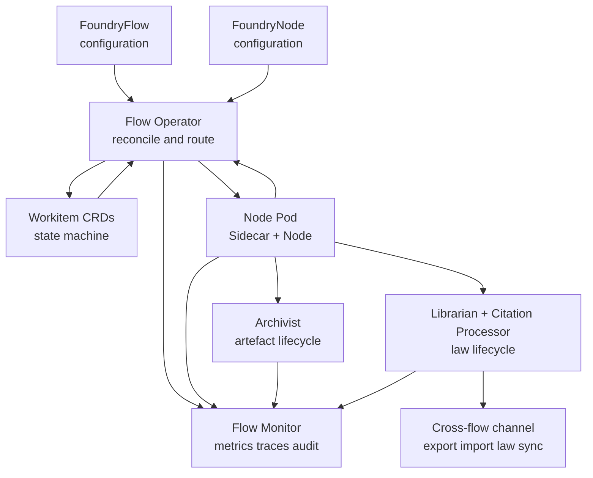
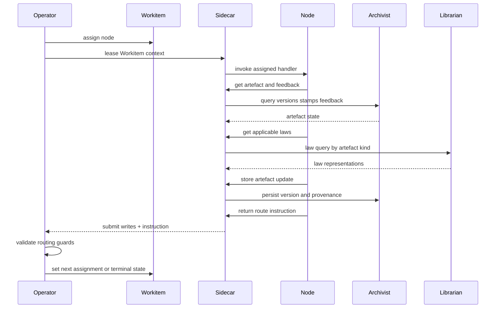
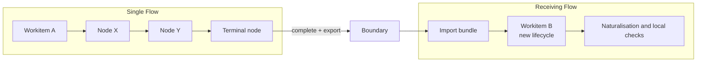

# Flow Runtime Overview

Foundry Flow's conceptual model is defined in [Conceptual Overview](../01-concepts/00-overview.md), [Architecture](../01-concepts/01-architecture.md), [Data Model](../01-concepts/02-data-model.md), and [Governance](../01-concepts/03-governance.md). This document defines the runtime view used by operators and platform administrators: component boundaries, execution loop, and non-negotiable behaviour invariants.

`02-flow/` is the platform specification for operating a Flow. Node implementation detail lives in [Node Overview](../03-node/00-overview.md). Field-level schema and wire shape live in [CRD Reference](../04-reference/crds.md).

## Runtime Composition

A Flow runtime is composed of control-plane actors, data-plane workers, and boundary services:

- The [Flow Operator](./01-operator.md) reconciles configuration, assigns Workitems, validates routing outcomes, and enforces terminal contracts.
- The [Workitem runtime contract](./02-workitem.md) carries control-plane state and artefact references while the Workitem moves through the Flow.
- [External and reference nodes](./03-nodes-external.md) execute work through Sidecar-mediated APIs; node pods stay stateless at execution level.
- [System services](./04-system-services.md) provide law lifecycle, artefact lifecycle, citation processing, telemetry aggregation, and backup surfaces.
- [Configuration](./05-configuration.md) defines topology, contracts, capability grants, and policy limits that shape runtime behaviour.
- [Cross-flow collaboration](./06-cross-flow.md) governs export/import boundaries, trust topology, naturalisation, and law integration.
- [Operations](./07-operations.md) governs monitoring, triage, recovery, and validation drills.

## Runtime Loop

Each Workitem moves through a deterministic control loop:

1. Operator observes a routable Workitem and assigns it to one node.
2. Sidecar leases Workitem execution context to the node.
3. Node reads artefacts, laws, and feedback through Sidecar-mediated APIs.
4. Node writes artefact changes and returns a routing instruction.
5. Sidecar persists allowed writes; Operator evaluates routing guards.
6. Operator routes to the next node or validates terminal completion.

The Flow remains sequential at orchestration level: one Workitem, one assignee, one routing outcome at a time.

## Reference Arrangement and Topology Freedom

The Foundry Cycle is the reference arrangement, not a mandatory topology. Flow Architects can add nodes, merge responsibilities, split gate nodes, or replace reference implementations, as long as platform invariants hold.

The runtime enforces behaviour through configuration and capabilities, not node names. "Forge", "Sort", or "Refine" describe standard responsibilities in the reference arrangement, but any deployment can map those responsibilities differently.

Assay is the exception: it is a standard runtime component present in every Flow and participates as a routable judicial node.

## Governance Runtime Mechanics

Law and stamp behaviour in runtime is fixed by invariant:

- Forge reads laws for context seeding and does not write laws.
- Laws are single objects with one goal and one-or-more representations; any mutation creates a new whole-law version.
- Stamp names are named governance checkpoints chosen by the Flow Architect; the platform attaches no built-in semantics to names.
- Sort is a gate in the reference arrangement with fixed decision order:
  1. unresolved feedback routes to Refine;
  2. deadlocked feedback routes to Assay;
  3. missing required stamps route to the node configured to provide each missing stamp;
  4. all feedback resolved and required stamps present allows Sort to apply `approval` and complete the reference path.
- `approval` is a reference-arrangement convention, not a privileged system stamp.
- Assay authority is bounded: resolve Tier 1-2, propose Tier 3, appeal Tier 4-5.

## Terminal Completion Model

Terminal completion is configuration-bound:

- A node is terminal only when configured with a terminal contract binding.
- Only terminal nodes may call `complete()`.
- The Operator, not the node, validates the bound contract.
- Terminal contracts are keyed by artefact kind with required stamp-name lists.
- If multiple artefacts of a required kind exist, all must satisfy that kind's requirement.
- A required kind with an empty stamp list means presence-only.
- A contract with no artefact entries imposes no artefact requirements.

When completion triggers cross-flow export, only artefact kinds listed in the selected terminal contract are exported. An empty contract exports metadata only.

## Data Ownership Boundaries

The runtime splits control-plane state from provenance state:

- Workitem CRD stores assignment state and artefact references (`id`, `kind`).
- Archivist stores artefact version history, passport stamps, and feedback in SQLite.
- Archivist stores raw artefact content bytes in a blob store (typically fast PVC-backed storage, optionally cloud object storage) keyed by content hash.
- Nodes access artefact and governance state through Sidecar and SDK surfaces; nodes do not call system services directly.

This split keeps Workitems small and watchable while retaining full provenance depth.

## Local Routing and Cross-Flow Boundaries

Local routing and cross-flow transfer are different runtime mechanisms:

- Local routing moves one Workitem between nodes inside one Flow.
- Cross-flow transfer exports a bundle and creates a new Workitem lifecycle in the receiving Flow.
- Export/import is copy-on-write across sovereignty boundaries.

Imported stamps are always cryptographically verifiable when chain validation succeeds. Local governance authority depends on topology:

- Sibling flows under a shared State Root: imported stamps are immediately authoritative when stamp names match local requirements.
- Treaty or non-sibling crossings: imported stamps are provenance-only until naturalisation and required local checks are completed.

## Operational Signal Surface

A running Flow emits three first-class signal families:

- Telemetry: metrics and traces across Operator, Sidecars, nodes, and services.
- Audit: immutable event stream for assignment, routing, law lifecycle, feedback transitions, and stamp actions.
- Friction: quantitative heat tagged to source (law, node, topology path) for governance-cost analysis.

These signals are runtime outputs, not optional observability add-ons.

## Runtime Invariants

The following invariants hold for every Flow deployment:

1. A Workitem is assigned to exactly one node at a time.
2. Flow routing decisions are enforced by the Operator.
3. Sidecar mediates authenticated node access and write operations.
4. Forge reads laws only; law writing belongs to authorised downstream actors.
5. Sort gate ordering is deterministic and configuration-driven for stamp-provider routing.
6. Stamps are named checkpoints with write-once-per-version behaviour.
7. Terminal completion is terminal-node-only and Operator-validated against bound contracts.
8. Artefact provenance (versions, stamps, feedback) is Archivist-owned, not Workitem-owned.
9. Assay is always present and cannot exceed its authority ceiling.
10. Cross-flow verifiability and local authority are distinct and topology-dependent.

These invariants are elaborated normatively in the remaining `02-flow` documents.
