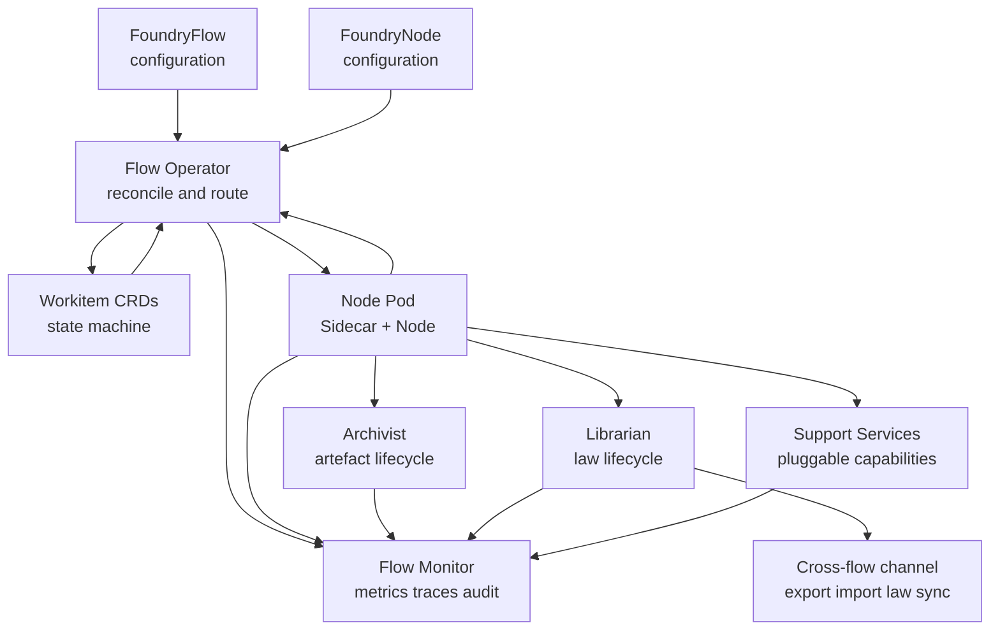
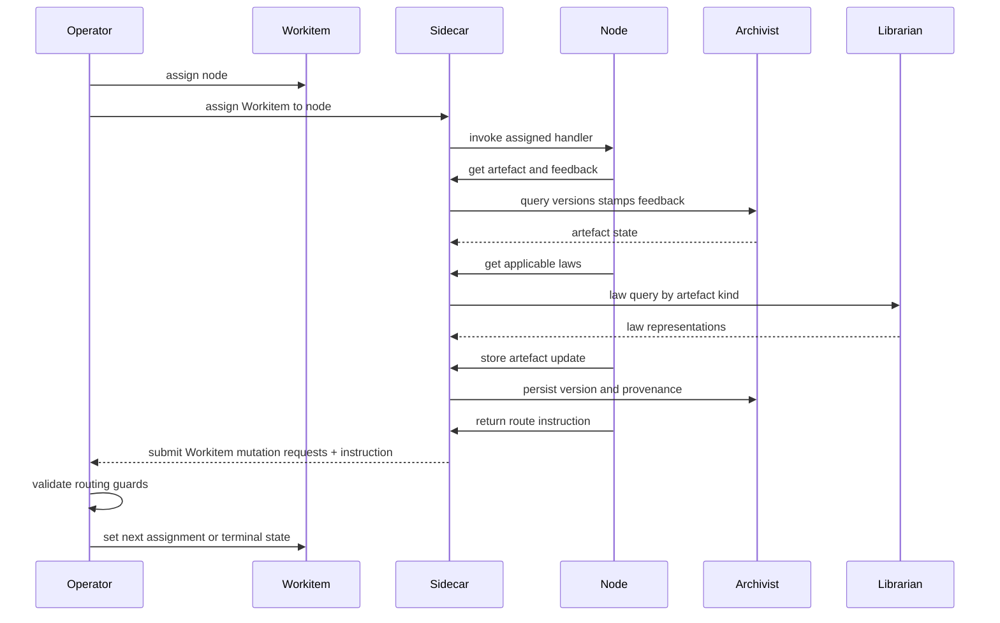
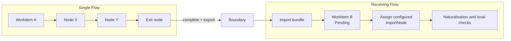

# Flow Runtime Overview

The Foundry Flow runtime is defined by component boundaries, the execution loop, and non-negotiable behaviour invariants.

## Runtime Composition

A Flow runtime is composed of control-plane actors, data-plane workers, and boundary services:

- The [Flow Operator](./01-operator.md) reconciles configuration, assigns Workitems, validates routing outcomes, and enforces entry/exit contracts.
- The [Workitem runtime contract](./02-workitem.md) carries control-plane state and artefact references while the Workitem moves through the Flow.
- [External and reference nodes](./03-nodes-external.md) execute work through Sidecar-mediated APIs; node pods stay stateless at execution level.
- [System services](./04-system-services.md) provide law lifecycle, artefact lifecycle, friction aggregation, telemetry, and backup surfaces.
- [Flow Support Services](./04-system-services.md#flow-support-services) are optional, Flow-Architect-deployed containers that expose pluggable capabilities (such as codification) consumed by nodes through Sidecar mediation and by system services directly.
- [Configuration](./05-configuration.md) defines topology, contracts, capability grants, and policy limits that shape runtime behaviour.
- [Cross-flow collaboration](./06-cross-flow.md) governs export/import boundaries, trust topology, naturalisation, and law integration.
- [Operations](./07-operations.md) governs monitoring, triage, recovery, and validation drills.

## Runtime Loop

Each Workitem moves through a deterministic control loop:

1. Operator observes a routable Workitem and assigns it to one node.
2. Sidecar invokes the node handler for the assigned Workitem.
3. Node reads artefacts, laws, and feedback through Sidecar-mediated APIs.
4. Node writes artefact changes and returns a routing instruction.
5. Sidecar forwards node requests to runtime services and submits routing instruction to Operator.
6. Operator routes to the next node or validates exit completion.

The Flow remains sequential at orchestration level: one Workitem, one assignee, one routing outcome at a time.

## Reference Arrangement and Topology Freedom

The [Foundry Cycle](../01-concepts/02-foundry-cycle.md) is the reference arrangement that Flow Architects adapt by adding nodes, merging responsibilities, splitting gate nodes, or replacing reference implementations while preserving platform invariants.

The runtime enforces behaviour through configuration and capabilities, not node names. [Forge](../01-concepts/02-foundry-cycle.md#forge-creator), [Sort](../01-concepts/02-foundry-cycle.md#sort-gate), and [Refine](../01-concepts/02-foundry-cycle.md#refine-refiner) describe standard responsibilities in the reference arrangement, but any deployment can map those responsibilities differently.

[Assay](./03-nodes-external.md#assay-as-standard-component) is the exception: it is a standard runtime component present in every Flow and participates as a routable judicial node.

## Governance Runtime Mechanics

[Law](../01-concepts/03-data-model.md#laws) and [stamp](../01-concepts/03-data-model.md#passports-and-stamps) behaviour is enforced by the platform through capabilities and configuration:

- Law writing is capability-gated. A node without a `WRITE:law/tierN` capability grant cannot write laws regardless of its role or name.
- Laws are single objects with one goal and one-or-more representations; any mutation creates a new whole-law version.
- Stamp names are named governance checkpoints chosen by the Flow Architect; the platform attaches no built-in semantics to names.
- Stamp-provider routing is configuration-discovered. A node granted `READ:flow` capability can query the topology to discover stamp-to-node mappings at runtime.
- `approval` is a naming convention used by the [reference arrangement](../01-concepts/02-foundry-cycle.md), not a privileged system stamp.
- Assay authority is bounded: resolve conflicts involving Tier 1-2 laws by minting Tier 2 Rulings, propose at Tier 3, appeal at Tier 4-5.

In the [reference arrangement](../01-concepts/02-foundry-cycle.md), the standard [Sort](../01-concepts/02-foundry-cycle.md#sort-gate) node uses these platform mechanisms to implement gate routing: unresolved non-deadlocked feedback routes toward refinement, deadlocked feedback toward Assay, missing stamps toward the configured provider, and fully satisfied governance toward exit completion. Deadlocked feedback is unresolved by state, so gate implementations must treat deadlock as a special-case branch when evaluating unresolved feedback predicates.

## Exit Completion Model

Exit completion is configuration-bound:

- A node is an exit node only when configured with an exit contract binding.
- Only exit nodes may call `complete()`.
- The Operator, not the node, validates the bound contract.
- Exit contracts are keyed by artefact kind with required stamp-name lists.
- If multiple artefacts of a required kind exist, all must satisfy that kind's requirement.
- A required kind with an empty stamp list means presence-only.
- A contract with no artefact entries imposes no artefact requirements.

When completion triggers cross-flow export, only artefact kinds listed in the bound exit contract are exported. An empty contract exports metadata only.

## Data Ownership Boundaries

The runtime splits control-plane state from provenance state:

- Workitem CRD stores assignment state and artefact references (`id`, `kind`).
- [Archivist](./04-system-services.md#archivist) stores artefact version history, passport stamps, and feedback in SQLite.
- Archivist stores raw artefact content bytes in a blob store (typically fast PVC-backed storage, optionally cloud object storage) keyed by content hash.
- Nodes access artefact and governance state through Sidecar and SDK surfaces; nodes do not call system services directly.
- Flow Support Services are accessed through Sidecar mediation when consumed by nodes, extending the same trust boundary to pluggable capabilities.

This split keeps Workitems small and watchable while retaining full provenance depth.

## Local Routing and Cross-Flow Boundaries

Local routing and cross-flow transfer are different runtime mechanisms:

- Local routing moves one Workitem between nodes inside one Flow.
- Cross-flow transfer exports a bundle and creates a new Workitem lifecycle in the receiving Flow.
- Export/import is copy-on-write across sovereignty boundaries.
- Successful import creates a `Pending` Workitem that is first-scheduled to configured `importNode` when capacity allows.

Imported stamps are always cryptographically verifiable when chain validation succeeds. Local governance authority depends on topology:

- Sibling flows under a shared State Root: imported stamps are immediately authoritative when stamp names match local requirements.
- Treaty or non-sibling crossings: imported stamps are provenance-only until naturalisation and required local checks are completed.

## Operational Signal Surface

A running Flow emits three first-class signal families:

- Telemetry: metrics and traces across Operator, Sidecars, nodes, and services.
- Audit: immutable event stream for assignment, routing, law lifecycle, feedback transitions, and stamp actions.
- Friction: quantitative heat tagged to source (law, node, topology path) for governance-cost analysis.

These signals are runtime outputs, not optional observability add-ons.

## Runtime Invariants

The following invariants hold for every Flow deployment:

1. A Workitem is assigned to exactly one node at a time.
2. Flow routing decisions are enforced by the Operator.
3. Sidecar mediates authenticated node access and write operations.
4. Law writing is capability-gated; nodes without a `WRITE:law/tierN` capability grant cannot write laws.
5. Stamp-provider routing is configuration-discovered, not hardcoded by node name.
6. Stamps are named checkpoints with write-once-per-version behaviour.
7. Exit completion is exit-node-only and Operator-validated against bound contracts.
8. Workitem admission is entry-contract-bound.
9. Artefact provenance (versions, stamps, feedback) is Archivist-owned, not Workitem-owned.
10. Assay is always present and cannot exceed its authority ceiling.
11. Cross-flow verifiability and local authority are distinct and topology-dependent.
12. Imported Workitems are created in `Pending` and first-scheduled to configured `importNode` when capacity allows.
13. Flow Support Services are consumed through Sidecar mediation by nodes and do not process Workitems.

These invariants are elaborated normatively in the remaining `02-flow` documents.
