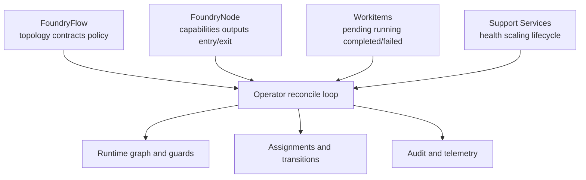
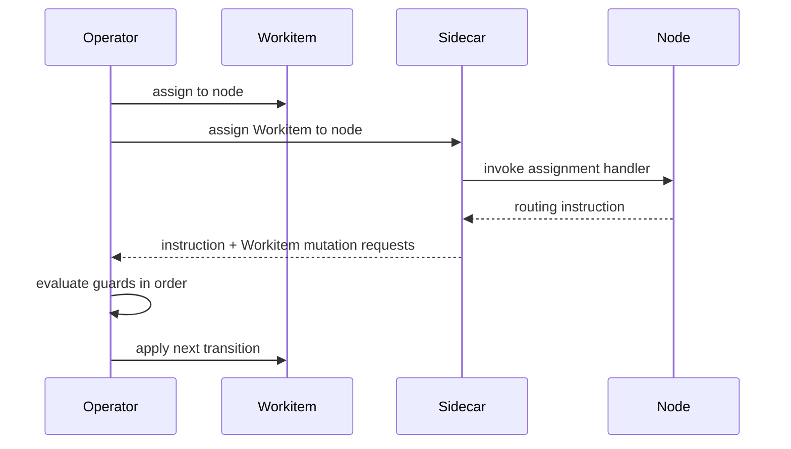
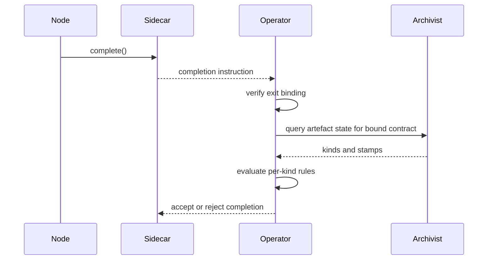

# Flow Operator

The Flow Operator is the control-plane authority for a Flow. It reconciles configuration, drives [Workitem](./02-workitem.md) assignment and routing, enforces exit completion rules, and emits lifecycle audit signals.

## Role and Boundaries

The Operator owns control-plane state transitions and policy enforcement:

- Reconciles Flow and Node configuration into an executable runtime graph.
- Assigns Workitems to nodes and advances lifecycle state.
- Validates routing instructions before state transition.
- Enforces exit completion against bound contracts.
- Applies timeout and thrash guards.
- Emits operator-originated metrics, traces, and audit events.

The Operator does not execute node business logic and does not own artefact provenance storage. Provenance is owned by [Archivist](./04-system-services.md), and node-facing API authentication and mediation are handled by [Sidecar](../03-node/01-sidecar.md).

The Operator maintains a direct service-level query path to the Archivist, distinct from the Sidecar-mediated path that nodes use. Entry and exit contract validation requires artefact kind, stamp, and feedback state that only the Archivist holds. Workitem retention and cleanup coordinate with the Archivist for artefact lifecycle management. The full inter-service contract surface is defined in [System Services](./04-system-services.md#inter-service-contracts).

## Reconciliation Surfaces

The Operator reconciles four state surfaces continuously:

- **FoundryFlow**: topology, contracts, policy limits, and cross-flow policy.
- **FoundryNode**: node capability envelope, routing outputs, timeout budget, and entry/exit bindings.
- **Workitem**: lifecycle progression through assignment, routing, and completion transition.
- **Support Service**: deployment lifecycle, health monitoring, and scaling policy for Flow-Architect-deployed [Flow Support Services](./04-system-services.md#flow-support-services).

Reconciliation is declarative and convergent. The Operator rejects invalid configuration rather than applying partial behaviour.

## Assignment Lifecycle

Assignment is deterministic and single-owner per Workitem.

1. Select routable `Pending` Workitem.
2. Resolve eligible target node from routing state and current configuration.
3. Transition Workitem to `Running` with current assignee set.
4. Wait for Sidecar-mediated assignment outcome.
5. Evaluate outcome guards and apply next transition.

The Operator preserves scalar assignment semantics: one Workitem, one active assignee, one outcome per assignment cycle.

Node selection policy can vary by deployment (capacity, readiness, fairness strategy), but resulting transitions must preserve deterministic state invariants.

## Entry Contract Admission

Workitem admission into a Flow lifecycle is entry-contract bound.

- Local creation admission (nodes originating new Workitems) is enforced against the admitting node's bound entry contract.
- Cross-flow import admission (receiving Flow) is enforced against configured `importNode` and its bound entry contract.
- Review-hearing admission is enforced against Assay's bound hearing entry contract.
- Entry and exit contracts share the same validation shape: per artefact kind, required stamp-name list, empty list as presence-only, empty contract as no artefact requirements.

Admission outcomes:

1. Resolve admission target and bound entry contract (local creation uses admitting node; cross-flow import uses configured `importNode`; review-hearing admission uses Assay hearing entry binding).
2. Validate Workitem artefacts against per-kind requirements.
3. On success, admit Workitem into `Pending` lifecycle state.
4. For cross-flow import, schedule first assignment to configured `importNode` when capacity allows.
5. For review-hearing admission, schedule first assignment to Assay when capacity allows.
6. On failure, reject admission with structured contract-validation errors.

## Routing and Guard Evaluation

Every node outcome is interpreted as one of three instructions:

- `route_to_output`
- `route_to`
- `complete`

Guard evaluation order is fixed:

1. Instruction shape validity.
2. Routing target or exit eligibility validity.
3. Timeout and thrash guard compliance.
4. Lifecycle transition application.

Routing-specific rules:

- `route_to_output` resolves output name on the current node configuration.
- `route_to` resolves direct node identity in Flow topology.
- Unresolvable targets are rejected with structured errors.

Completion-specific rules:

- `complete` is accepted only from an exit node bound to a named exit contract.
- Non-exit completion attempts are rejected.
- In the reference arrangement, governed artefact completion is user-configured through Sort, while review-hearing completion is runtime-mandated through Assay's hearing exit binding.

Sort behaviour for missing stamps is configuration-driven. Sort discovers missing-stamp provider targets from Flow configuration and capability grants. The Operator validates route legality and guard compliance before transition application.

## Exit Contract Enforcement

Exit completion is Operator-enforced and configuration-bound.

- Exit status is explicit by node contract binding in configuration.
- Exit status is not inferred from empty outputs.
- Contract selection is fixed by binding; node does not choose at runtime.
- Operator validates contract requirements against current artefact state.

Validation semantics:

- Requirements are per artefact kind.
- Stamp requirements are per kind as required stamp-name lists.
- Empty list means presence-only for that kind.
- Empty contract means no artefact requirements.
- If multiple artefacts of a required kind exist, all must satisfy that kind's requirements.

On validation failure, completion is rejected and the Workitem does not transition to `Completed`.

When completion also triggers export, export eligibility is filtered by bound exit-contract kind entries. Empty contract completion exports metadata only.

## Failure Handling and Recovery

Operator failure behaviour is deterministic and explicit.

- **Timeout**: assignment exceeds node timeout budget -> transition Workitem to `Failed` with timeout error.
- **Thrash**: aggregate visit count exceeds configured maximum -> transition Workitem to `Failed`.
- **Invalid route**: unresolvable or invalid instruction -> reject transition and apply failure policy.
- **Node unavailability**: no eligible node or repeated assignment failure -> retry according to policy, then fail when budget is exhausted.

Thrash and governance deadlock are separate mechanisms. Thrash is infrastructure loop failure; governance deadlock routes to [Assay](./03-nodes-external.md#assay-as-standard-component) through Sort logic.

Recovery policy can tune retry budgets and backoff strategy, but it cannot violate lifecycle invariants or exit enforcement rules.

## Trust and Identity Responsibilities

The Operator is the trust anchor manager for its Flow execution boundary.

- In standalone topology, Operator manages local trust-chain issuance for runtime participants.
- Under a Governance Flow, Operator participates in accession and receives intermediate authority anchored to the shared State Root.
- Operator rotates and applies runtime trust material according to policy windows.

Trust lifecycle details, treaty boundaries, and cross-flow authority semantics are defined in [Cross-Flow Collaboration](./06-cross-flow.md).

## Telemetry and Audit Emissions

Operator emits mandatory control-plane observability signals:

- Assignment lifecycle metrics (queue depth, assignment latency, completion latency).
- Routing and guard outcome counters (valid route, invalid route, timeout, thrash, rejected completion).
- Traces across assignment and transition stages.
- Audit events for state transitions, guard rejections, and completion decisions.

Signal schema and aggregation surfaces are defined by [System Services](./04-system-services.md) and runtime operations in [Operations](./07-operations.md).

## Operator Invariants

All Flow deployments preserve these Operator invariants:

1. Operator is the authoritative engine for Workitem lifecycle transitions.
2. Configuration reconciliation is convergent and rejects invalid partial states.
3. Assignment remains single-assignee per Workitem.
4. Routing transition occurs only after deterministic guard evaluation.
5. Stamp-provider mappings are configuration-derived; the Operator does not hardcode node names for routing decisions.
6. Workitem admission is entry-contract-bound and Operator-validated.
7. Exit completion is exit-node-only and bound-contract validated by Operator.
8. Contract checks are per artefact kind and apply to all artefacts of required kinds.
9. Thrash enforcement uses aggregate visit count across all node assignments.
10. Trust issuance and accession participation remain Operator responsibilities at control-plane boundary.
11. Operator-originated audit and telemetry emissions are mandatory runtime outputs.
12. Support Service deployment lifecycle, health monitoring, and scaling policy are Operator-managed.

Field-level definitions are in [CRD Reference](../05-reference/crds.md). Runtime error mappings are in [Error Catalog](../05-reference/error-catalog.md).
