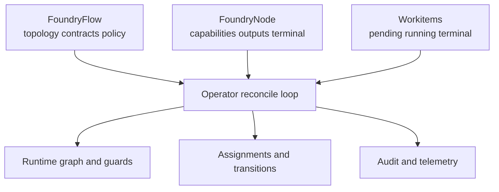
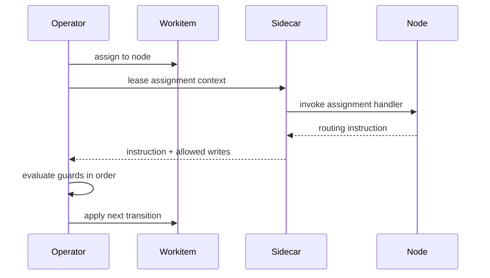
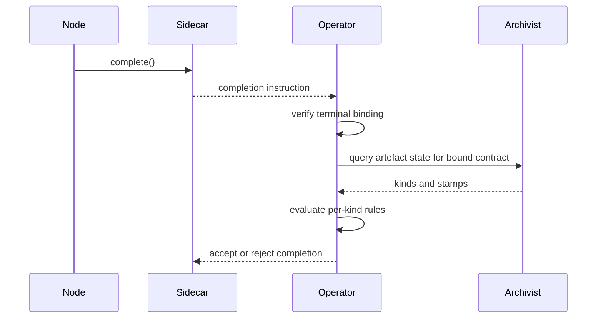

# Flow Operator

The Flow Operator is the control-plane authority for a Flow. It reconciles configuration, drives Workitem assignment and routing, enforces terminal completion rules, and emits lifecycle audit signals. Concepts and data semantics are defined in [Architecture](../01-concepts/01-architecture.md), [Data Model](../01-concepts/02-data-model.md), and [Governance](../01-concepts/03-governance.md); this document defines operator behaviour.

Operator semantics in this document align with [Flow Runtime Overview](./00-overview.md), [Workitems](./02-workitem.md), [System Services](./04-system-services.md), [Configuration Semantics](./05-configuration.md), and [Cross-Flow Collaboration](./06-cross-flow.md).

## Role and Boundaries

The Operator owns control-plane state transitions and policy enforcement:

- Reconciles Flow and Node configuration into an executable runtime graph.
- Assigns Workitems to nodes and advances lifecycle state.
- Validates routing instructions before state transition.
- Enforces terminal completion against bound contracts.
- Applies timeout and thrash guards.
- Emits operator-originated metrics, traces, and audit events.

The Operator does not execute node business logic and does not own artefact provenance storage. Provenance is owned by [Archivist](./04-system-services.md), and node-facing API enforcement is mediated by [Sidecar](../03-node/01-sidecar.md).

## Reconciliation Surfaces

The Operator reconciles three state surfaces continuously:

- **FoundryFlow**: topology, contracts, policy limits, and cross-flow policy.
- **FoundryNode**: node capability envelope, routing outputs, timeout budget, and terminal binding.
- **Workitem**: lifecycle progression through assignment, routing, and terminal transition.

Reconciliation is declarative and convergent. The Operator rejects invalid configuration rather than applying partial behaviour.

## Assignment Lifecycle

Assignment is deterministic and single-owner per Workitem.

1. Select routable `Pending` Workitem.
2. Resolve eligible target node from routing context and current configuration.
3. Transition Workitem to `Running` with current assignee set.
4. Wait for Sidecar-mediated assignment outcome.
5. Evaluate outcome guards and apply next transition.

The Operator preserves scalar assignment semantics: one Workitem, one active assignee, one outcome per assignment cycle.

Node selection policy can vary by deployment (capacity, readiness, fairness strategy), but resulting transitions must preserve deterministic state invariants.

## Routing and Guard Evaluation

Every node outcome is interpreted as one of three instructions:

- `route_to_output`
- `route_to`
- `complete`

Guard evaluation order is fixed:

1. Instruction shape validity.
2. Routing target or terminal eligibility validity.
3. Timeout and thrash guard compliance.
4. Lifecycle transition application.

Routing-specific rules:

- `route_to_output` resolves output name on the current node configuration.
- `route_to` resolves direct node identity in Flow topology.
- Unresolvable targets are rejected with structured errors.

Completion-specific rules:

- `complete` is accepted only from a terminal node bound to a named terminal contract.
- Non-terminal completion attempts are rejected.

Sort behaviour for missing stamps is configuration-driven. Sort discovers missing-stamp provider targets from Flow configuration and capability grants. The Operator validates route legality and guard compliance before transition application.

## Terminal Contract Enforcement

Terminal completion is Operator-enforced and configuration-bound.

- Terminal status is explicit by node contract binding in configuration.
- Terminal status is not inferred from empty outputs.
- Contract selection is fixed by binding; node does not choose at runtime.
- Operator validates contract requirements against current artefact state.

Validation semantics:

- Requirements are per artefact kind.
- Stamp requirements are per kind as required stamp-name lists.
- Empty list means presence-only for that kind.
- Empty contract means no artefact requirements.
- If multiple artefacts of a required kind exist, all must satisfy that kind's requirements.

On validation failure, completion is rejected and the Workitem remains non-terminal.

When completion also triggers export, export eligibility is filtered by terminal contract kind entries. Empty contract completion exports metadata only.

## Failure Handling and Recovery

Operator failure behaviour is deterministic and explicit.

- **Timeout**: assignment exceeds node timeout budget -> fail assignment path.
- **Thrash**: aggregate visit count exceeds configured maximum -> transition Workitem to `Failed`.
- **Invalid route**: unresolvable or invalid instruction -> reject transition and apply failure policy.
- **Node unavailability**: no eligible node or repeated assignment failure -> retry according to policy, then fail when budget is exhausted.

Thrash and governance deadlock are separate mechanisms. Thrash is infrastructure loop failure; governance deadlock routes to [Assay](./03-nodes-external.md) through Sort logic.

Recovery policy can tune retry budgets and backoff strategy, but it cannot violate lifecycle invariants or terminal enforcement rules.

## Trust and Identity Responsibilities

The Operator is the trust anchor manager for its Flow execution boundary.

- In standalone topology, Operator manages local trust-chain issuance for runtime participants.
- Under a Governance Flow, Operator participates in annexation and receives intermediate authority anchored to the shared State Root.
- Operator rotates and applies runtime trust material according to policy windows.

Trust lifecycle details, treaty boundaries, and cross-flow authority semantics are defined in [Cross-Flow Collaboration](./06-cross-flow.md).

## Telemetry and Audit Emissions

Operator emits mandatory control-plane observability signals:

- Assignment lifecycle metrics (queue depth, assignment latency, completion latency).
- Routing and guard outcome counters (valid route, invalid route, timeout, thrash, rejected completion).
- Traces across assignment and transition stages.
- Audit events for state transitions, guard rejections, and completion decisions.

Signal schema and aggregation surfaces are defined by [System Services](./04-system-services.md) and runtime operations in [Operations](./07-operations.md).

## Operator Invariants

All Flow deployments preserve these Operator invariants:

1. Operator is the authoritative engine for Workitem lifecycle transitions.
2. Configuration reconciliation is convergent and rejects invalid partial states.
3. Assignment remains single-assignee per Workitem.
4. Routing transition occurs only after deterministic guard evaluation.
5. Missing-stamp routing remains configuration-discovered, not hardcoded by node name.
6. Terminal completion is terminal-node-only and bound-contract validated by Operator.
7. Contract checks are per artefact kind and apply to all artefacts of required kinds.
8. Thrash enforcement uses aggregate visit count across all node assignments.
9. Trust issuance and annexation participation remain Operator responsibilities at control-plane boundary.
10. Operator-originated audit and telemetry emissions are mandatory runtime outputs.

Field-level definitions are in [CRD Reference](../04-reference/crds.md). Runtime error mappings are in [Error Catalog](../04-reference/error-catalog.md).
