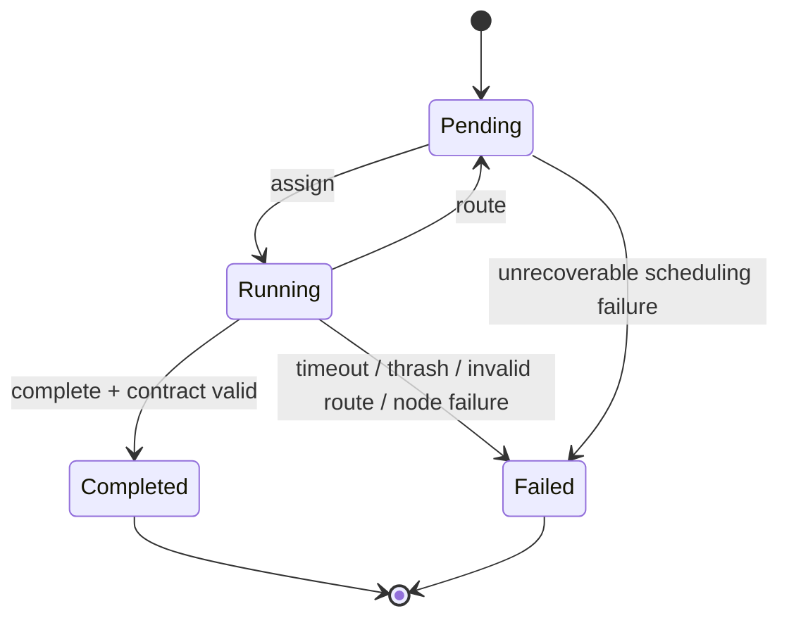
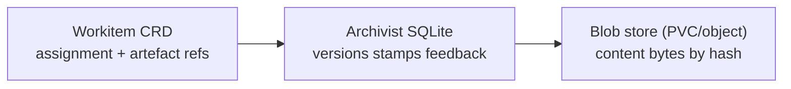
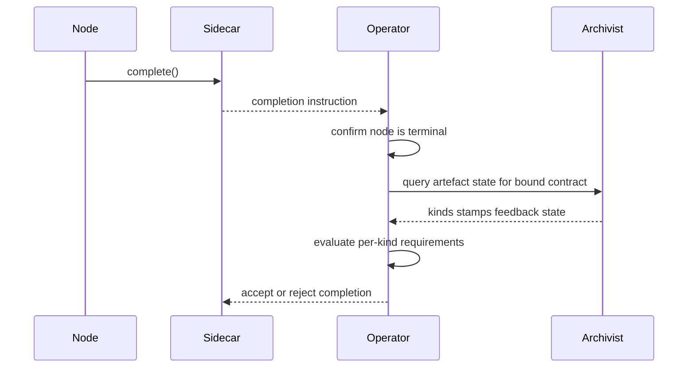

# Workitems

Workitems are the Flow control-plane contract for work execution. They carry assignment state, routing outcomes, and artefact references while work moves through the runtime. Operational behaviour in the Flow layer is grounded in [Conceptual Overview](../01-concepts/00-overview.md), [Data Model](../01-concepts/02-data-model.md), and [Governance](../01-concepts/03-governance.md).

Workitem semantics align with [Flow Runtime Overview](./00-overview.md), [Flow Operator](./01-operator.md), [System Services](./04-system-services.md), [Configuration Semantics](./05-configuration.md), and [Cross-Flow Collaboration](./06-cross-flow.md). Node-facing SDK usage is detailed in [SDK Core](../03-node/02-sdk-core.md) and [SDK Workitems](../03-node/06-sdk-workitems.md).

## Runtime Role

A Workitem is the unit of orchestration state, not the unit of provenance storage.

- It anchors assignment lifecycle in the control plane.
- It carries node routing instructions between assignments.
- It references governed artefacts by stable in-Workitem identity.
- It does not store artefact version history, stamps, or feedback bodies.

The Workitem state machine is single-assignee: one Workitem is assigned to exactly one node at a time.

## Ownership and Mutability Boundaries

Workitem mutability is partitioned by actor. Ownership is strict and non-overlapping.

| Surface | Owner | Mutability | Purpose |
|---|---|---|---|
| `spec` | Operator at creation | Immutable | Declares work intent and input contract |
| lifecycle state | Operator | Managed transitions | `Pending`, `Running`, terminal states |
| assignment fields | Operator | Managed transitions | Current and previous assignee tracking |
| routing instruction | Sidecar on node return | Overwrite per assignment | Next action requested by node |
| artefact references | Sidecar on node write | Append/update by `id` | `id` and `kind` references only |
| thrash counters | Operator | Increment-only | Loop budget enforcement |

Nodes do not mutate Workitem state directly. All node-originated state changes are mediated by the [Sidecar](../03-node/01-sidecar.md) and validated by runtime policy.

## Lifecycle States and Transitions

Workitem lifecycle uses deterministic control-plane states:

- `Pending`: waiting for assignment.
- `Running`: currently assigned to a node.
- `Completed`: terminal success after contract validation.
- `Failed`: terminal failure due to runtime guard or processing error.

Transition guards are fixed:

- `Pending -> Running` requires a valid target node and assignment lease.
- `Running -> Pending` requires a valid non-terminal routing instruction.
- `Running -> Completed` requires terminal-node `complete()` and successful contract validation.
- Any guard violation or runtime failure transitions to `Failed` when recovery budget is exhausted.

## Routing Instruction Contract

Each assignment ends with exactly one routing instruction.

- `route_to_output`: route by named output configured on the current node.
- `route_to`: route directly to a specific node.
- `complete`: request terminal completion.

Instruction validity checks:

- Output and direct targets must resolve in current configuration.
- `complete` is valid only from terminal nodes.
- Invalid instructions are rejected with structured errors and do not advance completion.

Routing semantics are runtime-level control behaviour; schema-level instruction fields are defined in [CRD Reference](../04-reference/crds.md). Error mappings are defined in [Error Catalog](../04-reference/error-catalog.md).

## Thrash Guard and Feedback Deadlock

Thrash and deadlock are distinct mechanisms with different sources and outcomes.

- **Thrash Guard** is infrastructure loop control on Workitem assignment history.
  - Enforcement key: total visits across all nodes.
  - Diagnostic signal: per-node counters.
  - Outcome: Workitem fails when aggregate visit budget is exceeded.

- **Feedback deadlock** is governance dispute detection on artefact feedback history.
  - Source of truth: Archivist feedback records via SDK queries.
  - Enforcement actor: Sort routing logic under configured deadlock threshold policy.
  - Outcome: Workitem routes to Assay for adjudication.

Thrash failure and governance deadlock escalation are never treated as equivalent transitions.

## Artefact Reference Model

Workitems carry artefact references only.

- Each reference contains `id` and `kind`.
- `id` is unique within the Workitem.
- Multiple artefacts of the same `kind` are supported through distinct `id` values.

Provenance ownership is external to the Workitem:

- version history -> Archivist
- stamps/passports -> Archivist
- feedback -> Archivist

This split keeps Workitem objects bounded and watch-efficient while preserving complete governance history.

## Terminal Completion Interaction

Terminal completion is a Workitem state transition controlled by configuration and Operator validation.

- Only terminal nodes may emit `complete()`.
- Terminal binding is fixed in node configuration.
- The node does not choose a contract at runtime.
- Operator validates the bound terminal contract against current artefact state.

Contract evaluation rules:

- Requirements are keyed by artefact kind.
- Required stamp lists are name-based governance checkpoints.
- Empty stamp list means presence-only for that kind.
- Empty contract means no artefact requirements.
- If multiple artefacts of a required kind exist, all must satisfy the requirement.

If validation fails, completion is rejected and the Workitem remains non-terminal.

When completion triggers cross-flow export, only artefact kinds listed in the selected terminal contract are export-eligible. Empty contract completion exports metadata only.

## Context and Reserved Keys

Workitem context supports application-specific key/value metadata and system-internal metadata.

- Keys prefixed with `_` are reserved for system use.
- User-defined keys must not use `_` prefix.
- Reserved key names and lifecycle semantics are specified in [SDK Workitems](../03-node/06-sdk-workitems.md).

## Retention and Finalisation

`Completed` and `Failed` are terminal states. Terminal Workitems are retained according to configured retention policy and then cleaned up by operational policy.

- Retention duration is configuration-driven.
- Cleanup sequencing must preserve required audit and provenance visibility.
- Operational procedures are defined in [Operations](./07-operations.md).

## Workitem Invariants

All Flow runtimes preserve these Workitem invariants:

1. `spec` is immutable after creation.
2. A Workitem has one current assignee at a time.
3. Node mutations are Sidecar-mediated; nodes do not write Workitem state directly.
4. Routing advances only on valid, resolvable instructions.
5. Thrash enforcement uses aggregate visit count across all nodes.
6. Feedback deadlock decisions are based on Archivist-backed feedback state.
7. Artefact references live on Workitem; provenance does not.
8. Terminal completion is terminal-node-only and Operator-validated.
9. Terminal contract checks are per kind and apply to all artefacts of required kinds.
10. Cross-flow export scope follows terminal contract kind entries.

These invariants are consumed by [Flow Operator](./01-operator.md), [External Nodes](./03-nodes-external.md), [System Services](./04-system-services.md), and [Configuration Semantics](./05-configuration.md).
