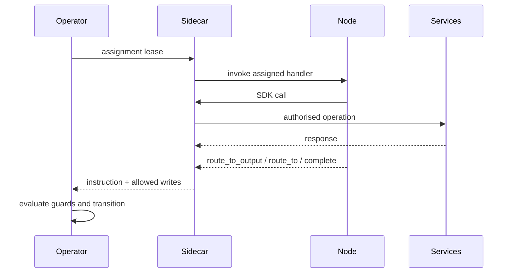
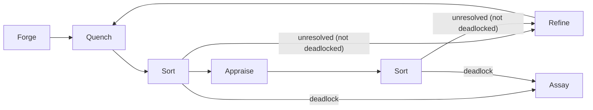
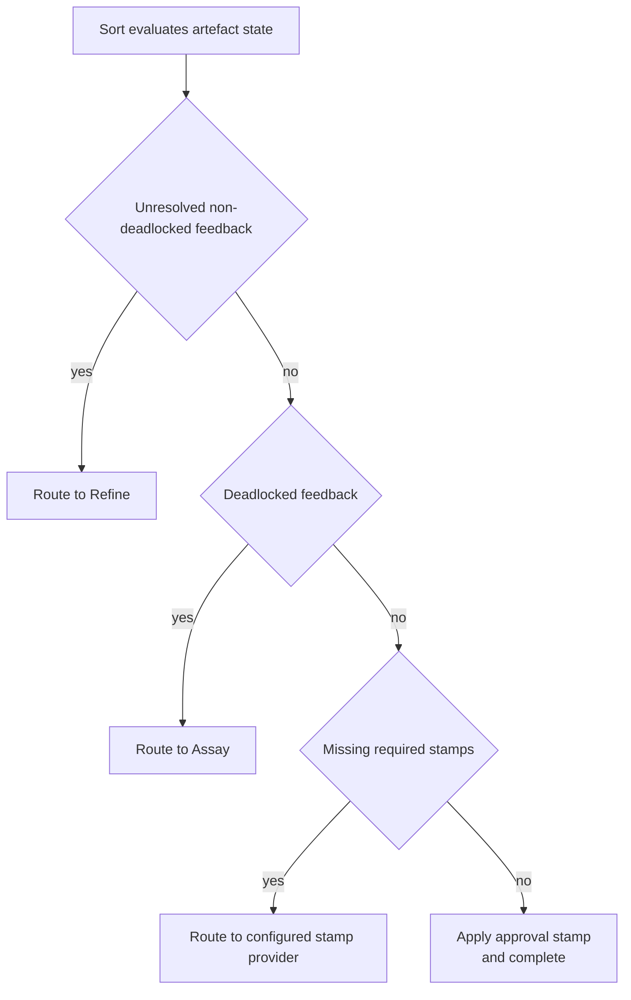

# Nodes and External Integrations

Nodes execute work inside the Flow runtime but do not own control-plane transitions. Node participation semantics, capability boundaries, reference-arrangement responsibilities, and external integration behaviour are runtime constraints. Conceptual framing is in [Conceptual Overview](../01-concepts/00-overview.md), [Architecture](../01-concepts/01-architecture.md), [Data Model](../01-concepts/02-data-model.md), and [Governance](../01-concepts/03-governance.md).

Runtime semantics here align with [Flow Runtime Overview](./00-overview.md), [Flow Operator](./01-operator.md), [Workitems](./02-workitem.md), [System Services](./04-system-services.md), [Configuration Semantics](./05-configuration.md), [Cross-Flow Collaboration](./06-cross-flow.md), and [Operations](./07-operations.md). Node implementation detail is specified in [Node Overview](../03-node/00-overview.md).

## Node Runtime Boundary

Nodes are execution actors in the data plane. Control-plane authority remains with the Operator.

- Nodes receive assignments through Sidecar-mediated invocation.
- Nodes read and write through SDK APIs mediated by [Sidecar](../03-node/01-sidecar.md).
- Nodes return one routing instruction at the end of each assignment.
- Nodes do not mutate Workitem lifecycle fields directly.
- Nodes admitting new Workitems through local creation must be bound to an entry contract.
- Cross-flow import admission targets configured `importNode`, which must be entry-bound.
- Runtime-triggered review-hearing admission targets Assay's mandatory hearing entry binding.

Every node, including externally integrated nodes, runs inside the same control and governance contract.

## Execution Contract

Assignment execution follows a fixed contract:

1. Operator assigns a `Pending` Workitem to one node.
2. Sidecar provides assignment snapshot to the node handler.
3. Node executes business logic using SDK APIs.
4. Sidecar validates capability-bounded operations.
5. Node returns one routing instruction.
6. Operator evaluates routing and exit guards, then applies state transition.

Routing instructions are `route_to_output`, `route_to`, or `complete`. Their schema is defined in [CRD Reference](../04-reference/crds.md), wire-level call contracts are defined in [gRPC API](../04-reference/grpc-api.md), and runtime rejection outcomes are defined in [Error Catalog](../04-reference/error-catalog.md).

## Capability and Authorisation Model

Node authority is capability-driven and enforced at runtime boundaries.

- `READ:*` grants read access to scoped resources.
- `WRITE:*` grants write access to scoped resources.
- `STAMP:*` grants stamp application rights.
- `ESCALATE:*` grants escalation action rights where configured.
- `READ:flow` grants topology and configuration discovery access used by gate logic.

Stamp capabilities are explicit and granular:

- Grant format: `STAMP:artefact/<kind>/<stamp-name>`.
- Scope is exact for artefact kind and stamp name.
- Stamp application is write-once per artefact version hash.

Enforcement split:

- Sidecar enforces node API and capability boundaries.
- Operator enforces routing validity, lifecycle transitions, and exit contract checks.

## Reference Arrangement Responsibilities

The Foundry Cycle is the reference arrangement that Flow Architects adapt to their node layout while preserving runtime invariants.

Reference responsibilities:

- **Forge**: create or reshape candidate artefacts; read laws for context seeding; does not write laws.
- **Quench**: perform deterministic checks and produce feedback or stamps.
- **Appraise**: perform evaluative review and produce feedback or stamps.
- **Sort**: evaluate governance state and route accordingly; apply `approval` in the reference arrangement when completion conditions are met.
- **Refine**: address unresolved feedback and produce new artefact versions.

Responsibility labels are descriptive. Runtime semantics are configuration- and capability-driven, not name-driven.

## Sort as Reference Gate

Sort is the gate node in the reference arrangement. Its decision order is fixed:

1. Any unresolved non-deadlocked feedback on governed artefacts -> route to Refine.
2. Any deadlocked feedback -> route to Assay.
3. Missing required stamps -> route to the node configured to provide each missing stamp.
4. All feedback resolved and all required stamps present -> apply `approval` and complete the reference path.

Deadlocked feedback is unresolved by state, so reference implementations must treat deadlock as a special-case branch when evaluating unresolved feedback predicates.

Sort discovers missing-stamp providers from Flow configuration and capability grants. It does not hardcode provider node names.

`approval` is a reference-arrangement convention. It is not a privileged platform keyword.

## Assay as Standard Component

[Assay](../01-concepts/00-overview.md) is a standard component in every Flow. It is routable as a node and cannot be omitted from the runtime.

Assay participates in two distinct runtime paths:

- Deadlock adjudication for governed-work Workitems routed from Sort, then returned to Sort for re-evaluation in the reference arrangement.
- Review-hearing processing, where Assay is both entry-bound and exit-bound and completes the hearing Workitem after verdict.

Assay authority ceiling is fixed:

- Resolve Tier 1-2 conflicts and mint Tier 2 rulings.
- Propose Tier 3 changes for human ratification.
- Appeal Tier 4-5 conflicts to Governance Flow authorities.

Assay does not write Tier 1 findings.

## External Integration Nodes

External integration nodes connect Flow execution to external systems (webhooks, event buses, service APIs, human workflow systems) while preserving Flow invariants.

External nodes follow the same runtime contract as any other node:

- Sidecar-mediated API access only.
- Capability-bounded reads and writes.
- One routing instruction per assignment.
- Full auditability of side effects and outcomes.

External integration requirements:

- Idempotent side-effect handling for retries.
- Correlation identifiers for traceability.
- Explicit timeout handling and failure signalling.
- Deterministic mapping from external response classes to Flow outcomes.

Cross-boundary handoff between Flows uses export/import, which starts a separate Workitem lifecycle. It is not intra-Flow routing.

## Failure and Retry at Node Boundary

Node boundary failures are classified and handled distinctly:

- **Execution failure**: node returns explicit failure or exits abnormally.
- **Timeout failure**: assignment exceeds configured node timeout budget.
- **Routing failure**: returned instruction is invalid or unresolvable.
- **Governance deadlock**: feedback dispute exceeds deadlock threshold and is escalated to Assay.

Retries and backoff may be configured operationally, but retries do not bypass capability checks, routing guards, or exit-contract validation.

## Telemetry and Friction Signals

Nodes are expected to emit operational and governance signals through [SDK Telemetry](../03-node/07-sdk-telemetry.md):

- Execution timing and error counters.
- Route-decision context tags.
- Friction events attributed by source (law, node, topology path).

Friction signalling is first-class runtime behaviour and feeds governance-cost analysis in [System Services](./04-system-services.md).

## Node Invariants

All node deployments preserve these invariants:

1. Nodes execute through Operator and Sidecar contracts.
2. Nodes do not mutate Workitem lifecycle fields directly.
3. Routing outcomes are limited to `route_to_output`, `route_to`, or `complete`.
4. Forge reads laws for context and does not write laws.
5. Sort gate ordering is deterministic and configuration-driven.
6. Missing-stamp routing targets are discovered from configuration.
7. Assay is always present and constrained to resolve/propose/appeal at its authority ceiling.
8. Hearing Workitems are standard Workitems (no `WorkitemType` or `spec.type`) with Assay entry/exit bindings.
9. Stamp authority is capability-scoped by artefact kind and stamp name.
10. Stamps are write-once per artefact version hash.
11. Nodes admitting locally created Workitems are bound to and validated against entry contracts.
12. External integrations preserve auditability, idempotency, and governance checks.
13. Cross-flow handoff is export/import lifecycle, not local route transition.

Node configuration and implementation patterns are defined in [Node Configuration](../03-node/08-configuration.md) and [Node Patterns](../03-node/09-patterns.md). SDK behaviour is defined in [SDK Core](../03-node/02-sdk-core.md), [SDK Artefacts](../03-node/03-sdk-artefacts.md), [SDK Legal](../03-node/04-sdk-legal.md), [SDK Feedback](../03-node/05-sdk-feedback.md), and [SDK Workitems](../03-node/06-sdk-workitems.md).
