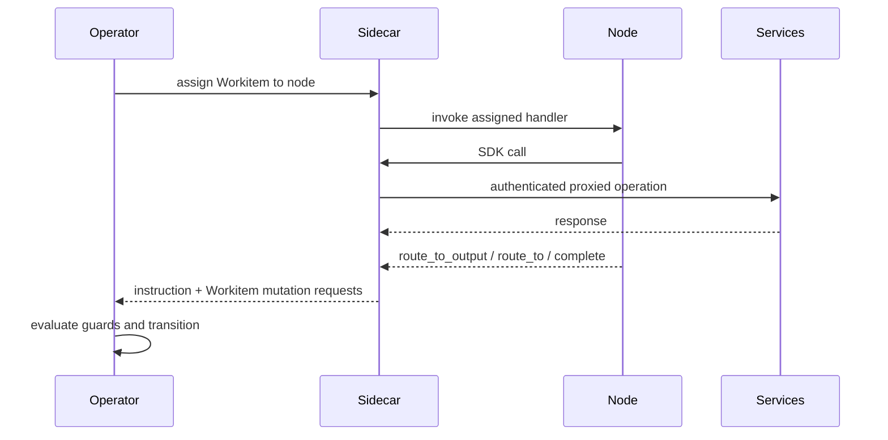

# Nodes and External Integrations

Nodes execute work inside the Flow runtime but do not own control-plane transitions. Node participation semantics, capability boundaries, and external integration behaviour are runtime constraints.

## Node Runtime Boundary

Nodes are execution actors in the data plane. Control-plane authority remains with the Operator.

- Nodes receive assignments through Sidecar-mediated invocation.
- Nodes read and write through SDK APIs mediated by [Sidecar](../03-node/01-sidecar.md).
- Nodes return one routing instruction at the end of each assignment.
- Nodes do not mutate Workitem lifecycle fields directly.
- Nodes admitting new Workitems through local creation must be bound to an entry contract.
- Cross-flow import admission targets configured `importNode`, which must be entry-bound.
- Runtime-triggered review-hearing admission targets Assay's mandatory hearing entry binding.

Every node, including externally integrated nodes, runs inside the same control and governance contract.

## Execution Contract

Assignment execution follows a fixed contract:

1. Operator assigns a `Pending` Workitem to one node.
2. Sidecar invokes the node handler for the assigned Workitem.
3. Node executes business logic using SDK APIs.
4. Runtime services authorise capability-bounded operations on Sidecar-mediated requests.
5. Node returns one routing instruction.
6. Operator evaluates routing and exit guards, then applies state transition.

Routing instructions are `route_to_output`, `route_to`, or `complete`. Their schema is defined in [CRD Reference](../05-reference/crds.md), wire-level call contracts are defined in [gRPC API](../05-reference/grpc-api.md), and runtime rejection outcomes are defined in [Error Catalog](../05-reference/error-catalog.md).

## Capability and Authorisation Model

Node authority is capability-driven and authorised at runtime service boundaries.

- `READ:*` grants read access to scoped resources.
- `WRITE:*` grants write access to scoped resources.
- `STAMP:*` grants stamp application rights.
- `ESCALATE:*` grants escalation action rights where configured.
- `READ:flow` grants topology and configuration discovery access used by gate logic.

Stamp capabilities are explicit and granular:

- Grant format: `STAMP:artefact/<kind>/<stamp-name>`.
- Scope is exact for artefact kind and stamp name.
- Stamp application is write-once per artefact version hash.

Enforcement split:

- Sidecar mediates authenticated SDK traffic between nodes and runtime services.
- Operator, Archivist, and Librarian authorise operations for their owned state surfaces.
- Operator enforces routing validity, lifecycle transitions, and exit contract checks.

## Reference Arrangement

The [Foundry Cycle](../01-concepts/02-foundry-cycle.md) defines the reference arrangement — node roles, cycle topology, and law authority. Flow Architects adapt it to their context while preserving the runtime invariants below.

From the platform's perspective, reference-arrangement node names (Forge, Quench, Appraise, Sort, Refine) carry no special runtime semantics. All node behaviour is determined by capability grants and configuration. A node named "Sort" with no `READ:flow` capability cannot perform gate logic; a node named "MyGate" with the right capabilities can.

Gate nodes in the reference arrangement discover stamp-provider routing targets from Flow configuration and capability grants — they do not hardcode provider node names. Deadlocked feedback is unresolved by state, so gate implementations must treat deadlock as a special-case branch when evaluating unresolved-feedback predicates. The `approval` stamp is a reference-arrangement convention, not a privileged platform keyword.

## Assay as Standard Component

[Assay](../01-concepts/02-foundry-cycle.md#assay-judiciary--standard-component) is a standard component in every Flow. It is routable as a node and cannot be omitted from the runtime.

Assay participates in distinct runtime paths:

- Deadlock adjudication for governed-work Workitems routed from Sort, then returned to Sort for re-evaluation in the reference arrangement.
- Review-hearing processing, where Assay is both entry-bound and exit-bound and completes the hearing Workitem after verdict.

Assay authority ceiling is fixed:

- Resolve Tier 1-2 conflicts and mint Tier 2 rulings.
- Propose Tier 3 changes for human ratification.
- Appeal Tier 4-5 conflicts to Governance Flow authorities.

Assay does not write Tier 1 findings.

## External Integration Nodes

External integration nodes connect Flow execution to external systems (webhooks, event buses, service APIs, human workflow systems) while preserving Flow invariants.

External nodes follow the same runtime contract as any other node:

- Sidecar-mediated API access only.
- Capability-bounded reads and writes.
- One routing instruction per assignment.
- Full auditability of side effects and outcomes.

External integration requirements:

- Idempotent side-effect handling for retries.
- Correlation identifiers for traceability.
- Explicit timeout handling and failure signalling.
- Deterministic mapping from external response classes to Flow outcomes.

Cross-boundary handoff between Flows uses export/import, which starts a separate Workitem lifecycle. It is not intra-Flow routing.

## Failure and Retry at Node Boundary

Node boundary failures are classified and handled distinctly:

- **Execution failure**: node returns explicit failure or exits abnormally.
- **Timeout failure**: assignment exceeds configured node timeout budget.
- **Routing failure**: returned instruction is invalid or unresolvable.
- **Governance deadlock**: feedback dispute exceeds deadlock threshold and is escalated to Assay.

Retries and backoff may be configured operationally, but retries do not bypass capability checks, routing guards, or exit-contract validation.

## Telemetry and Friction Signals

Nodes are expected to emit operational and governance signals through [SDK Telemetry](../04-sdk/06-sdk-telemetry.md):

- Execution timing and error counters.
- Route-decision context tags.
- Friction events attributed to the current Workitem and optionally to specific laws.

Friction signalling is first-class runtime behaviour and feeds governance-cost analysis in [System Services](./04-system-services.md).

## Node Invariants

All node deployments preserve these invariants:

1. Nodes execute through Operator and Sidecar contracts.
2. Nodes do not mutate Workitem lifecycle fields directly.
3. Routing outcomes are limited to `route_to_output`, `route_to`, or `complete`.
4. Law writing is capability-gated; nodes without `WRITE:law` capability cannot write laws.
5. Stamp-provider routing is configuration-discovered, not hardcoded by node name.
6. Assay is always present and constrained to resolve/propose/appeal at its authority ceiling.
7. Hearing Workitems are standard Workitems (no `WorkitemType` or `spec.type`) with Assay entry/exit bindings.
8. Stamp authority is capability-scoped by artefact kind and stamp name.
9. Stamps are write-once per artefact version hash.
10. Nodes admitting locally created Workitems are bound to and validated against entry contracts.
11. External integrations preserve auditability, idempotency, and governance checks.
12. Cross-flow handoff is export/import lifecycle, not local route transition.

Node configuration and implementation patterns are defined in [Node Configuration](../03-node/02-configuration.md) and [Node Patterns](../03-node/03-patterns.md). SDK behaviour is defined in [SDK Core](../04-sdk/01-sdk-core.md), [SDK Artefacts](../04-sdk/02-sdk-artefacts.md), [SDK Legal](../04-sdk/03-sdk-legal.md), [SDK Feedback](../04-sdk/04-sdk-feedback.md), and [SDK Workitems](../04-sdk/05-sdk-workitems.md).
