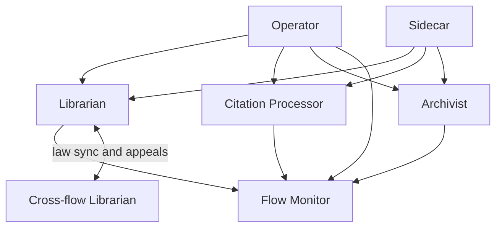
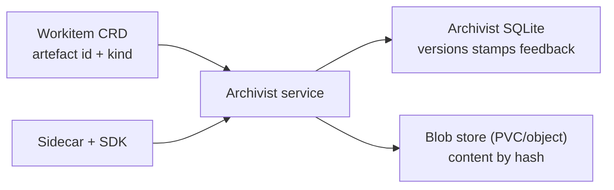
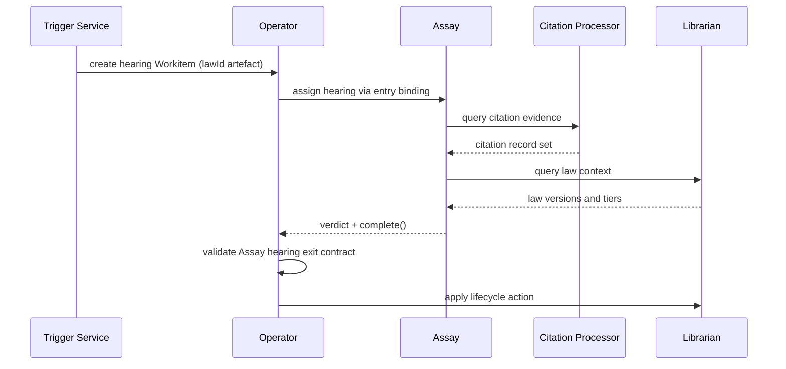

# System Services

System services provide the runtime substrate for law lifecycle, artefact lifecycle, governance signals, and operational resilience. Service responsibilities and inter-service contracts at the Flow layer define this substrate. Field-level schemas are specified in [CRD Reference](../04-reference/crds.md), and API-level wire contracts are specified in [gRPC API](../04-reference/grpc-api.md).

This service model aligns with [Architecture](../01-concepts/01-architecture.md), [Data Model](../01-concepts/02-data-model.md), [Governance](../01-concepts/03-governance.md), [Flow Runtime Overview](./00-overview.md), [Flow Operator](./01-operator.md), [Workitems](./02-workitem.md), [External Nodes](./03-nodes-external.md), [Configuration Semantics](./05-configuration.md), and [Cross-Flow Collaboration](./06-cross-flow.md).

## Service Landscape and Boundaries

Each service owns one primary concern:

- **Librarian**: law storage, retrieval, representation lifecycle, tier integration, and TTL-expiry hearing triggers.
- **Citation Processor**: citation ledger, citation analytics, and citation-threshold hearing triggers.
- **Archivist**: artefact lifecycle and provenance beyond Workitem references.
- **Flow Monitor**: telemetry aggregation, audit stream integration, and friction signal surfacing.
- **Backup surfaces**: service-owned backup scope for embedded stores and content stores, coordinated with infrastructure-level backup ownership.

No service duplicates another service's source of truth.

## Librarian

The Librarian is the law lifecycle service for a Flow.

### Law Model

- A law is one object with one textual goal and one-or-more representations.
- Representations express the same goal in different forms (prose, formal logic, executable forms, and others).
- Any mutation to goal, representations, or lifecycle metadata creates a new whole-law version identified by content hash.
- Representations are not independently versioned laws and are not linked sibling-law objects.

### Retrieval and Serving

- Nodes and system actors query laws by scope and applicability.
- Retrieval is representation-aware, allowing consumers to request forms they can interpret.
- Tier is part of legal authority, but retrieval remains one law body with one identity model.

### Integration and Conflict Checks

When higher-tier laws arrive from cross-flow replication, the Librarian performs a two-stage conflict protocol:

1. Semantic search for candidate contradictions.
2. LLM contradiction evaluation of candidates to determine actual contradiction.

Integration outcomes follow tiered supremacy semantics:

- Conflicting local Tier 1-2 laws retire immediately.
- Conflicting local Tier 3 laws enter HITL-controlled grace period flow when requested.
- On grace expiry, incoming law integrates automatically and conflicting Tier 3 law retires.
- If the LLM evaluator is unavailable or returns an indeterminate result, incoming higher-tier laws remain queued and inactive until evaluation succeeds.

### TTL-Expiry Hearing Triggers

Librarian owns hearing trigger emission for law TTL-expiry paths:

- Tier 1 nearing/at expiry -> create a Workitem for review-hearing processing, carrying hearing artefacts including `lawId`.
- Tier 2 nearing/at expiry -> create a Workitem for review-hearing processing, carrying hearing artefacts including `lawId`.

Librarian does not adjudicate hearings.

## Citation Processor

The Citation Processor owns citation evidence and threshold-triggered governance review.

### Citation Ledger

- Records citations by law, node, work context, and outcome metadata.
- Supports aggregation for promotion, decay analysis, and governance cost analysis.
- Preserves evidence required for judicial review and audit.

### Citation-Threshold Hearing Triggers

Citation Processor owns trigger emission when Tier 1 findings cross configured citation thresholds:

- Threshold crossing -> create a Workitem for review-hearing processing, carrying hearing artefacts including `lawId`, routed to Assay.

### Assay Evidence Path

During hearings and deadlock adjudication, Assay queries Citation Processor for supporting citation evidence. Evidence retrieval is mandatory for hearing-quality deliberation and audit traceability.

## Archivist

The Archivist is the artefact lifecycle service and authoritative provenance store.

### Storage Split

Archivist storage is normatively split into two layers:

- **SQLite**: artefact version history, passport stamps, and feedback.
- **Blob store**: raw artefact bytes keyed by content hash, typically on fast PVC-backed storage and optionally on cloud object storage.

### Workitem Boundary

- Workitem CRDs carry artefact references only: `id` and `kind`.
- Feedback does not live on Workitem status.
- Passports and stamps do not live on Workitem status.
- Artefact version history does not live on Workitem status.

### Access Contract

- Nodes never call Archivist directly.
- SDK calls are mediated by the [Sidecar](../03-node/01-sidecar.md).
- Query and write operations enforce capability boundaries configured in FoundryNode.

## Flow Monitor and Friction Surface

Flow Monitor aggregates runtime observability signals:

- Metrics from Operator, Sidecars, nodes, and services.
- Traces for assignment, routing, service calls, and completion paths.
- Audit event stream for governance-relevant state transitions.

Friction is a first-class signal:

- Friction events are source-tagged (law, node, topology path, and workflow context).
- Aggregation supports operational and governance analysis.
- Friction is not optional instrumentation; it is a mandatory runtime output surface.

## Hearing Lifecycle as Cross-Component Protocol

Hearings are implemented as a protocol across services and runtime actors, not as a standalone hearing service.

Hearing processing uses standard Workitems with explicit governed artefacts and contract bindings. No hearing-specific Workitem subtype or `spec.type` discriminator is introduced.

Trigger ownership is split by condition:

- Citation threshold trigger -> Citation Processor.
- TTL-expiry trigger -> Librarian.

Execution and adjudication path:

1. Triggering service creates a Workitem for review-hearing processing with hearing artefacts, including `lawId`.
2. Operator admits and assigns the hearing Workitem to Assay using Assay's bound hearing entry contract.
3. Assay retrieves citation evidence from Citation Processor and legal context from Librarian.
4. Assay issues a tier-appropriate verdict and calls `complete()`.
5. Operator validates Assay's bound hearing exit contract and applies completion state; Librarian applies resulting law lifecycle actions.

Verdict schema is tier-specific:

- **Citation-threshold hearing (Tier 1):** `Promote` or `Retain`.
- **Tier 1 TTL-expiry hearing:** `Retire` or `Promote`.
- **Tier 2 TTL-expiry hearing:** `Demote` or `Promote` (petition for Tier 3 ratification).

## Backup and Recovery Boundaries

Service backup scope is explicit:

- Librarian embedded stores and indexes: service-owned backup process.
- Citation Processor ledger store: service-owned backup process.
- Archivist SQLite provenance store: service-owned backup process.
- Archivist blob store (PVC-backed or object storage): service-owned backup and restore process consistent with storage backend.

Infrastructure-owned scope remains external to services:

- Kubernetes etcd backup/restore (including Workitem and configuration CRDs) is cluster-admin responsibility.

Recovery ordering must preserve referential integrity:

1. Restore control-plane CRDs (infrastructure domain).
2. Restore Librarian and Citation Processor stores.
3. Restore Archivist SQLite provenance.
4. Restore Archivist blob content.
5. Reconcile and verify provenance references and governance continuity.

Detailed runbooks are specified in [Operations](./07-operations.md).

## Inter-Service Contracts

Core call paths are stable:

- Operator <-> Librarian: law lifecycle events, hearing Workitem creation coordination.
- Operator <-> Archivist: completion validation queries and artefact presence checks.
- Sidecar <-> Archivist: artefact read/write/query lifecycle operations.
- Sidecar <-> Librarian: law retrieval and legal-context queries.
- Sidecar <-> Citation Processor: citation submission and citation evidence query paths.
- Assay <-> Citation Processor: hearing evidence queries.
- Services -> Flow Monitor: metrics, traces, and audit events.

Contract failures must return structured errors aligned with [Error Catalog](../04-reference/error-catalog.md).

## Failure and Degradation Semantics

Service outages degrade behaviour predictably:

- Archivist unavailable: artefact mutation and provenance queries fail closed; Workitems cannot progress through affected steps.
- Librarian unavailable: law retrieval and law lifecycle actions fail closed.
- LLM contradiction evaluator unavailable: higher-tier law activation pauses in queued state; integration retries with backoff and raises operational alerts.
- Citation Processor unavailable: hearing evidence retrieval and threshold-trigger automation are blocked; explicit operational intervention is required.
- Flow Monitor unavailable: processing continues, but observability coverage degrades and alerting is raised.

Fail-open behaviour is prohibited for governance integrity paths.

## Service Invariants

All deployments preserve these service invariants:

1. Archivist is the source of truth for artefact provenance beyond raw bytes.
2. Workitem CRD stores artefact references only (`id`, `kind`).
3. Laws are single objects with one goal and multiple representations under whole-law versioning.
4. Citation threshold hearing triggers are emitted by Citation Processor.
5. TTL-expiry hearing triggers are emitted by Librarian.
6. Assay evidence retrieval includes Citation Processor data.
7. Hearing adjudication remains an Assay responsibility, not a service-local shortcut.
8. Friction is first-class and queryable by source attribution.
9. Backup ownership boundaries are explicit between services and cluster administration.
10. Cross-flow law integration preserves tiered supremacy, grace-period semantics, and audit continuity.

Node-facing implications of these services are detailed in [SDK Core](../03-node/02-sdk-core.md), [SDK Artefacts](../03-node/03-sdk-artefacts.md), [SDK Legal](../03-node/04-sdk-legal.md), [SDK Feedback](../03-node/05-sdk-feedback.md), and [SDK Telemetry](../03-node/07-sdk-telemetry.md).
