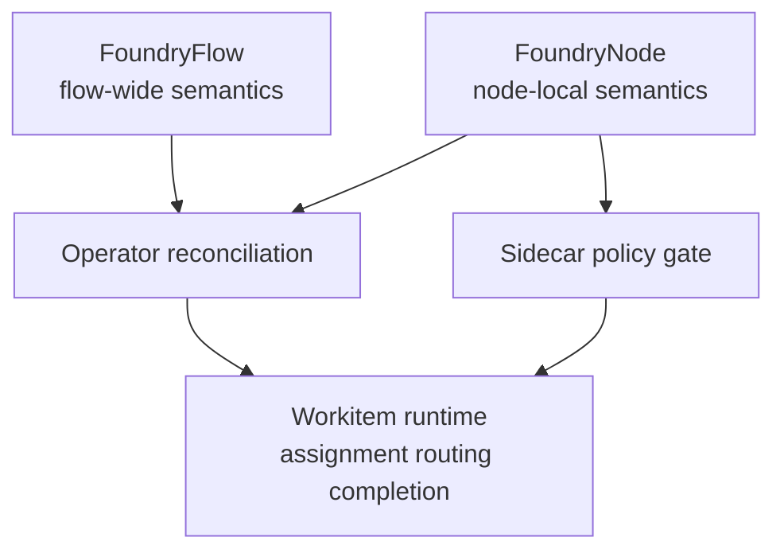
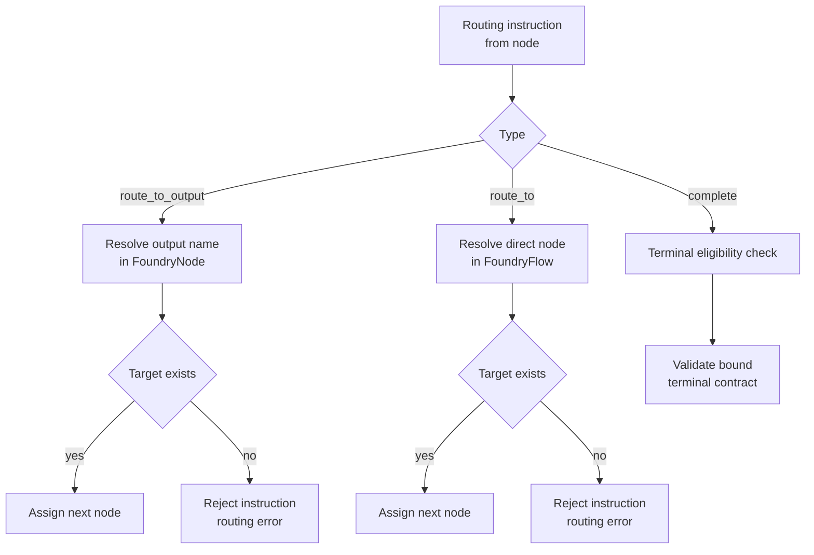
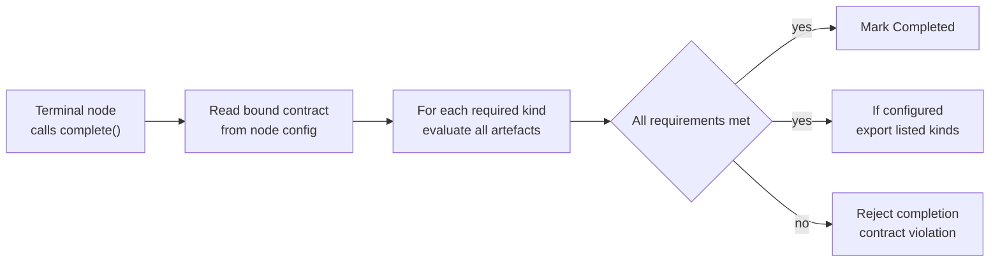

# Configuration Semantics

Flow configuration defines runtime behaviour. This document is the normative source for behavioural semantics in the Flow layer. Field names, types, defaults, and schema constraints are specified in [CRD Reference](../04-reference/crds.md).

Configuration semantics in this document align with [Architecture](../01-concepts/01-architecture.md), [Data Model](../01-concepts/02-data-model.md), and [Governance](../01-concepts/03-governance.md), plus the runtime model in [Flow Runtime Overview](./00-overview.md), the control-loop responsibilities in [Flow Operator](./01-operator.md), and the state contract in [Workitems](./02-workitem.md).

## Configuration Authority Model

Configuration is expressed through two resources with distinct authority boundaries:

- [FoundryFlow](../04-reference/crds.md) defines Flow-wide behaviour: topology, contracts, governance policy limits, and cross-flow policy.
- [FoundryNode](../04-reference/crds.md) defines node-local behaviour and permissions: routing outputs, capabilities, timeout budget, and terminal binding.

Behaviour precedence is deterministic:

1. Flow-wide invariants and policies from FoundryFlow.
2. Node-local configuration from FoundryNode.
3. Runtime state evaluation by the Operator and [Sidecar](../03-node/01-sidecar.md).

Node configuration cannot override Flow invariants.

## Flow-Level Behaviour Surface

FoundryFlow defines the executable shape of a Flow:

- Entry behaviour: accepted Workitem types and required entry conditions.
- Topology: entry node, routable graph, and routing validity constraints.
- Completion behaviour: named terminal contracts and export implications.
- Governance policy limits: thresholds and timers used by runtime guards.
- Cross-flow policy: trust topology and naturalisation requirements.

The Operator treats FoundryFlow as the source of reconciliation truth for behaviour-shaping runtime decisions.

## Topology and Routing Semantics

Routing is valid only when the target is discoverable in Flow configuration.

- `route_to_output` resolves through the assigned node's configured outputs.
- `route_to` resolves by explicit node identity.
- Resolution failures are terminal for that assignment attempt and return an error.

The Flow graph is configurable, but it must remain internally coherent:

- Every referenced routing target must exist.
- Entry node must exist and be assignable.
- Cycles are allowed and controlled by timeout and thrash policies.

## Terminal Node Semantics

Terminal status is explicit and configuration-bound. A node is terminal only when bound to a named terminal contract in configuration.

- Only terminal nodes may call `complete()`.
- Non-terminal `complete()` calls are rejected.
- Contract selection is fixed by node binding; the node does not choose at runtime.
- Contract validation is performed by the Operator.

Terminal status is not inferred from empty outputs.

## Terminal Contract Semantics

Terminal contracts are defined per governed artefact kind. Each kind maps to a required list of stamp names.

- `{"petition-draft": ["linter", "security-review"]}` means artefacts of `petition-draft` kind must exist and carry both named stamps.
- `{"audit-log": []}` means artefacts of `audit-log` kind must exist, with no stamp requirement.
- `{}` means no artefact requirements.

If multiple artefacts of a required kind exist, all must satisfy that kind's requirements.

Completion succeeds only when every required kind passes validation. Otherwise completion is rejected and the Workitem remains non-terminal.

## Stamp Grant and Capability Semantics

Stamp authority is configured through capability grants on FoundryNode.

- Stamp grant format is `STAMP:artefact/<kind>/<stamp-name>`.
- Grant scope is exact for artefact kind and stamp name.
- A node may apply only stamps it is granted.

Stamp names are governance conventions chosen by the Flow Architect. The platform does not attach special system semantics to names.

Stamp application is write-once per artefact version hash:

- A given stamp name can be applied once to a specific content hash.
- A second attempt for the same name on the same version is rejected.
- If independent sign-off is required from different actors, configure different stamp names.

The reference arrangement uses `approval` as the final checkpoint applied by Sort, but `approval` is not a privileged keyword.

## Reference Arrangement Defaults and Custom Topology

The Foundry Cycle is the reference arrangement and standard recommendation for governed workflows. Flow Architects can adapt topology while preserving platform invariants.

Reference arrangement expectations:

- Forge performs creation and reads laws only.
- Quench performs deterministic checks.
- Appraise performs subjective review.
- Sort performs gate routing and final approval checkpoint in the reference arrangement.
- Refine addresses unresolved feedback.

Custom topologies can split, merge, or replace these responsibilities. Runtime semantics remain invariant-driven rather than name-driven.

[Assay](./03-nodes-external.md) is always present as a standard runtime component and cannot be omitted.

## Cross-Flow Configuration Semantics

Cross-flow configuration defines trust relationships and authority treatment at boundaries.

- Sibling flows under a shared State Root can accept imported stamps as immediately authoritative after chain verification when names satisfy local requirements.
- Treaty and non-sibling crossings preserve imported stamps for provenance and audit only; local authority begins with naturalisation and required local checks.

Treaty trust is directed. A configured edge from Flow A to Flow B does not imply Flow B to Flow A.

Export scope at terminal completion is constrained by terminal contract kinds:

- Only artefacts whose kinds are listed in the selected terminal contract are exported.
- Empty contract exports metadata only.

## Operational Policy Knobs

Configuration exposes policy limits that bound runtime behaviour:

- Assignment timeout budgets for node execution windows.
- Thrash limits for aggregate Workitem visit budgets.
- Feedback deadlock thresholds for Assay escalation.
- Retention windows for completed and failed Workitems.
- Citation and TTL policy values driving hearing triggers.

These policies are behavioural inputs to Operator and service runtime logic and must be deterministic under reconciliation.

## Validation and Admission Invariants

Configuration is admitted only when invariants hold:

- Every routing reference resolves to a valid target.
- Entry node is present and routable.
- Terminal bindings reference existing terminal contracts.
- Capability grants are syntactically valid and enforceable.
- Cross-flow trust declarations are structurally complete for the configured topology.

The runtime rejects invalid configuration instead of applying partial behaviour.

## Configuration Evolution in v1

Configuration evolves without changing invariant meaning:

- Additive changes are preferred: new nodes, outputs, contracts, and capabilities that do not invalidate existing routes.
- Breaking changes require an explicit migration path that keeps Workitems processable during rollout.
- Runtime semantics in this document remain stable across v1 revisions.

## Behavioural Invariants

All Flow configurations must preserve these invariants:

1. Terminal status is explicit and contract-bound.
2. Only terminal nodes can complete Workitems.
3. Terminal validation is Operator-enforced against per-kind stamp requirements.
4. Stamp names are conventions; system semantics are capability and contract driven.
5. Sort routing for missing stamps is discovered from configuration, not hardcoded role names.
6. Assay is mandatory and bounded to resolve Tier 1-2, propose Tier 3, appeal Tier 4-5.
7. Cross-flow verifiability and local authority remain distinct and topology-dependent.
8. Export scope is constrained by terminal contract kind entries.

These semantics are consumed by [Flow Operator](./01-operator.md), [Workitems](./02-workitem.md), [External Nodes](./03-nodes-external.md), [System Services](./04-system-services.md), [Cross-Flow Collaboration](./06-cross-flow.md), and [Operations](./07-operations.md).

Node-level implementation patterns that realise this configuration model are detailed in [Node Configuration](../03-node/08-configuration.md) and [Node Patterns](../03-node/09-patterns.md). Runtime rejection outcomes map to [Error Catalog](../04-reference/error-catalog.md).
