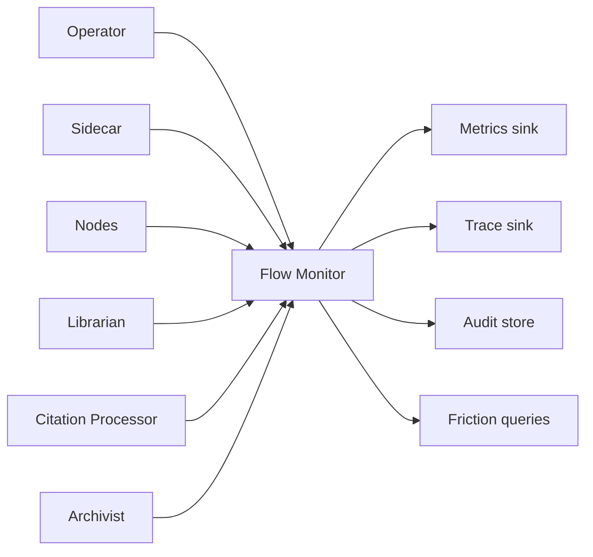
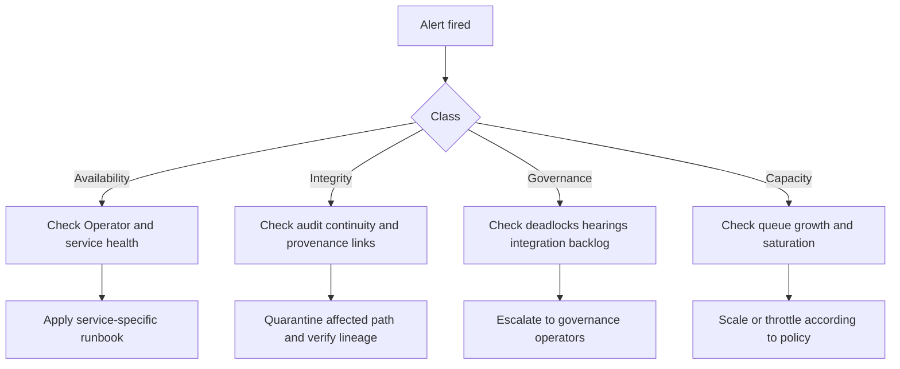

# Operations

Operations defines how a Flow is monitored, triaged, recovered, and validated in production. This document specifies runtime-operability requirements and ownership boundaries for platform operators and SRE teams.

Operational semantics align with [Architecture](../01-concepts/01-architecture.md), [Data Model](../01-concepts/02-data-model.md), [Governance](../01-concepts/03-governance.md), [Flow Runtime Overview](./00-overview.md), [Flow Operator](./01-operator.md), [Workitems](./02-workitem.md), [System Services](./04-system-services.md), [Configuration Semantics](./05-configuration.md), and [Cross-Flow Collaboration](./06-cross-flow.md).

## Operational Scope

Operators are accountable for three outcomes:

- Runtime reliability: Workitems continue to flow with predictable latency and bounded failure rate.
- Governance integrity: stamps, feedback lineage, law lineage, and hearing outcomes remain trustworthy.
- Recovery readiness: backup, restore, and failure drills are executable and verified.

Control boundaries are explicit:

- Service teams own service-level backup and restore for their stores.
- Cluster administrators own Kubernetes control-plane backup and restore.
- Operators own end-to-end validation that restored systems preserve Flow invariants.

## Telemetry Architecture

Telemetry is a mandatory runtime surface and includes four signal classes:

- Metrics
- Traces
- Audit events
- Friction events

Audit is not optional tooling. Audit continuity is a runtime requirement.

## Core Metrics and Friction Operations

Operators track at least these metric families:

- Assignment and queue health: queue depth, assignment latency, running duration.
- Transition outcomes: completion rate, failure rate, timeout rate, thrash rate.
- Governance flow: deadlock escalation count, hearing trigger count, ruling application rate.
- Cross-flow health: export/import success rate, transfer retry rate, integration conflict rate.

Friction operations are first-class:

- Friction events must be queryable by source attribution (law, node, topology path).
- Friction spikes must be triaged as real operational cost signals.
- Governance and topology tuning decisions should use friction trends, not anecdotal reports.

Node emission interfaces are defined in [SDK Telemetry](../03-node/07-sdk-telemetry.md).

## Alerting and Triage

Alert classes map to operational impact:

- **Availability**: assignment stalls, service unavailability, import/export channel disruption.
- **Integrity**: audit stream gaps, provenance mismatch, verification failure.
- **Governance**: deadlock surge, hearing backlog, unresolved conflict accumulation.
- **Capacity**: sustained queue growth, storage pressure, saturation on Operator or service dependencies.

Triage must preserve evidence. Incident response never deletes unresolved audit context.

## Error Taxonomy and Operator Actions

All operational error handling maps to [Error Catalog](../04-reference/error-catalog.md).

- Operators must use documented error families and remediation paths.
- Runbooks must not introduce undocumented failure codes or ad-hoc semantics.
- Source attribution (Operator, Sidecar, node, system service, transfer path) must be preserved in incident records.

gRPC surface failure semantics are defined in [gRPC API](../04-reference/grpc-api.md).

## Backup and Recovery Boundaries

Backup ownership is split by storage authority:

| Data Surface | Owner | Backup Responsibility |
|---|---|---|
| Workitem and config CRDs in etcd | Cluster administration | etcd backup and restore |
| Librarian stores and indexes | Service operations | service-level snapshots and restore |
| Citation Processor ledger | Service operations | service-level snapshots and restore |
| Archivist SQLite provenance | Service operations | snapshot and restore |
| Archivist blob content | Service operations | backend-consistent backup and restore |
| Audit pipeline storage | Platform/audit owner | retention and restore according to policy |

Workitem CRD backup is not handled by application services.

## Disaster Recovery Procedure

Recovery order is fixed to preserve referential and governance integrity:

1. Restore etcd control-plane state (CRDs and configuration).
2. Restore Librarian and Citation Processor stores.
3. Restore Archivist SQLite provenance store.
4. Restore Archivist blob content store.
5. Run reconciliation and integrity verification.

Post-restore verification must include:

- Workitem-to-artefact reference consistency.
- Stamp-to-version hash consistency.
- Feedback history continuity.
- Law lineage and tier state continuity.
- Cross-flow package lineage and authority semantics continuity.

Degraded mode is acceptable only with explicit alerting and documented risk window.

## Upgrade and Change Management

Operational changes must preserve runtime invariants during rollout.

- Use staged or rolling upgrades with health-gated progression.
- Validate compatibility of Operator, Sidecar, and service interfaces before full rollout.
- Rollback plans must preserve audit continuity and governance state integrity.

Change windows must include verification of terminal enforcement, routing guards, and cross-flow boundary behaviour.

## Testing and Operational Verification

Operational verification includes both conformance and failure-path testing:

- Happy-path throughput checks.
- Failure injection for timeout, unavailable service, invalid routing, and transfer interruption.
- Backup/restore drills with full post-restore integrity checks.
- Cross-flow drills validating verifiability-versus-authority semantics.

Test outcomes should be tracked as operational evidence, not one-off release notes.

## Capacity and Cost Signals

Capacity operations must combine performance and governance cost indicators:

- Queue growth, saturation, and tail latency reveal scaling pressure.
- Storage growth in provenance and blob layers informs retention policy tuning.
- Friction concentration identifies governance hotspots increasing operational cost.

Scaling and policy tuning decisions should consider both throughput and governance heat.

## Operations Invariants

All production operations preserve these invariants:

1. Audit logging is mandatory runtime output with monitored continuity guarantees.
2. Friction is a first-class, source-attributed operational signal.
3. Backup ownership boundaries are explicit by data surface.
4. etcd/CRD backup remains a cluster-admin responsibility.
5. Restore procedures preserve stamp, feedback, and law lineage integrity.
6. Error handling follows shared catalog semantics.
7. Cross-flow operations preserve provenance chain and topology-dependent authority.
8. Failure-path testing is required alongside happy-path validation.
9. Recovery readiness is continuously validated through drills.

Operational schema surfaces are defined in [CRD Reference](../04-reference/crds.md). Configuration levers consumed by operations are defined in [Configuration Semantics](./05-configuration.md).
