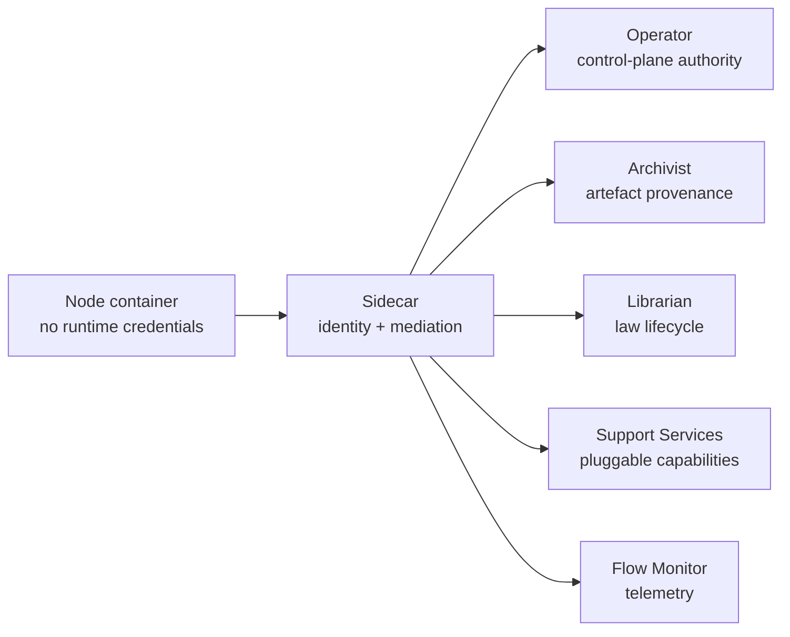
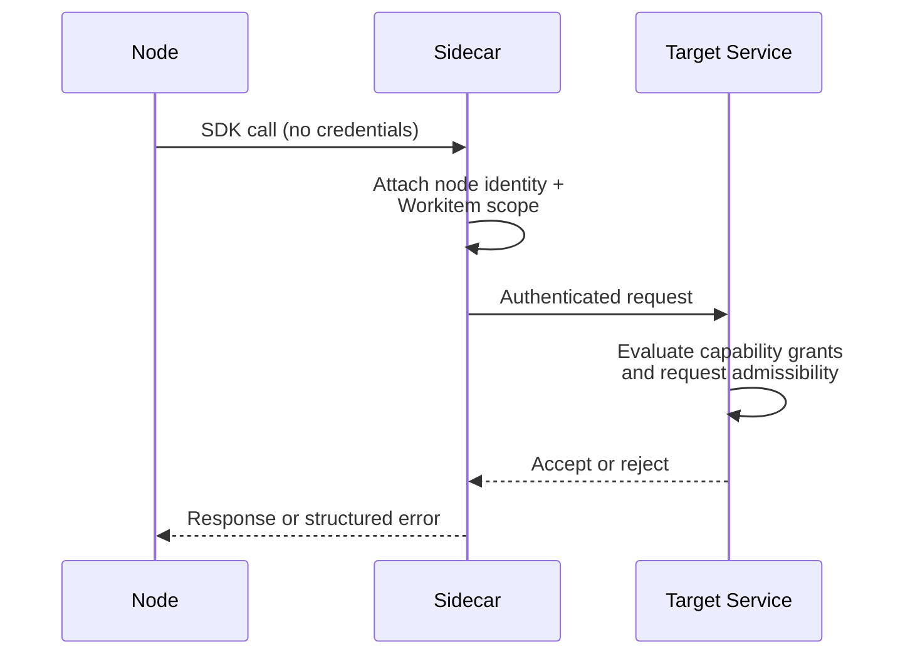

# Sidecar Boundary

Every node pod includes a Sidecar container that mediates all authenticated communication between node code and Flow runtime services. The Sidecar is not optional infrastructure — it is the security and trust boundary that makes capability-gated governance possible. Node containers hold no Flow runtime credentials and cannot call system services directly.

## Runtime Role

The Sidecar occupies a precise position in the [six-plane architecture](../01-concepts/01-architecture.md): it is the Security Plane's presence in the Data Plane. It holds identity material, brokers authenticated requests, and ensures that every node-originated operation carries verifiable provenance.

The Sidecar does not make policy decisions. It authenticates and mediates; [Operator](../02-flow/01-operator.md), [Archivist](../02-flow/04-system-services.md#archivist), and [Librarian](../02-flow/04-system-services.md#librarian) make authorisation decisions on their owned state surfaces. This separation means the Sidecar can be understood as a transport boundary without understanding the governance rules it carries traffic for.

## Identity and Trust Mediation

The Sidecar holds the node's runtime identity material — a certificate issued through the Flow's trust hierarchy. When the Sidecar brokers a request to a runtime service, it binds the request to the node's authenticated identity and the current [Workitem](../02-flow/02-workitem.md) assignment context.

This binding is what makes capability enforcement possible. When a node calls `StampArtefact` through the SDK, the Sidecar attaches the node identity to the request. The Archivist then evaluates whether that node holds the required `STAMP:artefact/<kind>/<stamp-name>` [capability](../02-flow/05-configuration.md#stamp-grant-and-capability-semantics) before accepting the stamp. The node never sees or handles the credential — it programs against [SDK abstractions](../04-sdk/01-sdk-core.md) and the Sidecar handles trust.

Stamp signing is Sidecar-mediated so that the resulting cryptographic attestation chains back to the node's certified identity. This is what makes stamps [cryptographically verifiable](../02-flow/06-cross-flow.md#stamp-verifiability-and-local-authority) across Flow boundaries.

## Workitem Scoping

Every SDK call operates within the scope of the currently assigned Workitem. The Sidecar injects Workitem identity into outgoing requests, and target services use this identity to validate request admissibility.

The scoping contract is strict:

- A node can only operate on artefacts, feedback, and stamps belonging to its currently assigned Workitem.
- Requests that reference artefacts outside the current assignment scope are rejected by the target service.
- The Sidecar does not maintain a separate assignment tracking object; the [Workitem CRD](../02-flow/02-workitem.md) state is the authoritative source of assignment ownership.

When a Workitem is assigned to a node, the Sidecar receives the assignment context from the Operator and establishes it as the active session. All subsequent SDK calls from the node handler are bound to this session until the handler returns a routing instruction.

## Service Brokering

The Sidecar brokers requests to five categories of runtime service. Each path has a distinct authority owner:

| Target service | Sidecar role | Authority owner |
|---|---|---|
| [Operator](../02-flow/01-operator.md) | Submit routing instructions and control-plane mutation requests | Operator validates and persists |
| [Archivist](../02-flow/04-system-services.md#archivist) | Proxy artefact, feedback, and stamp operations | Archivist authorises based on capability and Workitem scope |
| [Librarian](../02-flow/04-system-services.md#librarian) | Proxy law retrieval and write operations | Librarian authorises based on capability grants |
| [Flow Support Services](../02-flow/04-system-services.md#flow-support-services) | Proxy capability-gated requests to Flow-Architect-deployed services | Support Service validates capability grants |
| [Flow Monitor](../02-flow/04-system-services.md#flow-monitor-and-friction-surface) | Emit telemetry, metrics, and friction signals | Flow Monitor ingests |

The Sidecar never transfers control-plane ownership to node code. Routing instructions and Workitem mutations are submitted as requests — the Operator decides whether to accept them. Artefact provenance operations are submitted as requests — the Archivist decides whether to persist them.

## Authorisation Enforcement

Authorisation is a split responsibility. The Sidecar authenticates; the target service authorises.

The Sidecar rejects requests that fail local validation before they reach a service:

- Missing or malformed request parameters.
- Requests outside the current Workitem assignment scope.
- Authentication failures (expired or invalid identity material).

For requests that pass local validation, the Sidecar forwards them to the authoritative service with full identity context. The service then evaluates:

- **Operator**: whether the routing instruction is valid and the node holds appropriate bindings. Only [exit-bound](../02-flow/05-configuration.md#exit-node-semantics) nodes may call `complete()`.
- **Archivist**: whether the node holds the required capability for the requested operation (e.g., `STAMP:artefact/<kind>/<stamp-name>` for stamp operations), and whether the operation is consistent with current artefact state (e.g., write-once stamp enforcement). The Archivist also enforces the [Contempt Guard](../01-concepts/03-data-model.md#contempt-guard) — attempts to refuse feedback that carries a linked Assay ruling are rejected as contempt violations.
- **Librarian**: whether the node holds `READ:law` or `WRITE:law/finding` capability for the requested operation.
- **Support Services**: whether the node holds the required `USE:support/<service>/<capability>` grant for the requested operation.

Capability grants are defined in the [FoundryNode CRD](../02-flow/05-configuration.md#stamp-grant-and-capability-semantics) and evaluated by each service against the node identity that the Sidecar presents.

## Heartbeat and Activity Tracking

The Sidecar tracks node activity through complementary mechanisms:

**Implicit heartbeat.** Every SDK call that transits the Sidecar resets the activity timer. A node making regular artefact, feedback, or law queries is continuously signalling liveness without explicit action.

**Explicit heartbeat.** For long-running operations where no SDK calls occur for extended periods (complex reasoning, multi-step inference, blocking external calls), the node calls `Heartbeat()` through the SDK to reset the activity timer.

The activity timer drives inactivity timeout enforcement. The timeout window is determined by the node's configured timeout value (from [FoundryNode](./02-configuration.md#timeout-and-execution-budget)), falling back to the Flow-level default, and finally to a system fallback. The timer measures idle time, not total execution time — an operation that runs for an hour with regular heartbeats completes without timeout.

When the inactivity timer expires:

1. The Sidecar cancels the handler context, signalling the node to terminate gracefully.
2. The Sidecar reports timeout failure to the Operator.
3. The Operator transitions the Workitem to `Failed` with a timeout reason.
4. The pod remains alive and becomes ready for new assignments.

The Sidecar propagates activity timestamps to the Workitem CRD for Operator visibility, throttled to avoid excessive writes. The throttle window is a fraction of the configured timeout.

## Health and Readiness

The Sidecar exposes health and readiness endpoints that participate in Kubernetes pod lifecycle management.

**Liveness** answers whether the Sidecar process is running and the internal gRPC session to the node container is intact. If the node process crashes, the gRPC connection drops and the liveness check fails, triggering pod restart by the kubelet.

**Readiness** answers whether the node can accept new Workitem assignments. Readiness reflects:

- Initial startup completion (the node has signalled that it is ready to accept work).
- Capacity availability (active assignments have not reached the configured concurrency limit).
- Draining state (a `SIGTERM` has been received and no new work should be assigned).

The Operator uses readiness state to gate [assignment selection](../02-flow/01-operator.md#assignment-lifecycle) — only pods reporting ready receive new Workitem assignments.

Liveness and readiness are infrastructure concerns, distinct from Workitem timeout enforcement. A Workitem timing out does not kill the pod. A pod crash does not directly fail a Workitem — the Operator's inactivity detection eventually transitions orphaned Workitems to `Failed`.

## Concurrency

The Sidecar supports concurrent Workitem processing when the node's configured concurrency is greater than one.

Each active assignment maintains an independent session with its own Workitem scope, activity timer, and handler context. SDK calls from concurrent handlers are routed to the correct session by Workitem identity. The readiness endpoint returns unavailable when active assignments reach the concurrency limit.

Node handlers operating under concurrency greater than one must be safe for concurrent execution. The platform does not enforce thread safety within node code — it is a developer responsibility documented in [Node Patterns](./03-patterns.md).

## Graceful Termination

When the Sidecar receives `SIGTERM` (Kubernetes scale-down or rolling update), it enters a draining sequence:

1. **Lock**: readiness immediately returns unavailable, preventing new assignments from the Operator.
2. **Assess**: if no active assignments exist, the process exits immediately.
3. **Wait**: if assignments are in progress, the Sidecar keeps the process alive until all active Workitems reach a terminal state (`Completed` or `Failed`) or their timeout expires.

This sequence ensures that scale-down operations do not cause `Failed` Workitem transitions for work that is completing normally. The Operator sets the pod termination grace period to accommodate the configured timeout window.

## Failure Behaviour

The Sidecar fails closed on any path where governance integrity could be compromised.

| Failure scenario | Sidecar behaviour |
|---|---|
| Authentication failure | Request rejected before proxying; structured error returned to node |
| Service unavailability (Operator, Archivist, Librarian) | Fail closed on the affected path; node receives unavailability error |
| Support Service unavailability | Fail closed; node receives unavailability error |
| Invalid instruction shape | Rejected locally with structured error |
| Out-of-scope mutation request | Rejected locally with structured error |
| Identity material expiry | All requests fail until certificate renewal completes |

Service-side authorisation denial (e.g., missing capability, write-once stamp violation, contempt violation) returns a structured error to the node through the Sidecar. No state change occurs.

Timeout and thrash outcomes are decided by Operator guard logic, not by the Sidecar. The Sidecar reports the relevant signals; the [Operator](../02-flow/01-operator.md#failure-handling-and-recovery) applies failure policy.

## Telemetry

The Sidecar emits operational telemetry as a mandatory runtime output:

- Mediation outcomes (success, rejection, error) for every brokered request.
- Transport-level metrics (latency, throughput, connection state).
- Activity tracking signals for Operator visibility.
- Node-originated telemetry and friction reports forwarded to the [Flow Monitor](../02-flow/04-system-services.md#flow-monitor-and-friction-surface).

Governance audit events — the authoritative record of what changed and why — are emitted by the service that accepted, rejected, or applied the change. The Sidecar's telemetry is transport-level observability; the Archivist's audit events are provenance-level truth.

## External Service Integration

Node code may call external business services (APIs, databases, third-party platforms) directly over the data-plane network path. The Sidecar does not intercept or proxy external traffic. Network segmentation for external access is an infrastructure concern delegated to Kubernetes NetworkPolicies and service mesh configuration.

External integration does not change Flow runtime authority boundaries. Authenticated operations against Flow runtime services (artefact writes, stamp requests, routing instructions) still pass through Sidecar mediation regardless of what external calls the node makes. A node that calls an external LLM for generation and then stores the result as an artefact uses the external network path for the LLM call and the Sidecar-mediated path for the artefact store.

## Sidecar Invariants

1. Sidecar is the sole authenticated mediation path for node-originated runtime operations.
2. Sidecar holds identity material; node containers do not.
3. Sidecar authenticates and mediates; it does not make policy or authorisation decisions.
4. Authorisation is service-owned — Operator, Archivist, Librarian, and Support Services evaluate capability grants against node identity.
5. Workitem state is the source of truth for assignment scope and request admissibility.
6. Governance-integrity failures fail closed; no fail-open path exists.
7. Sidecar does not own control-plane persistence; Operator remains final authority.
8. Health and readiness are infrastructure signals, independent from Workitem timeout enforcement.
9. Activity tracking uses implicit (SDK call) and explicit (heartbeat) signals with inactivity-based timeout semantics.
10. External business service calls bypass the Sidecar; authenticated runtime operations do not.
11. Flow Support Service access is Sidecar-mediated for nodes, using the same trust boundary as system service calls.
12. Telemetry from the Sidecar is transport-level observability; governance audit events are service-owned.
