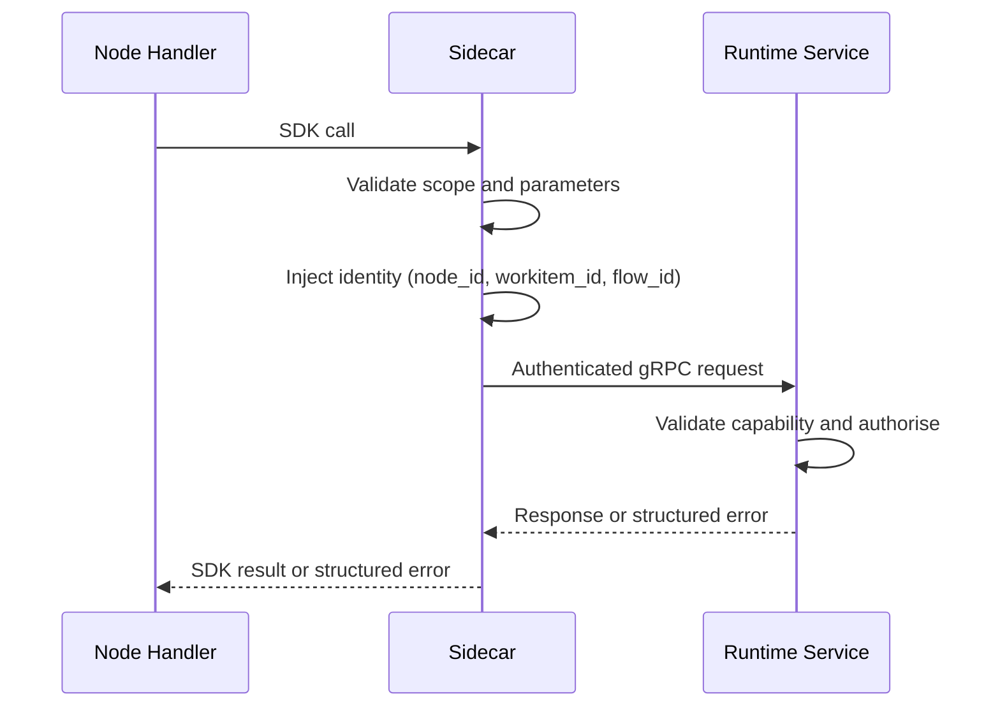

# gRPC API Reference

All runtime services expose gRPC APIs. Node-originated calls are mediated by the [Sidecar](../03-node/01-sidecar.md), which authenticates, injects identity context, and proxies to the owning service. Inter-service calls use direct service-to-service gRPC.

## Service Inventory

| Service | Responsibility | Primary Consumers |
|---------|---------------|-------------------|
| [Operator](#operator-api) | Workitem lifecycle, routing, assignment, entry/exit contract enforcement | Sidecar (on behalf of nodes) |
| [Archivist](#archivist-api) | Artefact content, versions, stamps, feedback | Sidecar (on behalf of nodes), Operator |
| [Librarian](#librarian-api) | Law storage, retrieval, integration, hearing triggers | Sidecar (on behalf of nodes), Operator |
| [Flow Monitor](#flow-monitor-api) | Friction, telemetry, metrics, traces, audit | Sidecar (on behalf of nodes), Librarian, all services |
| [Sidecar](#sidecar-mediated-sdk-paths) | Authentication proxy, identity injection, local validation | Node handlers (via SDK) |
| [Support Services](#support-service-api) | Pluggable capabilities (e.g. codification) | Sidecar (on behalf of nodes), system services |

---

## Operator API

The Operator API handles Workitem control-plane mutations. All node-facing methods are reached through the Sidecar; the Operator also exposes internal methods for service-to-service coordination.

### Node-Facing Methods (via Sidecar)

| Method | Request | Response | Description |
|--------|---------|----------|-------------|
| `SubmitResult` | `workitem_id`, `routing_instruction`, `artefact_mutations[]` | `accepted` or structured error | Submits the handler's routing instruction and any pending artefact reference additions. The Operator validates routing guards and applies the lifecycle transition. |
| `CreateWorkitem` | `intent`, `priority`, `artefacts[]?` | `workitem_id` or structured error | Creates a new Workitem in `Pending`. The creating node must be entry-bound. The Operator validates the bound entry contract. |

### Service-Facing Methods

| Method | Request | Response | Description |
|--------|---------|----------|-------------|
| `CreateHearingWorkitem` | `law_id` | `workitem_id` | Creates a review hearing Workitem for Assay processing. The Operator creates a `law-reference` artefact from the supplied `law_id` and admits the Workitem via Assay's bound hearing entry contract. Called by the Librarian when friction thresholds or TTL expiry trigger a review hearing. |
| `QueryArtefactState` | `workitem_id`, `artefact_kinds[]` | `artefact_states[]` | Returns artefact presence and stamp state for exit contract validation. Called by the Operator's own reconciliation loop against the Archivist. |
| `ExportWorkitem` | `workitem_id` | `export_package` | Assembles an export package from the completed Workitem: artefact content (scoped by exit contract), passport stamps, Workitem metadata, and provenance chain. The Operator signs the package with the Flow's identity material and includes the certificate chain. |
| `ImportWorkitem` | `export_package`, `treaty_name?` | `workitem_id` or structured error | Validates and materialises a Workitem from an export package. Verifies the package signature against the certificate chain (State Root for siblings, Treaty `caCert` for non-siblings), enforces `allowedSubjects` and `maxBundleSize` from the Treaty if applicable, validates the materialised Workitem against the configured `importNode`'s entry contract, and creates the Workitem in `Pending`. |

### Routing Instruction Shape

| Field | Type | Description |
|-------|------|-------------|
| `type` | `string` | `route_to_output`, `route_to`, or `complete`. |
| `target` | `string` | Output name (for `route_to_output`), node name (for `route_to`), or empty (for `complete`). |

### Validation and Error Responses

| Condition | Error | gRPC Status |
|-----------|-------|-------------|
| Output name not in node's configured outputs | `INVALID_ROUTE` | `FAILED_PRECONDITION` |
| Target node does not exist in topology | `INVALID_ROUTE` | `FAILED_PRECONDITION` |
| `complete` from non-exit node | `EXIT_NOT_BOUND` | `FAILED_PRECONDITION` |
| Exit contract not satisfied | `CONTRACT_VIOLATION` | `FAILED_PRECONDITION` |
| Thrash budget exceeded | `THRASH_BUDGET_EXCEEDED` | `FAILED_PRECONDITION` |
| Entry contract not satisfied (CreateWorkitem) | `CONTRACT_VIOLATION` | `FAILED_PRECONDITION` |
| Creating node not entry-bound | `ENTRY_NOT_BOUND` | `FAILED_PRECONDITION` |
| Imported Workitem does not satisfy import node's entry contract | `IMPORT_ADMISSION_FAILED` | `FAILED_PRECONDITION` |

---

## Archivist API

The Archivist API manages artefact lifecycle and provenance. All node-facing methods are reached through the Sidecar. The Operator has a direct query path for contract validation.

### Artefact Content and Version Methods

| Method | Request | Response | Description |
|--------|---------|----------|-------------|
| `GetArtefact` | `workitem_id`, `artefact_id` | `content`, `version_hash`, `kind` | Returns the latest version's content bytes. Sidecar verifies `SHA256(content) == version_hash`. |
| `GetArtefactVersion` | `workitem_id`, `artefact_id`, `version_hash` | `content` | Returns content bytes for a specific version by hash. |
| `GetArtefactMetadata` | `workitem_id`, `artefact_id` | `version_history[]`, `stamps[]` | Returns version history and current passport without content bytes. |
| `ListArtefacts` | `workitem_id` | `artefact_refs[]` | Returns all artefact references (`id`, `kind`) on the Workitem. |
| `StoreArtefact` | `workitem_id`, `artefact_id`, `kind`, `content`, `content_hash`\* | `version_hash`, `is_new_version` | Stores content bytes and creates a version record. Returns the confirmed version hash and whether a new version was created. \*`content_hash` is Sidecar-computed, not node-supplied. |

### Stamp Methods

| Method | Request | Response | Description |
|--------|---------|----------|-------------|
| `GetStamps` | `workitem_id`, `artefact_id` | `stamps[]` | Returns all stamps on the artefact's current version. Each stamp includes name, applying node, content hash, signature, and certificate chain. |
| `HasStamp` | `workitem_id`, `artefact_id`, `stamp_name` | `exists` (bool) | Returns whether the named stamp exists on the current version. |
| `StampArtefact` | `workitem_id`, `artefact_id`, `stamp_name`, `signature`\*, `cert_chain`\* | `stamp_record` | Applies a named stamp. \*`signature` and `cert_chain` are Sidecar-injected from the node's identity material. The Archivist validates: (1) `STAMP:artefact/<kind>/<stamp-name>` capability, (2) stamp has not already been applied to this version (write-once). |

### Feedback Methods

| Method | Request | Response | Description |
|--------|---------|----------|-------------|
| `AddFeedback` | `workitem_id`, `artefact_id`, `severity`, `message`, `version_hash`\* | `feedback_id` | Creates a feedback item in `new` state, tagged to the artefact's current version. \*`version_hash` is Sidecar-resolved from the latest version at call time. Transparently emits `AddFriction` with magnitude = feedback depth. |
| `GetFeedback` | `workitem_id`, `artefact_id` | `feedback_items[]` | Returns all feedback items for the artefact across all versions. |
| `HasUnresolvedFeedback` | `workitem_id`, `artefact_id` | `has_unresolved` (bool) | Returns `true` if any feedback item is in a non-`resolved` state. |
| `ResolveFeedback` | `workitem_id`, `feedback_id`, `message` | `updated_item` | Transitions feedback from `new` or `rejected` to `actioned`. |
| `RefuseFeedback` | `workitem_id`, `feedback_id`, `justification` | `updated_item` | Transitions feedback from `new` or `rejected` to `wont_fix`. Requires structured justification (`citation` with `citation_ids[]` or `novel_argument` with `argument`). |
| `AcceptFix` | `workitem_id`, `feedback_id` | `updated_item` | Transitions feedback from `actioned` to `resolved`. |
| `RejectFix` | `workitem_id`, `feedback_id`, `message` | `updated_item` | Transitions feedback from `actioned` to `rejected`. |
| `AcceptRefusal` | `workitem_id`, `feedback_id` | `updated_item` | Transitions feedback from `wont_fix` to `resolved`. |
| `RejectRefusal` | `workitem_id`, `feedback_id`, `message` | `updated_item` | Transitions feedback from `wont_fix` to `rejected`. |
| `GetFeedbackDepth` | `workitem_id`, `feedback_id` | `depth` (integer) | Returns the current history depth (number of transitions) for the specified feedback item. |
| `DeadlockFeedback` | `workitem_id`, `feedback_id` | `updated_item` | Transitions feedback from `wont_fix` or `rejected` to `deadlocked`. Requires `WRITE:feedback/deadlocked` capability. The Archivist validates capability and from-state; threshold enforcement (`maxFeedbackDepth`) is gate node logic, not Archivist enforcement. |

### Archivist Error Responses

| Condition | Error | gRPC Status |
|-----------|-------|-------------|
| Missing `READ:artefact` capability | `CAPABILITY_DENIED` | `PERMISSION_DENIED` |
| Missing `WRITE:artefact` capability | `CAPABILITY_DENIED` | `PERMISSION_DENIED` |
| Missing `STAMP:artefact/<kind>/<stamp>` capability | `CAPABILITY_DENIED` | `PERMISSION_DENIED` |
| Missing `READ:feedback` or `WRITE:feedback/<status>` capability | `CAPABILITY_DENIED` | `PERMISSION_DENIED` |
| Stamp already applied to this version | `STAMP_ALREADY_APPLIED` | `ALREADY_EXISTS` |
| Content hash mismatch on read | `ARTEFACT_CORRUPTED` | `DATA_LOSS` |
| Existing `id` with different `kind` | `ARTEFACT_KIND_CONFLICT` | `INVALID_ARGUMENT` |
| Invalid feedback state transition | `INVALID_STATE_TRANSITION` | `FAILED_PRECONDITION` |
| Attempt to override Assay-linked ruling | `CONTEMPT_VIOLATION` | `FAILED_PRECONDITION` |
| Feedback ID not found | `FEEDBACK_NOT_FOUND` | `NOT_FOUND` |
| Message exceeds 1024 characters | `MESSAGE_TOO_LONG` | `INVALID_ARGUMENT` |

---

## Librarian API

The Librarian API manages the Flow's body of law. Node-facing methods are reached through the Sidecar. The Librarian also exposes inter-service methods for the Operator and for cross-flow replication.

### Node-Facing Methods (via Sidecar)

| Method | Request | Response | Description |
|--------|---------|----------|-------------|
| `QueryLaws` | `filter` (optional) | `laws[]` | Returns laws matching the filter. Three modes: (1) no filter — all laws, (2) `artefact_kind` — laws whose `appliesTo` includes the kind plus global laws, (3) `artefact_kind` + `representation_type` — same kind filter plus at least one representation of the requested MIME type. All modes return full law objects. |
| `Cite` | `law_ids[]` | `acknowledged` | Records law usage. The Sidecar wraps this as an `AddFriction` call with fixed citation magnitude and the specified law identifiers. |
| `RecordFinding` | `goal`, `applies_to[]`, `representations[]?` | `law_id` | Creates a Tier 1 Finding. Write-availability-first: returns immediately with a law identifier. Indexing and duplicate detection are asynchronous. |

### Service-Facing Methods

| Method | Request | Response | Description |
|--------|---------|----------|-------------|
| `GetLaw` | `law_id` | `law` | Returns the full law object by identifier. Used by Assay for hearing evidence retrieval. |
| `WriteLaw` | `law` | `law_id`, `version_hash` | Persists a law (Tier 2 Ruling minted by Assay, Tier 3+ applied by administrator or Governance Flow). |
| `RetireLaw` | `law_id` | `acknowledged` | Removes a law from the active Library. History is preserved in the audit log. |
| `ReplicateLaws` | `laws[]`, `source_flow_id` | `integration_results[]` | Receives higher-tier laws from a remote Librarian for integration. Triggers the two-stage conflict protocol. |
| `ApplyLifecycleAction` | `law_id`, `verdict` | `acknowledged` | Applies the outcome of a review hearing (promote, retire, demote) to the specified law. Called by the Operator after Assay hearing completion. |

### Librarian Error Responses

| Condition | Error | gRPC Status |
|-----------|-------|-------------|
| Missing `READ:law` capability | `CAPABILITY_DENIED` | `PERMISSION_DENIED` |
| Missing `WRITE:law/tier1` capability | `CAPABILITY_DENIED` | `PERMISSION_DENIED` |
| Cited law does not exist or is retired | `LAW_NOT_FOUND` | `NOT_FOUND` |
| Finding goal exceeds maximum length | `MESSAGE_TOO_LONG` | `INVALID_ARGUMENT` |
| Librarian service unavailable | `SERVICE_UNAVAILABLE` | `UNAVAILABLE` |
| Certificate chain invalid on replicated laws | `TRUST_CHAIN_INVALID` | `PERMISSION_DENIED` |
| No Treaty configured for the required direction | `TREATY_NOT_FOUND` | `NOT_FOUND` |

---

## Flow Monitor API

The Flow Monitor API ingests telemetry, friction events, and custom events. It also serves friction queries for the Librarian and Assay.

### Ingestion Methods

| Method | Request | Response | Description |
|--------|---------|----------|-------------|
| `AddFriction` | `flow_id`, `workitem_id`, `node_id?`, `law_ids[]?`, `magnitude` | `acknowledged` | Records a friction event. Identity fields are Sidecar-injected for node context; caller-provided for service context. |
| `RecordTelemetry` | `flow_id`, `node_id`, `workitem_id`, `event_type`, `payload` | `acknowledged` | Records a custom telemetry event. Payload is JSON-serializable, max 64 KB. The Sidecar wraps the event in a standard envelope with timestamp and trace context. |

### Query Methods

| Method | Request | Response | Description |
|--------|---------|----------|-------------|
| `QueryFriction` | `filter` (by `law_id`, `node_id`, `workitem_id`, `tier`, `time_range`) | `friction_aggregates[]` | Returns aggregated friction data across the requested axes. Used by the Librarian for hearing threshold evaluation and by Assay for hearing evidence. |

### Flow Monitor Error Responses

| Condition | Error | gRPC Status |
|-----------|-------|-------------|
| Flow Monitor unavailable | `SERVICE_UNAVAILABLE` | `UNAVAILABLE` |

Telemetry ingestion is non-blocking. If the Flow Monitor is degraded, `AddFriction` and `RecordTelemetry` calls from nodes return without error — the Sidecar buffers events and drops the oldest under sustained backpressure. Friction events take priority over custom telemetry in buffer contention.

---

## Sidecar-Mediated SDK Paths

The [Sidecar](../03-node/01-sidecar.md) abstracts all transport — the node sees SDK calls, and the Sidecar operates as an in-pod proxy with the following responsibilities:

### Identity Injection

Every outgoing request from the Sidecar carries:

| Field | Source | Description |
|-------|--------|-------------|
| `node_id` | Sidecar identity material | The node's identity. |
| `workitem_id` | Current assignment | The Workitem being processed. |
| `flow_id` | Sidecar identity material | The Flow this node belongs to. |

Nodes cannot override or spoof these fields. The Sidecar is the sole authority for runtime attribution on node-originated requests.

### Authorisation Split

| Layer | Responsibility |
|-------|---------------|
| Sidecar | Scope validation (assignment boundaries), parameter validation (malformed requests), authentication (identity material). |
| Runtime service | Capability enforcement, state machine validation, write-once enforcement, contempt guard. |

The Sidecar catches invalid requests early. The owning service makes authoritative governance decisions.

### Sidecar-Local Operations

| Method | Request | Response | Description |
|--------|---------|----------|-------------|
| `Heartbeat` | `workitem_id` | `acknowledged` | Resets the Sidecar's inactivity timer. Implicit heartbeats occur on every SDK call; this method provides an explicit signal for long-running computation. The Sidecar propagates activity timestamps to the Operator, throttled to avoid excessive writes. |

### Sidecar Error Responses

| Condition | Error | gRPC Status |
|-----------|-------|-------------|
| Request targets a Workitem outside the current assignment | `ASSIGNMENT_SCOPE_VIOLATION` | `FAILED_PRECONDITION` |
| Identity material expired or invalid | `IDENTITY_EXPIRED` | `UNAUTHENTICATED` |
| Node inactivity timer exceeded | `TIMEOUT_EXCEEDED` | `DEADLINE_EXCEEDED` |

---

## Support Service API

[Flow Support Services](../02-flow/04-system-services.md#flow-support-services) expose custom gRPC capabilities. The API shape is extensible — each service defines its own methods.

### Consumption Paths

| Consumer | Path | Authorisation |
|----------|------|---------------|
| Nodes | Sidecar-mediated | `USE:support/<service>/<capability>` grant on the node. |
| System services | Direct service-to-service gRPC | Flow configuration discovery. |

### Codification Service API

Each [CodificationService](./crds.md#codificationservice) exposes a single `Encode` method:

| Method | Request | Response | Description |
|--------|---------|----------|-------------|
| `Encode` | `law` (Law object) | `representation` (Representation) | Translates the law's goal into the service's declared `outputFormat`. The service receives the full law object (goal, existing representations, tier, metadata) and returns a single typed representation. The output MIME type matches the `outputFormat` declared in the service's CRD. |

### Health Endpoints

All Support Services implement:

| Endpoint | Description |
|----------|-------------|
| `healthz` | Liveness probe. Returns healthy when the service process is running. |
| `readyz` | Readiness probe. Returns ready when the service can accept requests. |

### Support Service Error Responses

| Condition | Error | gRPC Status |
|-----------|-------|-------------|
| Missing `USE:support/<service>/<capability>` grant | `CAPABILITY_DENIED` | `PERMISSION_DENIED` |
| Support Service unavailable | `SERVICE_UNAVAILABLE` | `UNAVAILABLE` |

---

## API Invariants

1. All node-originated requests transit the Sidecar. No node calls a runtime service directly.
2. Identity context (`node_id`, `workitem_id`, `flow_id`) is Sidecar-injected and cannot be overridden by node code.
3. Capability enforcement is performed by the owning service, not by the Sidecar or the SDK.
4. All errors use structured responses with stable error codes from the [Error Catalogue](./error-catalogue.md).
5. Telemetry ingestion failures do not block or fail work execution.
6. State-mutating operations return structured errors with no state change on rejection.
7. gRPC status codes map to error categories: `PERMISSION_DENIED` for capability failures, `FAILED_PRECONDITION` for guard violations, `NOT_FOUND` for missing resources, `ALREADY_EXISTS` for write-once violations, `UNAVAILABLE` for transient service failures, `INVALID_ARGUMENT` for malformed input, `DATA_LOSS` for integrity failures, `DEADLINE_EXCEEDED` for timeout failures, `UNAUTHENTICATED` for identity failures.
8. Inter-service calls (Operator-Archivist, Librarian-Flow Monitor) use the same error model as node-facing calls.
9. Configuration errors (`INVALID_CAPABILITY`, `UNKNOWN_CONTRACT`, `IMPORT_NODE_INVALID`, `SCHEMA_VALIDATION_FAILED`) are caught at CRD admission time and do not appear in runtime gRPC responses. See [Error Catalogue](./error-catalogue.md#configuration-and-validation-errors).
