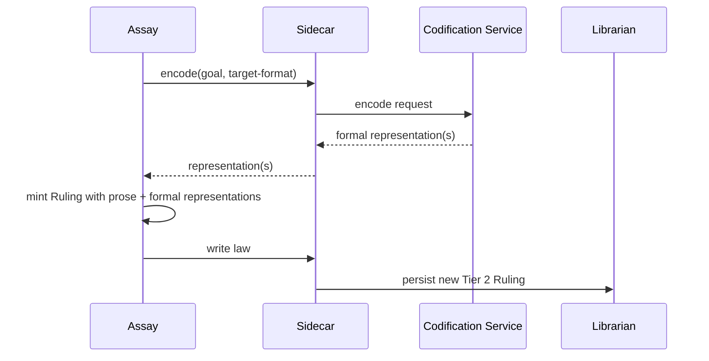
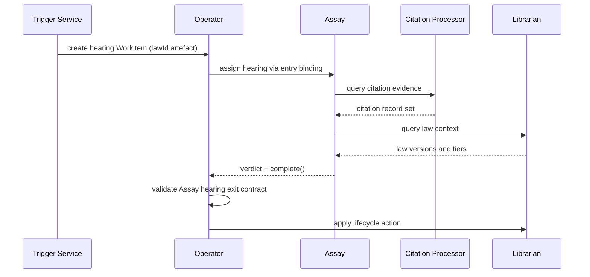
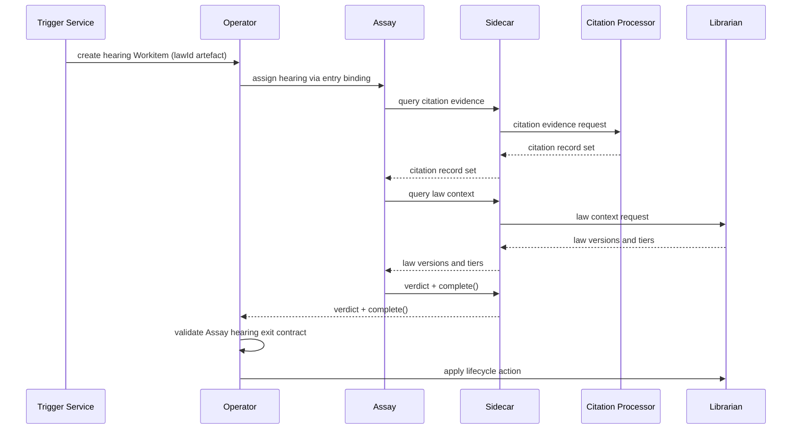

# Flow Support Services — Implementation Plan

This document is an execution plan for introducing **Flow Support Services** into the Foundry Flow specification. It captures the design decisions, lists every file change with exact locations and proposed content, and can be executed in a single session.

## Background

REVIEW.md issue #2 identified that "Codification Services" is referenced in three concepts documents but never defined in `02-flow/04-system-services.md`. During review, the decision was made to introduce a new architectural concept — **Flow Support Services** — rather than folding codification into the Librarian. Codification Services become the first concrete instance of this broader category.

## Design Decisions

These decisions were made during the review session and must be preserved:

| Decision | Value |
|----------|-------|
| **What are they?** | Pluggable containers deployed by Flow Architects that expose gRPC capabilities consumed by nodes and system services. |
| **How do they run?** | As containers in the Flow namespace, like bespoke system services. Direct gRPC — no Sidecar of their own. |
| **How are they consumed by nodes?** | Through Sidecar mediation on the consumer side. The consuming node's Sidecar brokers the call, preserving the "nodes never call services directly" invariant. |
| **How are they consumed by system services?** | Direct service-to-service gRPC (same pattern as inter-system-service calls). |
| **Configuration surface** | Own CRD (or specialised sub-CRDs for subtypes like Codification Services). Declares provided capabilities. FoundryFlow config grants consuming nodes access to those capabilities. CRD supports infrastructure config: PVC mounts, deployment strategy (ReplicaSet default, StatefulSet option). |
| **Permission model** | Simplified — not the full node capability envelope. |
| **Workitem processing** | None. Support Services do not receive Workitems. |
| **Statefulness** | Not required to be stateless. May use PVC-backed storage (e.g., local model caches). Better if stateless, but not enforced. |
| **SDK usage** | The SDK provides a `FlowSupportService` base class. Support Services are built using the SDK, analogous to how nodes use a Node base class. |
| **Naming** | Full name: "Flow Support Services". Informal: "Support Services". |
| **First concrete instance** | Codification Services: expose an `encode` capability consumed by Assay during law promotion to translate natural-language verdicts into formal representations. |
| **Lifecycle management** | Operator manages Support Service deployments. Default: ReplicaSet, minimum replicas 0 (scaled down when unused). Stateful services or those that cannot scale to zero can override the minimum. StatefulSet available as an option. |
| **Health contract** | Support Services must implement standard `healthz`/`readyz` endpoints for Operator health management and pod lifecycle. |
| **Telemetry** | Support Services emit context-specific telemetry relevant to their capability. No generic mandatory schema beyond standard health signals. |
| **Discovery by system services** | Via the Flow configuration — the same mechanism that grants node access. |
| **Assay access pattern** | Assay is a node and accesses Codification Services through its Sidecar, the same as any other node consuming a Support Service. |

### The Codification Pattern

From legacy material (`PolymorphicLaw.md`): Assay decides *what* the ruling should be; the Codification Service writes the formal syntax. The workflow:

1. Assay renders a verdict in natural language during Tier 1 → Tier 2 promotion.
2. Assay sends the natural-language verdict to a Codification Service (e.g., `codify-smt`) via its Sidecar.
3. The Codification Service returns one or more formal representations (SMT-LIB, executable validators, etc.).
4. Assay mints the Tier 2 Ruling with both the original prose and the new formal representations.

The Codification Service does not adjudicate. Assay is the judge; the Codification Service is the scribe. Assay is a node and accesses Codification Services through its Sidecar, the same as any other node consuming a Support Service.

---

## Files to Change

Twelve files require changes. Each is described below with its current status, exact locations, and proposed content.

---

### 1. `AGENTS.md` — Add key decisions

**Status:** N/A (project governance file)

**Location:** After the "Assay is a standard Flow component" key decision (after line 317), add two new key decision sections.

**Add key decision: "Flow Support Services are pluggable service containers"**

```markdown
### Flow Support Services are pluggable service containers

Flow Support Services are optional, Flow-Architect-deployed containers that expose gRPC capabilities consumed by nodes (via Sidecar mediation) and system services (via direct service-to-service calls). They run in the Flow namespace alongside system services and do not process Workitems.

Support Services are declared via their own CRD (or specialised sub-CRDs for specific subtypes). The CRD declares what capabilities the service provides and supports infrastructure configuration including PVC mounts and deployment strategy (ReplicaSet default, StatefulSet as an option). Support Services are not required to be stateless. The FoundryFlow configuration grants consuming nodes access to Support Service capabilities. System services discover Support Services through the same Flow configuration.

Node access to Support Service capabilities is granted through the same capability-grant pattern as other capabilities, using the `USE:support/<service>/<capability>` syntax. For example, `USE:support/codify-smt/encode` grants a node access to the `encode` capability of the `codify-smt` Codification Service.

Nodes consume Support Services through Sidecar mediation — the consuming node's Sidecar brokers the call, preserving the platform invariant that nodes never call services directly. Assay is a node and accesses Support Services through its Sidecar. System services consume Support Services via direct service-to-service gRPC.

Support Services use the SDK's `FlowSupportService` base class and have a simplified permission model distinct from the full node capability envelope. Specialised subtypes (such as Codification Services) extend subtype-specific base classes that inherit from `FlowSupportService`.

The Operator manages Support Service deployments. Default deployment strategy is ReplicaSet with minimum replicas of 0, allowing the Operator to scale services down when unused. Stateful services or services that cannot scale to zero can override the minimum. Support Services must implement standard `healthz`/`readyz` endpoints for Operator health management and pod lifecycle. Support Services emit context-specific telemetry relevant to their capability.
```

**Add key decision: "Codification Services are Flow Support Services"**

```markdown
### Codification Services are Flow Support Services

Codification Services are a specialisation of Flow Support Services for translating law goals into formal representations during governance hardening. They inherit from `CodificationService`, which extends the SDK's `FlowSupportService` base class. They expose an `encode` capability that Assay can consume during law promotion.

When Assay renders a verdict for Tier 1-to-Tier 2 promotion, it sends the natural-language goal to a Codification Service, which returns one or more formal representations (formal logic, executable validators, etc.). Assay mints the Tier 2 Ruling with both the original prose and the new formal representations. Assay decides what the ruling should be; the Codification Service writes the formal syntax.

Codification Services are pluggable and replaceable. A Flow Architect can deploy multiple Codification Services for different representation types (e.g., `codify-smt` for formal logic, `codify-rego` for policy-as-code). Assay discovers available Codification Services through Flow configuration.
```

**Also:** Update the spec structure comment for `02-flow/04-system-services.md` to note it now covers Support Services. In the Spec Structure block (line 39), change:

```text
│   ├── 04-system-services.md
```

to:

```text
│   ├── 04-system-services.md    # System services + Flow Support Services
```

**Also:** Append a paragraph to the existing "Workitem control-plane ownership and SDK boundary" key decision (after line 264, before "Concepts documents are technology-agnostic" at line 266):

```markdown

The `FlowSupportService` base class is a distinct SDK surface from the Workitem-scoped node handler contract. Support Services do not participate in Workitem mutation flow or artefact provenance flow — they expose stateless gRPC capabilities consumed through Sidecar mediation. The `FlowSupportService` contract covers capability declaration, health reporting, and the simplified permission model; it does not include Workitem, Artefact, or routing abstractions.
```

---

### 2. `01-concepts/01-architecture.md` — Data Plane + Responsibility Boundaries

**Status:** Complete (full writing-principle review applies)

**Change 1: Data Plane section — add Support Services paragraph**

**Location:** After line 74 ("Nodes have direct, uninhibited network access to external services. Network security is an infrastructure concern delegated to the platform's network policy layer."), add:

```markdown

Flow Architects can also deploy **Support Services** — containers that expose capabilities consumed by nodes and system services but do not process Workitems. A Codification Service that translates a law's prose goal into formal logic is a Support Service; a notification relay that pushes alerts to an external channel is another. Support Services run in the Flow namespace and are accessed through Sidecar mediation when consumed by nodes, preserving the same trust boundary as system service calls. They are declared in Flow configuration and are optional — the platform imposes no minimum set.
```

**Important:** This text must remain technology-agnostic per the "Concepts documents are technology-agnostic" key decision. No gRPC, Docker, PVC, ReplicaSet, or other product names.

**Change 2: Responsibility Boundaries table — add row**

**Location:** In the table at lines 114-127, add a new row after "Work execution" (line 116):

```markdown
| Pluggable capabilities | Data | Support Services |
```

The full table row should sit naturally among the existing rows. Insert it after the "Work execution" row (line 116) and before "Routing decisions" (line 117), since Support Services are Data Plane participants alongside Nodes and Archivist.

**Change 3: Architectural Planes diagram — add Support Services to Data Plane**

**Location:** In the Mermaid diagram at lines 38-41, update the Data Plane subgraph:

Change:

```text
    subgraph data["Data Plane"]
        direction LR
        Nodes ~~~ Archivist
    end
```

To:

```text
    subgraph data["Data Plane"]
        direction LR
        Nodes ~~~ Archivist ~~~ SupportSvc["Support Services"]
    end
```

---

### 3. `01-concepts/00-overview.md` — Fix Codification Services link

**Status:** Drafted

**Location:** Line 88

**Current text:**

```markdown
...through [Codification Services](../02-flow/04-system-services.md). Authority increases through the tier system; enforceability increases through representation.
```

**Replace with:**

```markdown
...through [Codification Services](../02-flow/04-system-services.md#codification-services). Authority increases through the tier system; enforceability increases through representation.
```

The anchor `#codification-services` must match the heading we create in `02-flow/04-system-services.md` (change 7 below).

---

### 4. `01-concepts/03-data-model.md` — Fix Codification Services link

**Status:** Drafted

**Location:** Line 395

**Current text:**

```markdown
...If the Finding proves durable enough to be promoted to a Tier 2 Ruling, [Codification Services](../02-flow/04-system-services.md) can translate the goal into formal logic, adding a deterministic representation alongside the original prose.
```

**Replace with:**

```markdown
...If the Finding proves durable enough to be promoted to a Tier 2 Ruling, [Codification Services](../02-flow/04-system-services.md#codification-services) can translate the goal into formal logic, adding a deterministic representation alongside the original prose.
```

---

### 5. `01-concepts/04-governance.md` — Fix representation lifecycle link

**Status:** Drafted

**Location:** Line 75

**Current text:**

```markdown
Representation lifecycle responsibilities are defined in [System Services](../02-flow/04-system-services.md).
```

**Replace with:**

```markdown
Representation lifecycle responsibilities — including [Codification Services](../02-flow/04-system-services.md#codification-services) that translate goals into formal representations — are defined in [System Services](../02-flow/04-system-services.md).
```

---

### 6. `02-flow/00-overview.md` — Runtime Composition + Mermaid diagram

**Status:** Drafted

**Change 1: Add Support Services bullet to runtime composition list**

**Location:** After line 12 (system services bullet), add a new bullet:

```markdown
- [Flow Support Services](./04-system-services.md#flow-support-services) are optional, Flow-Architect-deployed containers that expose pluggable capabilities (such as codification) consumed by nodes through Sidecar mediation and by system services directly.
```

**Change 2: Update Mermaid diagram**

**Location:** In the diagram at lines 17-39, add Support Services. After line 30 (`SC --> CP["Citation Processor<br/>citation tracking"]`), add:

```text
    SC --> SS["Support Services<br/>pluggable capabilities"]
```

Also add the telemetry connection after line 36 (`CP --> FM`):

```text
    SS --> FM
```

**Change 3: Add Support Services to Runtime Invariants**

**Location:** In the Runtime Invariants list (lines 167-183), add after invariant 12 (line 182):

```markdown
13. Flow Support Services are consumed through Sidecar mediation by nodes and do not process Workitems.
```

**Change 4: Update Data Ownership Boundaries**

**Location:** After line 122 ("Nodes access artefact and governance state through Sidecar and SDK surfaces; nodes do not call system services directly."), add:

```markdown
- Flow Support Services are accessed through Sidecar mediation when consumed by nodes, extending the same trust boundary to pluggable capabilities.
```

---

### 7. `02-flow/04-system-services.md` — Major addition

**Status:** Drafted

This is the largest change. Add a new top-level section and update several existing sections.

**Change 1: Update service landscape bullet list**

**Location:** At line 13 (after the backup surfaces bullet), add:

```markdown
- **Flow Support Services**: optional, Flow-Architect-deployed containers that expose pluggable gRPC capabilities consumed by nodes (via [Sidecar](../03-node/01-sidecar.md) mediation) and system services (directly). Codification Services are the worked example in this spec.
```

**Change 2: Update the service landscape Mermaid diagram**

**Location:** In the diagram at lines 17-33, add Support Services. After line 25 (`SC --> AR`), add:

```text
    SC --> SS["Support Services<br/>(Flow Architect deployed)"]
```

After line 30 (`OP --> FM`), add:

```text
    SS --> FM
```

**Change 3: Add new "Flow Support Services" section**

**Location:** After the "Flow Monitor and Friction Surface" section (after line 140, before "Hearing Lifecycle as Cross-Component Protocol"). Insert the following section:

```markdown
## Flow Support Services

Flow Support Services are optional containers deployed by the Flow Architect that expose gRPC capabilities to nodes and system services. They run in the Flow namespace — pluggable, replaceable, and Flow-Architect-owned.

Support Services do not process Workitems — they expose gRPC capabilities consumed by nodes and system services through different access paths:

- Nodes consume Support Services through [Sidecar](../03-node/01-sidecar.md) mediation, preserving the platform invariant that nodes never call services directly. Assay is a node and accesses Support Services through its Sidecar.
- System services discover and consume Support Services via the Flow configuration and direct service-to-service gRPC.

Support Services are declared via their own CRD, which specifies:

- The capabilities the service provides (e.g., `encode` for Codification Services).
- Infrastructure configuration: PVC mounts, deployment strategy (ReplicaSet default, StatefulSet as an option), resource limits.
- Health and readiness endpoints (`healthz`/`readyz`).

The [Operator](./01-operator.md) manages Support Service deployments. Default deployment strategy is ReplicaSet with minimum replicas of 0, allowing the Operator to scale services down when unused. Stateful services or services that cannot scale to zero can override the minimum replica count. Support Services must implement standard `healthz`/`readyz` endpoints for Operator health management and pod lifecycle.

The FoundryFlow [configuration](./05-configuration.md) grants consuming nodes access to Support Service capabilities using `USE:support/<service>/<capability>` syntax (e.g., `USE:support/codify-smt/encode`). Support Services use the [SDK](../04-sdk/00-overview.md)'s `FlowSupportService` base class and have a simplified permission model distinct from the full node capability envelope. Specialised subtypes (such as `CodificationService`) extend subtype-specific base classes that inherit from `FlowSupportService`.

Support Services are not required to be stateless. A Codification Service might cache model weights on a PVC; a notification relay might maintain connection pools. Infrastructure state is Support-Service-owned and not part of the Workitem provenance boundary.

Support Services emit context-specific telemetry relevant to their capability. No mandatory generic telemetry schema is imposed beyond standard health signals.

CRD field-level definitions are in [CRD Reference](../05-reference/crds.md).

### Codification Services

Codification Services are a Flow Support Service specialisation for governance hardening. They translate a [law](../01-concepts/03-data-model.md#laws)'s natural-language goal into formal representations — formal logic, executable validators, policy-as-code — increasing enforceability without changing the law's intent.

Codification Services expose an `encode` capability consumed during law promotion:

1. Assay renders a verdict during Tier 1 → Tier 2 promotion, expressing the ruling's goal in natural language.
2. Assay sends the goal to a Codification Service via its Sidecar.
3. The Codification Service returns one or more formal representations alongside the original prose.
4. Assay mints the Tier 2 Ruling as a single law object with multiple representations.

Assay decides what the ruling should be; the Codification Service writes the formal syntax.

Flow Architects can deploy multiple Codification Services for different representation types (e.g., `codify-smt` for formal logic, `codify-rego` for policy-as-code). Assay discovers available Codification Services through [Flow configuration](./05-configuration.md). If no Codification Service is deployed, Assay mints rulings with prose representations only — governance hardening through codification is optional, not a platform requirement.



**Change 4: Fix hearing lifecycle diagram to show Sidecar mediation**

**Location:** In the hearing lifecycle sequence diagram (lines 161-178), Assay calls Citation Processor and Librarian directly. Since Assay is a node, these calls must go through its Sidecar.

Change:



To:



**Note:** This fixes a pre-existing inconsistency (Assay shown calling services directly) exposed by our new Codification Services diagram which correctly shows Sidecar mediation.

**Change 5: Update inter-service contracts**

**Location:** In the "Inter-Service Contracts" section (lines 209-221), change line 218:

```markdown
- Assay <-> Citation Processor: hearing evidence queries.
```

To:

```markdown
- Assay (via Sidecar) <-> Citation Processor: hearing evidence queries.
```

Also add after that line:

```markdown
- Sidecar <-> Support Services: capability-gated operations on Flow-Architect-deployed services.
- Assay (via Sidecar) <-> Codification Services: encode requests during law promotion.
```

**Note:** The existing contract entry lacked "(via Sidecar)" — Assay is a node and all its service calls are Sidecar-mediated. This fix ensures consistency with the new Codification Services entry.

**Change 6: Update failure and degradation semantics**

**Location:** In the "Failure and Degradation Semantics" section (lines 223-233), after line 230 (`Citation Processor unavailable...`), add:

```markdown
- Support Service unavailable: operations requiring that service's capability fail closed for the requesting actor. Governance hardening (codification) degrades gracefully — Assay can mint prose-only rulings when Codification Services are unavailable.
```

**Change 7: Update service invariants**

**Location:** In the "Service Invariants" section (lines 235-249), after invariant 10 (line 248), add:

```markdown
11. Flow Support Services are optional, Flow-Architect-deployed, and do not process Workitems.
12. Codification Services are optional; their absence degrades governance hardening to prose-only rulings.
```

---

### 8. `02-flow/05-configuration.md` — Configuration authority model + Support Service declaration

**Status:** Drafted

**Change 1: Update Configuration Authority Model text**

**Location:** Line 7

Change:

```markdown
Configuration is expressed through two resources with distinct authority boundaries:
```

To:

```markdown
Configuration is expressed through three resource types with distinct authority boundaries:
```

**Change 2: Add Support Service CRD bullet to authority model**

**Location:** After line 10 (`- [FoundryNode]...`), add:

```markdown
- Support Service CRDs define per-service capabilities, infrastructure requirements, and deployment policy. FoundryFlow controls which nodes can consume which Support Service capabilities. Support Service CRDs are subordinate to FoundryFlow — they declare what is available; FoundryFlow governs who can use it.
```

**Change 3: Update Mermaid diagram**

**Location:** In the diagram at lines 20-27, add Support Services. After line 23 (`FN["FoundryNode<br/>node-local semantics"] --> OP`), add:

```text
    SS["Support Service CRDs<br/>capabilities infrastructure"] --> OP
```

**Change 4: Add new Support Service Configuration section**

**Location:** After the "Reference Arrangement Defaults and Custom Topology" section (after line 169, before "Cross-Flow Configuration Semantics" at line 171). Insert a new section:

```markdown
## Support Service Configuration

Flow Support Services are declared via dedicated CRDs that define provided capabilities and infrastructure requirements.

- Each Support Service CRD declares the capabilities it exposes (e.g., `encode` for Codification Services).
- Infrastructure configuration includes PVC mounts, deployment strategy (ReplicaSet default, StatefulSet option), resource limits, and replica count.
- Default minimum replicas is 0, allowing the Operator to scale services down when unused. Stateful services or services that cannot scale to zero can override the minimum.
- Support Services must implement standard `healthz`/`readyz` endpoints.
- The FoundryFlow configuration grants consuming nodes access to Support Service capabilities using `USE:support/<service>/<capability>` syntax (e.g., `USE:support/codify-smt/encode`), following the same capability-grant pattern as stamp and law capabilities.

Assay discovers available Codification Services from Flow configuration. Other nodes discover Support Services through their granted capabilities. System services discover Support Services through the same Flow configuration.

Support Service CRD field-level definitions are in [CRD Reference](../05-reference/crds.md).
```

**Change 5: Update Behavioural Invariants**

Update the Behavioural Invariants list (lines 217-231). After invariant 10 (line 230), add:

```markdown
11. Support Service capabilities are configuration-granted and Sidecar-mediated for node consumers.
```

---

### 9. `02-flow/01-operator.md` — Add Support Service reconciliation surface

**Status:** Drafted (full writing-principle review applies)

**Change 1: Update Reconciliation Surfaces text**

**Location:** Line 22

Change:

```markdown
The Operator reconciles three state surfaces continuously:
```

To:

```markdown
The Operator reconciles four state surfaces continuously:
```

**Change 2: Add Support Service bullet to reconciliation list**

**Location:** After line 26 (`- **Workitem**: lifecycle progression...`), add:

```markdown
- **Support Service**: deployment lifecycle, health monitoring, and scaling policy for Flow-Architect-deployed [Flow Support Services](./04-system-services.md#flow-support-services).
```

**Change 3: Update Reconciliation Surfaces Mermaid diagram**

**Location:** In the Mermaid diagram at lines 28-37, add Support Services. After line 32 (`WI["Workitems<br/>pending running completed/failed"] --> OP`), add:

```text
    SS["Support Services<br/>health scaling lifecycle"] --> OP
```

**Change 4: Add Operator invariant**

**Location:** In the Operator Invariants list (lines 189-203), after invariant 11 (line 203), add:

```markdown
12. Support Service deployment lifecycle, health monitoring, and scaling policy are Operator-managed.
```

---

### 10. `03-node/00-overview.md` — Update Runtime Interaction Model

**Status:** Drafted (full writing-principle review applies)

**Location:** In the "Runtime Interaction Model" bullet list (lines 50-54), after line 54 (`Sidecar -> telemetry surfaces...`), add:

```markdown
- Sidecar -> Citation Processor: citation submission and citation evidence queries.
- Sidecar -> Flow Support Services: capability-gated operations on Flow-Architect-deployed services.
```

---

### 11. `03-node/01-sidecar.md` — Update service brokering contract

**Status:** Stub outline (structural changes only)

**Change 1: Add Support Services and Citation Processor to brokering contract**

**Location:** In the "Service Brokering Contract" section (lines 39-45), after line 44 (`Sidecar -> telemetry surfaces...`), add:

```markdown
- Sidecar -> Citation Processor for citation submission and citation evidence query paths.
- Sidecar -> Flow Support Services for capability-gated operations on Flow-Architect-deployed services.
```

**Note:** Adding Citation Processor here also addresses REVIEW.md issue #3 (Sidecar-to-Citation-Processor path missing from the stub).

**Change 2: Update the failure section**

**Location:** In "Failure and Fail-Closed Behaviour" (line 51), update to include Support Services in the unavailable-dependency list:

Change:

```markdown
- Unavailable dependency (Operator/Archivist/Librarian) -> fail closed on affected governance path.
```

To:

```markdown
- Unavailable dependency (Operator/Archivist/Librarian/Support Service) -> fail closed on affected path.
```

**Change 3: Update Sidecar Invariants**

**Location:** After line 69 ("Sidecar does not own control-plane persistence; Operator remains final authority."), add:

```markdown
- Flow Support Service access is Sidecar-mediated for nodes, using the same trust boundary as system service calls.
```

---

### 12. `04-sdk/00-overview.md` — Add FlowSupportService to SDK surface

**Status:** Stub outline (structural changes only)

**Change 1: Update Goal**

**Location:** Line 5

**Current text:**

```markdown
Define the SDK contract that node developers use to execute Workitem-scoped logic through Sidecar mediation while runtime services remain authoritative for authorisation and state changes.
```

**Replace with:**

```markdown
Define the SDK contracts for node developers (Workitem-scoped handler execution) and Support Service developers (capability endpoint implementation), both mediated through Sidecar boundaries while runtime services remain authoritative for authorisation and state changes.
```

**Change 2: Update SDK Surface Map**

**Location:** Lines 19-21

**Current text:**

```markdown
## SDK Surface Map

Introduce the SDK domains: core, artefacts, legal, feedback, Workitems, and telemetry.
```

**Replace with:**

```markdown
## SDK Surface Map

Introduce the SDK domains: core, artefacts, legal, feedback, Workitems, telemetry, and the `FlowSupportService` base class for Support Service implementations.
```

**Change 3: Add FlowSupportService section**

**Location:** After "SDK Surface Map" (after line 21) and before "Failure and Error Model" (line 23), add:

```markdown
## FlowSupportService Base Class

Define the SDK base class for Flow Support Service implementations. Covers capability declaration, gRPC endpoint registration, health reporting, and the simplified permission model distinct from node handler execution. Specialised subtypes (such as `CodificationService`) extend `FlowSupportService` with subtype-specific contracts.
```

---

## REVIEW.md Updates

After all changes are applied, update `REVIEW.md`:

### Mark issue #2 as RESOLVED

Change:

```markdown
### 2. Codification Services referenced but never defined
```

To:

```markdown
### ~~2. Codification Services referenced but never defined~~ RESOLVED
```

Add after the suggested fix paragraph:

```markdown
**Resolution:** Introduced Flow Support Services as a new architectural concept in AGENTS.md (key decisions), `01-concepts/01-architecture.md` (Data Plane, Responsibility Boundaries), `02-flow/04-system-services.md` (dedicated section with Codification Services subsection), `02-flow/05-configuration.md` (configuration authority model and Support Service configuration), `02-flow/01-operator.md` (reconciliation surface), `02-flow/00-overview.md` (runtime composition), `03-node/00-overview.md` (Runtime Interaction Model), `03-node/01-sidecar.md` (brokering contract), and `04-sdk/00-overview.md` (FlowSupportService base class). Codification Services are the first concrete instance, exposing an `encode` capability consumed by Assay during law promotion. Links in concepts documents updated to point to the new section.
```

### Mark issue #3 as RESOLVED (Sidecar brokering gap)

The Sidecar stub now includes both Citation Processor and Support Services in its brokering contract.

Change:

```markdown
### 3. Librarian cited as source of law query by Sidecar in gRPC API stub, but Citation Processor also receives Sidecar calls — unclear in service contract
```

To:

```markdown
### ~~3. Librarian cited as source of law query by Sidecar in gRPC API stub, but Citation Processor also receives Sidecar calls — unclear in service contract~~ RESOLVED
```

Add after the suggested fix paragraph:

```markdown
**Resolution:** Added Citation Processor and Flow Support Services to the Sidecar's service brokering contract in `03-node/01-sidecar.md`. The Sidecar stub now lists all five brokered paths: Operator, Archivist, Librarian, Citation Processor, and Flow Support Services. The concepts architecture document (`01-concepts/01-architecture.md`) was not changed for this specific issue since it describes planes at a higher abstraction level where the Sidecar's brokering detail is not enumerated.
```

### Update Summary table

Update the summary table to reflect the new resolved counts.

---

## Post-Edit Checklist

After all changes are applied:

1. **Run the `lint-and-fix` skill.** Execute `pnpm lint` from the `lint/` directory, fix any issues, and rerun until clean.
2. **Verify cross-links.** Confirm that:
   - `#codification-services` anchor in `02-flow/04-system-services.md` matches the heading
   - `#flow-support-services` anchor matches the heading
   - All three concepts document links resolve correctly
3. **Review writing principles compliance** on all new prose:
   - No negative definitions ("unlike...", "not like...")
   - No planning voice ("there are N things...")
   - No meta-commentary ("in this section we will...")
   - No announced tables or diagrams
   - British spelling throughout
   - Technology-agnostic in `01-concepts/` (no gRPC, Docker, PVC, ReplicaSet in that layer)

---

## Execution Order

Execute changes in this order to minimise context-switching:

1. `AGENTS.md` (key decisions — establishes the authoritative design)
2. `02-flow/04-system-services.md` (the largest change — creates the target sections and anchors)
3. `02-flow/00-overview.md` (runtime composition update)
4. `02-flow/05-configuration.md` (configuration authority model + Support Service section)
5. `02-flow/01-operator.md` (reconciliation surface update)
6. `01-concepts/01-architecture.md` (Data Plane + Responsibility Boundaries)
7. `01-concepts/00-overview.md` (link fix)
8. `01-concepts/03-data-model.md` (link fix)
9. `01-concepts/04-governance.md` (link fix + text update)
10. `03-node/00-overview.md` (Runtime Interaction Model update)
11. `03-node/01-sidecar.md` (brokering contract update)
12. `04-sdk/00-overview.md` (SDK surface update)
13. `REVIEW.md` (mark issues resolved)
14. Run `lint-and-fix`

---

## Resolved Design Questions

These questions were identified during planning and have been resolved:

1. **CRD field-level schema** for the Support Service CRD — deferred to `05-reference/crds.md` drafting.
2. **Assay's deployment model** — Assay is a node and accesses Codification Services through its Sidecar, the same as any other node consuming a Support Service. The sequence diagram should show only the Sidecar-mediated path.
3. **Support Service discovery by system services** — via the Flow configuration, the same mechanism that grants node access.
4. **Support Service telemetry contract** — Support Services emit context-specific telemetry relevant to their capability. No generic mandatory telemetry schema beyond standard health signals. The specific signal content depends on the Support Service type.
5. **Support Service lifecycle management** — The Operator manages Support Service deployments. Default deployment strategy is ReplicaSet with minimum replicas of 0, allowing the Operator to scale services down when unused. Stateful services or services that cannot scale to zero can override the minimum. Support Services must implement standard `healthz`/`readyz` endpoints for Operator health management and pod lifecycle.
