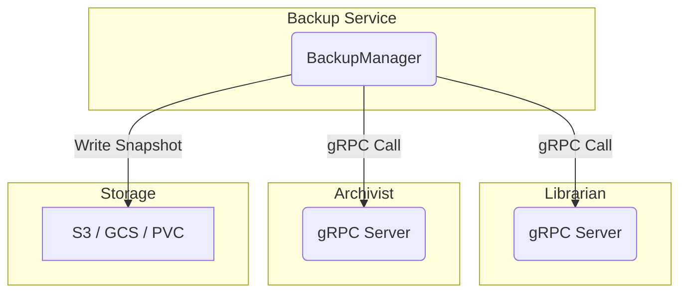

# Foundry Flow: Backup Service

**Status:** v1 Specification

## 1. Overview

The Backup Service provides a centralized, consistent mechanism for backing up the stateful components of Foundry Flow that rely on SQLite databases, specifically the **Librarian** and the **Archivist**.

It operates by calling a standard gRPC endpoint on these services to stream a consistent, live snapshot of their database, which it then writes to a configurable storage backend. This decouples the core services from the complexities of backup scheduling, retention, and storage management.

## 2. Architecture



- The **Backup Service** runs as a standalone deployment.
- It periodically calls the `StreamDatabaseSnapshot` gRPC endpoint on the Librarian and Archivist.
- The Librarian and Archivist use the SQLite Online Backup API to create a consistent snapshot in memory and stream it back to the Backup Service.
- The Backup Service writes the received snapshot to the configured storage destination.

## 3. gRPC Interface

The Backup Service relies on a standard interface that must be implemented by any service wishing to be backed up.

**File:** `proto/backup.proto`

```protobuf
syntax = "proto3";

package backup;

// The interface that services must implement to be backed up
// by the central Backup Service.
service BackupSource {
  // Streams a consistent snapshot of the service's database.
  // The service should use the SQLite Online Backup API to ensure
  // the snapshot is taken without service interruption.
  rpc StreamDatabaseSnapshot(DatabaseSnapshotRequest) returns (stream DatabaseSnapshotResponse);
}

message DatabaseSnapshotRequest {}

message DatabaseSnapshotResponse {
  // A chunk of the database file.
  bytes chunk = 1;
}
```

## 4. Configuration

The Backup Service is configured in the `FoundryFlow` CRD.

```yaml
apiVersion: flow.gideas.io/v1
kind: FoundryFlow
metadata:
  name: default
spec:
  backup:
    schedule: "0 * * * *" # Hourly cron schedule
    retention:
      hourly: 24
      daily: 7
      weekly: 4
      monthly: 12
    destination:
      provider: "s3"
      s3:
        bucket: "foundry-flow-backups"
        region: "us-east-1"
        # Assumes IAM role for authentication
```

| Field | Type | Description |
|---|---|---|
| `schedule` | string | Cron expression for when to run the backup jobs. |
| `retention` | object | Tiered retention policy. |
| `retention.hourly` | integer | Number of hourly snapshots to keep. |
| `retention.daily` | integer | Number of daily snapshots to keep. |
| `retention.weekly` | integer | Number of weekly snapshots to keep. |
| `retention.monthly` | integer | Number of monthly snapshots to keep. |
| `destination` | object | Configuration for the backup storage backend. |
| `destination.provider` | string | `s3`, `gcs`, `azureBlob`, or `pvc`. |
| `destination.s3` | object | S3-specific configuration. |
| `destination.pvc` | object | PVC-specific configuration. |

## 5. Restoration

Restoration is a manual process performed by a cluster administrator.

1. **Retrieve Snapshot:** The administrator retrieves the desired snapshot file (e.g., `librarian-20260110T140000Z.db`) from the backup storage location.
2. **Scale Down Service:** The target service (e.g., Librarian) is scaled down to 0 replicas.
3. **Replace Database File:** The administrator copies the snapshot file into the service's PVC, replacing the existing database file.
4. **Scale Up Service:** The service is scaled back up. It will start with the restored database state.

This process is documented in the Disaster Recovery guide.
