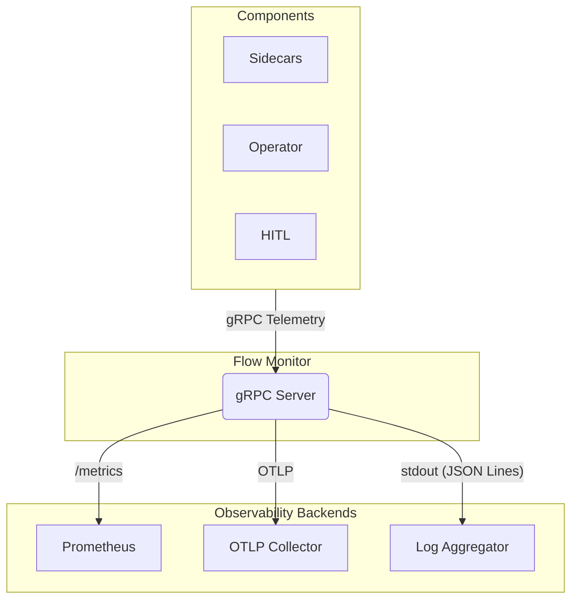

# Foundry Flow: Flow Monitor

**Status:** v1 Specification

## 1. Overview

The **Flow Monitor** is the central observability hub for a Foundry Flow. It aggregates events from all components (Sidecars, Operator, HITL Nodes) and serves four distinct functions:

1.  **Metrics Export:** Processes telemetry events and exposes them as Prometheus metrics for real-time monitoring and alerting.
2.  **Trace Aggregation:** Acts as an OpenTelemetry (OTLP) endpoint for distributed tracing across the system.
3.  **Audit Logging:** Emits structured, compliance-relevant events as JSON Lines to stdout for collection by log aggregation platforms.
4.  **Friction Aggregation:** Aggregates friction reports from nodes and exposes them as metrics for the Friction Ledger.



---

## 2. Friction Aggregation & The Friction Ledger

The Flow Monitor receives friction reports from nodes and aggregates them into Prometheus metrics. The **Friction Ledger** is the conceptual view of this data, implemented through Prometheus queries and Grafana dashboards.

### 2.1 Friction Model

Friction measures **governance resistance** — the intensity of conflict when laws are enforced. It separates:

| Category | Description | Friction Cost |
|---|---|---|
| **Compliance (Usage)** | Node reads a law to generate an artefact (context seeding) | **0** — The law functioned as a guardrail |
| **Enforcement (Correction)** | Appraise Node cites a law to block an artefact | **Base cost** — The law forced a correction |
| **Resistance (Argument Loop)** | Node refuses correction or reviewer rejects fix | **Exponential** — Compounding conflict |

### 2.2 Friction Reporting

Nodes emit friction via the `ReportFriction()` SDK method. Each report includes:

| Field | Type | Description |
|---|---|---|
| `value` | float64 | Friction magnitude (positive) |
| `op` | FrictionOp | Aggregation operation |
| `reason` | string | Human-readable explanation |
| `tags` | map | Attribution labels (law_id, phase, model, etc.) |

**Friction Operations:**

| Operation | Formula | Use Case |
|---|---|---|
| `FrictionLog` | `Score += log(1 + value)` | Diminishing returns; many small frictions |
| `FrictionAdd` | `Score += value` | Linear accumulation; countable issues |
| `FrictionMultiply` | `Score *= value` | Severity multiplier; compounding issues |

### 2.3 Friction Metrics

The Flow Monitor exposes friction data as Prometheus metrics at `0.0.0.0:9090/metrics`:

| Metric | Type | Labels | Description |
|---|---|---|---|
| `foundry_friction_score_total` | Counter | `flow`, `node`, `law_id`, `attribution` | Cumulative friction score |
| `foundry_friction_events_total` | Counter | `flow`, `node`, `op` | Count of friction events by operation |

**Labels:**

| Label | Values | Purpose |
|---|---|---|
| `law_id` | Law identifier | Attribute friction to specific laws |
| `attribution` | `law_violation`, `feedback_loop`, `timeout`, `external_api` | Why friction was incurred |
| `node` | Node name | Which node reported the friction |
| `flow` | Flow ID | Multi-flow aggregation |

### 2.4 The Friction Ledger

The **Friction Ledger** is a conceptual view of friction data, implemented through Prometheus and Grafana. It answers questions that were previously unanswerable:

| Question | PromQL Query |
|---|---|
| Which laws generate the most resistance? | `topk(10, sum by (law_id) (rate(foundry_friction_score_total[1h])))` |
| Toxic Laws vs Foundational Laws | Compare `foundry_friction_score_total` (resistance) vs `foundry_legal_citation_total{nature="USAGE"}` (compliance) |
| Friction by tier (local vs federal) | `sum by (tier) (foundry_friction_score_total)` |
| Friction by node | `sum by (node) (rate(foundry_friction_score_total[1h]))` |
| Total friction for a workitem | `sum(foundry_friction_score_total{workitem_id="wi-123"})` |

**Recommended Recording Rules:**

```yaml
groups:
  - name: friction_ledger
    rules:
      - record: foundry:friction_by_law_1h
        expr: sum by (law_id) (increase(foundry_friction_score_total[1h]))
      
      - record: foundry:top_toxic_laws
        expr: topk(100, foundry:friction_by_law_1h)
      
      - record: foundry:friction_by_node_1h
        expr: sum by (node) (increase(foundry_friction_score_total[1h]))
```

**Friction Ledger Dashboard Panels:**

1. **Toxic Laws Heatmap:** Top 10 laws by friction (bar chart)
2. **Friction Over Time:** Total friction rate by flow (line chart)
3. **Friction Attribution:** Breakdown by `attribution` label (pie chart)
4. **Node Friction Comparison:** Friction by node (table)

---

## 3. Audit Logging

The Flow Monitor provides a definitive, immutable audit trail for all significant workitem lifecycle events. This is critical for compliance, debugging, and understanding the history of any piece of work.

### 3.1 Emission

The Flow Monitor writes all audit events to its standard output (stdout) as a stream of JSON Lines. Each line is a self-contained JSON object representing a single audit event.

This approach decouples the Flow from the specifics of any logging backend. Operators are responsible for configuring a log collection agent (e.g., Fluentd, Vector) to capture these logs and forward them to their chosen long-term storage and analysis platform.

### 3.2 Audit Event Schema

Every audit event adheres to a consistent schema.

| Field | Type | Description |
|---|---|---|
| `timestamp` | string | ISO 8601 timestamp of the event (UTC). |
| `event_type` | string | The type of event that occurred (e.g., `workitem.created`). |
| `flow_id` | string | The ID of the Foundry Flow where the event occurred. |
| `workitem_id` | string | The ID of the workitem this event relates to. Present for all workitem-related events. |
| `actor` | object | The entity that performed the action. |
| `actor.type` | string | `node`, `operator`, `user`, etc. |
| `actor.id` | string | The ID of the actor (e.g., node name, operator pod name). |
| `payload` | object | A nested object containing event-specific details. |

**Example Event:**

```json
{"timestamp":"2026-01-10T15:30:00Z","event_type":"artefact.stamped","flow_id":"default","workitem_id":"wi-abc-123","actor":{"type":"node","id":"code-generator-v1-xyz"},"payload":{"artefact_id":"art-def-456","stamp_type":"compliance","law_id":"f-105","result":"pass"}}
```

### 3.3 Audit Event Catalog

The following event types are considered part of the audit trail.

| Event Type | Emitted By | Payload Fields | Description |
|---|---|---|---|
| `workitem.created` | Operator | `spec`, `initial_artefacts` | A new workitem has been created. |
| `workitem.assigned` | Operator | `assignee_node`, `assignee_role` | A workitem has been assigned to a node for processing. |
| `workitem.completed` | Operator | `terminal_contract`, `final_artefacts` | A workitem has finished processing. |
| `workitem.failed` | Operator | `reason`, `error_message` | A workitem has failed. |
| `artefact.stamped` | Sidecar | `artefact_id`, `stamp_type`, `law_id`, `result` | An artefact was validated against a law. |
| `hitl.escalated` | Operator | `escalation_reason` | A workitem was escalated for human-in-the-loop review. |
| `hitl.decided` | HITL Node | `decision`, `decider_identity` | A human has made a decision on an escalated workitem. |
| `flow.exported` | Operator | `target_flow`, `export_bundle_id` | A workitem and its artefacts were exported to another flow. |

---

## 4. Metrics Export (Prometheus)

The Flow Monitor exposes all system metrics at `0.0.0.0:9090/metrics` in Prometheus format. This includes:

- **Friction metrics** (see Section 2.3)
- **Workitem lifecycle metrics** (from Operator events)
- **Node health metrics** (from Sidecar heartbeats)
- **LLM cost metrics** (token usage, model attribution)

See `05_metrics_catalog.md` for the complete metrics reference.

---

## 5. Trace Aggregation (OTLP)

The Flow Monitor acts as an OpenTelemetry collector endpoint, receiving trace spans from components and forwarding them to the configured OTLP backend.

**Endpoint:** `0.0.0.0:4317` (gRPC) or `0.0.0.0:4318` (HTTP)

Traces enable distributed debugging across the Flow, correlating events from the Operator, Sidecars, and external services.

---

## 6. Deployment

The Flow Monitor is deployed as a Kubernetes Deployment within the Flow namespace.

```yaml
apiVersion: apps/v1
kind: Deployment
metadata:
  name: flow-monitor
spec:
  replicas: 1
  template:
    spec:
      containers:
        - name: flow-monitor
          image: foundry/flow-monitor:v1
          ports:
            - containerPort: 9090  # Prometheus metrics
            - containerPort: 4317  # OTLP gRPC
            - containerPort: 50051 # Telemetry ingestion gRPC
```

**Resource Recommendations:**

| Workload | CPU | Memory |
|---|---|---|
| Small (< 100 workitems/day) | 100m | 128Mi |
| Medium (100-1000 workitems/day) | 250m | 256Mi |
| Large (> 1000 workitems/day) | 500m | 512Mi |
