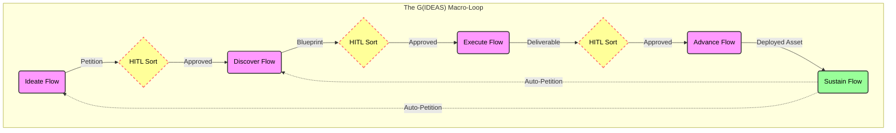

## The G(IDEAS) Framework: A Federated Architecture for Governed Work

### Abstract

The `G(IDEAS)` framework is a general-purpose, federated meta-framework for governing *any* complex business process, from initial intent to operational monitoring.

The framework's name, `G(IDEAS)`, represents its core architecture: a sequence of five operational `Flows` (`I`deate, `D`iscover, `E`xecute, `A`dvance, and `S`ustain) governed by a single, local `Governance Flow` (`G`). This entire `G(IDEAS)` instance can operate in a standalone mode (where its `G` is the supreme legislature) or as part of a federation, where its `G` flow also subscribes to and integrates `Tier 4` law published by external "Federal" `G(IDEAS)` instances.

It is a macro-architecture—a "Flow of Flows"—comprising five stages: **Ideate, Discover, Execute, Advance, and Sustain**.

Each stage is implemented as an autonomous **Foundry Cycle**—a constitutional "micro-state" that governs its own `Workitems` through adversarial iteration, judicial escalation, and economic accountability. (This engine is detailed across our companion papers—*The Foundry Flow*, *The Foundry Cycle*, and *The Governance Flow & Federation*.)

The framework's novelty lies in its two primary mechanisms:
1.  The **"Planned HITL Sort Node,"** which acts as an auditable, constitutional API between major organizational silos.
2.  The **"Sustain"** stage, an institutional feedback loop where the system programmatically petitions itself for change.

The result is a fully auditable, self-correcting federation that replaces invisible, trust-based processes with a single, verifiable, and economically-transparent record of governance.

### Executive Summary

The modern enterprise is a "black box," executing critical processes with unquantified risk and unauditable governance. Traditional process maps rely on trust, tacit knowledge, and human oversight—all of which are unreliable, unscalable, and opaque.

The **`G(IDEAS)`** framework is a macro-architecture for governing the entire lifecycle of value creation. Each `G(IDEAS)` instance contains a "Flow of Flows" for its own workload. Multiple instances can be linked in a federation, where "Federal" instances publish `Tier 4` law to "Operational" instances.

This is achieved through five core stages:

1.  **Ideate:** Governs the translation of unreliable human intent into a formally aligned and constitutionally-valid "Petition" or "Business Case."
2.  **Discover:** Governs the translation of the "Petition" into a verifiable "Solution Blueprint" or "Specification" (e.g., a domain model, a legal outline, a marketing brief).
3.  **Execute:** Governs the translation of the "Blueprint" into the final, compliant "Deliverable" (e.g., source code, a finished contract, a marketing asset).
4.  **Advance:** Governs the translation of the "Deliverable" into a live, "Deployed Asset" (e.g., a production system, a filed contract, a product on a shelf).
5.  **Sustain:** An autonomous, institutional feedback loop where the deployed asset is monitored, and any failures or opportunities *programmatically* generate new "Petitions" to be fed back into the `Ideate` stage.

In short, `G(IDEAS)` is a general-purpose framework for transforming a chaotic, trust-based assembly line into a transparent, self-healing federation of governed `Flows`. It provides a single, auditable "truth" for the entire value-creation lifecycle.

### Visual Architecture

#### The Governance Engine: The Foundry Cycle

Each of the five IDEAS stages is powered by a standardized, reusable governance *engine*: the **Foundry Cycle**.

The Foundry Cycle is a "micro-architecture" for governing *outcomes* by starting from the premise that all agents (human or AI) are **unreliable**. It enforces compliance through three core components:

1.  **A Constitutional Loop:** A 5-stage adversarial pattern (**Forge, Quench, Appraise, Sort, Refine**) that subjects a `Workitem` (the artefact) to relentless scrutiny against a codified legal **Library**.
2.  **The Two-Tier Judiciary:** A `local Assay Node` in each operational `Flow` resolves `Workitem`-level deadlocks, creating `Tier 2` "Case Law." The instance's local `Governance Flow` (`G`) handles `Tier 3` petitions. If federated, any conflicts with `Tier 4` law are escalated as petitions to the originating "Federal `G(IDEAS)` Instance," which runs its own Federal Assay.
3.  **The Friction Ledger (Conscience):** An economic ledger that makes the *true cost* of every single rule auditable.

The Foundry Cycle is the *engine* that provides the auditable, constitutional guarantee of compliance *within* each stage. `G(IDEAS)` is the *chassis* that federates these engines to govern the *entire* business process.

*(This engine is an application of the `Foundry Flow` and `Foundry Cycle` patterns, all governed by `The Governance Flow & Federation`.)*

Here is a draft of that section, written in the "manifesto" style of the framework.

### The Crisis of Ungoverned Work

The modern enterprise is built on a foundational, unspoken, and increasingly dangerous assumption: **trust**.

We trust our people to follow the process. We trust our teams to have the right conversations in the right Slack channels. We trust our managers to have perfect, gapless oversight. This trust-based model of operation was, at best, a fragile social contract that functioned only at a small, human-centric scale.

In the modern, scaled enterprise, this model has become an existential liability.

#### The Failure of Trust

The trust-based model has already collapsed under the weight of organisational complexity. That "trust" now manifests as a chaotic, invisible system of tribal knowledge, shadow governance, and well-intentioned but ultimately unverifiable human processes.

Into this broken and brittle system, we are now aggressively introducing non-deterministic, unreliable *statistical* agents—Large Language Models—as core actors. This is an accelerant on an open flame. We are attempting to build mission-critical, AI-driven systems on a crumbling, pre-digital foundation of human handshakes. This is an abdication of responsibility.

#### The Black Box Enterprise

The direct consequence of this trust-based model is the **"Black Box Enterprise."** We have inputs (a new business initiative, a legal requirement) and we have outputs (a deployed product, a filed contract), but the critical process that connects them is an opaque, unauditable, and expensive mess.

We cannot answer the most basic questions about our own operations:

* What is the *true economic cost* of a single compliance rule?
* Where is the *invisible friction*—the contradictory policies, the rework loops, the escalated disputes—in our value stream?
* Which failures are being silently "fixed" by heroic human effort, and which are being *ignored* entirely?

Our current processes are *designed* to obscure this data. Failures go unlogged as auditable data points; they are discovered months later as catastrophic bugs, budget overruns, or legal liabilities. We are governing by autopsy.

#### The Need for a New Model

The solution is to create ***governable*** **processes**; a "better" dysfunctional process is just a faster path to failure.

A governable process is one built on a new, cynical, and more realistic set of axioms:

1.  **Assume Unreliability:** All agents, human or AI, are fallible. We trust the intent (loyalty) but we always verify execution (competence). We explicitly separate **malice** (an HR problem) from **fallibility** (a systems problem) so the architecture protects good actors from their own blind spots. The framework functions as a **Safety Harness** that protects competent actors from systemic complexity.
2.  **Make Work Auditable:** Every action, decision, review, and piece of feedback must be an immutable, traceable record.
3.  **Make Governance Economic:** The friction of governance—measured in time, computational cost, and human effort—must be treated as a first-class, quantifiable, and auditable *economic signal* that replaces the notion of governance as bureaucratic side-effect.

A new architecture must replace "trust" with auditable proof and translate procedural friction into a measurable *cost*. We need a system that is *designed* to complain, and to do so with a receipt—one that goes beyond checklists or better-intentioned meetings.

### The G(IDEAS) Framework: A "Flow of Flows"

The `G(IDEAS)` framework is the macro-architecture that federates individual Foundry Cycles into a single, end-to-end "Flow of Flows." It provides a high-level, five-stage topology for governing the entire lifecycle of a value-producing initiative.

This section details each of the five stages. Each stage is a complete, autonomous, and governed **Foundry Flow** (see *The Foundry Flow*) with its own specific "Constitution" (subscribed from `G(IDEAS)`), a *local* "Judiciary" (`Assay Node`) for `Workitem` disputes, and a local "Economic Ledger" (`Friction Ledger`). The "output" of one `Flow` becomes the "input" (or "Petition") for the next.

**1. Ideate (Intent Clarification)**

* **Function:** To translate vague, unreliable human intent into a *formally-governed, constitutionally-aligned Petition*. This stage acts as the "constitutional front door" for the entire enterprise.

	This `Flow` is designed to ingest a raw, un-governed "idea" from a human agent. This input is treated as a "raw petition" `Workitem`. The Foundry Cycle in this stage (often wrapped in a conversational interface) will **Forge** a standardized "Petition" or "Business Case" artefact, **Appraise** it against the organization's core (Tier 4) Federal Constitution, and **Refine** it (with human or AI feedback) until it is coherent, justified, and aligned.

* **Input:** A raw, unstructured idea.
* **Output:** A governed, structured "Petition" or "Business Case" artefact.
* **HITL Gate (The `Sort` Node):** "Does this petition accurately represent the business intent and is it worth discovering?" The Sort Node validates artefact requirements and routes to the human authority for approval.

**2. Discover (Solution Design)**

* **Function:** To translate the *Petition* into a *verifiable solution blueprint*. This is the primary architectural and design `Flow`.

	Once a petition is approved by the `Ideate` gate, it is routed to the `Discover` `Flow`. This `Flow` is often a "Chain of Cycles"—a sequence of specialized Foundry Cycles that sequentially build the "blueprint." For example, it may first govern the creation of a "Ubiquitous Language" artefact, then an "Actor Model," then a "Domain Model." The "Constitution" for this `Flow` is the organization's set of design principles and architectural laws.

* **Input:** The governed "Petition" artefact.
* **Output:** A "Solution Model," "Blueprint," or "Specification" artefact bundle.
* **HITL Gate (The `Sort` Node):** "Does this proposed solution blueprint correctly and adequately satisfy the petition?" The Sort Node validates that required artefacts exist at required validity levels (via `ValidateArtefact()`) before human review.

**3. Execute (Artefact Construction)**

* **Function:** To translate the *Solution Blueprint* into the *final, deliverable artefact*. This is the "construction" or "manufacturing" `Flow`.

	With an approved blueprint, the `Workitem` proceeds to `Execute`. This `Flow`'s "Constitution" is its domain-specific "Executeing Constitution"—a set of laws governing quality, safety, style, and testing (e.g., legal precedents for a contract, test coverage for code, brand guidelines for a marketing asset). The Foundry Cycle here is a relentless quality gate, using its `Quench` and `Appraise` nodes to enforce these standards.

* **Input:** The governed "Solution Model" artefact.
* **Output:** The "Deliverable" (e.g., a finished product, a legal contract, a marketing asset).
* **HITL Gate (The `Sort` Node):** "Does this final deliverable perfectly match the blueprint and meet all quality standards?"

**4. Advance (Value Delivery)**

* **Function:** To translate the *Constructed Artefact* into an *operational, value-delivering state*. This is the "launch" `Flow`.

	This `Flow` governs the *release* of the artefact. Its "Constitution" is the organization's *Operational Constitution*—the non-negotiable laws of Security, Compliance, and Finance. Its `Appraise` nodes check for security vulnerabilities, its `Quench` nodes check against regulatory constraints, and its `Friction Ledger` exposes the true *cost* of deployment.

* **Input:** The governed "Deliverable" artefact.
* **Output:** A "Deployed Asset" (e.Sg., a live system, a filed contract, a product on a shelf).
* **HITL Gate (The `Sort` Node):** "Is this asset 100% compliant and ready to go live?"

**5. Sustain (The Closed Loop)**

* **Function:** To monitor the *Operational Asset* and provide an *automated, institutional feedback loop*. This stage is what makes the `G(IDEAS)` framework self-healing.

	`Sustain` is a collection of persistent, autonomous `Nodes`. These `Nodes` monitor the live "Deployed Asset." When they detect a *governance failure* (e.g., a defect, a budget overrun, low ROI) or a new *opportunity* (e.g., an unexpected usage pattern), they are constitutionally bound to *programmatically generate a new, formal "Petition" artefact* and submit it back to the **`Ideate`** or **`Discover`** stage instead of merely raising an alert.

* **Input:** Live operational data (e.g., performance, cost, errors, user feedback).
* **Output:** A *new, auto-generated "Petition"* that is fed back into the `Ideate` or `Discover` stage, making the entire framework self-healing.

### Core Architectural Principles

The `G(IDEAS)` framework's novelty comes from the federation of these components into a holistic, self-referential system. This system is defined by three core architectural principles.

#### Fractal Governance

The Foundry Cycle is the "atom" of governance; the `G(IDEAS)` framework is the "molecule." The same constitutional principles apply at every level of the organization, creating a consistent, fractal pattern of governance.

The same adversarial loop that governs a single `Workitem` at a `Node` also governs the entire `Flow` (e.g., "Execute"). This `Flow`, in turn, is a single stage in the federated "Flow of Flows" that *is* `G(IDEAS)`. This fractal application ensures that there is no "shadow governance." Every action, from the smallest agent-driven refinement to the largest inter-departmental handoff, is subject to the same constitutional order, the same judicial review, and the same economic transparency.

This fractal pattern now runs at two explicit governance levels:

1.  **Federal `G(IDEAS)` Instances:** Full `G(IDEAS)` stacks operated by policy owners (e.g., Legal, Brand, HR) whose primary charter is to `Execute` and `Advance` new `Tier 4` constitutional law.
2.  **Operational Flows:** The "state" stacks that consume the federal `Tier 4` packages and create `Tier 3` law for their domain (e.g., the "Ad Campaign" stack). They run their own `Governance Flow` to legislate locally and to integrate incoming federal doctrine.

This federation operates as a strictly typed **Service Mesh** anchored in cryptographic identity, functioning as an **Intranet of Flows** where the Governance Flow serves as the Certificate Authority for every subscriber. Sharing law therefore also means sharing a trust anchor; disconnected Flows are treated as untrusted until they can prove who they are.

#### The HITL Gate as a Constitutional API

The "Planned HITL Sort Node" is the most important component of the macro-architecture. It is the **formal, auditable, constitutional interface** between major organizational silos.

In a traditional enterprise, the handoff from "Legal" to "Executeing" is a black box of emails, meetings, and shared documents. In the `G(IDEAS)` framework, this handoff is a non-negotiable, treaty-like API. The "Discover" `Flow` must produce a *provably compliant* "Solution Blueprint" artefact. The human (the "Domain Architect") is the sovereign legislator at the gate, formally ratifying that the artefact meets the constitutional requirements to *enter* the "Execute" `Flow`. This makes inter-team and inter-domain dependencies explicit, auditable, and subject to enforceable, data-driven law.

#### Governance as an Economic Signal

The `G(IDEAS)` framework makes governance an *auditable economic signal*, transforming governance into an auditable economic asset.

Each individual Foundry Cycle within the framework maintains its own `Friction Ledger`, meticulously tracking the *measurable cost* (in time, tokens, and human escalations) of its *own* local laws. The `G(IDEAS)` framework aggregates these individual ledgers into a single, federated, end-to-end view.

For the first time, this allows an organization to see the *total economic cost* of its governance policies, from the initial idea all the way to production. Abstract concepts like "bureaucracy," "technical debt," or "compliance friction" are no longer just complaints. They are *data*. The `Friction Ledger` provides a real-time, consolidated dashboard that allows leadership to make informed, data-driven decisions about the true cost and friction of their own rules, and to hold legislators accountable for the economic impact of their laws.

#### The Axiom of Role-Based Agency

In this framework, terms like "Human Architect," "Chief Inspector," "Judge," or "Policy Owner" refer to **constitutional roles**, not individual persons. While a single individual may hold a role in a small context, the role itself is defined as a **Functional Authority** (e.g., "The Architecture Team," "The SRE Rotation," "The Claims Tribunal"). These authorities operate as "Human Services" within the mesh: they advertise queues, maintain SLOs for petition review, and persist even when individual members change. `G(IDEAS)` eliminates the hero bottleneck; responsibilities are institutional, not personal.

### Application

The `G(IDEAS)` framework is a general-purpose meta-framework, flexible across domains. To illustrate its flexibility, here are two hypothetical applications—one for a creative business process and one for a technical process.

#### Example 1: Global Marketing Campaign

In this example, the "Deliverable" is a live, multi-channel marketing campaign.

**1. Ideate:**
A Product Marketer, in a conversational `Flow`, states: "We need to launch our new product in Europe in Q3." The `Ideate` Foundry Cycle governs this intent, `Forge`ing a formal "Petition" artefact. The `Appraise` node checks this petition against the "Federal Constitution" (e.g., global brand guidelines, data privacy laws) and the `Friction Ledger` (e.g., budget constraints). After a `Refine` loop, the `Sort` node presents the final, aligned "Petition" to the marketer, who gives the "Go" at the HITL gate.

**2. Discover:**
The "Petition" `Workitem` is routed to the `Discover` `Flow`. This `Flow`'s "Constitution" is the organization's "Marketing Strategy." It runs a "Chain of Cycles" to build the "Solution Blueprint":
* `Cycle 1:` Forges "Target Audience Persona" artefacts.
* `Cycle 2:` Forges "Core Messaging" and "Legal Disclaimers" artefacts, which are `Appraise`d by a "Legal" agent.
* `Cycle 3:` Forges "Campaign Storyboard" and "Channel Plan" artefacts.
The `Sort` gate presents this complete "Blueprint" to the CMO, who provides the HITL approval.

**3. Execute:**
The "Blueprint" `Workitem` moves to the `Execute` `Flow`... A `Forge` node generates ad copy. This `Workitem` then enters the two-stage "Review Gauntlet" governed by a composed constitution: subscribed `Tier 4` law from the Legal and Brand federal `Flows`, plus local `Tier 3` law.

* **Loop 1 (Machine Gauntlet):** The copy is first `Appraise`d by AI agents for grammar, legal disclaimers, and basic brand-voice keywords. The `Refine` node fixes these "cheap" errors.
* **Loop 2 (Human Tribunal):** *Only after* the AI loop is "happy" is the `Workitem` routed to the `Appraise (Human-as-Agent)` node, where the Brand Director (a Human-as-Agent) reviews it for *subjective* "tone" and "wit," still under the same composed constitution.

This topology ensures expensive human time is spent on high-level judgment rather than machine-fixable typos, and the entire review's cost is auditable on the `Friction Ledger`. The `Sort` gate (the final creative review) is approved by the Marketing Director.

**4. Advance:**
The "Deliverable" `Workitem` (containing the final video files, copy, and assets) moves to the `Advance` `Flow`. This `Flow` governs the "Deployment." Its `Forge` node generates the ad-buy configurations for various platforms. Its `Quench` node deterministically checks these configurations against the "Budget" artefact from the "Petition." The `Sort` gate is the final HITL "Go Live" button.

**5. Sustain:**
Autonomous `Nodes` monitor the live "Deployed Asset" and proactively create typed petitions using the `CreateWorkitem` RPC.
* **Performance Node:** Detects that "Ad Creative B" has a 50% lower click-through rate. It calls `createWorkitem({ type: "creative-refinement-v1", intent: "Refine and replace creative B due to performance degradation", initial_context: { creative_id: "B", metrics: {...} } })` to auto-generate a new petition for the `Execute` `Flow`.
* **Budget Node:** Detects that the campaign's cost-per-acquisition is trending 25% over the "Petition's" original projection. It calls `createWorkitem({ type: "strategy-review-v1", intent: "Re-evaluate campaign budget and strategy", initial_context: { variance: "+25%", cpa_actual: {...} } })` to auto-generate a new petition for the `Ideate` `Flow`.

#### Example 2: Digital Product Lifecycle

In this example, the "Deliverable" is a new, deployed software feature.

**1. Ideate:**
A Product Owner, in a chat, says, "We need users to have 'goals' on their profile." The `Ideate` `Flow` governs this, `Forge`ing a formal "Petition" artefact. The `Appraise` node checks it against the "Product Roadmap" (the Constitution). After refinement, the PO approves the "Petition" at the HITL `Sort` gate.

**2. Discover:**
The "Petition" `Workitem` enters the "Domain Model" `Flow`. This "Chain of Cycles" builds the "Solution Blueprint" (the "Architectural Delta"):
* `Cycle 1:` Forges a "Business Language" artefact (e.g., defining the term "Actor Goal").
* `Cycle 2:` Forges a "Data Model" artefact (proposing changes to the "User" data structure).
* `Cycle 3:` Forges a "Service Logic" artefact (designing the new business rules).
The `Sort` gate presents this "Architectural Delta" to the Domain Architect, who provides the HITL approval.

**3. Execute:**
The "Blueprint" `Workitem` moves to the `Execute` `Flow`. This `Flow`'s "Constitution" is the "Executeing Standard" (e.g., "must pass all tests," "must follow style guides").
* `Forge`: An agent generates the *source code* to implement the new "goals" field.
* `Quench`: A node runs the compiler and automated tests, failing if the code breaks anything.
* `Appraise`: An agent reviews the code, adding feedback (e.g., "This new code is missing required 'data contract' tags").
* `Refine`: An agent fixes the code.
The `Sort` gate (a formal code review) is approved by the Tech Lead.

**4. Advance:**
The "Source Code" `Workitem` moves to the `Advance` `Flow`. This `Flow`'s "Constitution" is the "Operations Manual."
* `Forge`: Generates deployment configurations.
* `Quench`: A node runs a container security scan.
* `Appraise`: An agent estimates the new memory footprint and checks it against resource limits.
The `Sort` gate is the final "Deploy to Production" approval from the SRE.

**5. Sustain:**
Autonomous `Nodes` monitor the live "Deployed Asset" and proactively create typed petitions using the `CreateWorkitem` RPC.
* **Error Node:** Detects a spike in failures from a specific "Session-Close" service. It calls `createWorkitem({ type: "investigation-v1", intent: "Investigate service failure", initial_context: { service: "session-close", error_rate: {...} } })` to auto-generate a new petition for `Discover`.
* **Performance Node:** Detects that database queries on the new "goals" field are too slow. It calls `createWorkitem({ type: "performance-fix-v1", intent: "Add database index for Actor.goals", initial_context: { query_latency: {...} } })` to auto-generate a new petition for `Execute`.

### Conclusion: The Auditable Enterprise

The `G(IDEAS)` framework is a *meta-framework* for forcing accountability. It is a direct response to the "Black Box Enterprise," an architecture designed to replace implicit, unreliable "trust" with explicit, *auditable proof*. It is a system built to replace "blame" with *economic data*.

This framework provides two novel capabilities that traditional process management lacks:

1.  **A Mechanism for Accountability (The Federated `Friction Ledger`):** By rolling up the economic data from each `Flow`'s Foundry Cycle, `G(IDEAS)` provides a total, end-to-end report of its own operational friction. It replaces subjective blame with **objective data**, enabling a purely forensic accounting of procedural cost.

2.  **A Mechanism for Self-Correction (The `Sustain` Loop):** The `Sustain` stage transforms monitoring from a passive, defensive act into an active, institutional one. It creates an automated, constitutional feedback loop where the system is empowered to petition for its own improvement.

These mechanisms are not hypothetical. The AWS ARC neurosymbolic verifier already delivers **99.2% soundness with a 2.5% false-positive rate and 92.6% precision**, climbing to **100% soundness with 45.5% recall** after a brief vetting loop [(Bayless et al., 2025)][1], validating our deterministic Quench gates. Likewise, IBM’s Computer Using Generalist Agent achieved **61.7% WebArena success** and **AppWorld task completion of 73.2% (normal) / 57.6% (challenge)** while enabling **\~90% faster and \~50% cheaper** development in a BPO pilot [(Shlomov et al., 2025)][1], mirroring the productivity and audit outcomes that `G(IDEAS)` targets.

Broader governance and BPM research reinforces the same mandate for constitutional automation—from Governance-as-a-Service protocols to facts-grounding evaluators that keep agents honest [(Gaurav et al., 2025)][1] [(Jacovi et al., 2025)][1]. Industry studies chronicle the shift toward AI-first oversight and federated law libraries [(Verma, 2025)][1] [(Knisley, 2025)][1] [(Rosemann et al., 2024)][1] [(van Dun et al., 2023)][1]. Safety and reliability literature on scheming models, adversarial judge attacks, and long-term governance demands further justify the cross-Flow judiciary [(Meinke et al., 2024)][1] [(Raina et al., 2024)][1] [(Russell et al., 2015)][1] [(Schroeder & Wood-Doughty, 2024)][1].

The `G(IDEAS)` framework, therefore, **transforms a "black box" enterprise into a transparent, self-correcting "republic," where every `Flow` is governed by visible laws, an impartial judiciary, and a transparent economic ledger.**

This framework exposes dysfunction with auditable receipts; fixing a dysfunctional organization still requires leadership to act. It will relentlessly and transparently *expose* the cost and location of that dysfunction with auditable receipts.

It is, ultimately, a "decision-forcing system." An organization that adopts it must be prepared to confront its own internal contradictions. It is the architectural foundation for a truly auditable enterprise.

### References

* Gaurav, S., Heikkonen, J., & Chaudhary, J. (2025). *Governance-as-a-Service (GaaS): A Governance Protocol for Multi-Agent Systems*. arXiv:2508.18765.
* Bayless, S., et al. (2025). *A Neurosymbolic Approach to Natural Language Formalization and Verification (ARC)*. arXiv:2511.09008v1. Demonstrates 99.2% soundness at 2.5% FPR (92.6% precision) with redundant SMT-LIB verification, rising to 100% soundness/45.5% recall after human vetting.
* Jacovi, A., et al. (2025). *The facts grounding leaderboard*. arXiv:2501.03200.
* Verma, L. (2025). *The Transformative Impact of Artificial Intelligence on Business Process Management*. European Journal of Computer Science and Information Technology, 13(48), 14-25.
* Knisley, J. (2025). *Six ways the AI-first era is revolutionizing BPM*. WorkflowOTG.
* Rosemann, M., vom Brocke, J., Van Looy, A., & Santoro, F. M. (2024). *Business process management in the age of AI – three essential drifts*. Information Systems and e-Business Management, 22(3), 415–429.
* Meinke, A., Schoen, B., Scheurer, J., Balesni, M., Shah, R., & Hobbhahn, M. (2024). *Frontier Models are Capable of In-context Scheming*. arXiv:2412.04984.
* Raina, V., Liusie, A., & Gales, M. (2024). *Is LLM-as-a-Judge Robust? Investigating Universal Adversarial Attacks on Zero-shot LLM Assessment*. arXiv:2402.14016.
* Russell, S., Dewey, D., & Tegmark, M. (2015). *Research Priorities for Robust and Beneficial Artificial Intelligence*.
* Schroeder, S., & Wood-Doughty, M. (2024). *Can You Trust LLM Judgments? Reliability of LLM-as-a-Judge*. arXiv:2412.12509.
* Shlomov, S., et al. (2025). *From Benchmarks to Business Impact: Deploying IBM Generalist Agent in Enterprise Production (CUGA)*. arXiv:2510.23856v1. Reports 61.7% WebArena success and AppWorld task completion of 73.2% (normal) / 57.6% (challenge), with \~90% development-time and \~50% cost reductions in a BPO pilot.
* van Dun, C., et al. (2023). Cited in Rosemann, M., vom Brocke, J., Van Looy, A., & Santoro, F. M. (2024). *Business process management in the age of AI – three essential drifts*.

[1]:	#references
