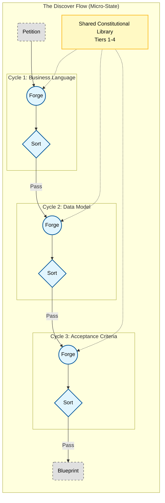

## The Foundry Flow: An Architectural Model for Governed Work

### Abstract

The Foundry Flow is the constitutional "micro-state" that makes governed work possible. It is the persistent architectural container that federates institutional Nodes (including a local Assay Node for Workitem deadlocks), orchestrates Workitems through reusable **Foundry Cycle** patterns (see *The Foundry Cycle*), and subscribes to the constitutional authority of the **`Governance Flow` (`G`)** (detailed in *The Governance Flow & Federation*), which is the primary governor of the `G(IDEAS)` stack. This paper defines the Flow: how it routes artefacts through a "Flow of Cycles," how it inherits law, and how it escalates petitions into the federated judiciary.

The canon is now four papers. *The G(IDEAS) Framework* sets the macro-strategy, *The Foundry Flow* (this document) defines the Flow architecture, *The Foundry Cycle* specifies the Cycle pattern, and *The Governance Flow & Federation* formalises governance and federation. Together they describe how strategic intent becomes governed execution.

### Executive Summary

A Foundry Flow is an autonomous jurisdictional component that owns topology, Nodes, and Workitems while subscribing to federated law. It is the architectural chassis that makes it possible to run one or more Foundry Cycle patterns within the same sovereign container.

**Deployment Modes:**
* **Atomic Mode:** A single Flow operates as a standalone team-level jurisdiction with only local Tier 1/2 law. No Governance Flow, no federation.
* **State Mode:** Multiple Flows compose together as a G(IDEAS) instance (G + IDEAS). The team owns the entire State, and individual Flows are architectural components within that jurisdiction. The State's Governance Flow manages Tier 3 law, and Tier 4 subscriptions (federation) are optional.

A Flow succeeds by mastering three concepts:

1.  **Flow as Micro-State:** The Flow defines the institutional topology (Forge, Quench, Appraise, Sort, Refine, a local Assay, and any specialty Nodes) and governs Workitems under the subscribed constitution. It manages local Tier 1/2 law, mints Tier 2 rulings via its local Assay Node, and contributes telemetry to the federated Friction Ledger.
2.  **Flow of Cycles Pattern:** A Flow may run a single Cycle or sequence multiple Cycle applications. Complex Flows (e.g., `Discover`) route a Workitem through successive Cycle patterns—"Govern Business Language," "Govern Data Model," "Govern Acceptance Criteria"—while maintaining one audit trail.
3.  **Subscribing to Governance:** When a Flow links to one or more *Federal `G(IDEAS)` Instances* (e.g., `Legal_Federation`, `Brand_Federation`) it agrees to two contracts: (a) read Tier 4 law from those federal namespaced Libraries and Tier 3 law from its own `State Governance Flow`, and (b) escalate constitutional disputes **after local Assay deliberation** by creating a petition Workitem on its `Governance Flow` or, when required, to the relevant Federal instance (see *The Governance Flow & Federation*).

This paper provides the Flow-level architectural model. *The G(IDEAS) Framework* declares why the federation exists, *The Foundry Cycle* teaches how to run each Cycle, and *The Governance Flow & Federation* details how the federated judiciary functions.

### Visual Architecture

This architecture is grounded in two external proof points. First, the AWS ARC neurosymbolic verifier reaches **99.2% soundness with 2.5% false positives and 92.6% precision**, rising to **100% soundness with 45.5% recall** after a light vetting loop [(Bayless et al., 2025)][1], validating our insistence on deterministic Quench Nodes for constitutional rules. Second, IBM’s Computer Using Generalist Agent (CUGA) achieved **61.7% success on WebArena** and **AppWorld task completion of 73.2% (normal) / 57.6% (challenge)** while enabling **~90% faster and ~50% cheaper** development in a BPO pilot [(Shlomov et al., 2025)][1], mirroring the productivity and audit targets of the Flow-of-Cycles chassis.

Broader ecosystem research on Governance-as-a-Service protocols and enterprise agentic toolchains mirrors the same Flow obligations, from sovereign-service contracts to shared retrievers [(Gaurav et al., 2025)][1] [(Gartner, 2025)][1] [(LangChain, 2024)][1]. The Flow’s deterministic Quench emphasis also reflects advances in neurosymbolic invariant inference that pair LLM creativity with bounded-model checking [(Wu et al., 2024b)][1].

#### Companion Executive Summaries

* **`The G(IDEAS) Framework` (The "Why"):** `G(IDEAS)` is the macro-architecture: `Ideate, Discover, Execute, Advance, Sustain`. Each stage is a Flow that uses the Foundry Flow/Cycle canon to turn intent into governed outcomes. `G(IDEAS)` defines the strategic value proposition and the portfolio of Flows.
* **`The Foundry Cycle` (The "How"):** The Cycle is the five-stage operational pattern (`Forge → Quench → Appraise → Sort → Refine`). *The Foundry Cycle* explains how each Node behaves, how feedback loops work, and how artefacts converge inside each Cycle application.
* **`The Governance Flow & Federation` (The "Meta"):** The Governance Flow is the dedicated legislative and judicial Flow. It owns the namespaced Tier 3/Tier 4 constitutions, operates the federated Assay Node, manages the Friction Ledger, and processes every petition submitted by subscriber Flows.

### The Constitutional Spine of the Foundry Flow

The Flow is a persistent jurisdiction. It defines topology (its graph of Nodes and routing), Workitem schemas, subscription namespaces, and the thresholds that make escalation predictable. Each Flow is sovereign over its Tier 1 Findings and Tier 2 Rulings (minted by its local Assay Node), but it subscribes to Tier 3/Tier 4 doctrine authored by the Governance Flow. It is a constitutional micro-state that persists regardless of current Workitem traffic.

### Constitutional Foundations

A Flow is federated by design:

* It **subscribes** to law: on initialization it ingests the relevant Tier 3 namespaces from its own `State Governance Flow` (e.g., `Tier 3 – Global`, `Tier 3 – Discover`) and the Tier 4 corpora published by subscribed Federal `G(IDEAS)` instances. These packages are immutable until their publishers release an update.
* It **manages** local precedent: Tier 1 and Tier 2 are mutable stores owned by the Flow. Nodes may contribute Findings or promote them to Rulings, but any constitutional change (Tier 3/4) must be petitioned to the Governance Flow or escalated to Federal publishers.
* It **evolves** local doctrine: The Flow operates as an **Active Sensor**, continuously monitoring citation rates via a `usage_counter` for every **Tier 1 Finding** in its local Library. When a Finding's usage exceeds the defined **Populus Threshold** (e.g., cited in 50 successful Workitems), the Flow automatically generates a **"Petition for Promotion"** Workitem and routes it to its own **Local Assay Node**. This ensures that "what works" (high-frequency patterns) is systematically reviewed for promotion to "what is binding" (Tier 2 Ruling).
* **Active Federation:** The Flow must keep an active heartbeat with its `Governance Flow` so its **Federation Certificate** stays valid. Falling out of sync downgrades the Flow to "offline," preventing it from routing or receiving petitions.
* It **participates** in the federated Friction Ledger: every Node writes friction telemetry (node passes, token usage, escalation cost) that the Governance Flow aggregates. The Flow can view its local slice; the Governance Flow views the federation.

#### Federation Connectivity

**Quarantine vs. Kill Switch:** We **Quarantine** disconnected Flows. Without a valid Certificate, other Flows (Legal, Finance, etc.) will cryptographically reject their petitions. The federation simply ceases to acknowledge their traffic until the handshake is restored, meaning the Flow can continue operating locally but remains an island until it re-establishes heartbeat and proves identity.

### Constitutional Domains: Workitems, Library, and Nodes

The Flow has three inseparable domains:

* **Workitems (the governed artefacts):** Workitems represent artefacts under construction. They carry current state, topology metadata, audit logs, and attachments. A Flow defines the schemas and state transitions and keeps them governed rather than changing them ad hoc; Workitems are the primary evidence of compliance.

* **The Library (the source of law):** The Library exposed to a Flow is a composition of three strata: the Flow's mutable Tier 1/2 layers, its *local* Governance Flow's Tier 3 packages, and all subscribed Tier 4 packages pulled from Federal `G(IDEAS)` instances. Nodes read the combined view. Tier 1/2 entries are mutable by the Flow (subject to decay rules), Tier 3 entries are mutable by the State `Governance Flow`, and Tier 4 entries are read-only snapshots owned by their Federal sources.

* **Nodes (the institutional enforcers):** Nodes are persistent institutions within the Flow. They operationalise doctrine by invoking Agents, transforming artefacts, annotating Workitems, and emitting routing instructions. Nodes strictly petition the Governance Flow for all constitutional amendments. When law is insufficient they create a petition Workitem for the Governance Flow.

This separation keeps the system legible. The Workitem is the subject, the Library is the law, and the Nodes are the machinery that enforces it.

#### Nodes: Role-Based Agents with Contracts

Nodes are role-based institutional agents that execute work under contract. They hold specific roles (e.g., `security-reviewer`, `legal-reviewer`) and declare which WorkItemTypes they can process.

**What Nodes Are:**

* **Role Holders:** Each Node is assigned a role that defines its authority to stamp artefacts and participate in governance validation
* **Contract Executors:** Nodes declare which WorkItemTypes and phases they can handle, creating a contract-based capability model
* **Law-Aware Processors:** Nodes query the Library before execution (context seeding) to ensure constitutional compliance from the start
* **Evidence Generators:** Nodes create an investigative trail through structured justifications (citations vs. novel arguments)

**What Nodes Do:**

* Query applicable laws via `knowledge.laws.findByLabel()` before processing (context seeding)
* Read artefacts and previous feedback on a Workitem
* Mutate artefacts (create, modify, or restructure them)
* Add or update feedback annotations on a Workitem
* Stamp artefacts with role-based authority (not identity-based)
* Write to the Workitem's audit log and friction telemetry
* Resolve feedback using either citations or novel arguments (forced choice for investigative tracking)
* Create petitions (new Workitems) for the Governance Flow when constitutional clarification or amendment is required
* Emit routing instructions (node-based, phase-based, or terminal completion)

**Constitutional Constraints:**

Nodes are restricted to authoring Findings (Tier 1) and Rulings (Tier 2). Tier 3/4 authority is reserved for the Governance Flow. Specifically, Nodes:

* Must petition the Governance Flow for all constitutional amendments
* Cannot alter Flow topology without architectural change control
* Must respect the federation agreement when constitutional issues arise
* Must provide structured justifications when rejecting feedback (citation or novel argument)

**Nodes and Agents:**

Nodes may invoke AI Agents (LLMs, symbolic checkers, domain-specific models) to perform interpretive labour. Agents submit proposals to the Node, which retains sole authority to commit changes to the Workitem or Library. They operate under the Node's authority, and the Node is accountable for every mutation.

**Phase-Gated Routing: Contract-Based Transitions**

A Node's final responsibility is to declare the Workitem's next state. The Flow Operator validates routing instructions against the WorkItemType contract.

The contract supports three patterns:
*   **Explicit Node Routing:** `Result.routeTo("node-name")` routes to a specific node. The target must exist and the node must have routing capabilities.
*   **Phase Transition:** `Result.transitionTo("phase-name")` requests transition to a new phase. The Operator validates this against `WorkItemType.phases[].allowedTransitions`, checks phase requirements (artefacts + validity levels), and selects an appropriate node that handles the target phase.
*   **Terminal Completion:** `Result.complete()` signals work is done. The Terminal Guard validates contract satisfaction (required artefacts exist at required validity levels with stamps from required roles).

This mechanism validates transitions against contracts rather than topology, making routing decisions based on "what phase is next?" instead of "who is next?"

**The Assay Node: Investigative Judiciary**

The Assay Node is a **System Peer**—a built-in judicial service that operates in the Pull Model.

*   **Privilege:** It runs with a privileged Service Account that grants it direct write access to the Kubernetes API, allowing it to mint `Tier 2 Rulings` and `Tier 3 Statutes` without using the standard Node SDK.
*   **Invocation:** A routing-based deadlock occurs when a Node cannot proceed and routes the Workitem to a phase requiring judicial review. The Node writes an `assayBrief` explaining the deadlock. The Operator routes the Workitem to the assay node.
*   **Investigation:** The Assay Node reads the `assayBrief`, then pulls full evidence via the Knowledge Client: `knowledge.workitem.getStatus()`, `knowledge.laws.findByLabel()`. It examines the investigative history (citations, novel arguments, feedback patterns).
*   **Resolution:** The Assay Node deliberates (potentially using a multi-agent jury), mints its verdict directly to the Library as a `Law` CRD, and routes the Workitem back via Provenance-Based Routing (scanning the Guestbook for the last valid author).

**Node Examples:**

* **Forge** queries laws via context seeding and constructs initial artefacts with constitutional compliance.
* **Quench** enforces objective, deterministic constraints and stamps artefacts with specific roles.
* **Appraise** interprets doctrine and annotates artefacts with subjective feedback.
* **Refine** reconciles artefacts with feedback using forced choice (citation or novel argument).
* **Sort** acts as a Phase Guard, attempting phase transitions based on WorkItemType contracts.

Each Node is persistent and may participate in multiple phase patterns. Flows may define additional Nodes for specialised work (e.g., telemetry ingestion, dependency scanning) so long as they follow the same constitutional contract.

#### Acknowledged Architectural Trade-offs

* **Federation (Cost: Latency):** Subscribing to Tier 3/4 packages couples the Flow to the Governance Flow's release cadence. Updates are mandatory; the Flow must absorb them even when inconvenient.
* **Escalation (Cost: Tokens + Time):** Creating petitions for the Governance Flow consumes AI budget and human review time. Escalation thresholds must therefore be explicit, observable, and justified by risk.
* **Library Inheritance (Cost: Retrieval):** As the subscribed corpus grows, retrieval strategy becomes critical. Architects must invest in embeddings, indices, and caching to keep Node prompts performant.

### The Architectural Model: Workitems, Flows, Cycles, and Federations

The architecture unfolds at three layers:

1.  **Workitem-Level (Cycle Invocation):** Each Cycle application is a prescribed order of Node invocations (`Forge → Quench → Appraise → Sort → Refine`). *The Foundry Cycle* describes this loop in depth. In this paper we reference the Cycle as a reusable pattern that a Flow applies to a Workitem objective.
2.  **Flow-Level (Topology and Governance):** The Flow defines which Nodes exist, how they are connected, what Workitem states exist, and which Cycle patterns are available. It centralises Tier 1/2 law, subscribes to Tier 3/4 law, and ensures every Node interaction is logged.
3.  **The Flow of Cycles Pattern:** A Flow may orchestrate one or many Cycle applications for a single Workitem. Simple Flows (e.g., a "Generate Release Notes" Flow) may apply one Cycle and exit. Complex Flows (e.g., the `Discover` Flow from *The G(IDEAS) Framework*) implement a "Flow of Cycles":
    * **Cycle 1 – Govern Business Language:** Forge interprets the Petition, Quench validates structure, Appraise reviews narrative quality, Sort either routes to Refine or escalates to Governance if business doctrine conflicts arise.
    * **Cycle 2 – Govern Data Model:** The same Workitem (now enriched) enters a second Cycle dedicated to domain modeling. Findings from Cycle 1 remain attached; Tier 1/2 law is shared.
    * **Cycle 3 – Govern Acceptance Criteria:** A third Cycle validates executable specifications. Refine reconciles all prior feedback. If contradictions persist, the Workitem is marked `Deadlocked` and routed to the **local Assay Node** for deliberation, per the two-tier judiciary model.

    The Flow orchestrates this sequence as one auditable journey. Every Cycle writes to the same Workitem, meaning a single ledger captures the entire discovery effort. This "Flow of Cycles" pattern lets one Flow govern multi-artefact deliverables without creating new governance silos.

Crucially, all Cycle applications inside a Flow share the same subscribed Library snapshot and the same escalation pathway: petitions to the Governance Flow.

### Key Architectural Roles (Human Authorities)

These roles are **functional authorities**, not heroic individuals. Production deployments staff each authority with a team, rotation, or committee that advertises availability, operates via queues, and upholds service objectives for adjudicating petitions.

* **The Inspectorate (Flow Ownership):** The policy authority for the Flow. This team authors Tier 2 rulings, calibrates thresholds (loop counters, severity baselines, escalation triggers), tunes Flow topology, and ensures petitions are filed when constitutional ambiguity is detected. The Inspectorate owns Friction Ledger interpretation (e.g., deciding that 15% friction is acceptable for Safety work) and decides when to propose Tier 3 amendments via the Governance Flow. They define the Workitem's "review topology," such as configuring a two-stage `Appraise > Sort` gauntlet to balance token cost against human friction.
* **The Platform Architects (Federated Implementation):** The engineering authority responsible for the plumbing of the Flow. They maintain state machines, storage, retrieval reliability, observability, and the integration hooks to the Governance Flow (subscription refresh, petition creation, ledger streaming). They ensure the "courthouse" stays operational; the Inspectorate decides what happens inside it.
* **The Central Legislature (Federal Authorities):** The cross-functional bodies (e.g., Global Security Council, Brand Standards Committee) that operate the Federal `G(IDEAS)` instances. They publish Tier 4 law, adjudicate escalations, and act as the sovereign law suppliers for every subscribing Flow.

### Subscribing to Governance

When a Flow links to `G(IDEAS)` it accepts a two-way contract.

#### 1. Subscribing to Law

* **Namespace Selection:** The Flow declares which Tier 3 namespaces apply (e.g., `Global`, `Discover`, `Execute`).
* **Synchronization:** On startup and on every release, the Flow pulls the relevant packages and freezes them as read-only snapshots referenced by Node prompts and Workitem metadata.
* **Provenance Tracking:** Every Workitem stores the hash/version of the subscribed packages so audits can prove which doctrine governed the artefact.

#### 2. Delegating Justice

* **Escalation Invocation:** After local Assay deliberation determines a Tier 3/4 issue, Sort (or any Node) emits an `Escalate` instruction. The Flow packages evidence and posts a petition Workitem to the Governance Flow.
* **Bidirectional Feedback:** The Governance Flow responds with rulings, amendments, or remands. Subscriber Flows must ingest these outcomes, update Tier 1/2 doctrine, and adjust topology if necessary.
* **Ledger Contribution:** Flows continuously stream friction telemetry to the Governance Flow so that constitutional cost can be measured before and after amendments.

### Architectural Prerequisites

#### **The Workitem Lifecycle**

The Workitem is a persistent container that holds the artefact. While its *location* (Current Node) changes constantly based on routing instructions, its *lifecycle state* is managed strictly by the Flow Operator to ensure completion.

* **`Pending`**: The Workitem has been created but has not yet been picked up by the Operator.
* **`Running`**: The Workitem is active. It has been assigned to a Node, and the Flow Operator is waiting for a routing instruction or a timeout.
* **`Succeeded`**: The Workitem has reached a Terminal Node (returned `null`), AND the Operator has verified that its inventory matches the `FoundryFlow` manifest.
* **`Failed`**: The Workitem has failed for one of several reasons: it has reached `maxAttempts` (Thrash Guard); a Node has signaled a fatal system error; or it has reached a Terminal Node, but its inventory does not match the `FoundryFlow` manifest (e.g., missing or unstamped `outputArtefacts`).

#### Inter-Flow Dispute Resolution

Tier 3/4 meaning is mediated through the Governance Flow, which serves as the canonical interpreter for every subscriber Flow. Ambiguity is logged locally and escalated via petition to the Governance Flow. The federation's constitutional registry (*The Governance Flow & Federation*) records clarifications so every subscribing Flow inherits the same interpretation.

#### Severity Classification Principles

Severity drives cost. The Chief Inspector defines severity schema and the routing logic (e.g., "SEVERE findings skip extra loops and go straight to escalation"). The Governance Flow expects severity metadata in every petition so it can prioritise the docket.

#### Feedback Rejection Protocol

Appraise Nodes may reject `Refine` justifications, but rejection criteria must cite a subscribed law (Tier 3/4) or a local Tier 2 ruling. Rejections that repeatedly hit loop counters trigger automatic routing to the **local Assay Node** to resolve the deadlock judicially.

### Conclusion: The Flow as Constitutional Chassis

The Foundry Flow is the architectural chassis that lets organizations run governed work. It owns topology, Nodes, and Workitems; subscribes to federated law; and routes artefacts through one or many Foundry Cycle applications. By delegating constitutional authority to the `G(IDEAS)` Governance Flow, it keeps local teams focused on execution while ensuring the canon (*The G(IDEAS) Framework*, *The Foundry Flow*, *The Foundry Cycle*, *The Governance Flow & Federation*) functions as a cohesive system: strategy (`G(IDEAS)`) defines intent, Flow architecture (this paper) operationalises it, Cycle mechanics (*The Foundry Cycle*) perform the work, and governance (*The Governance Flow & Federation*) keeps the republic honest.

### References

* Gaurav, S., Heikkonen, J., & Chaudhary, J. (2025). *Governance-as-a-Service (GaaS): A Governance Protocol for Multi-Agent Systems*. arXiv:2508.18765.
* Bayless, S., et al. (2025). *A Neurosymbolic Approach to Natural Language Formalization and Verification (ARC)*. arXiv:2511.09008v1. Demonstrates 99.2% soundness at 2.5% FPR (92.6% precision) with redundant SMT-LIB verification, rising to 100% soundness/45.5% recall after human vetting.
* Gartner. (2025). Cited in Kanerika (2025). *LangChain vs LangGraph*.
* LangChain. (2024). *LangGraph Documentation*.
* Shlomov, S., et al. (2025). *From Benchmarks to Business Impact: Deploying IBM Generalist Agent in Enterprise Production (CUGA)*. arXiv:2510.23856v1. Reports 61.7% WebArena success and AppWorld task completion of 73.2% (normal) / 57.6% (challenge), with ~90% development-time and ~50% cost reductions in a BPO pilot.
* Wu, G., et al. (2024b). *LLM Meets Bounded Model Checking: Neuro-symbolic Loop Invariant Inference*. IEEE/ACM International Conference on Automated Software Engineering.

[1]: #references
