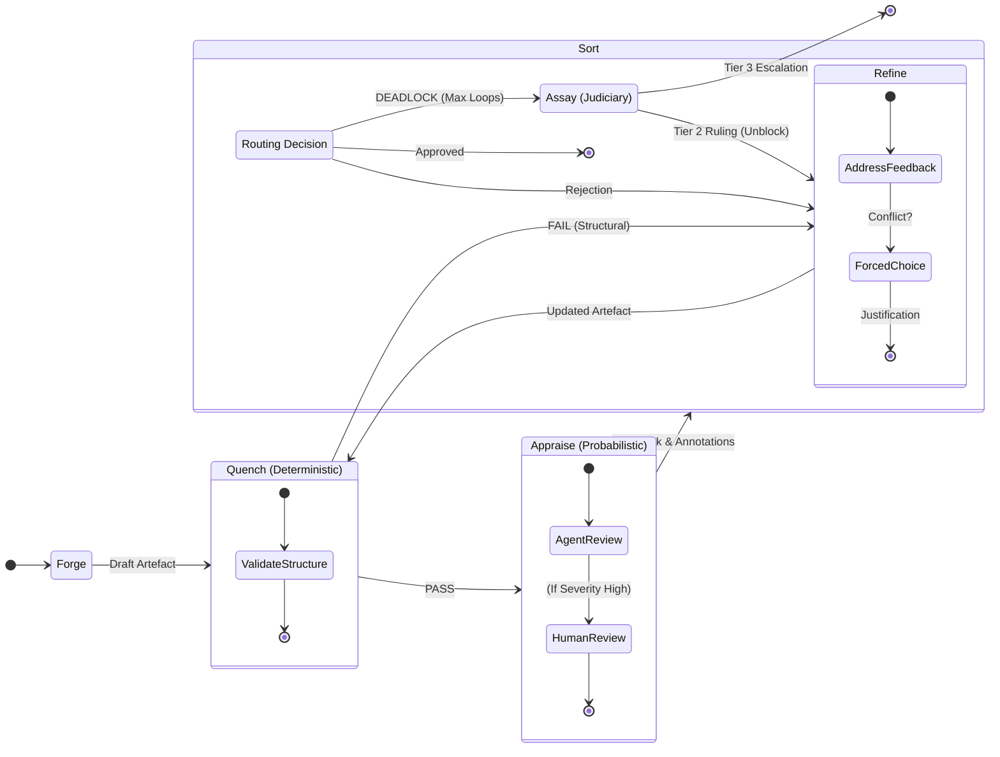

## The Foundry Cycle: Tactical Engine for Governed Work

### Abstract

This document details the **Foundry Cycle**: the core, five-stage adversarial pattern (**Forge, Quench, Appraise, Sort, Refine**) that serves as the tactical engine for all governed work. The Cycle is a reusable pattern applied by a `Foundry Flow` (see *The Foundry Flow*) to a `Workitem`, forcing it to converge with the `Library` (see *The Governance Flow & Federation*) through iterative review and auditable feedback. This paper is a tactical guide for developers and `Human Architects` responsible for implementing the Nodes of this loop.

### Executive Summary

The Foundry Cycle is the tactical, 5-stage loop that executes governed work. Its job is to force an unreliable agent (human or AI) to produce an artefact that is provably compliant with a codified constitution. It does this by creating a "gauntlet" of institutional nodes. `Forge` creates the work, `Quench` (optional) checks objective facts, `Appraise` conducts subjective review, `Sort` acts as the routing gate, and `Refine` processes the feedback. This loop is the fundamental "atom" of work, detailed in this paper. It is applied inside a `Foundry Flow` (see *The Foundry Flow*), which is governed by the `G(IDEAS)` `Flow` (see *The Governance Flow & Federation*) to achieve the strategic goals of `G(IDEAS)` (see *The G(IDEAS) Framework*). Enterprise deployments such as IBM’s CUGA program show how this gauntlet compresses rework and risk [(Shlomov et al., 2025)][1].

Recent tactical research on reinforcement learning via symbolic feedback and reasoning-tool productionization underscores the need for this deterministic gauntlet [(Jha et al., 2024)][1] [(Bembenek, 2025)][1].

#### Companion Executive Summaries

* **`The G(IDEAS) Framework` (The "Why"):** `G(IDEAS)` is the macro-architecture: `Ideate, Discover, Execute, Advance, Sustain`. Each stage is a Flow that uses the Foundry Flow/Cycle canon to turn intent into governed outcomes. `G(IDEAS)` defines the strategic value proposition and the portfolio of Flows.
* **`The Foundry Flow` (The "What"):** The Flow is the architectural container that owns Nodes and Workitems, orchestrates one or more Cycle applications, and subscribes to federated law from `G(IDEAS)`.
* **`The Governance Flow & Federation` (The "Meta"):** The Governance Flow runs the federated judiciary and namespaced constitutions (Tier 3/4), manages the federated Assay Node, and aggregates the Friction Ledger across subscriber Flows.

### Visual Architecture

## The Foundry Cycle Pattern (The 5 Stages)

The Cycle pattern is a prescribed sequence of Node invocations applied to each Workitem application within a Flow. It forces feedback, surfaces doctrinal conflicts, and converges on explicitly codified compliance rather than abstract truth.

#### 1. Forge Node

The Forge Node constructs the initial artefact using **context seeding** to ensure constitutional compliance from the start. Before generation, the Node queries applicable laws via `knowledge.laws.findByLabel()` to load the relevant constitutional rules into context. This eliminates the "blind node" problem where generators produce work without knowing the rules they must follow.

The Node reads the Workitem's specification and the Flow's configured context requirements to understand what must be seeded. It fetches laws, templates, and schemas using label-based queries (deterministic, no fuzzy search), then builds a prompt that includes these constitutional constraints as non-negotiable requirements.

The Agent processes this **retrieved context window** and generates the artefact within constitutional bounds. The Node itself writes the result to the Workitem and cites every law consulted via `this.cite(lawId)` for friction tracking.

This context seeding approach ensures:
* Higher success rates during validation (fewer rejections from Quench/Appraise)
* Reduced LLM token waste on non-compliant outputs
* Lower friction accumulation from repeated failures
* Auditable law usage via the Friction Ledger

#### 2. Quench Node (Optional)

The Quench Node performs deterministic verification. Its primary purpose is to protect the more expensive, interpretive Appraise Node from processing artefacts that are fundamentally broken. It enforces the bare minimum structural and technical requirements for an artefact to be considered viable for subjective appraisal.

* For a "Write Code" application of the Cycle pattern, a Human Architect might configure Quench Node logic to enforce compilation and structural integrity.
* For a "Write Docs" application, the Quench Node logic enforces formatting, link validity, and orthographic constraints.

The Quench Node is a pattern; a common pre-fab implementation is the **ConstitutionQuenchNode**. This node applies the **Answer Verifier (AV)** pattern [(Bayless et al., 2025)][1], querying the `Flow`'s Library for applicable SMT-LIB clauses, loading them into a symbolic solver, and returning a cheap, mathematically provable `Valid` or `Invalid` finding.
This Quench pattern is recursive. In the Architectural Flow (Paper 5), this same logic is used to lint the Flow topology itself against the Governance Recipes.

The AWS ARC implementation of this AV pattern demonstrates the reliability bar we target: **99.2% soundness with a 2.5% false-positive rate and 92.6% precision** at its strict redundant-formalization setting, and **100% soundness with 45.5% recall** after a short human vetting loop [(Bayless et al., 2025)][1]. That empirical profile justifies making Quench the deterministic gate for Tier 3/4 law in high-risk Flows.

This pattern is recursive. The same Quench logic that validates artefact structure in an Operational Cycle also validates **Flow topology** inside the Architectural Flow (Paper 5), where it lint-compiles entire Node graphs against Tier 4 architectural meta-law before letting them ship.

This Node is also the appropriate place for deterministic enforcement of Constitutional rules. While a Tier 4 law like "No PII" will be subjectively checked by the Appraise Node, a competent architect will also include objective pattern matching in Quench to catch violations cheaply, mirroring neurosymbolic invariant inference research [(Wu et al., 2024b)][1].

This Node is optional; creative Workitem objectives (e.g., "ideate a feature") proceed directly to subjective review.

* **Pass:** The artefact is structurally sound. The Quench Node annotates the Workitem and routes it to the Appraise Node for subjective review.
* **Fail:** The artefact is objectively non-compliant (e.g., structural integrity failure, pattern match violation). The Quench Node annotates the Workitem with SEVERE feedback and routes it directly to the Refine Node, bypassing Appraise.

#### 3. Appraise Node

The Appraise Node conducts subjective review and is the second point of implementation for the Chief Inspector. Where Quench was objective enforcement, Appraise is interpretive annotation. This Node orchestrates a multi-perspective review and, for complex subjective work, often *stages* that review into a topology: an initial "Machine Gauntlet" of AI specialist Agents followed by a "Human Tribunal" of human-as-Agent reviewers after machine-level feedback is resolved.

Crucially, this is a conflict-finding Node, built to contain scheming behaviors and unreliable evaluators observed in recent LLM deployments [(Meinke et al., 2024)][1] [(Schroeder & Wood-Doughty, 2024)][1].

**Architectural Note:** Unlike the `Quench Node`, which is deterministic, the `Appraise Node` is **probabilistic**. It functions as a **Probabilistic Feedback Generator**, surfacing likely conflicts for downstream resolution. It is designed to be fallible but efficient, serving as a noise-reduction filter for the downstream Human Sort gate.

The Chief Inspector architects the Appraise Node to invoke a panel of specialist Agents (e.g., "Legal," "Brand," "Customer-Value"). These Agents are deliberately given scoped context—a minimal prompt defining their specialized jurisdiction (e.g., "Assess adherence to brand voice") and only the artefact segments required.

Each Agent consults relevant laws and Findings from the Library as its non-negotiable framework. Agents work with scoped views of the artefact and leave cross-domain conflict resolution to downstream nodes.

Each Agent provides two forms of non-authoritative analysis to the Appraise Node:

1.  **Audit Past Feedback:** They evaluate any relevant feedback from the *previous* loop that the `Refine Node` marked as `'actioned'` or `'wont-fix'`, recommending either `'approval'` or `'rejection'` of the change/justification.
2.  **Generate New Feedback:** Based on their narrow, surgical focus, they analyze the current state of the artefact for any new violations from their perspective.

The Appraise Node may then invoke a consolidation Agent (a "clerk") which produces an aggregated report of all new and rejected feedback from all specialists. The Appraise Node reads this report, de-duplicates and formats it into a single, canonical list, then writes this list to the Workitem. This list intentionally preserves contradictions. Surfacing these policy conflicts for the Refine Node (or, ultimately, the Assay Node) is the purpose of this Node.

#### 4. Sort Node

The Sort Node functions as the **Routing Gate** of the Cycle pattern. It reads the Workitem's state and decides whether to advance the work, loop back for refinement, or escalate to the judiciary.

**Routing Logic:**

The Sort Node examines the Workitem state and makes routing decisions via named outputs:
1. Checks feedback state - are there unresolved (`pending`) feedback items?
2. Checks thrash count - has this node been visited too many times (deadlock detection)?
3. Optionally validates artefacts via `ValidateArtefact()` SDK call to check passport stamps
4. Routes via `RouteToOutput()` to one of its configured outputs:
   - `"pass"` → Advance to next node in the cycle (e.g., Appraise, or Terminal)
   - `"fail"` → Loop back to Refine for more work
   - `"deadlock"` → Escalate to Assay Node with `assayBrief`

The Node drives the routing decision. The Operator resolves targets from the Node's `outputs` configuration and selects a ready replica.

**The Cascading Defense (Swiss Cheese Model):**

For high-stakes Workitems, the Cycle topology is configured as a cascading defense, strictly separating deterministic, probabilistic, and authoritative gates:

1.  **Gate 1: Deterministic (The Wall):** `Quench > Sort`. The Workitem must pass objective, mathematical verification [(Bayless et al., 2025)][1]. Failure here routes immediately to `Refine`.
2.  **Gate 2: Probabilistic (The Filter):** `Appraise (AI) > Sort`. The Workitem is reviewed by AI Agents for subjective quality. This operates as a **Heuristic Filter** designed to preserve expensive human attention for structurally sound artefacts. It catches "cheap" errors [(Raina et al., 2024)][1].
3.  **Gate 3: Authoritative (The Judge):** `Appraise (Human) > Sort`. Only if the Workitem passes both prior gates does it reach the Human. This "Swiss Cheese" model ensures the expensive Human Judge only reviews work that is structurally sound and ostensibly compliant.

**Deadlock Detection:**

If the Sort Node detects a maximum rework threshold (e.g., visited the same node 5 times via the `guestbook` counter) or encounters unresolvable feedback, it writes an `assayBrief` and routes to the Assay Node for judicial investigation via `RouteToOutput("deadlock")`.

It is the Chief Inspector's responsibility to define the logic each Sort Node uses for routing decisions. This logic defines cost, speed, and risk profile.

#### 5. Refine Node

The Refine Node is the primary workhorse participating in the Cycle pattern, where the artefact is iteratively transformed and **investigative history** is created through forced-choice justifications.

The Refine Node reads the consolidated, potentially contradictory list of feedback from the Appraise Node. Its sole purpose is to **generate a new version of the artefact** that addresses this feedback, using the Library as its guide. The Node may invoke Agents to assist, but the Node itself writes the updated artefact and feedback annotations to the Workitem.

The Node (via its invoked Agents) loops through the feedback list, attempting to implement each item and marking it as **`'actioned'`**.

**The Forced Choice Mechanism (Investigative History Creation):**

When the Node encounters *contradictory* feedback (e.g., `[LEGAL: "Delete this"]` and `[BRAND: "Make this bold"]`), it is **architecturally forced to make a choice.** This forced choice creates an investigative trail that the Judiciary can later examine:

1.  It implements one feedback item (e.g., `[LEGAL]`), changing its state to **`'actioned'`**.
2.  It *refuses* the contradictory item (e.g., `[BRAND]`), changing its state to **`'wont-fix'`**.
3.  This **`'wont-fix'`** state **must** be accompanied by a **structured justification** via `resolveFeedback()`. This justification takes one of two forms:
    * **Citation (Established Doctrine):** Citing existing Library entries (e.g., `citation_ids: ["tier4-legal-01", "f-105"]`). The Node queries `knowledge.laws.findByLabel()` to find applicable law, then cites it. This signals the conflict is governed by existing doctrine.
    * **Novel Argument (Emerging Doctrine):** Proposing a new reason (e.g., `novel_argument: "Refused because this pattern reduces readability in regulatory contexts"`). This signals a gap in constitutional coverage—no existing law addresses this situation.

**Why This Matters (The Investigative Pull Model):**

The forced-choice structure creates an investigative history that the Judiciary examines when deadlocks escalate:

* **Citations:** Track which laws are being applied and how frequently. Patterns of citations signal active doctrine. High citation rates trigger promotion thresholds.
* **Novel Arguments:** Signal constitutional gaps. When the same novel argument appears repeatedly across Workitems, it indicates missing law. The Assay Node examines this pattern to decide if new law is warranted.
* **Friction Attribution:** The Friction Ledger correlates justification types with deadlock rates. Flows with high novel-argument rates have governance gaps; Flows with high citation rates have complex but well-defined law.

This process repeats until **all feedback items have been marked as either `'actioned'` or `'wont-fix'`**. The Refine Node writes the updated artefact and the completed feedback report to the Workitem, then routes it back to a Sort Node for phase transition validation.

The structured justification is the "case file" that makes invisible conflicts visible, auditable, and escalatable. When the Assay Node investigates a deadlock, it pulls this history via `knowledge.workitem.getStatus()` and examines the pattern of citations vs. novel arguments to determine if new law is needed or the feedback is invalid.

### References

* Bayless, S., et al. (2025). *A Neurosymbolic Approach to Natural Language Formalization and Verification (ARC)*. arXiv:2511.09008v1. Demonstrates 99.2% soundness at 2.5% FPR (92.6% precision) with redundant SMT-LIB verification, rising to 100% soundness/45.5% recall after human vetting.
* Jha, P., Jana, P., Suresh, P., Arora, A., & Ganesh, V. (2024). *RLSF: Reinforcement Learning via Symbolic Feedback*. arXiv:2405.16661.
* Bembenek, A. (2025). *Current Practices for Building LLM-Powered Reasoning Tools Are Ad Hoc – and We Can Do Better*. arXiv:2507.05886.
* Meinke, A., Schoen, B., Scheurer, J., Balesni, M., Shah, R., & Hobbhahn, M. (2024). *Frontier Models are Capable of In-context Scheming*. arXiv:2412.04984.
* Raina, V., Liusie, A., & Gales, M. (2024). *Is LLM-as-a-Judge Robust? Investigating Universal Adversarial Attacks on Zero-shot LLM Assessment*. arXiv:2402.14016.
* Schroeder, S., & Wood-Doughty, M. (2024). *Can You Trust LLM Judgments? Reliability of LLM-as-a-Judge*. arXiv:2412.12509.
* Shlomov, S., et al. (2025). *From Benchmarks to Business Impact: Deploying IBM Generalist Agent in Enterprise Production (CUGA)*. arXiv:2510.23856v1. Reports 61.7% WebArena success and AppWorld task completion of 73.2% (normal) / 57.6% (challenge), with ~90% development-time and ~50% cost reductions in a BPO pilot.
* Wu, G., et al. (2024b). *LLM Meets Bounded Model Checking: Neuro-symbolic Loop Invariant Inference*. IEEE/ACM International Conference on Automated Software Engineering.

[1]: #references
