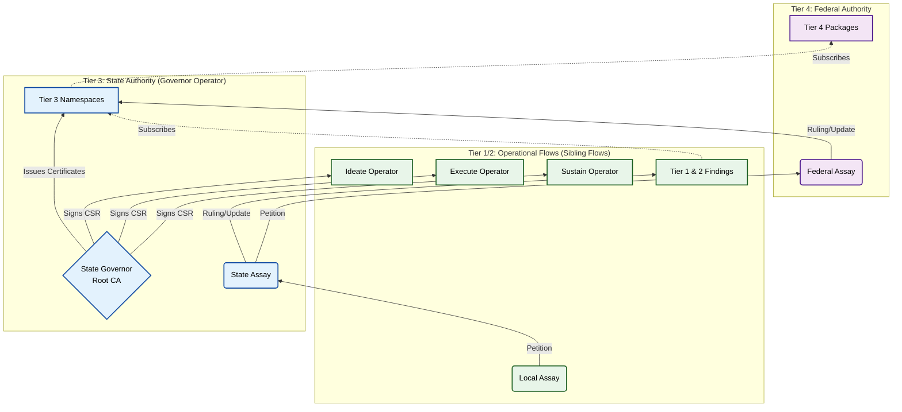

## The Governance Flow & Federation

### Abstract

This document details the `G` component of the `G(IDEAS)` framework: the single, federated `Governance Flow` that wraps the operational `(IDEAS)` flows. Policy owners run **Federal `G(IDEAS)` instances** that exist to draft, formalize, and publish `Tier 4` law. **Operational Flows** run a single State `Governance Flow` (their `G`) to create `Tier 3` law and integrate subscribed `Tier 4` packages. This paper defines how these layers compose a constitutional Library, how judicial escalation crosses State and Federal boundaries, and how the Friction Ledger exposes the economic cost of doctrine.

### Executive Summary

The governance canon now runs as a *federation of federations*:

1.  **Federal `G(IDEAS)` Instances:** Full `G(IDEAS)` stacks owned by central policy teams (Legal, Brand, Security) that execute the five-stage pattern to author, auto-formalize, and ratify `Tier 4` law before publishing it as namespaced packages.
2.  **State `Governance Flows`:** The single `Flow` inside each Operational Flow that legislates `Tier 3` doctrine and integrates incoming `Tier 4` law into the local Library.
3.  **Escalation Path:** Workitems deadlock up the chain: `local Assay` → `State Governance Flow` HITL → petition to the relevant `Federal G(IDEAS) Instance`. Returned rulings become updated `Tier 3` or `Tier 4` packages that every subscriber consumes.

This paper defines the Library sources, the judiciary choreography, and the friction accounting that hold the federation together. It complements the strategic framework (*The G(IDEAS) Framework*), the Flow container (*The Foundry Flow*), and the Cycle mechanics (*The Foundry Cycle*).

This multi-tier design mirrors findings from Governance-as-a-Service protocols and BPM research that emphasize federated oversight cells [(Gaurav et al., 2025)][1] [(Rosemann et al., 2024)][1] [(van Dun et al., 2023)][1] and directly addresses the AI governance priorities outlined by safety research [(Russell et al., 2015)][1].
The governance design is informed by empirical results. The AWS ARC neurosymbolic verifier achieves **99.2% soundness with a 2.5% false-positive rate and 92.6% precision**, rising to **100% soundness with 45.5% recall** after light human vetting [(Bayless et al., 2025)][1], demonstrating that PMC/AV pipelines can meet constitutional assurance targets. IBM’s Computer Using Generalist Agent (CUGA) couples similar auditability demands with **61.7% WebArena success** and **AppWorld task completion of 73.2% (normal) / 57.6% (challenge)**, while delivering **~90% faster and ~50% cheaper** development in a BPO pilot [(Shlomov et al., 2025)][1]. Those results motivate the federation’s emphasis on deterministic verification, provenance, and reusable legislative packages.

#### Companion Executive Summaries

* **`The G(IDEAS) Framework` (The "Why"):** `G(IDEAS)` is the macro-architecture: `Ideate, Discover, Execute, Advance, Sustain`. Each stage is a `Flow` that uses the Foundry canon to turn strategic intent into a governed outcome.
* **`The Foundry Flow` (The "What"):** The `Flow` is the architectural container—the "micro-state"—that owns `Nodes` and `Workitems`, orchestrates one or more `Foundry Cycle` patterns, and subscribes to this `Governance Flow` for its law.
* **`The Foundry Cycle` (The "How"):** The `Cycle` is the tactical, five-stage operational pattern (`Forge → Quench → Appraise → Sort → Refine`) that performs the actual, auditable work on an artefact.

### Visual Architecture



**Key Architectural Pattern: Hub-and-Spoke Trust**

The State Governor Operator sits at the center of the trust hierarchy:
* **Hub:** The Governor is the Root CA (self-signed certificate)
* **Spokes:** Sibling Flow Operators (Ideate, Execute, Sustain, etc.) are Intermediate CAs
* **Transitive Trust:** Any Sibling can validate cryptographic stamps from any other Sibling by traversing the chain to the shared State Root
* **Zero Peer Relationships:** Siblings never communicate directly for trust establishment - all trust flows through the Governor

This eliminates the N² scaling problem of peer-to-peer certificate exchange and enables dynamic addition of new Operational Flows without reconfiguring existing ones.

---

### The Foundation: The Four-Tiered Legal Library

The Library is still a closed constitutional loop, but its jurisdiction is now explicit. Operational `Flows` own the ephemeral half of the canon (Tiers 1 and 2). Each operational `G(IDEAS)` instance runs a **State `Governance Flow`** that stewards `Tier 3` and subscribes to namespaced `Tier 4` packages published by **Federal `G(IDEAS)` instances**.

#### Tier 1: "Finding" (Local Common Law)

* **Source:** The local `Forge` and `Refine` Nodes.
* **Mechanism:** Starts at a configurable relevance score. It has two possible futures:
    1.  **Decay:** The score decays at a configurable rate every time a `Workitem` completes without citing it. If it hits zero, it vanishes.
*   **Promotion (The "Populus Threshold"):** The Flow tracks a `citation_count` for every Finding. If a Finding is successfully cited by Nodes more than `X` times (the "Populus Threshold"), it triggers an automatic **"Petition for Promotion."** Citations from the Assay Node (Verdicts) are excluded from this count, as its Rulings are born as Tier 2.
* **The Promotion Tribunal:** The petition is routed to the **Local Assay Node**. The Assay Node reviews the Finding's usage history and renders a verdict:
    * **Enshrine:** The Finding is formalised by the Clerk and minted as a **Tier 2 Ruling** (Case Law).
    * **Remand:** The Finding is rejected as "bad habit, not law." Its `citation_count` is reset to zero, and it is tagged with a cooldown period to prevent immediate re-petitioning.
* **Function:** "Popular wisdom" scoped to a single `Flow`. It either proves its worth and ascends, or it decays and disappears.

#### Tier 2: "Ruling" (Local Case Law)

* **Source:** The **local Assay Node**.
    * **Voting Mechanism:** The Node (composed of a jury of Agents) arrives at a verdict via dynamic thresholds based on risk profile. **SEVERE** impact issues require **Unanimity** among the jury; **LOW** or **MEDIUM** impact issues require a **Simple Majority**.
* **Deadlock Resolution:** In the event of a hung jury (failure to reach the required threshold), the Node summons the **Local Architectural Authority** to cast the deciding vote. This may be a senior individual, a voting pair, or a rapid-response council depending on the Flow's constitution, and it preserves the ruling as Local Tier 2 precedent rather than escalating a simple disagreement to the State Governance Flow. This safeguard is critical because LLM-as-a-judge experiments have shown how easily automated reviewers can be manipulated without clear human ratification [(Raina et al., 2024)][1].
* **Mechanism:** Starts at a high relevance score which decays over time if uncited. Crucially, decay triggers an automated **'Retirement Petition'** Workitem. When a Ruling's score hits the decay threshold, the Flow auto-generates a **"Retirement Petition"** Workitem and routes it to the `State Governance Flow`.
* **The Probate Tribunal (Split Jurisdiction):** When a Ruling hits its decay threshold, the Governance Flow's `Appraise` node (acting as the Tribunal) reviews the case. Its authority is constitutionally bifurcated:
    1.  **Retire (Sovereign Automated Authority):** The Tribunal possesses the unilateral authority to delete obsolete Tier 2 rulings. (Rationale: The removal of unused, ephemeral local precedent is a fully automated maintenance task).
    2.  **Promote (Petitioner Role):** To promote a ruling, the Tribunal must convert it into a **'Petition for Codification'** (Tier 3 Draft) and route it to the **State Governance Flow's HITL Sort Gate** for formal human ratification.
* **Function:** Binding precedent for the local `Flow`. Tier 2 rulings never leave the `Flow` unless they are promoted (via petition) to the Governance `Flow`.

### The Registry of Types: Process Schemas as Constitutional Assets

WorkItemType and GovernedArtefact definitions are constitutional assets stored alongside laws in the Library's tiered structure.

**WorkItemTypes define process contracts:**
* **Tier 4 (Federal):** Universal process schemas (e.g., `security-audit-v1`, `legal-review-v1`) published by Federal `G(IDEAS)` instances
* **Tier 3 (State):** Organization-wide process schemas (e.g., `petition-v1`, `promotion-hearing-v1`) defined by the State Governance Flow
* **Tier 2/1:** WorkItemTypes cannot exist at these tiers (process schemas are legislative, not judicial)

**GovernedArtefacts define quality standards:**
* Map abstract validity levels (`partial`, `compliant`, `final`) to concrete role requirements
* Define which roles must stamp an artefact to achieve each validity level
* Enable role-based validation independent of specific node identities

**Distribution Mechanism:**
* Flows subscribe to Tier 4 WorkItemType packages from Federal sources
* State Governance Flow publishes Tier 3 WorkItemTypes to all operational Flows
* The Entry Guard validates incoming Workitems against `supportedTypes[]`
* The Terminal Guard performs Two-Step Validation: WorkItemType → GovernedArtefact → Passport roles

This treats process definitions as living law: Federal instances legislate universal workflows, State instances adapt them to organizational context, and operational Flows consume them as immutable contracts.

### Defining the Ledger: The Resistance-Based Friction Model

The Friction Ledger separates **Compliance** (using the law) from **Resistance** (fighting the law). It does not measure the "length" of the process (Macro-Friction), but rather the intensity of the constitutional conflict generated by a Workitem.

Friction is calculated as a **Cumulative Pain Score**, derived algorithmically from the event stream:

1.  **Usage (Compliance):** When a Node reads a law to generate an artefact (Context Seeding), it emits a citation with `nature: USAGE`.
      * **Score:** **0**. (The law functioned as a guardrail. Usage is free.)
2.  **Correction (Enforcement):** When an Appraise Node cites a law to block an artefact (`AddFeedback`), it emits `nature: CONFLICT`.
      * **Score:** **1 Point**. (The law forced a correction.)
3.  **Resistance (The Argument Loop):** When a Node refuses a correction (`WONT_FIX`) or a Reviewer rejects a fix, the conflict count for that law increments.
      * **Formula:** The score grows exponentially: $2^n - 1$ (where $n$ is the conflict count).
      * *Impact:* A law involved in a 4-cycle argument (15 points) is weighted as 15x more "toxic" than a law cited once.
4.  **The Process Tax (Multipliers):** The Base Score is multiplied by the complexity of the resolution path.
      * **Judicial Tax:** $\times (1 + \text{Hearings})$. Every time the Jury sits, the cost multiplies.
      * **Human Tax:** $\times 2$. If the Workitem required an *unplanned* human escalation (System Failure), the total friction doubles.

This creates a heatmap of **"Toxic Laws"** (High Resistance) vs. **"Foundational Laws"** (High Usage, Zero Resistance).

#### Tier 3: Namespaced Constitutions (State Law)

* **Source:** Ratified petitions processed inside the *State `Governance Flow`* that lives inside an operational `G(IDEAS)` instance.
* **Mechanism:** **No decay.** Each Tier 3 law is published as a versioned package under a namespace.
* **Jurisdiction:** **Read-Only for operational Flows; Write authority lives exclusively in the State `Governance Flow`.**
* **Creation:** Managed by the **State `Governance Flow`**. While Petitions are argued and drafted by Agents (acting as Legislative Clerks), the final enactment of any Tier 3 doctrine **MUST** be ratified by the **Legislative Authority**. No State Law is valid without the cryptographic signature of this governing body, asserting that the ratified law represents the **cryptographically signed consensus** of the Legislative Authority.
* **Function:** The State `Governance Flow` manages *all* Tier 3 doctrines as namespaced constitutions. It maintains a global namespace (e.g., `Tier 3 – Global`) and any number of domain namespaces (`Tier 3 – Discover`, `Tier 3 – Execute`, `Tier 3 – Sustain`, etc.). An operational `Flow` subscribes to the namespaces that match its charter. A Discover `Flow` reads the global Tier 3 package plus the `Tier 3 – Discover` namespace. An Execute `Flow` reads the global package plus `Tier 3 – Execute`. Namespacing keeps the State-level laws coherent while still allowing discipline-specific doctrine.

#### Tier 4: The "Federal" Constitution (Global Law)

* **Source:** Federal `G(IDEAS)` instances operated by central authorities (Compliance, Legal, Security) that draft and ratify Tier 4 doctrine before publishing it to subscribers.
* **Mechanism:** **No decay.** Tier 4 is a set of versioned corpora—one per Federal publisher—that sit above every Tier 3 namespace.
* **Jurisdiction:** **Global (Read-Only for all operational Flows).**
*   **Function:** The immovable, non-negotiable law of the federation. Tier 4 supersedes everything beneath it, and only the publishing Federal `G(IDEAS)` instance can amend or repeal it via its legislative `Flow`. In **Atomic Mode**, Tier 4 is an empty set.
* **Meta-Law:** Tier 4 also includes architectural law—the rules about how Flows are built. Paper 5's structural `Quench` enforces these clauses so Operational architects cannot bypass the kernel.
* **Governance Recipes (Architectural Law):** Tier 4 includes the **Artefact Definition Registry**. This defines the required "Stamps" (Validation Chain) for critical artefact types (e.g., Contracts, Code, Copy).

### The Friction Ledger

The Foundry Cycle operates on a core architectural principle: **Quality is a fixed constant; time and cost are the variables.**

The framework is a non-negotiable quality gate. An artefact cannot "ship" from a `Sort` gate until it *provably* meets the explicit, human-defined rules in the `Constitution` (enforced by `Quench` and `Appraise`). Quality, defined this way, is fixed.

The *cost* of achieving this constitutional certainty, however, is highly variable. The **Friction Ledger** is the central diagnostic tool designed to measure this variability.

The Ledger exists to shame the Constitution. It forces the Flow's lawmakers to confront the true cost of their doctrine. Expensive laws, contradictory laws, vague laws and missing laws all surface here. The Ledger is the Flow's economic conscience.

The ledger measures **constitutional resistance**—the intensity of conflict when laws are enforced, not the length of the process. It distinguishes **Compliance** (free usage of laws as guardrails) from **Resistance** (exponentially-penalized fights against enforcement).

Its job is to answer questions that were previously unanswerable:

* Which rules generate the most **resistance** (i.e., argument loops, rejections, escalations)?
* Which laws are **foundational** (high usage, zero conflict) vs. **toxic** (high conflict, exponential penalties)?
* Critically, the ledger can distinguish between friction sources: "Which resistance is caused by our *local (Tier 3)* rules versus inherited *(Tier 4)* federal rules?"

A Team Lead sees their **local Friction Ledger**, allowing them to diagnose their own implementation. A Compliance Officer sees the **federated Friction Ledger**, showing the total, aggregated friction of a single federal rule (Tier 4) across the entire organization.

This provides, for the first time, a data-driven ledger for the **friction of compliance**, allowing leaders to make informed, *cost-based* decisions about their own rules. To be effective, the `Friction Ledger` implementation **must support gate-level friction attribution**. When a `Refine` loop is triggered, the ledger must be able to trace that rework back to the specific `Sort` gate (and, if possible, the specific rule enforced by that gate) that issued the 'No-Go' decision. This allows the 'Chief Inspector' to identify which rules are creating the most friction.

#### Micro-Friction Scoring: The Resistance Algorithm

The Friction Ledger calculates a **Cumulative Pain Score** algorithmically from the event stream, measuring constitutional conflict intensity rather than process length.

##### Base Score Calculation (Per Law)

For each law cited in a Workitem:

1. **Query:** Count `foundry.legal.citation` events where `nature = 'CONFLICT'` for each `law_id` within the Workitem context.
2. **Calculate:** $\text{Score} = 2^{\text{count}} - 1$.
3. **Sum:** $\text{Total Base} = \sum \text{LawScores}$.

**Semantics:**
- **`USAGE` citations** (Context Seeding during generation) contribute **0 friction**. The law functioned as a guardrail.
- **`CONFLICT` citations** (Enforcement via `AddFeedback` or `WONT_FIX` resistance) trigger the exponential penalty.

##### Process Tax (Multipliers)

The Base Score is amplified by the complexity of the resolution path:

1. **Judicial Tax:** $(1 + \text{HearingCount})$
   - Count `foundry.governance.hearing` events for the Workitem.
   - Each Jury deliberation multiplies the friction cost.

2. **Human Tax:** $\times 2$ if human escalation occurred.
   - Check for `foundry.governance.escalation` where `type = 'UNPLANNED'`.
   - Unplanned human intervention doubles the total friction (System Failure).

##### Final Friction Score

$$
\text{Friction} = \text{Total Base} \times (1 + \text{Hearings}) \times \text{Human Tax}
$$

**Example:**
- Law A: 3 conflicts → Score = $2^3 - 1 = 7$
- Law B: 1 conflict → Score = $2^1 - 1 = 1$
- Base = 8
- 2 hearings, 1 unplanned escalation
- **Final:** $8 \times (1 + 2) \times 2 = 48$

This creates a heatmap of **"Toxic Laws"** (high resistance, exponential penalties) vs. **"Foundational Laws"** (high usage, zero friction).

### The Federal `G(IDEAS)` Instance – Policy Creation

Federal `G(IDEAS)` instances are dedicated, full-stack deployments run by central policy owners. Their output is versioned, namespaced `Tier 4` packages consumable by every subscriber.

* **Ideate:** Intake petitions from State `Governance Flows`, regulators, and enterprise strategy. Define the legislative backlog and severity.
* **Discover:** Analyze conflicts with existing `Tier 4` doctrine and map dependencies to downstream State namespaces.
* **Engineer (Execute):** The deterministic drafting Cycle implements the **Policy Model Creator (PMC)** pattern: the `Forge` node auto-formalizes a `deterministic_law.rfc` into a `law.smt` artefact; the `Appraise` node runs the **Answer Verifier (AV)** pattern as a test harness over symbolic constraints before ratification (Bayless et al., 2025).
* **Advance:** Ratify and publish the new `Tier 4` package (or namespace version), emitting provenance and compatibility notes to subscribers.
* **Sustain:** Monitor petitions and Friction Ledger signals across subscribers; open amendments when global friction or ambiguity crosses thresholds.

### The State `Governance Flow` – Policy Integration

Every operational `G(IDEAS)` instance runs a single **State Governance Flow** implemented by the **State Governor Operator** - a specialized Foundry Operator that serves as the State Root Authority. This Governor has three constitutionally distinct roles:

#### 1. The Legislator (Tier 3 Authority)

The Governor runs its own five-stage legislative Flow (using PMC/AV patterns as needed) to mint namespaced `Tier 3` law aligned to the operational domain. It holds **exclusive write authority** for Tier 3 Law CRDs and publishes them to all Sibling Flows via the State Library Snapshot.

#### 2. The Diplomat (Federation Gateway)

The Governor operates a "Constitutional Convention" Cycle whenever new `Tier 4` packages arrive from upstream Federal Instances. It:
* Maintains persistent gRPC connections to configured Tier 4 Federal Authorities
* Pulls Law packages on a scheduled basis (default: every 6 hours)
* Detects collisions between incoming federal clauses and existing `Tier 3` doctrine
* Annotates contradictions in the Library
* Routes petitions upstream if reconciliation requires Federal action

#### 3. The Certificate Authority (State Root CA)

The Governor functions as the **Root Certificate Authority** for the State trust hierarchy, enabling the Hub-and-Spoke trust model:

**Trust Topology:**
```
State Governor (Root CA - Self-Signed)
  ├─ Ideate Flow Operator (Intermediate CA)
  │   ├─ Forge Node (Leaf)
  │   └─ Quench Node (Leaf)
  ├─ Execute Flow Operator (Intermediate CA)
  │   ├─ Deploy Node (Leaf)
  │   └─ Monitor Node (Leaf)
  └─ Sustain Flow Operator (Intermediate CA)
      └─ Optimize Node (Leaf)
```

**Operational Mechanics:**
* **Bootstrap:** On first deployment, the Governor generates a self-signed RSA-4096 keypair (`state-root.key`, `state-root.crt`)
* **Sibling Enrollment:** Operational Flow Operators (Ideate, Execute, Sustain, etc.) submit Certificate Signing Requests (CSRs) to the Governor's CSR Signing Endpoint
* **Identity Issuance:** The Governor signs CSRs with its Root Key, issuing certificates valid for 365 days
* **Trust Bundle Distribution:** All Sibling Flows mount the same `state-root.crt` via a Kubernetes ConfigMap, enabling them to validate cryptographic stamps from **any** other Sibling Flow

**Cross-Sibling Trust:**

This Hub-and-Spoke model eliminates N² peer relationships. A security scan performed by a Node in `flow-security` can be trusted by a Node in `flow-execute` without re-execution, because both Flows share a common Trust Root. The Terminal Guard validates artefact stamps by traversing the certificate chain:

```
Artefact Stamp Signature
  └─ Signing Node Certificate (Leaf)
      └─ Issuing Operator Certificate (Intermediate - ANY Sibling)
          └─ State Root Certificate (Trusted by ALL Siblings)
```

**Security Posture:**

The Governor's private key (`state-root.key`) is the **most sensitive asset** in the State. If compromised, the entire State's cryptographic trust collapses. It is:
* Stored in a Kubernetes Secret with strict RBAC (only Governor ServiceAccount has access)
* Never rotated (if lost, entire State must be re-bootstrapped)
* Future: Backed by HSM or cloud KMS in production deployments

**Contrast with Atomic Mode:**

In Atomic mode (`federationMode: "Atomic"`), there is no Governor. Each Flow Operator generates its own self-signed certificate and functions as its own Root CA. Cross-Flow trust is impossible - stamps are valid only within the originating Flow.

### Judiciary and Escalation

Operational `Flows` retain **local Assay Nodes** to resolve Workitem deadlocks and mint Tier 2 rulings. Escalation is routing to the assay node with an investigative brief.

**The Routing-Based Deadlock Model:**

When a Node encounters a situation it cannot resolve (e.g., feedback with no applicable law), it:

1.  **Writes an assayBrief:** A structured instruction explaining the deadlock (e.g., "Feedback fb-101 cannot be resolved. No constitutional law addresses: 'hardcoded credentials in test files'. Judiciary must determine if new law is warranted.")
2.  **Routes to Judiciary:** Uses `RouteToOutput("deadlock")` to route the Workitem to the Assay Node via its configured outputs.
3.  **Provides Investigative History:** The Node has already created a trail through forced-choice justifications (citations vs. novel arguments) that the Judge can examine.

**The Investigative Pull Model:**

The Assay Node operates as an investigative judiciary:

1.  **Reads the Brief:** Examines `Workitem.status.assayBrief` to understand the deadlock.
2.  **Pulls Evidence:** Uses the Knowledge Client to gather full context:
    * `knowledge.workitem.getStatus()` - Current workitem state and artefacts
    * `knowledge.laws.findByLabel()` - Applicable laws and precedents
    * Examines feedback history, citations, novel arguments
3.  **Deliberates:** The Assay Node (potentially using a multi-agent jury with configurable consensus thresholds) evaluates whether:
    * The feedback is invalid (reject and route back)
    * A new law is warranted (mint Tier 2 Ruling)
    * The issue requires escalation to State Governance Flow
4.  **Returns via Provenance:** Routes the Workitem back using Provenance-Based Routing (scans Guestbook for last valid author).

**Escalation Paths:**

1.  **Local Assay → State `Governance Flow`:** When deadlock cites `Tier 3` or `Tier 4` ambiguity, the local Assay creates a petition Workitem for the State Governance Flow. The petition includes the investigative brief, Friction Ledger evidence, and artefact snapshots. The State `Governance Flow` adjudicates or amends `Tier 3` doctrine.
    
2.  **State `Governance Flow` → Federal `G(IDEAS)` Instance:** If the conflict is upstream (e.g., clashing `Tier 4` clauses or missing federal coverage), the State `Governance Flow` petitions the relevant Federal instance. That docket deliberates and produces one of two outcomes:
    * **Global Amendment:** The Federal instance ratifies an update to the `Tier 4` package, which propagates to *all* subscribers.
    * **Federal Exemption (Risk Acceptance Token):** The Federal instance issues a **"Risk Acceptance Token"** (a temporary, cryptographically signed exemption) to the petitioning State.
        * **Time-Boxed Risk:** All tokens carry a mandatory, immutable expiry timestamp (e.g., 90 days). The Federation accepts the risk only for this defined duration.
        * **Automated Expiry Protocol ("Deadman Switch"):** Upon token expiration, the local `Quench` node (which validates the token signature) will automatically **fail**, effectively blocking the Flow.
        * **Sustain Responsibility:** The Local `Sustain` Flow is responsible for monitoring expiry and must file a **"Petition for Extension"** *before* the deadline. If active energy is not applied to maintain the exception, the system self-heals by reverting to the Standard.

3.  **Propagation:** Returned rulings update the State Library and cascade into every subscribing operational Flow. Human legislators intervene at State and Federal gates; machines prepare the casework.

**Friction Ledger Alignment:**

The structured justification requirement (citation vs. novel argument) creates an investigative history that the Judiciary examines:

* **Citations:** Track which laws are being applied and how frequently. High citation counts trigger promotion.
* **Novel Arguments:** Signal gaps in constitutional coverage. Patterns of novel arguments point to areas needing new laws.
* **Friction Attribution:** When a Workitem deadlocks, the Friction Ledger shows whether the cost came from:
    * Complex but well-defined law (expected friction)
    * Ambiguous or missing law (governance failure)
    * Inappropriate feedback (invalid rejection)

This investigative model ensures that escalations carry full context, judges pull evidence on demand, and the system learns from patterns of constitutional gaps.

### References

* Gaurav, S., Heikkonen, J., & Chaudhary, J. (2025). *Governance-as-a-Service (GaaS): A Governance Protocol for Multi-Agent Systems*. arXiv:2508.18765.
* Bayless, S., et al. (2025). *A Neurosymbolic Approach to Natural Language Formalization and Verification (ARC)*. arXiv:2511.09008v1. Demonstrates 99.2% soundness at 2.5% FPR (92.6% precision) with redundant SMT-LIB verification, rising to 100% soundness/45.5% recall after human vetting.
* Rosemann, M., vom Brocke, J., Van Looy, A., & Santoro, F. M. (2024). *Business process management in the age of AI – three essential drifts*. Information Systems and e-Business Management, 22(3), 415–429.
* Raina, V., Liusie, A., & Gales, M. (2024). *Is LLM-as-a-Judge Robust? Investigating Universal Adversarial Attacks on Zero-shot LLM Assessment*. arXiv:2402.14016.
* Russell, S., Dewey, D., & Tegmark, M. (2015). *Research Priorities for Robust and Beneficial Artificial Intelligence*.
* Shlomov, S., et al. (2025). *From Benchmarks to Business Impact: Deploying IBM Generalist Agent in Enterprise Production (CUGA)*. arXiv:2510.23856v1. Reports 61.7% WebArena success and AppWorld task completion of 73.2% (normal) / 57.6% (challenge), with ~90% development-time and ~50% cost reductions in a BPO pilot.
* van Dun, C., et al. (2023). Cited in Rosemann, M., vom Brocke, J., Van Looy, A., & Santoro, F. M. (2024). *Business process management in the age of AI – three essential drifts*.

[1]: #references
