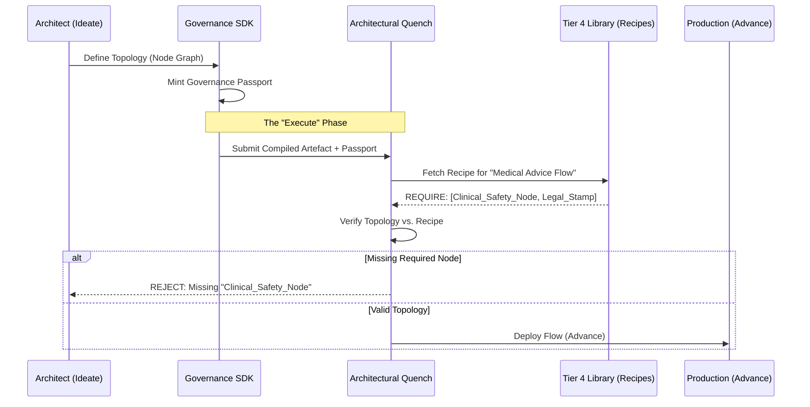

# The Architectural Flow: Governing the Self-Adaptation of Operational Architecture
### Abstract

This document defines the **Architectural Flow**—the parallel infrastructure Flow (`[IDEAS]`) that runs alongside the primary Operational Flow. Together they form the **Immutable Kernel**: `G` plus `[IDEAS]` is the managed runtime (the "operating system") for every Operational Flow, the **Standardized Runtime Environment** that replaces bespoke stacks. The kernel is instantiated—never edited—so that every application domain runs on the same constitutional substrate. This paper specifies how the kernel exposes an SDK and Foundry Cycle so Architects can safely extend capacity by supplying governed configuration, while the runtime preserves determinism, judiciary hooks, and Ledger plumbing.

The governed artifact is an **Artefact-Centric Configuration**. The framework enforces compliance through a **Governance Passport** system. Every Workitem carries a verifiable metadata passport that must contain specific cryptographic "stamps" from authorized Nodes before it can cross the border into production.

---

### Executive Summary

The **Architectural Flow** enforces that the construction of new **Nodes** (the components of the operational Flow) is a governed software development task.

1.  **The Immutable Kernel (`G + [IDEAS]`):** The Architectural Flow is the managed runtime that ships *with* the Governance Flow. It enforces the pre-built kernel that every Operational Flow must boot from.
2.  **The SDK Contract:** The governed artifact is an **Artefact-Centric Configuration**: Node implementations and topology manifests that declare their Output Artefact Type and subscribed Governance Recipe. The SDK mints a Governance Passport per Workitem, Nodes stamp it as they complete work, and the kernel verifies that the passport matches the Recipe before the topology crosses into production.
3.  **The Process:** The Flow uses the G(IDEAS) stages to govern structural change, with an architectural `Quench` acting as a structural compiler/linter that enforces Tier 4 architectural law before any topology is allowed into production.

**Empirical Validation (2025):**
This architecture is grounded in emerging successes in self-healing and neurosymbolic systems. Recent benchmarks validate the core mechanisms:
* **The Quench Pattern:** Adding symbolic verification to LLM tasks increases success rates by **46.2%** [(Ahn et al., 2025)][1] and enables **80% autonomous repair** of security vulnerabilities [(University of Manchester, 2025)][1].
* **The Sustain Loop:** Self-improving safety frameworks have demonstrated the ability to autonomously synthesize **234 new policies** from zero to mitigate attacks in real-time [(Slater, 2025)][1].
* **Economic Efficiency:** Fractal, self-healing architectures have been shown to reduce development time by **41%** while reducing critical error rates by **54%** [(Nehzati, 2025)][1].

### Visual Architecture

---

### I. The Immutable Kernel

#### The `G(IDEAS + [IDEAS])` Constitutional Co-Existence
* **Definition:** `G` and `[IDEAS]` ship together as the operating system for every Operational Flow. Architects instantiate the kernel and extend it strictly through governed configuration.
* **Shared Constitution:** Both Flows subscribe to the same **Tier 3** and **Tier 4** law. Kernel updates arrive as Tier 4 architectural law packages; adopting Operational Flows simply inherit the upgrade.

---

### II. Domains of Architectural Work

#### The Workitem: Artefact-Centric Configuration
The primary `Workitem` is defined as a **Governance SDK Configuration**—code and topology manifests that already implement the platform contract. Each submission carries the hash of the compiled artefact, the Node Metamodel version, and the expected friction increase so it can be traced through the Ledger.
* **Node Blueprints:** Node implementations are packaged as SDK-managed artefacts so ledger streaming, petition hooks, and identity handshakes ship directly with the configuration, embedding those controls as intrinsic properties of the artefact.
* **Topology Definition:** The YAML/JSON files defining how Nodes are wired into a directed graph, constrained by the same SDK (e.g., which outputs are valid, which hand-offs require planned HITL).
* **The Governance Recipe:** The combination of **FoundryFlow** (entry/terminal contracts) and **GovernedArtefact** (quality standards) defines the contract. The FoundryFlow specifies entry requirements and terminal contracts with required artefacts at specified validity levels (e.g., `approved` terminal requires `petition-draft` artefact at `final` validity). The GovernedArtefact maps validity levels to role requirements (e.g., `final` validity requires stamps from `linter`, `security-reviewer`, `legal-reviewer`, and `executive-approver` roles).
* **The Governance Passport:** Every Node (via the SDK) automatically stamps artefacts when it completes work. The stamp includes the node's role (from `FoundryNode.spec.role`), not its identity. The Terminal Guard validates that artefacts meet the terminal contract requirements by checking that all required role stamps are present in the passport.

---

### III. The G(IDEAS) Stages (The Flow of Architectural Change)

This section maps the macro-stages of the framework onto the constitutional task of changing the Flow's architecture.

#### 1. Ideate
* **Function:** To translate an amorphous request into a formally governed **Petition for Architectural Change**. This Petition documents the observed friction, the desired improvement, and the scope of work.
* **Output:** A governed, structured **Petition** artifact.

#### 2. Discover
* **Function:** To translate the **Petition** into a verifiable **Architectural Model** or **Blueprint**. This stage defines the specific components that need modification or creation.
* **Output:** A validated **Model** of the new topology and a list of required **Node Artifacts**.

#### 3. Execute
* **Function:** To build or modify the **SDK-compliant Source Code** and **Topology Definition** to align with the **Architectural Model**. This stage is where the actual coding, compiling, and adversarial review occurs, guarded by an architectural **Quench** that behaves like a structural compiler/linter. The Quench Linter now checks **Recipe Compliance**, confirming that every required stamp in the Governance Recipe has a corresponding Node and automated stamp path. It enforces Tier 4 architectural law (e.g., "Every Flow must expose a Sustain Node," "Every Node must declare a Federation certificate dependency") and recipe obligations; violations fail the build before any subjective review occurs. The Linter validates that the proposed topology contains the necessary Nodes to generate the required stamps. You cannot build a Flow that produces "Medical Advice" if your graph is missing the "Clinical Safety Node." *Validation:* This deterministic gating is critical. Research demonstrates that coupling LLMs with symbolic verification (the Quench pattern) improves task reliability by **46.2%** compared to probabilistic models alone [(Ahn et al., 2025)][1] [(Bayless et al., 2025)][1] and enables high-confidence autonomous repair of structural flaws [(University of Manchester, 2025)][1].
* **Output:** The final, **audited and compiled Node Artifacts** and the updated **Topology Definition** file.

#### 4. Advance
* **Function:** To deploy the new code artifacts and topology into the live **Operational Flow** environment. This stage governs the operational handover, ensuring the deployment adheres to all security and operations constraints.
* **Output:** The **Live and Running Flow** with the new architecture enabled.

#### 5. Sustain
* **Function:** To monitor the **effectiveness** of the deployed Flow, tracking its aggregate friction, throughput, and governance ratio. The system generates **Petitions** when friction diverges from the baseline, automatically closing the institutional feedback loop. *Validation:* This loop mirrors the **Self-Improving Safety Framework (SISF)**, which empirically demonstrated the ability to autonomously synthesize hundreds of new policy rules in response to adversarial attacks, reducing attack success rates by over 50% without human intervention [(Slater, 2025)][1].
* **Output:** **Programmatically generated Petitions** submitted back to the **Ideate** stage to initiate the next cycle of self-repair.

---

### IV. Federated Interoperability – The Intranet of Flows

The Architectural Flow produces local Nodes while simultaneously maintaining the Flow's status on the organization's intranet. The Flow operates as an **Agentic Mesh** [(IEEE, 2025)][1], creating a structured network where every Node ("Holon") acts autonomously yet obeys a governed reasoning layer [(Ashfaq et al., 2025)][1].

* **Federation Certificates:** Each Flow advertises a signed certificate issued by its Governance Flow. Before accepting a Petition or artefact from another Flow, it validates that certificate. This provides a zero-trust-style handshake for constitutional interoperability.
* **Online vs. Offline:** A disconnected or "rogue" Flow is **Economically Isolated**; once its certificate expires, it becomes invisible to the mesh and other Flows ignore its petitions and doctrine until it rejoins the heartbeat. The mesh relies on trustable identity to determine who is allowed to participate.
* **Intranet Policy:** The Architectural Flow encodes the policy for these checks inside its SDK and structural Quench so Architects cannot forget the handshake logic when defining new Nodes or topologies.

### V. Conclusion: The Self-Healing Republic

* **Enforced Humility:** The `Architectural Flow` guarantees that the effort to create governance is subject to the same auditability as the effort to create product.
* **The Ouroboros Loop:** By making the output of the **Sustain** node (a petition) the input of the **Architectural Flow**, the framework achieves a state of self-governance, allowing the system to programmatically deploy tested code to fix its own operational issues.

### References

* **Ahn, S., et al. (2025).** *Towards Reliable Code-as-Policies: A Neuro-Symbolic Framework for Embodied Task Planning*. arXiv:2510.21302. Demonstrates +46.2% reliability gains from coupling LLM reasoning with symbolic verification (the Quench pattern).
* **Ashfaq, M., et al. (2025).** *LLM-Enhanced Holonic Architecture for Ad-Hoc Scalable SoS*. arXiv:2501.07992. Validates the holonic/Node model for governed autonomy layers.
* **Bayless, S., et al. (2025).** *A Neurosymbolic Approach to Natural Language Formalization and Verification (ARC)*. arXiv:2511.09008v1. Provides the constitutional AV pipeline referenced across the canon.
* **IEEE Computer Society. (2025).** *AI Agentic Mesh: Building Enterprise Autonomy*. Tech News Trends. Describes the enterprise mesh pattern adopted in Section IV.
* **Nehzati, T. (2025).** *A quantum-inspired, biomimetic, and fractal framework for self-healing AI code generation*. Frontiers in Artificial Intelligence. Reports 41% faster delivery with 54% fewer critical defects using fractal self-healing loops.
* **Slater, T. (2025).** *A Self-Improving Architecture for Dynamic Safety in Large Language Models*. arXiv:2511.07645. Documents the SISF loop that synthesizes hundreds of new guardrails on demand.
* **University of Manchester (2025).** *A New Era in Software Security: Towards Self-Healing Software via Large Language Models and Formal Verification*. Demonstrates 80% autonomous repair rates when pairing LLM agents with formal Quench gates.

[1]: #references
