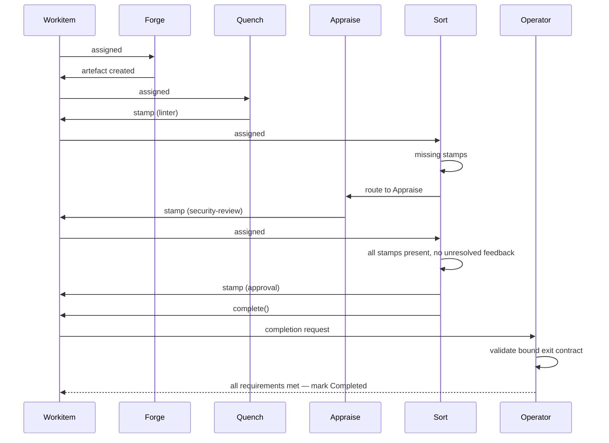
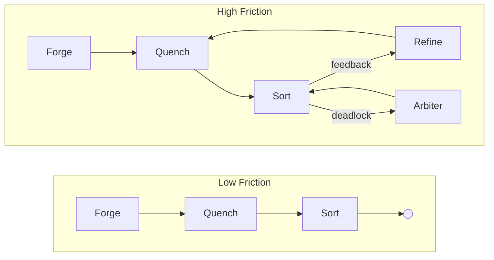

# Foundry Flow: Conceptual Overview

## What is Foundry Flow?

Foundry Flow is a governed workflow runtime on Kubernetes. It orchestrates work through adversarial cycles of creation, validation, review, and refinement — producing artefacts that carry cryptographic proof of every check they passed.

All agents are fallible — human, AI, or deterministic. The framework provides a safety harness: trust intent, verify execution. Competent actors are protected from systemic complexity and their own blind spots. Every action, decision, and review becomes an immutable, traceable record. If it happened, there is a record.

Governance has a measurable cost. Friction is a first-class, quantifiable signal exposing the real-time cost of governance — whether the actors are human, AI, or both. The [Friction Ledger](../02-flow/04-system-services.md#friction-ledger) aggregates that cost as actionable data.

Work cannot leave a Flow until its artefacts carry the required stamps. The quality standard is non-negotiable. What the framework measures is the cost of achieving it. If that cost is too high, the system — the laws, the topology, the nodes — needs to change.

## Core Definitions

A **Flow** is a self-contained runtime in a single Kubernetes namespace. One namespace, one Flow. All state, storage, governance, and execution live within the boundary.

A **[Workitem](./03-data-model.md#workitems)** is the unit of work. It carries lifecycle state, assignment ownership, routing instructions, and thrash counters — all managed by the [Operator](../02-flow/01-operator.md) in `status` (the Workitem CRD has no `spec` block). Artefacts are not referenced on the Workitem — the [Archivist](./03-data-model.md#artefacts) maintains artefact-to-Workitem associations. Feedback, stamps, and version history live in the Archivist, scoped to artefact `id` and tagged to specific versions.

A **[Node](../03-node/00-overview.md)** is a stateless worker. Node pods persist for efficiency (model loading, connection pools), but execution state is rebuilt from the Workitem and Archivist each time. A node that sees a Workitem for the second time treats it as a stranger.

An **[artefact](./03-data-model.md#artefacts)** is a governed output — versioned, content-addressed, and stored in the Archivist. An artefact could be a document, a code file, a data model — anything the Flow produces.

An artefact's **[passport](./03-data-model.md#passports-and-stamps)** is the collection of [stamps](#stamps) on a specific version. It tracks which governance checkpoints have been satisfied for that content hash.

### Stamps

A **stamp** is a named governance checkpoint on an artefact's passport — recording which node applied it, the content hash at stamp time, and a cryptographic signature. Stamp names are declared by the [GovernedArtefact CRD](../05-reference/crds.md#governedartefact), and [entry and exit contracts](./03-data-model.md#entry-and-exit-contracts) define which stamps are required at each lifecycle boundary. Stamps are write-once per artefact version — if artefact content changes, existing stamps remain with the old version and the new version starts with no stamps. Detail: [Data Model](./03-data-model.md#passports-and-stamps).

**[Feedback](./03-data-model.md#feedback)** is structured annotations on artefacts — threaded, with forced-choice resolution. When addressing contradictory feedback, a node must either cite existing law or propose a novel argument. Every disagreement is explicit and justified.

A **[law](./03-data-model.md#laws)** is a governance rule with a textual **goal** — what it enforces, stops, or ensures. A law can carry one or more **representations** (prose, formal logic, executable code, or anything else), all expressing the same goal. The [Library](../02-flow/04-system-services.md#librarian) stores them all with equal indifference.

---

## The Foundry Cycle

The [Foundry Cycle](./02-foundry-cycle.md) is the reference arrangement — the standard pattern of node roles (Forge, Quench, Appraise, Sort, Refine) that demonstrates how adversarial cycles of creation, validation, review, and refinement produce artefacts that are provably compliant with a body of governance. [Flow Architects](../05-reference/glossary.md#flow-architect) adapt it to their context: adding nodes, merging responsibilities, splitting gate nodes, or replacing reference implementations entirely.

The Judiciary is the exception — it is a standard runtime subsystem present in every Flow, not a swappable reference implementation. It comprises lifecycle nodes ([Facilitator](./02-foundry-cycle.md#facilitator)), orchestration nodes ([Arbiter](./02-foundry-cycle.md#arbiter-deadlock-resolver), [Tribunal](./02-foundry-cycle.md#tribunal-hearing-conductor)), deliberation nodes ([Juror](./02-foundry-cycle.md#juror-judicial-agent)), watcher nodes ([Friction Watcher](./02-foundry-cycle.md#friction-watcher), [TTL Watcher](./02-foundry-cycle.md#ttl-watcher)), a legislative inner cycle (the [Clerk cycle](./02-foundry-cycle.md#clerk-cycle) using [Codification](./02-foundry-cycle.md#codification-nodes), [Rule Router](./02-foundry-cycle.md#rule-router), and [law-applicator](./02-foundry-cycle.md#law-applicator) nodes), and generic [HITL](./02-foundry-cycle.md#hitl-nodes) nodes for human review.

The [Embassy](../02-flow/06-cross-flow.md) is the standard cross-flow boundary node, present in every Flow. It handles outbound export and inbound import of Workitems — including `law-petition`s for higher-authority escalation — using a signed manifest and streamed package protocol. The [Federation service](../02-flow/08-federation.md) is a separate platform service that manages inter-flow trust, membership, state groupings, authority publisher roles, and published-law distribution.

The standard library provides configurable reference implementations for each role as container images. The platform enforces behaviour through capabilities and configuration, not node names.

---

## The Governance Model

### Laws and the Library

A Flow's [Library](../02-flow/04-system-services.md#librarian) is its collective body of law — its constitution. Every law the Flow has ever discovered, enacted, or inherited lives here.

Each law has a **goal** — a plain-language statement of what it enforces, stops, or ensures — and one or more **representations**: prose, formal logic, executable code, or any other format. The Library stores all representations as part of a single law object with equal indifference. It cares only that a law exists and has a goal; interpretation belongs to the nodes that consume it.

Nodes query the Library for laws that apply to the governed artefact they are working on and request representations they can interpret. A review node reads prose and applies judgement. A validation node reads formal logic and runs a solver. Different nodes consume different representations of the same law through their own lens. The Library is one body of law; execution is eye of the beholder.

### Law Tiers

Laws are tiered by authority and lifecycle:

| Tier | Name | Source | Lifecycle |
|------|------|--------|-----------|
| 1 | **Finding** | Nodes (any with `WRITE:law/tier1` capability; [Appraise](./02-foundry-cycle.md#appraise-reviewer), [Refine](./02-foundry-cycle.md#refine-refiner) in the reference arrangement) | Ephemeral. Decays if uncited, promoted if heavily used. |
| 2 | **Ruling** | [Judiciary](./02-foundry-cycle.md#the-judiciary--standard-subsystem) (via the Clerk cycle and law-applicator) | Binding precedent. Minted when disputes are resolved. |
| 3 | **Local Statute** | [Flow Architect](../05-reference/glossary.md#flow-architect) | Local policy. Human-administered or via local legislative cycle. |
| 4 | **State Constitution** | [Federation](./04-governance.md) (state-level authority publisher) | Organisational policy. Published by an authority Flow and distributed to subscriber Flows within the same state by the [Federation service](../02-flow/08-federation.md). |
| 5 | **Federal Accord** | [Federation](./04-governance.md) (federation-level authority publisher) | Cross-organisation. Published by a federation-level authority Flow and distributed to all subscriber Flows by the [Federation service](../02-flow/08-federation.md). |

Tier 1 Findings are the raw material. They emerge from work — a reviewer notices a pattern, a refiner articulates a principle. If a Finding proves useful (cited frequently across Workitems), it accumulates [friction](./03-data-model.md#friction) attributed to it. When that friction crosses a configured threshold, the [Friction Watcher](./02-foundry-cycle.md#friction-watcher) node triggers a review hearing that can promote it to a Tier 2 Ruling through the [Tribunal](./02-foundry-cycle.md#tribunal-hearing-conductor) node. Laws that generate disproportionate friction surface for review — the system makes the cost of its own governance visible.

The system naturally hardens soft rules into strict ones. A Tier 1 Finding begins as prose and, when promoted, can acquire additional [representations](./03-data-model.md#representations) — formal logic, executable validators — through specialised [translation services](../02-flow/04-system-services.md#codification-services). Authority increases through the tier system; enforceability increases through representation.

### Federation and Cross-Flow Governance

Tiers 1 and 2 emerge from within a Flow. Tier 3 is the Flow's own legislative authority. Tiers 4 and 5 arrive from external authority publishers via the [Federation service](../02-flow/08-federation.md).

A standalone Flow (no federation membership) manages its own Tier 3 Local Statutes as CRDs applied by an administrator. Tiers 4 and 5 do not exist in this configuration.

When a Flow joins a [Federation](./04-governance.md), it gains identity, trust-root discovery, and membership in a governed topology. The Federation defines **states** — groups of Flows that share organisational relationships — and designates **authority publisher** roles that determine which Flows may publish local Tier 3 laws outward. A state-level authority publishes laws that materialise as Tier 4 in subscriber Flows; a federation-level authority publishes laws that materialise as Tier 5 across the federation.

Published law distribution is a Federation service responsibility. When an authority Flow marks an approved local Tier 3 law as `published`, the Federation service validates the publication, runs conflict detection, and distributes accepted laws to subscriber Flows.

Higher-authority escalation flows in the opposite direction: a Flow's Clerk cycle can produce a `law-petition` that the [Embassy](../02-flow/06-cross-flow.md) exports to the relevant authority Flow. The authority Flow processes the petition through its own governance cycle. The originating Flow does not wait for remote deliberation — it creates a [dispute record](./03-data-model.md#dispute-records) and routes affected Workitems to `pending-hold` until the authority accepts or rejects the petition.

Federation membership also establishes a shared trust hierarchy. The federation trust root enables cross-flow stamp verification: any stamp produced by any node in any member Flow is cryptographically verifiable by tracing the certificate chain back to the federation root. Non-federation cross-flow exchange uses [Treaties](../02-flow/06-cross-flow.md) — directed trust policies that constrain which `importType`s a remote Flow may use.

---

## Verifiable Outcomes

The system verifies that work was done correctly. Deterministically.

### Passports and Stamps

As a Workitem moves through the cycle, nodes apply [stamps](#stamps) to the artefact's passport. Each stamp binds a governance checkpoint to a specific content hash with a cryptographic signature, making it independently verifiable. If the artefact content changes, existing stamps remain with the old version — governance starts over for the new content.

### Exit Contracts

Exit contracts are defined per governed artefact name. For each name, a contract specifies a list of required stamp names; an empty list means artefacts of that governed artefact name must be present but carry no specific stamps. A code artefact might require stamps named "linter", "security-review", and "approval". A log artefact might only need to exist. If a Workitem carries multiple artefacts of a required governed artefact name, all of them must satisfy that name's requirement. The Flow grants nodes permission to apply specific named stamps via the FoundryNode CRD's capabilities. At the border, the exit-bound node calls `complete()`, and the Operator checks the bound exit contract against each required governed artefact name. If any requirement is unsatisfied, the Workitem cannot exit. When a Workitem is handed to the Embassy for cross-flow transfer, only artefacts whose governed artefact names are listed in the Embassy's bound exit contract are exported.

An artefact that exits a Flow carries cryptographic proof of every governance checkpoint it passed. Quality is proved.

---

## Friction

Friction is systemic heat. As Workitems move through a Flow, they generate friction everywhere they touch — bumping into nodes, bouncing off laws, looping through rework cycles, waiting on reviewers, escalating to the Judiciary. Every interaction has a cost, and the system tracks it.

The system captures where and why heat builds up. A Workitem that flows smoothly generates low friction. One that thrashes — looping between Refine and Sort, escalating to the Arbiter, timing out on a human reviewer — generates high friction. Every friction event is tagged to its source: which node, which Workitem, which laws.

This gives organisations a quantifiable, real-time signal for dysfunction. The [Friction Ledger](../02-flow/04-system-services.md#friction-ledger) aggregates friction data and tags it to its source — laws, nodes, topology paths — so it can be queried across every dimension. Which laws generate the most heat? Which nodes are bottlenecks? Where in the topology do Workitems thrash? Governance cost becomes data — quantified, attributable, and actionable. How friction feeds back into governance — surfacing costly laws for review, driving amendment pressure — is covered in [Governance](./04-governance.md#friction-as-governance-signal).
