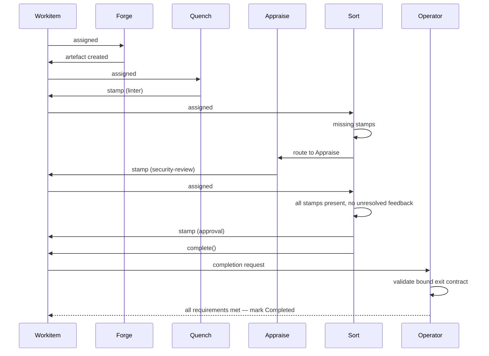
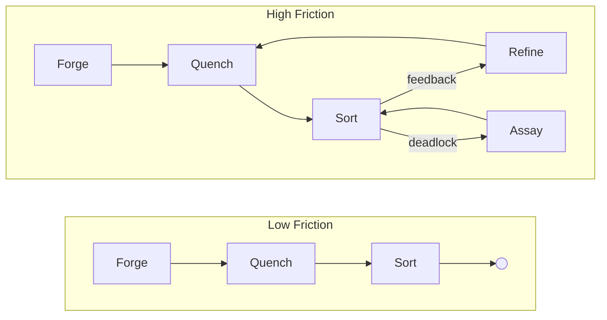

# Foundry Flow: Conceptual Overview

## What is Foundry Flow?

Foundry Flow is a governed workflow runtime on Kubernetes. It orchestrates work through adversarial cycles of creation, validation, review, and refinement — producing artefacts that carry cryptographic proof of every check they passed.

All agents are fallible — human, AI, or deterministic. The framework provides a safety harness: trust intent, verify execution. Competent actors are protected from systemic complexity and their own blind spots. Every action, decision, and review becomes an immutable, traceable record. If it happened, there is a record.

Governance has a measurable cost. Friction is a first-class, quantifiable signal exposing the real-time cost of governance — whether the actors are human, AI, or both. The [Flow Monitor](../02-flow/04-system-services.md#flow-monitor-and-friction-surface) aggregates that cost as actionable data.

Work cannot leave a Flow until its artefacts carry the required stamps. The quality standard is non-negotiable. What the framework measures is the cost of achieving it. If that cost is too high, the system — the laws, the topology, the nodes — needs to change.

## Core Definitions

A **Flow** is a self-contained runtime in a single Kubernetes namespace. One namespace, one Flow. All state, storage, governance, and execution live within the boundary.

A **[Workitem](./03-data-model.md#workitems)** is the unit of work. It carries lifecycle state, assignment ownership, routing instructions, and thrash counters — all managed by the [Operator](../02-flow/01-operator.md) in `status` (the Workitem CRD has no `spec` block). Artefacts are not referenced on the Workitem — the [Archivist](./03-data-model.md#artefacts) maintains artefact-to-Workitem associations. Feedback, stamps, and version history live in the Archivist, scoped to artefact `id` and tagged to specific versions.

A **[Node](../03-node/00-overview.md)** is a stateless worker. Node pods persist for efficiency (model loading, connection pools), but execution state is rebuilt from the Workitem and Archivist each time. A node that sees a Workitem for the second time treats it as a stranger.

An **[artefact](./03-data-model.md#artefacts)** is a governed output — versioned, content-addressed, and stored in the Archivist. An artefact could be a document, a code file, a data model — anything the Flow produces.

An artefact's **[passport](./03-data-model.md#passports-and-stamps)** is the collection of [stamps](#stamps) on a specific version. It tracks which governance checkpoints have been satisfied for that content hash.

### Stamps

A **stamp** is a named governance checkpoint on an artefact's passport — recording which node applied it, the content hash at stamp time, and a cryptographic signature. Stamp names are declared by the [GovernedArtefact CRD](../05-reference/crds.md#governedartefact), and [entry and exit contracts](./03-data-model.md#entry-and-exit-contracts) define which stamps are required at each lifecycle boundary. Stamps are write-once per artefact version — if artefact content changes, existing stamps remain with the old version and the new version starts with no stamps. Detail: [Data Model](./03-data-model.md#passports-and-stamps).

**[Feedback](./03-data-model.md#feedback)** is structured annotations on artefacts — threaded, with forced-choice resolution. When addressing contradictory feedback, a node must either cite existing law or propose a novel argument. Every disagreement is explicit and justified.

A **[law](./03-data-model.md#laws)** is a governance rule with a textual **goal** — what it enforces, stops, or ensures. A law can carry one or more **representations** (prose, formal logic, executable code, or anything else), all expressing the same goal. The [Library](../02-flow/04-system-services.md#librarian) stores them all with equal indifference.

---

## The Foundry Cycle

The [Foundry Cycle](./02-foundry-cycle.md) is the reference arrangement — the standard pattern of node roles (Forge, Quench, Appraise, Sort, Refine) that demonstrates how adversarial cycles of creation, validation, review, and refinement produce artefacts that are provably compliant with a body of governance. [Flow Architects](../05-reference/glossary.md#flow-architect) adapt it to their context: adding nodes, merging responsibilities, splitting gate nodes, or replacing reference implementations entirely.

Assay is the exception — it is a standard runtime component present in every Flow, not a swappable reference implementation.

The standard library provides configurable reference implementations for each role as container images. The platform enforces behaviour through capabilities and configuration, not node names.

---

## The Governance Model

### Laws and the Library

A Flow's [Library](../02-flow/04-system-services.md#librarian) is its collective body of law — its constitution. Every law the Flow has ever discovered, enacted, or inherited lives here.

Each law has a **goal** — a plain-language statement of what it enforces, stops, or ensures — and one or more **representations**: prose, formal logic, executable code, or any other format. The Library stores all representations as part of a single law object with equal indifference. It cares only that a law exists and has a goal; interpretation belongs to the nodes that consume it.

Nodes query the Library for laws that apply to the artefact they are working on and request representations they can interpret. A review node reads prose and applies judgement. A validation node reads formal logic and runs a solver. Different nodes consume different representations of the same law through their own lens. The Library is one body of law; execution is eye of the beholder.

### Law Tiers

Laws are tiered by authority and lifecycle:

| Tier | Name | Source | Lifecycle |
|------|------|--------|-----------|
| 1 | **Finding** | Nodes ([Appraise, Refine](./02-foundry-cycle.md) in the reference arrangement) | Ephemeral. Decays if uncited, promoted if heavily used. |
| 2 | **Ruling** | Assay node | Binding precedent. Minted when disputes are resolved. |
| 3 | **Local Statute** | [Flow Architect](../05-reference/glossary.md#flow-architect) | Local policy. Human-administered or via local legislative cycle. |
| 4 | **State Constitution** | [Governance Flow](./04-governance.md) | Organisational policy. Applies to all Flows in the Governance Flow's instance. |
| 5 | **Federal Accord** | Federation | Cross-organisation. Synchronised from upstream Federal authorities. |

Tier 1 Findings are the raw material. They emerge from work — a reviewer notices a pattern, a refiner articulates a principle. If a Finding proves useful (cited frequently across Workitems), it accumulates [friction](./03-data-model.md#friction) attributed to it. When that friction crosses a configured threshold, the [Librarian](../02-flow/04-system-services.md#librarian) triggers a review hearing that can promote it to a Tier 2 Ruling through the Assay node. Laws that generate disproportionate friction surface for review — the system makes the cost of its own governance visible.

The system naturally hardens soft rules into strict ones. A Tier 1 Finding begins as prose and, when promoted, can acquire additional [representations](./03-data-model.md#representations) — formal logic, executable validators — through specialised [translation services](../02-flow/04-system-services.md#codification-services). Authority increases through the tier system; enforceability increases through representation.

### The Governance Flow

Tiers 1 and 2 emerge from within a Flow. Tier 3 is the Flow's own legislative authority. Tiers 4 and 5 arrive from above.

A standalone Flow (no [Governance Flow](./04-governance.md)) manages its own Tier 3 Local Statutes as CRDs applied by an administrator. Tiers 4 and 5 do not exist in this configuration.

Under a Governance Flow, the [Governance Flow](./04-governance.md) is a dedicated Flow whose governed artefacts are the laws themselves. It produces Tier 4 State Constitution laws through the same [Foundry Cycle](./02-foundry-cycle.md) as any other Flow, and synchronises Tier 5 Federal Accords from upstream authorities. Sibling Flows receive these laws via their Librarians, ensuring every Flow in the organisation operates under a consistent body of higher-tier governance.

The Governance Flow also serves as the **State Root Certificate Authority**. It issues intermediate CA certificates to each Sibling Flow's Operator, establishing a shared trust hierarchy. Any stamp produced by any node in any sibling Flow is cryptographically verifiable by tracing the certificate chain back to the State Root.

---

## Verifiable Outcomes

The system verifies that work was done correctly. Deterministically.

### Passports and Stamps

As a Workitem moves through the cycle, nodes apply [stamps](#stamps) to the artefact's passport. Each stamp binds a governance checkpoint to a specific content hash with a cryptographic signature, making it independently verifiable. If the artefact content changes, existing stamps remain with the old version — governance starts over for the new content.

### Exit Contracts

Exit contracts are defined per governed artefact kind. For each kind, a contract specifies a list of required stamp names; an empty list means artefacts of that kind must be present but carry no specific stamps. A code artefact might require stamps named "linter", "security-review", and "approval". A log artefact might only need to exist. If a Workitem carries multiple artefacts of a required kind, all of them must satisfy that kind's requirement. The Flow grants nodes permission to apply specific named stamps via the FoundryNode CRD's capabilities. At the border, the exit-bound node calls `complete()`, and the Operator checks the bound exit contract against each required kind. If any requirement is unsatisfied, the Workitem cannot exit. When completion triggers cross-flow export, only artefacts whose kinds are listed in the bound exit contract are exported.

An artefact that exits a Flow carries cryptographic proof of every governance checkpoint it passed. Quality is proved.

---

## Friction

Friction is systemic heat. As Workitems move through a Flow, they generate friction everywhere they touch — bumping into nodes, bouncing off laws, looping through rework cycles, waiting on reviewers, escalating to the judiciary. Every interaction has a cost, and the system tracks it.

The system captures where and why heat builds up. A Workitem that flows smoothly generates low friction. One that thrashes — looping between Refine and Sort, escalating to Assay, timing out on a human reviewer — generates high friction. Every friction event is tagged to its source: which node, which Workitem, which laws.

This gives organisations a quantifiable, real-time signal for dysfunction. The [Flow Monitor](../02-flow/04-system-services.md#flow-monitor-and-friction-surface) aggregates friction data and tags it to its source — laws, nodes, topology paths — so it can be queried across every dimension. Which laws generate the most heat? Which nodes are bottlenecks? Where in the topology do Workitems thrash? Governance cost becomes data — quantified, attributable, and actionable. How friction feeds back into governance — surfacing costly laws for review, driving amendment pressure — is covered in [Governance](./04-governance.md#friction-as-governance-signal).
