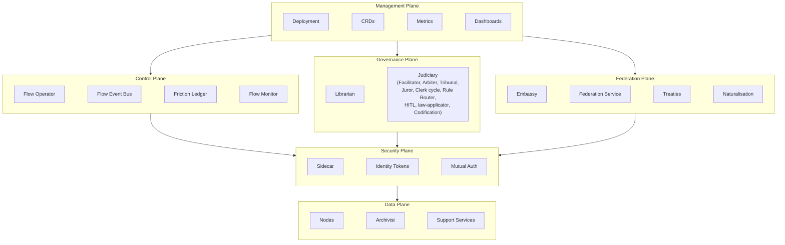

# Architecture

A [Flow](./00-overview.md) is a self-contained runtime in a single Kubernetes namespace. One namespace, one Flow. All state, storage, governance, and execution live within the boundary. The namespace is the sovereignty line — nothing enters or leaves without crossing a guarded border.

---

## Architectural Planes

### Management Plane

Configuration, lifecycle, and observability. Configuration resources define the Flow's desired state, a metrics pipeline provides monitoring and dashboards, and retention policies handle housekeeping.

A Flow is deployed as a single unit. One deployment creates one namespace, installs the CRDs, deploys the [Flow Operator](../02-flow/01-operator.md) and [system services](../02-flow/04-system-services.md), and applies the singleton [FoundryFlow](../02-flow/05-configuration.md) configuration resource. Everything the Flow needs ships together, avoiding partial deployment states.

### Control Plane

Work assignment and routing decisions. The [Flow Operator](../02-flow/01-operator.md) is the Control Plane's central component — a state router that watches [Workitem](./03-data-model.md#workitems) CRDs, assigns them to [nodes](../03-node/00-overview.md), and validates the bound exit contract at the exit boundary. The [Thrash Guard](./03-data-model.md#thrash-guard) is part of the Operator's assignment logic — it tracks per-node visit counts on each Workitem and fails any Workitem whose total visit count across all nodes exceeds the configured threshold, enforcing a maximum visit budget per Workitem.

The [Flow Event Bus](../02-flow/04-system-services.md#flow-event-bus) distributes runtime events across three channels — telemetry, audit, and friction — enabling reactive consumption by any subscribing component. The [Friction Ledger](../02-flow/04-system-services.md#friction-ledger) subscribes to friction events on the telemetry channel, aggregates them, and publishes threshold-crossing signals to the friction channel. The [Flow Monitor](../02-flow/04-system-services.md#flow-monitor) subscribes to the Flow Event Bus's telemetry and audit channels and exports metrics for Prometheus scraping and audit events as JSON Lines for log pipeline consumption.

The Control Plane's scope is routing decisions. It reads state and moves Workitems; nodes do the rest. NodeGroups provide sub-topology boundaries within a Flow — named collections of nodes with optional entry and exit contracts that govern work crossing the group boundary. NodeGroups are a configuration concern defined on the [FoundryFlow](../02-flow/05-configuration.md#nodegroups) CRD; nodes inside a group do not need to know about grouping.

### Data Plane

Where work happens. The Data Plane contains the [nodes](../03-node/00-overview.md) that execute logic and the [Archivist](../02-flow/04-system-services.md) that manages artefact lifecycle — version history, [passport stamps](./03-data-model.md#passports-and-stamps), [feedback](./03-data-model.md#feedback), and raw content bytes.

Nodes are stateless workers — their pods persist for efficiency (model loading, connection pools), but execution state is rebuilt from the Workitem and Archivist on every assignment. A node that sees a Workitem for the second time treats it as a stranger. The Workitem CRD carries only control-plane state (lifecycle, assignment, routing); artefacts are associated with Workitems in the Archivist, which the Operator queries for contract validation.

The Flow platform does not mediate or restrict node network access to external services — nodes and [Support Services](../02-flow/04-system-services.md#flow-support-services) reach external endpoints directly. Network segmentation is an infrastructure concern; operators who require egress controls should define Kubernetes NetworkPolicies or service mesh configuration accordingly.

Flow Architects can also deploy **[Support Services](../02-flow/04-system-services.md#flow-support-services)** — containers that expose capabilities consumed by nodes and system services but do not process Workitems. A [Codification Service](../02-flow/04-system-services.md#codification-services) that translates a law's prose goal into formal logic is a Support Service; a notification relay that pushes alerts to an external channel is another. Support Services run in the Flow namespace and are accessed through Sidecar mediation when consumed by nodes, preserving the same trust boundary as system service calls. They are declared in Flow configuration and are optional — the platform imposes no minimum set.

### Security Plane

Identity, authentication, and cryptographic trust. The Security Plane cross-cuts all other planes — a concern that runs through each of them, present wherever identity, authentication, or trust is exercised.

Its primary agent is the [Sidecar](../03-node/01-sidecar.md), injected into every node pod. The Sidecar holds all credentials; the node container itself is credential-free. Every authenticated request between a node and the Flow's services passes through the Sidecar, which brokers identity on the node's behalf.

[Passport stamps](./03-data-model.md#passports-and-stamps) are the Security Plane's output. When a node stamps an artefact, the Sidecar computes the content hash, signs it with the node's private key, and attaches the full certificate chain. The stamp is cryptographically bound to the artefact's content — if the content changes, the stamp is invalidated. Exit-contract verification traces each stamp's certificate chain back to the Flow's trust root.

Every service call requires valid credentials regardless of network path.

### Governance Plane

The legal lifecycle. The Governance Plane manages the discovery, enforcement, and evolution of [law](./03-data-model.md#laws) within the Flow.

The [Librarian](../02-flow/04-system-services.md#librarian) manages the Flow's body of [law](./03-data-model.md#laws) — storing, embedding, and serving laws to nodes that query for applicable governance. The Librarian is a pure law store and lifecycle service — it stores, indexes, and serves laws, and manages integration conflict checks for cross-flow law replication. Hearing triggers are owned by dedicated watcher nodes: the [Friction Watcher](./02-foundry-cycle.md#friction-watcher) subscribes to the [Flow Event Bus](../02-flow/04-system-services.md#flow-event-bus) friction channel for threshold-crossing signals and creates hearing Workitems, while the [TTL Watcher](./02-foundry-cycle.md#ttl-watcher) polls the Librarian for laws exceeding their review TTL. The [Friction Ledger](../02-flow/04-system-services.md#friction-ledger) aggregates friction events and publishes threshold-crossing signals to the friction channel.

The [Judiciary](./02-foundry-cycle.md#the-judiciary--standard-subsystem) provides judicial review. It is a standard runtime subsystem whose deliberation and legislative processes are externalised into the flow topology as node-based Workitem transitions — every step is auditable with full friction tracking. The [Facilitator](./02-foundry-cycle.md#facilitator) owns the deadlock resolution lifecycle: it assembles an evidence bundle, creates a child Workitem for the [Arbiter](./02-foundry-cycle.md#arbiter-deadlock-resolver), and suspends until the Arbiter completes. The Arbiter and [Tribunal](./02-foundry-cycle.md#tribunal-hearing-conductor) are orchestrators that fan out to [Juror](./02-foundry-cycle.md#juror-judicial-agent) nodes, tally verdicts, and handle multi-round retry internally. On consensus, they create a child Workitem for the [Clerk cycle](./02-foundry-cycle.md#clerk-cycle) — a legislative inner cycle that mirrors the main cycle using the same node images (Forge, Sort, Appraise, Refine, Facilitator) with different CRD configs. A standalone [Codification](./02-foundry-cycle.md#codification-nodes) node handles formal representation fan-out. [Rule Router](./02-foundry-cycle.md#rule-router) instances provide tier-based routing, and [law-applicator](./02-foundry-cycle.md#law-applicator) applies approved petitions via the Librarian. Generic [HITL](./02-foundry-cycle.md#hitl-nodes) nodes handle human review at multiple points: petition approval, hung jury resolution, and cancellation.

Tiers 1, 2, and 3 are local — they emerge from work within the Flow or from the Flow's own legislative authority. Tiers 4 and 5 arrive from external authority publishers via the [Federation service](../02-flow/08-federation.md), materialised into each Flow's Library as organisational and federal policy. The Library stores all tiers with equal indifference; nodes query and interpret them the same way regardless of origin.

### Federation Plane

Cross-flow trust and collaboration. Flows are sovereign — a Workitem belongs to its namespace. When work needs to cross a Flow boundary, the [Embassy](../02-flow/06-cross-flow.md) — each Flow's standard boundary node — handles the transfer. The sending Embassy packages artefacts and sends a signed manifest; the receiving Embassy preflights, requests the full package, creates a new local Workitem, and applies naturalisation stamps. The bound exit contract shapes the export bundle: only artefacts whose governed artefact names are listed in that contract are transferred, and an empty contract exports no artefacts.

The Federation Plane has two distinct responsibilities:

**Workitem transfer** is handled by the Embassy. Every Flow has an operator-provisioned Embassy instance that manages outbound export and inbound import. The receiving Flow publishes `crossFlow.importTypes` — a map of import type names to entry-bound nodes — and senders target those stable import type names, never internal node names. `law-petition` is the only reserved built-in import type (used for higher-authority escalation). Federation-member and Treaty-based exchange use the same Embassy manifest + package protocol; only the trust source differs.

**Law publication and distribution** is handled by the [Federation service](../02-flow/08-federation.md). When an authority Flow marks an approved local Tier 3 law as `published`, the Federation service validates the publication, runs conflict detection, and distributes accepted laws to subscriber Flows. State-level publications materialise as Tier 4; federation-level publications materialise as Tier 5. Published law distribution is not an Embassy import type — it is a separate Federation service path.

Cross-flow relationships are governed by distinct trust models:

**Federated trust** operates through the [Federation](./04-governance.md). Joining a federation establishes Flow identity, trust-root discovery, endpoint discovery, and membership. The federation provides the trust root — all member Flows share a common certificate authority, and any stamp from any member is cryptographically verifiable by tracing the certificate chain to the federation root. The Embassy verifies required foreign stamps and emits local `imported-<stamp>` attestations; downstream local contracts rely on these attested local stamps while foreign stamps remain for provenance.

**Treaty-based trust** enables collaboration between Flows that do not share federation membership — typically across organisational boundaries. A [Treaty](../02-flow/06-cross-flow.md) is a directed trust policy that constrains which `importType`s a remote Flow may use. The receiving Flow pins the foreign Flow's CA certificate and validates that the Embassy manifest was signed by the source Flow's identity. Treaties may further constrain `allowedImportTypes` for the relationship.

Embassy-to-Embassy connections use mTLS. The signed manifest carries per-transfer claims and artefact inventory. Federation membership or Treaty policy authorises the remote Flow and its import types; this is not embedded in the certificate. Details of the Embassy transfer protocol are covered in [Cross-Flow Collaboration](../02-flow/06-cross-flow.md).

---

## Responsibility Boundaries

Each concern in the system maps to exactly one plane. When a node executes work, it operates in the Data Plane. When the result needs routing, the Control Plane decides where it goes. When a law is cited, it generates a friction signal that feeds the Governance Plane. When a stamp is applied, the Security Plane signs it.

| Concern | Plane | Handler |
|---------|-------|---------|
| Work execution | Data | node pods |
| Pluggable capabilities | Data | Support Services |
| Routing decisions | Control | Flow Operator |
| Artefact lifecycle | Data | Archivist |
| Law lifecycle | Governance | Librarian |
| Dispute resolution | Governance | Judiciary (Facilitator, Arbiter, Tribunal, HITL) |
| Authentication | Security | Sidecar |
| Cryptographic stamps | Security | Sidecar |
| Event distribution | Control | Flow Event Bus |
| Friction aggregation and threshold signals | Control | Friction Ledger |
| Metrics export and audit pipeline | Control | Flow Monitor |
| Cross-flow Workitem transfer | Federation | Embassy |
| Law publication and distribution | Federation | Federation service |
| Tier 4/5 law authority | Federation | Federation service (authority publishers) |
| Configuration and deployment | Management | CRDs, deployment tooling |

---

## Design Decisions

### One Namespace, One Flow

A Flow occupies exactly one Kubernetes namespace. The namespace is the isolation boundary — all CRDs, services, secrets, and storage are scoped to it. This is a singleton pattern: one deployment creates one namespace creates one Flow. The Operator enforces this invariant: if more than one FoundryFlow CRD is deployed to a namespace, all instances are marked `Degraded` with a `SingletonViolation` reason and no reconciliation proceeds.

The namespace is the flow's identity. Runtime components derive flow identity from the `FLOW_NAMESPACE` environment variable (set by the Operator during pod construction) rather than from a separate flow identifier. The Sidecar injects `x-flow-namespace` into every outgoing gRPC request as the authoritative flow identity header.

The namespace boundary also defines data sovereignty. Workitems, artefacts, and laws belong to their Flow. Cross-flow collaboration happens through the Federation Plane's export-import protocol, never through shared state.

### Sequential Processing

A [Workitem](./03-data-model.md#workitems) is assigned to exactly one node at a time — atomic ownership prevents race conditions in state transitions. The Operator's routing loop is linear: read state, pick a target, assign, wait for completion, repeat.

When parallel execution is needed, the platform provides [child Workitems](../02-flow/02-workitem.md#child-workitems) for structured fan-out/fan-in. A node creates child Workitems, populates them with input artefacts, routes them for independent processing, and collects results when they complete. From the Flow's perspective, each child is a separate Workitem with atomic ownership — the parallelism is in the number of concurrent children, not in shared state.

### Stateless Workers

Node pods are persistent, platform-managed processes. They boot once, load expensive infrastructure (LLM model weights, connection pools, SDK caches), and process many Workitems over their lifetime. This eliminates cold-start latency.

But execution state is ephemeral. Each Workitem assignment starts fresh — the node reads Workitem state from the CRD and fetches artefact content from the Archivist. If a Workitem loops back to the same node type after visiting other nodes, it may land on a different pod replica. The node has no memory of having seen it before.

Infrastructure state persists across assignments. Execution state is rebuilt from the Workitem and Archivist each time.

### Data Gravity

Workitems are immutable residents of their namespace. They do not move between Flows — they are copied. The [export-import protocol](../02-flow/06-cross-flow.md) creates a new Workitem in the receiving Flow with its own lifecycle, its own chain of custody, and its own governance. The original Workitem remains in its home Flow, completed.

Artefact content lives in the Archivist as content-addressed blobs. The Workitem CRD carries no artefact references — artefacts are associated with Workitems in the Archivist, which the Operator queries for routing and exit contract checks. Version history, passport stamps, and feedback live in the Archivist's database, queryable through the [SDK](../04-sdk/01-sdk-core.md).

### Hybrid Persistence

| Layer | Storage | Data | Access Pattern |
|-------|---------|------|----------------|
| State | CRDs | Workitems, Laws, FoundryFlow config, FoundryNode config | Watch-driven, strongly consistent |
| Governance Query | Embedded database — Librarian | Embeddings | Analytical, vector similarity search |
| Telemetry | Pipeline adapter — Flow Monitor | Prometheus metrics endpoint, audit JSON Lines to stdout | Prometheus scraping, log pipeline ingestion |
| Event distribution | SQLite append-only log — Flow Event Bus | Events within per-channel retention window | Publish/subscribe with bounded replay |
| Friction aggregation | SQLite — Friction Ledger | Running friction totals per law, node, tier | Direct gRPC queries, threshold-crossing events via friction channel |
| Artefact Provenance | Embedded database — Archivist | Artefact version history, passport stamps, feedback | Relational queries, lifecycle tracking |
| Blobs | Content-addressed store — Archivist | Artefact content (raw bytes) | Content-addressed read/write |

CRDs provide the watch-driven consistency the Operator needs for state transitions. The Librarian's embedded database provides the query capabilities needed for law embeddings and similarity search. The Flow Event Bus distributes runtime events durably across three channels (telemetry, audit, friction) with SQLite-backed persistence and per-channel configurable retention. The Friction Ledger subscribes to friction events on the telemetry channel, aggregates them, and publishes threshold-crossing signals to the friction channel. The Flow Monitor subscribes to the telemetry and audit channels and serves as the pipeline adapter — exporting metrics via a `/metrics` endpoint for Prometheus scraping and emitting audit events as JSON Lines to stdout for log pipeline consumption. The [Friction Watcher](./02-foundry-cycle.md#friction-watcher) subscribes to the friction channel for threshold-crossing signals and creates hearing Workitems. The Tribunal and Librarian query the Friction Ledger's `QueryFriction` API for point-to-point friction data retrieval. Friction is queryable through the Friction Ledger's `QueryFriction` API and through Prometheus for long-term time-series analysis. The Archivist's database stores all artefact provenance — version history, stamps, and feedback — as a single queryable layer. The Archivist's content-addressed store holds raw content bytes where they are cheap and durable.

### Zero-Trust Security

Every node pod runs with a Sidecar that holds its cryptographic identity. The node container has no credentials — it cannot authenticate to any Flow service directly. All authenticated communication passes through the Sidecar, which brokers identity on the node's behalf using platform-native credentials and, in federated deployments, mutual authentication certificates.

In federated deployments, the trust chain is hierarchical: the [Federation](./04-governance.md) holds the trust root and issues intermediate CA certificates to each member Flow's Operator, which in turn issues mutual authentication certificates to its node Sidecars. The resulting chain — Sidecar, Flow Operator CA, Federation Root CA — makes every stamp verifiable across the entire federation.

Passport stamps carry the Sidecar's signature and certificate chain, making them independently verifiable. Exit contract checks validate stamps by cryptographic chain, not by trusting the network path the Workitem travelled.

The Security Plane's presence in the Data Plane is the Sidecar. Its presence in the Governance Plane is the signed stamp. Its presence in the Control Plane is the authenticated API call.
