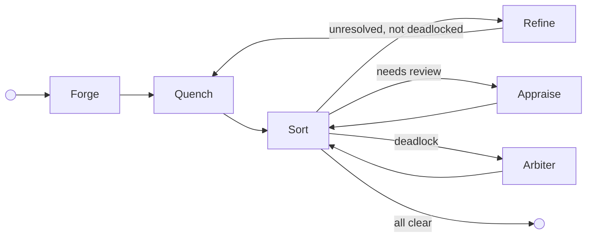
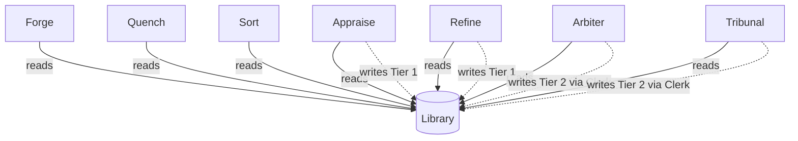

# The Foundry Cycle

The Foundry Cycle is the reference arrangement — a standard pattern of node roles that demonstrates how adversarial cycles of creation, validation, review, and refinement drive unreliable agents to produce artefacts that are provably compliant with a body of governance. It is not the only way to structure a Flow. It is the way the standard library structures one, and the pattern [Flow Architects](../05-reference/glossary.md#flow-architect) are expected to adapt to their specific problem space.

The standard library provides configurable reference implementations for each node role as container images. [Flow Architects](../05-reference/glossary.md#flow-architect) can extend them, adapt them, merge responsibilities across fewer nodes, split them across more, or implement completely custom nodes. The platform enforces behaviour through [capabilities and configuration](../02-flow/05-configuration.md) — not node names. A node named "Validator" that holds the same capabilities as the reference Sort node behaves identically from the platform's perspective.

The Judiciary is the exception. It is a standard runtime subsystem present in every Flow, not a swappable reference implementation. [Flow Architects](../05-reference/glossary.md#flow-architect) do not choose whether to include it.

---

## Node Roles

### Forge (Creator)

Forge creates the initial artefact. Before generation, it reads the Flow's [Library](../02-flow/04-system-services.md#librarian) of applicable [law](./03-data-model.md#laws), filtered by governed artefact name, and seeds it into its context — so the creator knows the rules before it starts. In the reference arrangement, Forge reads laws exclusively; it does not write them. The platform enforces this through capability grants: a node without a `WRITE:law/tierN` capability grant cannot write laws regardless of its role.

### Quench (Deterministic Validator)

Quench performs deterministic validation. It queries the law body for executable [representations](./03-data-model.md#representations) — formal logic, constraint schemas, compiled checks — and runs them against the artefact to verify deterministic compliance before it reaches the more expensive review stage. In the reference arrangement, Quench can apply deterministic validation stamps (e.g., "linter") when granted the appropriate `STAMP` capability. Quench is optional. Topologies that rely exclusively on non-deterministic review can omit it, routing directly from Forge to the gate node.

### Appraise (Reviewer)

Appraise conducts subjective review. It reads the applicable laws for the governed artefact and orchestrates a panel of specialist reviewers (AI agents, human reviewers, or both) who evaluate the artefact against them. Appraise intentionally preserves contradictions in its feedback — resolving them is Refine's job. In the reference arrangement, Appraise holds the `WRITE:law/tier1` capability and can record Tier 1 [Findings](./03-data-model.md#law-tiers) — emergent patterns observed during review.

### Sort (Gate)

Sort is the central routing hub. It evaluates governance state and routes. Granted the `READ:flow` capability, Sort reads the [Flow configuration](../02-flow/05-configuration.md) to discover which nodes can provide which [stamps](./03-data-model.md#passports-and-stamps), then applies its routing rules:

1. Is there unresolved [feedback](./03-data-model.md#feedback) that is not deadlocked? Route to **Refine**.
2. Is feedback deadlocked (arguing in circles)? Route to **Arbiter**.
3. Missing required stamps? Route to the node configured to provide them (Appraise, in the reference arrangement).
4. All feedback resolved, all required stamps present? Stamp **approval**, call `complete()`, and let the [Operator](../02-flow/01-operator.md) validate the bound [exit contract](./03-data-model.md#entry-and-exit-contracts) before marking **Completed**.

Sort is a gate. It evaluates state, consults the Flow config for routing targets, and — in the reference arrangement for governed artefact processing — acts as the exit-bound node: it stamps approval when the passport is complete and all feedback is resolved, then calls `complete()`.

Sort queries artefact state through the [SDK](../04-sdk/01-sdk-core.md) — `artefact.hasUnresolvedFeedback()`, `artefact.getStamps()` — the same interface available to every node. The `READ:flow` capability enables topology discovery via [`GetFlowTopology`](../05-reference/grpc-api.md#node-facing-methods-via-sidecar); Sort calls this at assignment time to build stamp-to-provider mappings from peer node capabilities and to resolve its own exit contract. Any node granted `READ:flow` capability can query the same topology information.

### Refine (Refiner)

Refine addresses feedback. It reads the applicable laws for the governed artefact, reviews the consolidated (potentially contradictory) feedback, produces a new artefact version, and must address every item — marking each as *actioned* or *Won't Fix*. A Won't Fix requires a structured [justification](./03-data-model.md#forced-choice-justification): either a citation of existing law or a novel argument proposing new reasoning. In the reference arrangement, Refine holds the `WRITE:law/tier1` capability and can record Tier 1 Findings.

### The Judiciary — Standard Subsystem

The Judiciary is the judicial branch of the Flow. It is built into the runtime as a standard subsystem — every Flow includes it, and Flow Architects do not choose whether to include it. The Judiciary comprises three nodes and two core services, all Operator-provisioned.

#### Arbiter (Deadlock Resolver)

The Arbiter resolves deadlocked feedback disputes. When the gate node detects that a feedback item's history depth warrants escalation, it transitions the item to `deadlocked` and routes the Workitem to the Arbiter. The Arbiter invokes the [Jury](../02-flow/04-system-services.md#jury) service for multi-agent deliberation, then uses the [Clerk](../02-flow/04-system-services.md#clerk) service to draft and codify a Tier 2 Ruling. The feedback item's `linkedRuling` is set to this Ruling regardless of which side the Arbiter favours, and the Workitem routes back to Sort for re-evaluation.

The Arbiter holds the `WRITE:law/tier2` capability — Tier 2 Rulings are both the floor and the ceiling of its judicial authority, and the ceiling grant also covers Tier 1. The Arbiter does not write Tier 1 Findings by convention; its role is judicial, not observational. Its full [authority ceiling](./04-governance.md#judiciary-authority-ceiling) is constitutionally bounded.

#### Tribunal (Hearing Conductor)

The Tribunal conducts review hearings on laws. When a law's accumulated friction crosses its tier's configured threshold, or when a law's age exceeds its tier's configured review TTL, the [Librarian](../02-flow/04-system-services.md#librarian) triggers creation of a hearing Workitem routed to the Tribunal. The Tribunal invokes the [Jury](../02-flow/04-system-services.md#jury) service for deliberation, then renders a tier-appropriate verdict:

- **Tier 1 Finding**: Promote (mint Tier 2 Ruling via the [Clerk](../02-flow/04-system-services.md#clerk)) or Retire.
- **Tier 2 Ruling**: Promote (route to [Advocate](#advocate-human-escalation) for HITL ratification as Tier 3), Retire, or Demote (drop to Tier 1).
- **Tier 3–5**: Route to [Advocate](#advocate-human-escalation) for petition or appeal.

Hearing Workitems carry a `law-reference` artefact containing the law ID under review. They are self-contained at the Tribunal.

#### Advocate (Human Escalation)

The Advocate is the Judiciary's [human-in-the-loop](../03-node/03-patterns.md#human-in-the-loop-pattern) node. It receives work that exceeds automated judicial authority:

- **Hung jury**: When the Arbiter or Tribunal cannot reach consensus after the configured maximum jury rounds, the Workitem routes to the Advocate for human decision.
- **Tier 3 proposal**: When the Tribunal renders a Promote verdict for a Tier 2 Ruling, the Advocate presents the proposal to a human for ratification.
- **Tier 4–5 appeal**: When a conflict involves Tier 4 or Tier 5 laws, the Advocate files an appeal to the [Governance Flow](./04-governance.md) via the Librarian.

The Advocate uses the SDK's [HITL pattern](../04-sdk/08-sdk-hitl.md) — exposing a queue interface for human reviewers, persisting pending decisions in local storage, and maintaining heartbeats while awaiting human input. Escalation patterns (timeout chains, delegation, pool routing) are built on top of this base.

---

## Cycle Topology

In the reference arrangement, Refine routes back through Quench — deterministic validation runs again on the revised artefact. Topologies without Quench route Refine directly to Sort (or to whatever gate node the Flow Architect has configured). Deadlock-escalated governed-work assignments route back through Sort after Arbiter adjudication. Review-hearing [Workitems](./03-data-model.md#workitems) are self-contained at the Tribunal. Human escalations are handled by the Advocate.

---

## Law Authority in the Cycle

All nodes in the cycle can **read** laws from the Library. Only some can **write**:

Forge reads laws for context seeding. Quench and Sort are read-only consumers. Appraise and Refine can record Tier 1 Findings (emergent patterns) — any node granted the `WRITE:law/tier1` capability can do the same, regardless of whether it bears one of these names. The Arbiter and Tribunal hold `WRITE:law/tier2` and mint Tier 2 Rulings (binding precedent) through the [Clerk](../02-flow/04-system-services.md#clerk) service, which coordinates [codification](../02-flow/04-system-services.md#codification-services) and persists the law via the Librarian. Their [authority ceiling](./04-governance.md#judiciary-authority-ceiling) is constitutionally bounded.

The underlying platform mechanism is capability-gated law access. Law read and write permissions are granted per node through the FoundryNode CRD. The reference arrangement maps these capabilities to specific roles, but a custom topology can distribute them differently.

---

## Adapting the Arrangement

The reference arrangement is a starting point. [Flow Architects](../05-reference/glossary.md#flow-architect) adapt it to their context:

- **Add nodes.** A topology might insert a "Translate" node between Forge and Quench, or add a second review stage with different stamp authority.
- **Merge responsibilities.** A simple topology might combine validation and review into a single node that holds both deterministic and non-deterministic capabilities.
- **Split gate nodes.** A complex topology might use separate gate nodes for feedback routing and stamp verification.
- **Replace reference implementations.** The standard library containers are configurable, but a Flow Architect can implement entirely custom nodes that fulfil the same platform contracts.
- **Omit optional nodes.** Quench is optional. Topologies without deterministic validation omit it entirely.

The platform enforces behaviour through capabilities, contracts, and Operator validation — not through node names or a fixed topology. A Flow that uses none of the reference node names but grants the same capabilities and binds the same contracts produces identical governance outcomes.
