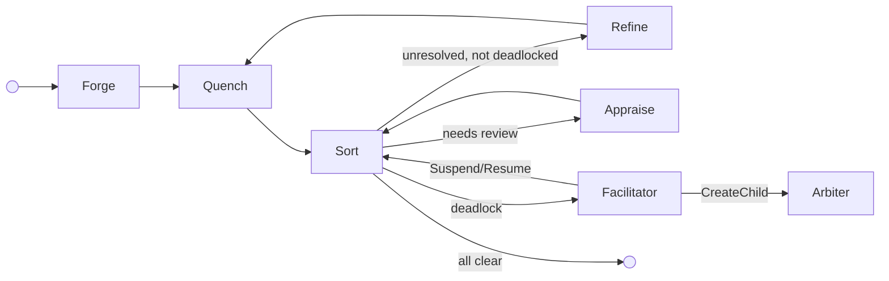
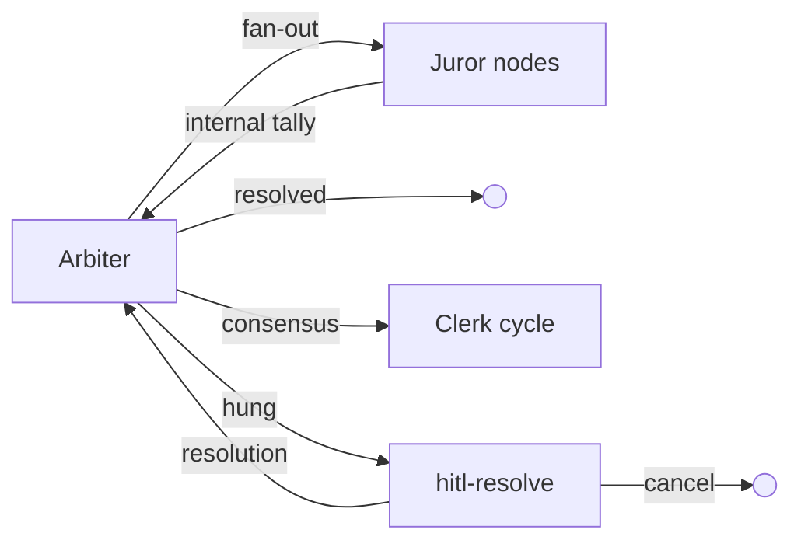
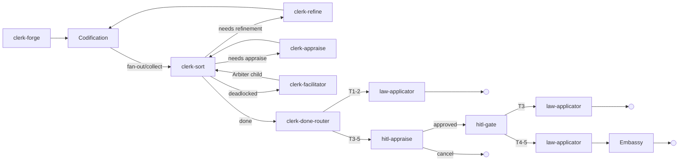
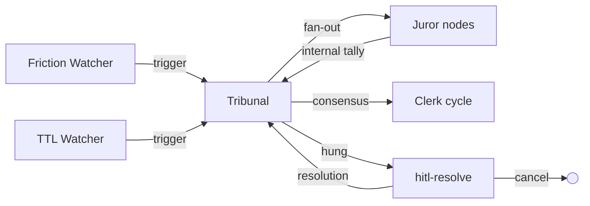
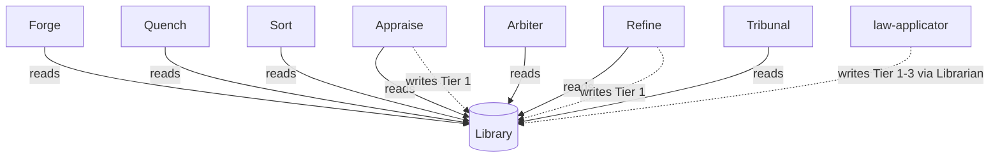

# The Foundry Cycle

The Foundry Cycle is the reference arrangement — a standard pattern of node roles that demonstrates how adversarial cycles of creation, validation, review, and refinement drive unreliable agents to produce artefacts that are provably compliant with a body of governance. It is not the only way to structure a Flow. It is the way the standard library structures one, and the pattern [Flow Architects](../05-reference/glossary.md#flow-architect) are expected to adapt to their specific problem space.

The standard library provides configurable reference implementations for each node role as container images. [Flow Architects](../05-reference/glossary.md#flow-architect) can extend them, adapt them, merge responsibilities across fewer nodes, split them across more, or implement completely custom nodes. The platform enforces behaviour through [capabilities and configuration](../02-flow/05-configuration.md) — not node names. A node named "Validator" that holds the same capabilities as the reference Sort node behaves identically from the platform's perspective.

The Judiciary is the exception. It is a standard runtime subsystem present in every Flow, not a swappable reference implementation. [Flow Architects](../05-reference/glossary.md#flow-architect) do not choose whether to include it.

---

## Node Roles

### Forge (Creator)

Forge creates the initial artefact. Before generation, it reads the Flow's [Library](../02-flow/04-system-services.md#librarian) of applicable [law](./03-data-model.md#laws), filtered by governed artefact name, and seeds it into its context — so the creator knows the rules before it starts. In the reference arrangement, Forge reads laws exclusively; it does not write them. The platform enforces this through capability grants: a node without a `WRITE:law/tierN` capability grant cannot write laws regardless of its role.

### Quench (Deterministic Validator)

Quench performs deterministic validation. It queries the law body for executable [representations](./03-data-model.md#representations) — formal logic, constraint schemas, compiled checks — and runs them against the artefact to verify deterministic compliance before it reaches the more expensive review stage. In the reference arrangement, Quench can apply deterministic validation stamps (e.g., "linter") when granted the appropriate `STAMP` capability. Quench is optional. Topologies that rely exclusively on non-deterministic review can omit it, routing directly from Forge to the gate node.

### Appraise (Reviewer)

Appraise conducts subjective review. It reads the applicable laws for the governed artefact and orchestrates a panel of specialist reviewers (AI agents, human reviewers, or both) who evaluate the artefact against them. Appraise intentionally preserves contradictions in its feedback — resolving them is Refine's job. In the reference arrangement, Appraise holds the `WRITE:law/tier1` capability and can record Tier 1 [Findings](./03-data-model.md#law-tiers) — emergent patterns observed during review.

### Sort (Gate)

Sort is the central routing hub. It evaluates governance state and routes. Granted the `READ:flow` capability, Sort reads the [Flow configuration](../02-flow/05-configuration.md) to discover which nodes can provide which [stamps](./03-data-model.md#passports-and-stamps), then applies its routing rules:

1. Is there unresolved [feedback](./03-data-model.md#feedback) that is not deadlocked? Route to **Refine**.
2. Is feedback deadlocked (arguing in circles)? Route to **Arbiter**.
3. Missing required stamps? Route to the node configured to provide them (Appraise, in the reference arrangement).
4. All feedback resolved, all required stamps present? Stamp **approval**, call `complete()`, and let the [Operator](../02-flow/01-operator.md) validate the bound [exit contract](./03-data-model.md#entry-and-exit-contracts) before marking **Completed**.

Sort is a gate. It evaluates state, consults the Flow config for routing targets, and — in the reference arrangement for governed artefact processing — acts as the exit-bound node: it stamps approval when the passport is complete and all feedback is resolved, then calls `complete()`.

Sort queries artefact state through the [SDK](../04-sdk/01-sdk-core.md) — `artefact.hasUnresolvedFeedback()`, `artefact.getStamps()` — the same interface available to every node. The `READ:flow` capability enables topology discovery via [`GetFlowTopology`](../05-reference/grpc-api.md#node-facing-methods-via-sidecar); Sort calls this at assignment time to build stamp-to-provider mappings from peer node capabilities and to resolve its own exit contract. Any node granted `READ:flow` capability can query the same topology information.

### Refine (Refiner)

Refine addresses feedback. It reads the applicable laws for the governed artefact, reviews the consolidated (potentially contradictory) feedback, produces a new artefact version, and must address every item — marking each as *actioned* or *Won't Fix*. A Won't Fix requires a structured [justification](./03-data-model.md#forced-choice-justification): either a citation of existing law or a novel argument proposing new reasoning. In the reference arrangement, Refine holds the `WRITE:law/tier1` capability and can record Tier 1 Findings.

### The Judiciary — Standard Subsystem

The Judiciary is the judicial branch of the Flow. It is built into the runtime as a standard subsystem — every Flow includes it, and Flow Architects do not choose whether to include it. All deliberation and legislative processes are externalised into the flow topology as node-based Workitem transitions — every step produces auditable artefacts with full friction tracking.

The Judiciary comprises a lifecycle node ([Facilitator](#facilitator)), orchestration nodes ([Arbiter](#arbiter-deadlock-resolver), [Tribunal](#tribunal-hearing-conductor)), deliberation nodes ([Juror](#juror-judicial-agent)), watcher nodes ([Friction Watcher](#friction-watcher), [TTL Watcher](#ttl-watcher)), and a legislative inner cycle (the [Clerk cycle](#clerk-cycle) using [Codification](#codification-nodes), [Rule Router](#rule-router), and [law-applicator](#law-applicator) nodes), plus generic [HITL](#hitl-nodes) nodes for human review. Cross-flow petition export then hands off to the operator-provisioned [Embassy](../02-flow/06-cross-flow.md), which is a separate boundary node present in every Flow.

#### Facilitator

The Facilitator owns the deadlock resolution lifecycle. When Sort detects deadlocked feedback, it routes to the Facilitator. The Facilitator gathers evidence (feedback history, artefact content, relevant laws, friction data), packages it into an evidence bundle artefact, creates a child Workitem for the [Arbiter](#arbiter-deadlock-resolver), and calls [Suspend](../02-flow/02-workitem.md#suspendresume). When the Arbiter child completes, the Facilitator resumes and routes `resolved` back to Sort.

The Facilitator is generic — it handles any governed artefact's deadlocked feedback, not just haiku or petition feedback. The same `facilitator:latest` image serves both the main cycle (`facilitator`) and the Clerk cycle (`clerk-facilitator`) as different CRD instances.

#### Arbiter (Deadlock Resolver)

The Arbiter resolves deadlocked feedback disputes. It receives a child Workitem from the [Facilitator](#facilitator) with a pre-assembled evidence bundle. The Arbiter fans out to [Juror](#juror-judicial-agent) nodes using [child Workitems](../02-flow/02-workitem.md#child-workitems), tallies their verdicts internally, and handles multi-round retry internally. Three outcomes:

1. **Resolved** — the jury settles the dispute within existing law. The Arbiter calls `Complete()`. The Facilitator resumes and routes back to Sort.
2. **Consensus** — the jury decides a law change is needed. The Arbiter creates a child Workitem for the [Clerk cycle](#clerk-cycle) with a `verdict-context` artefact containing the jury's reasoned decision (prose `trigger` + `decision` fields only) and calls [Suspend](../02-flow/02-workitem.md#suspendresume). When the Clerk cycle completes, the Arbiter resumes and calls `Complete()`. The Facilitator then resumes and routes back to Sort.
3. **Hung** — the jury cannot reach consensus after maximum rounds. The Arbiter routes to [hitl-resolve](#hitl-nodes). The human can provide a resolution (back to Arbiter for re-deliberation) or cancel.

The Arbiter holds the `WRITE:law/tier2` capability — Tier 2 Rulings are both the floor and the ceiling of its judicial authority. Its full [authority ceiling](./04-governance.md#judiciary-authority-ceiling) is constitutionally bounded.

**Suspension chain** (deepest path): Facilitator suspends for Arbiter. Arbiter suspends for Clerk. Clerk cycle completes. Arbiter resumes and completes. Facilitator resumes and routes to Sort.

#### Tribunal (Hearing Conductor)

The Tribunal conducts review hearings on laws. When a law's accumulated friction crosses its tier's configured threshold, the [Friction Watcher](#friction-watcher) node creates a hearing Workitem. When a law's age exceeds its tier's configured review TTL, the [TTL Watcher](#ttl-watcher) node creates a hearing Workitem. Both watcher nodes store a `law-reference` artefact and route to the Tribunal.

The Tribunal assembles evidence (the law under review, friction data, related laws), fans out to [Juror](#juror-judicial-agent) nodes, tallies their verdicts internally, and handles multi-round retry internally. On consensus, it creates a child Workitem for the [Clerk cycle](#clerk-cycle) with a `verdict-context` artefact containing the jury's reasoned decision (prose) and **Completes** (fire-and-forget). The hearing Workitem has no parent to report back to, so no suspension is needed. On hung jury, it routes to [hitl-resolve](#hitl-nodes).

Friction hearings can target any tier, including imported Tier 4-5 laws — a hearing verdict on a T4-5 law feeds a Clerk cycle that exits via the [Embassy](../02-flow/06-cross-flow.md) as a `law-petition` to the authority.

#### Juror (Judicial Agent)

The Juror is the deliberation primitive. A single Juror node image loads different agent configurations at fan-out time to maximise diversity of judicial philosophy for the jury size required. Each Juror receives a child Workitem containing: the question to deliberate, evidence artefacts, prior-round reasoning (if a retry), and allowed outcomes. It runs a [FoundryAgent](../04-sdk/07-sdk-agent.md) with the loaded judicial personality and produces a structured verdict artefact (outcome + reasoning). It then calls `Complete()`.

Juror nodes are shared across both the Arbiter path and the Tribunal path. The Arbiter and Tribunal are responsible for framing the question and assembling evidence; the Juror only deliberates.

#### Clerk Cycle

The Clerk cycle mirrors the main cycle. It uses the same node images (Forge, Sort, Appraise, Refine, Facilitator) as different CRD instances with different configs — primarily different agent prompts loaded from ConfigMaps. A petition is a governed artefact that goes through the same quality process as any other work product.

The Clerk cycle structure:

- **clerk-forge** (`forge:latest` with petition-drafting ConfigMap prompts) — receives a `verdict-context` artefact, interprets the court's prose decision into a structured [petition](#petition-artefact).
- **[Codification](#codification-nodes)** (`codification:latest`) — reads the petition, fans out to codify-\* nodes **per-change** for non-retire changes, collects formal representations, attaches them to the originating changes, routes to clerk-sort.
- **clerk-sort** (`sort:latest`) — petition feedback triage, same logic as main Sort.
- **clerk-appraise** (`appraise:latest`) — automated petition review against the verdict to ensure alignment.
- **clerk-refine** (`refine:latest`) — petition revision.
- **clerk-facilitator** (`facilitator:latest`) — handles deadlocked petition feedback via the same Facilitator -> Arbiter path.
- **clerk-done-router** ([Rule Router](#rule-router)) — post-approval tier routing: T1-2 to law-applicator, T3-5 to hitl-appraise.
- **hitl-gate** ([Rule Router](#rule-router)) — post-HITL routing: T3 to law-applicator, T4-5 to law-applicator then Embassy.
- **[hitl-appraise](#hitl-nodes)** — T3-5 petition HITL review with cancel option.
- **[law-applicator](#law-applicator)** — applies approved petitions via the Librarian.

On the T4-5 path, law-applicator creates a [dispute record](./03-data-model.md#dispute-records) linking the `petition_id` to cited law IDs before routing to the [Embassy](../02-flow/06-cross-flow.md) for export as a `law-petition`. The local Flow does not wait for remote deliberation.

While the authority deliberates, [Sort](#sort-gate) checks for active dispute records when evaluating feedback. If any cited law is under active dispute, Sort routes the Workitem to `pending-hold` instead of deadlocking. A separate petition-outcome-watcher node then retires the dispute record and resumes the held Workitems when the authority accepts or rejects the petition through federation publication outcomes.

#### Codification Nodes

Codification nodes produce formal representations of laws. The Codification orchestrator (`codification:latest`) reads the petition artefact, iterates its changes, fans out to codify-\* nodes **per-change** for non-retire changes, collects formal representations, attaches them to the originating changes, stores the updated petition, and routes to Sort. Each codify-\* node receives a child Workitem, produces a formal representation in its declared output format (Rego, SMT-LIB, etc.), and calls `Complete()`.

#### Rule Router

The Rule Router is a generic, config-driven routing node. It evaluates an ordered list of [CEL](https://github.com/google/cel-spec) expressions against the current Workitem state. The first rule whose expression evaluates to `true` determines the output. A default output catches anything that falls through. One image (`rule-router:latest`), many CRD instances with different configs.

Rule Router instances in the Clerk cycle:

- **clerk-done-router** — routes approved petitions by tier: T1-2 to law-applicator, T3-5 to hitl-appraise.
- **hitl-gate** — routes HITL-approved petitions: T3 to law-applicator, T4-5 to law-applicator then Embassy.

#### Law-Applicator

The law-applicator is an action node that applies approved petitions via the Librarian (`WriteLaw`/`RetireLaw`). For T1-3 petitions, it writes the law changes and calls `Complete()`. For T4-5 petitions, it creates a [dispute record](./03-data-model.md#dispute-records) via the Librarian (`CreateDisputeRecord`) linking the `petition_id` to cited law IDs, then routes to the [Embassy](../02-flow/06-cross-flow.md) for export as a `law-petition` to the relevant authority Flow.

#### HITL Nodes

HITL nodes are generic, config-driven human-in-the-loop nodes. A single image (`hitl:latest`) derives its behaviour entirely from CRD configuration: outputs become user action choices, `WRITE:feedback` capability enables feedback, and exit-node config enables cancellation via `Complete(WithReason(cancelled))`.

CRD instances in the Judiciary:

- **hitl-appraise** — T3-5 petition review. Outputs: `approved`. Exit node (cancel enabled).
- **arbiter-hitl-resolve** — Arbiter hung jury resolution. Outputs: `resolution`. Exit node.
- **tribunal-hitl-resolve** — Tribunal hung jury resolution. Outputs: `resolution`. Exit node.

#### Friction Watcher

The Friction Watcher is an entry-bound watcher node that subscribes to the [Flow Event Bus](../02-flow/04-system-services.md#flow-event-bus) friction channel for `friction.threshold_crossed` events. When a law's accumulated friction crosses its tier's configured threshold, the Friction Watcher creates a hearing Workitem via `CreateWorkitem`, stores a `law-reference` artefact containing the law ID, and routes to the [Tribunal](#tribunal-hearing-conductor) via its `default` output. The Friction Watcher tracks pending hearing law IDs to prevent duplicate hearing creation for the same law.

#### TTL Watcher

The TTL Watcher is an entry-bound watcher node that periodically polls the [Librarian](../02-flow/04-system-services.md#librarian) via `QueryLaws` for laws whose age exceeds their tier's configured review TTL. On expiry, the TTL Watcher creates a hearing Workitem via `CreateWorkitem`, stores a `law-reference` artefact containing the law ID, and routes to the [Tribunal](#tribunal-hearing-conductor) via its `default` output. The TTL Watcher tracks pending hearing law IDs to prevent duplicate hearing creation for the same law. Per-tier TTL durations are configured via node config. Only Tier 1-2 laws have TTLs; Tier 3-5 laws are not subject to TTL-based review.

#### Petition Artefact

A petition is a structured YAML/Markdown [GovernedArtefact](./03-data-model.md#artefacts) containing the complete proposed change set. It is human-readable — a HITL reviewer can read it directly. The petition includes context (trigger, verdict decision, justification) and one or more proposed changes (create, retire, demote), each with the goal, applicable representations, and tier. The `petition_id` is a UUID generated by clerk-forge at drafting time and serves as the stable correlation identifier across cross-flow petition submission, dispute records, and publication outcome tracking.

---

## Cycle Topology

### Main Cycle (with Judiciary Entry)

When Sort detects deadlocked feedback, it routes to the Facilitator. The Facilitator assembles evidence, creates a child for the Arbiter, and suspends. When the Arbiter completes, the Facilitator resumes and routes back to Sort.

### Arbiter Path (Deadlock Resolution)

### Clerk Cycle

### Hearing Path

In the reference arrangement, Refine routes back through Quench — deterministic validation runs again on the revised artefact. Topologies without Quench route Refine directly to Sort (or to whatever gate node the Flow Architect has configured). Deadlock-escalated Workitems route through the Facilitator to the Arbiter, which fans out to Jurors, tallies internally, and on consensus creates a Clerk cycle child. Hearing [Workitems](./03-data-model.md#workitems) follow the hearing path through the Tribunal to a fire-and-forget Clerk cycle child. Human escalation for hung juries is handled by generic [HITL nodes](#hitl-nodes). Higher-authority escalation for T4-5 petitions exits via the [Embassy](../02-flow/06-cross-flow.md) as a `law-petition`.

---

## Law Authority in the Cycle

All nodes in the cycle can **read** laws from the Library. Only some can **write**:

Forge reads laws for context seeding. Quench and Sort are read-only consumers. Appraise and Refine can record Tier 1 Findings (emergent patterns) — any node granted the `WRITE:law/tier1` capability can do the same, regardless of whether it bears one of these names. The [law-applicator](#law-applicator) applies approved petitions to the Library via the Librarian (`WriteLaw`/`RetireLaw`). clerk-forge drafts petitions and the [Codification](#codification-nodes) node fans out to codify-\* nodes for formal representations, but law writes are performed by law-applicator after the petition has been reviewed and approved. The judiciary's [authority ceiling](./04-governance.md#judiciary-authority-ceiling) is constitutionally bounded.

The underlying platform mechanism is capability-gated law access. Law read and write permissions are granted per node through the FoundryNode CRD. The reference arrangement maps these capabilities to specific roles, but a custom topology can distribute them differently.

---

## Adapting the Arrangement

The reference arrangement is a starting point. [Flow Architects](../05-reference/glossary.md#flow-architect) adapt it to their context:

- **Add nodes.** A topology might insert a "Translate" node between Forge and Quench, or add a second review stage with different stamp authority.
- **Merge responsibilities.** A simple topology might combine validation and review into a single node that holds both deterministic and non-deterministic capabilities.
- **Split gate nodes.** A complex topology might use separate gate nodes for feedback routing and stamp verification.
- **Replace reference implementations.** The standard library containers are configurable, but a Flow Architect can implement entirely custom nodes that fulfil the same platform contracts.
- **Omit optional nodes.** Quench is optional. Topologies without deterministic validation omit it entirely.

The platform enforces behaviour through capabilities, contracts, and Operator validation — not through node names or a fixed topology. A Flow that uses none of the reference node names but grants the same capabilities and binds the same contracts produces identical governance outcomes.
