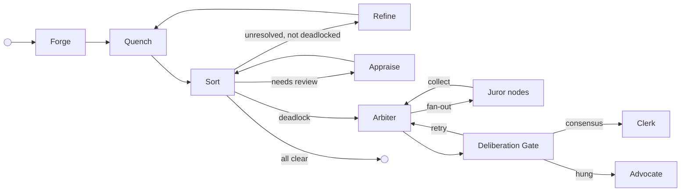
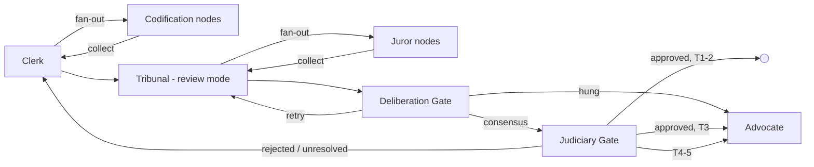
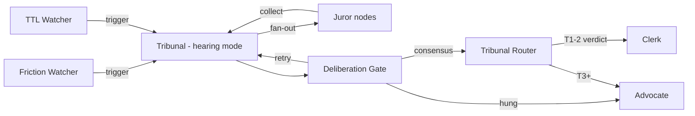
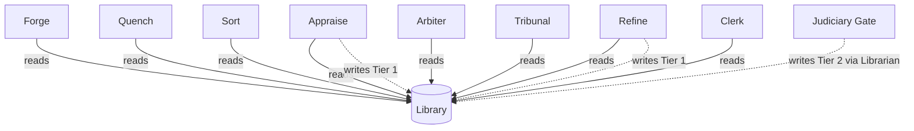

# The Foundry Cycle

The Foundry Cycle is the reference arrangement — a standard pattern of node roles that demonstrates how adversarial cycles of creation, validation, review, and refinement drive unreliable agents to produce artefacts that are provably compliant with a body of governance. It is not the only way to structure a Flow. It is the way the standard library structures one, and the pattern [Flow Architects](../05-reference/glossary.md#flow-architect) are expected to adapt to their specific problem space.

The standard library provides configurable reference implementations for each node role as container images. [Flow Architects](../05-reference/glossary.md#flow-architect) can extend them, adapt them, merge responsibilities across fewer nodes, split them across more, or implement completely custom nodes. The platform enforces behaviour through [capabilities and configuration](../02-flow/05-configuration.md) — not node names. A node named "Validator" that holds the same capabilities as the reference Sort node behaves identically from the platform's perspective.

The Judiciary is the exception. It is a standard runtime subsystem present in every Flow, not a swappable reference implementation. [Flow Architects](../05-reference/glossary.md#flow-architect) do not choose whether to include it.

---

## Node Roles

### Forge (Creator)

Forge creates the initial artefact. Before generation, it reads the Flow's [Library](../02-flow/04-system-services.md#librarian) of applicable [law](./03-data-model.md#laws), filtered by governed artefact name, and seeds it into its context — so the creator knows the rules before it starts. In the reference arrangement, Forge reads laws exclusively; it does not write them. The platform enforces this through capability grants: a node without a `WRITE:law/tierN` capability grant cannot write laws regardless of its role.

### Quench (Deterministic Validator)

Quench performs deterministic validation. It queries the law body for executable [representations](./03-data-model.md#representations) — formal logic, constraint schemas, compiled checks — and runs them against the artefact to verify deterministic compliance before it reaches the more expensive review stage. In the reference arrangement, Quench can apply deterministic validation stamps (e.g., "linter") when granted the appropriate `STAMP` capability. Quench is optional. Topologies that rely exclusively on non-deterministic review can omit it, routing directly from Forge to the gate node.

### Appraise (Reviewer)

Appraise conducts subjective review. It reads the applicable laws for the governed artefact and orchestrates a panel of specialist reviewers (AI agents, human reviewers, or both) who evaluate the artefact against them. Appraise intentionally preserves contradictions in its feedback — resolving them is Refine's job. In the reference arrangement, Appraise holds the `WRITE:law/tier1` capability and can record Tier 1 [Findings](./03-data-model.md#law-tiers) — emergent patterns observed during review.

### Sort (Gate)

Sort is the central routing hub. It evaluates governance state and routes. Granted the `READ:flow` capability, Sort reads the [Flow configuration](../02-flow/05-configuration.md) to discover which nodes can provide which [stamps](./03-data-model.md#passports-and-stamps), then applies its routing rules:

1. Is there unresolved [feedback](./03-data-model.md#feedback) that is not deadlocked? Route to **Refine**.
2. Is feedback deadlocked (arguing in circles)? Route to **Arbiter**.
3. Missing required stamps? Route to the node configured to provide them (Appraise, in the reference arrangement).
4. All feedback resolved, all required stamps present? Stamp **approval**, call `complete()`, and let the [Operator](../02-flow/01-operator.md) validate the bound [exit contract](./03-data-model.md#entry-and-exit-contracts) before marking **Completed**.

Sort is a gate. It evaluates state, consults the Flow config for routing targets, and — in the reference arrangement for governed artefact processing — acts as the exit-bound node: it stamps approval when the passport is complete and all feedback is resolved, then calls `complete()`.

Sort queries artefact state through the [SDK](../04-sdk/01-sdk-core.md) — `artefact.hasUnresolvedFeedback()`, `artefact.getStamps()` — the same interface available to every node. The `READ:flow` capability enables topology discovery via [`GetFlowTopology`](../05-reference/grpc-api.md#node-facing-methods-via-sidecar); Sort calls this at assignment time to build stamp-to-provider mappings from peer node capabilities and to resolve its own exit contract. Any node granted `READ:flow` capability can query the same topology information.

### Refine (Refiner)

Refine addresses feedback. It reads the applicable laws for the governed artefact, reviews the consolidated (potentially contradictory) feedback, produces a new artefact version, and must address every item — marking each as *actioned* or *Won't Fix*. A Won't Fix requires a structured [justification](./03-data-model.md#forced-choice-justification): either a citation of existing law or a novel argument proposing new reasoning. In the reference arrangement, Refine holds the `WRITE:law/tier1` capability and can record Tier 1 Findings.

### The Judiciary — Standard Subsystem

The Judiciary is the judicial branch of the Flow. It is built into the runtime as a standard subsystem — every Flow includes it, and Flow Architects do not choose whether to include it. All deliberation and legislative processes are externalised into the flow topology as node-based Workitem transitions — every step produces auditable artefacts with full friction tracking.

The Judiciary comprises orchestration nodes (Arbiter, Tribunal, Advocate), deliberation nodes (Juror, Deliberation Gate), watcher nodes (Friction Watcher, TTL Watcher), and a legislative inner cycle (Clerk, Codification nodes, Tribunal Router, Judiciary Gate). All are Operator-provisioned.

#### Arbiter (Deadlock Resolver)

The Arbiter resolves deadlocked feedback disputes. When the gate node detects that a feedback item's history depth warrants escalation, it transitions the item to `deadlocked` and routes the Workitem to the Arbiter. The Arbiter assembles evidence (artefact content, feedback history, relevant laws, friction data), fans out to [Juror](#juror-judicial-agent) nodes using [child Workitems](../02-flow/02-workitem.md#child-workitems), and collects their verdicts. The Workitem then routes to the [Deliberation Gate](#deliberation-gate-consensus-tally) for consensus tally. On consensus (or after HITL resolution of a hung jury), the verdict flows to the [Clerk](#clerk-petition-drafter) to draft a Tier 2 Ruling as a petition. The feedback item's `linkedRuling` is set to this Ruling regardless of which side the Arbiter favours, and the Workitem routes back to Sort for re-evaluation.

The Arbiter holds the `WRITE:law/tier2` capability — Tier 2 Rulings are both the floor and the ceiling of its judicial authority, and the ceiling grant also covers Tier 1. The Arbiter does not write Tier 1 Findings by convention; its role is judicial, not observational. Its full [authority ceiling](./04-governance.md#judiciary-authority-ceiling) is constitutionally bounded.

#### Tribunal (Hearing Conductor)

The Tribunal conducts review hearings on laws and reviews petitions from the Clerk. It operates in two modes, distinguished by the artefacts present on the Workitem:

**Hearing mode.** When a law's accumulated friction crosses its tier's configured threshold, the [Friction Watcher](#friction-watcher) node creates a hearing Workitem. When a law's age exceeds its tier's configured review TTL, the [TTL Watcher](#ttl-watcher) node creates a hearing Workitem. Both watcher nodes store a `law-reference` artefact and route to the Tribunal. The Tribunal assembles evidence (the law under review, friction data, related laws), fans out to [Juror](#juror-judicial-agent) nodes, and collects their verdicts. The Workitem then routes to the [Deliberation Gate](#deliberation-gate-consensus-tally) for consensus tally. On consensus, the [Tribunal Router](#tribunal-router) reads the tier from the law-reference artefact and routes accordingly:

- **Tier 1–2 verdict**: Route to [Clerk](#clerk-petition-drafter) to draft a petition (promote, retire, or demote).
- **Tier 3+**: Route to [Advocate](#advocate-human-escalation) for petition or appeal.

**Review mode.** When the Clerk drafts a petition and routes it for review (mirroring how Appraise reviews Forge's artefacts), the Tribunal reads the petition artefact, reviews it against governance context, fans out to [Juror](#juror-judicial-agent) nodes for deliberation, and routes to the [Deliberation Gate](#deliberation-gate-consensus-tally). On consensus, the Workitem flows to the [Judiciary Gate](#judiciary-gate).

Hearing Workitems carry a `law-reference` artefact containing the law ID under review. Review Workitems carry a `petition` artefact.

#### Advocate (Human Escalation)

The Advocate is the Judiciary's [human-in-the-loop](../03-node/03-patterns.md#human-in-the-loop-pattern) node. It receives work that exceeds automated judicial authority:

- **Hung jury**: When the [Deliberation Gate](#deliberation-gate-consensus-tally) produces a `hung` output (consensus not reached after the configured maximum rounds), the Workitem routes to the Advocate for human decision.
- **Tier 3+ hearing**: When the [Tribunal Router](#tribunal-router) routes a Tier 3+ verdict, the Advocate presents it to a human for ratification or appeal.
- **Tier 3+ ratification**: When the [Judiciary Gate](#judiciary-gate) routes an approved Tier 3 petition, the Advocate presents it for HITL ratification before application.
- **Tier 4–5 escalation**: The Advocate files an appeal to the [Governance Flow](./04-governance.md) via the Librarian.

The Advocate uses the SDK's [HITL pattern](../04-sdk/08-sdk-hitl.md) — exposing a queue interface for human reviewers, persisting pending decisions in local storage, and maintaining heartbeats while awaiting human input. Escalation patterns (timeout chains, delegation, pool routing) are built on top of this base. HITL decisions route to the [Clerk](#clerk-petition-drafter) so they are codified as petitions and go through the normal review cycle.

#### Juror (Judicial Agent)

The Juror is the deliberation primitive. A single Juror node image loads different agent configurations at fan-out time to maximise diversity of judicial philosophy for the jury size required. Each Juror receives a child Workitem containing: the question to deliberate, evidence artefacts, prior-round reasoning (if a retry), and allowed outcomes. It runs a [FoundryAgent](../04-sdk/07-sdk-agent.md) with the loaded judicial personality and produces a structured verdict artefact (outcome + reasoning). It then calls `Complete()`.

Juror nodes are shared across both the Arbiter path and the Tribunal path. The Arbiter and Tribunal are responsible for framing the question and assembling evidence; the Juror only deliberates.

#### Deliberation Gate (Consensus Tally)

The Deliberation Gate is a generic consensus tally node. It reads juror verdict artefacts from the Workitem (the parent collected them after fan-in), applies the configured consensus strategy (simple majority, super-majority, or unanimity), and tracks the round count. It has three well-known outputs:

- **`consensus`**: The jury reached agreement. Route to the next step (Clerk for Arbiter path, Tribunal Router for hearing path, Judiciary Gate for review path).
- **`retry`**: No consensus, but rounds remain. Route back to the fan-out parent (Arbiter or Tribunal) for another round with prior-round reasoning attached.
- **`hung`**: No consensus and maximum rounds exhausted. Route to the [Advocate](#advocate-human-escalation) for human decision.

The Deliberation Gate does not know about tiers, petitions, or law semantics. It tallies votes and routes.

#### Clerk (Petition Drafter)

The Clerk drafts and revises [petition](#petition-artefact) artefacts — structured YAML/Markdown documents describing proposed law changes. It receives verdict and context artefacts (from Arbiter consensus, HITL decision, or Tribunal hearing verdict), drafts the petition with prose description, fans out to [Codification](#codification-nodes) nodes for formal representations, collects codification results, and assembles the complete petition (prose + formal representations). The petition then routes to the [Tribunal](#tribunal-hearing-conductor) for review (review mode).

On revision (feedback from the Tribunal via the [Judiciary Gate](#judiciary-gate)), the Clerk reads the feedback, revises the petition, re-fans-out for codification, and re-routes to the Tribunal.

#### Codification Nodes

Codification nodes produce formal representations of laws. Each node receives a child Workitem containing the law goal and context as artefacts, produces a formal representation in its declared output format (Rego, SMT-LIB, prose, etc.), and calls `Complete()`. The Clerk fans out to the appropriate Codification nodes based on which representations are needed.

#### Tribunal Router

The Tribunal Router handles post-hearing routing. After the Deliberation Gate reaches consensus on a hearing, the Tribunal Router reads the verdict artefacts and the law-reference artefact (for tier context) and routes:

- **Tier 1–2 verdict**: Route to [Clerk](#clerk-petition-drafter) to draft a petition.
- **Tier 2 promote to Tier 3**: Route to [Advocate](#advocate-human-escalation) for HITL ratification.
- **Tier 3+**: Route to [Advocate](#advocate-human-escalation) for petition or appeal.

The Tribunal Router is distinct from the [Judiciary Gate](#judiciary-gate): it routes after hearings (before the inner cycle), while the Judiciary Gate routes after petition review (after the inner cycle).

#### Judiciary Gate

The Judiciary Gate mirrors Sort for the judiciary's inner cycle. After the Tribunal reviews a petition and the Deliberation Gate reaches consensus, the Judiciary Gate checks feedback resolution on the petition artefact and routes:

- **Approved, all feedback resolved, Tier 1–2**: Apply the petition via the Librarian (`WriteLaw`/`RetireLaw`), add approval stamp, done.
- **Rejected or unresolved feedback**: Route back to the [Clerk](#clerk-petition-drafter) for revision.
- **Approved, Tier 3**: Route to the [Advocate](#advocate-human-escalation) for HITL ratification, then apply.
- **Tier 4–5**: Route to the [Advocate](#advocate-human-escalation), then to the [Governance Flow](./04-governance.md).

#### Friction Watcher

The Friction Watcher is an entry-bound watcher node that subscribes to the [Flow Event Bus](../02-flow/04-system-services.md#flow-event-bus) friction channel for `friction.threshold_crossed` events. When a law's accumulated friction crosses its tier's configured threshold, the Friction Watcher creates a hearing Workitem via `CreateWorkitem`, stores a `law-reference` artefact containing the law ID, and routes to the [Tribunal](#tribunal-hearing-conductor) via its `default` output. The Friction Watcher tracks pending hearing law IDs to prevent duplicate hearing creation for the same law.

#### TTL Watcher

The TTL Watcher is an entry-bound watcher node that periodically polls the [Librarian](../02-flow/04-system-services.md#librarian) via `QueryLaws` for laws whose age exceeds their tier's configured review TTL. On expiry, the TTL Watcher creates a hearing Workitem via `CreateWorkitem`, stores a `law-reference` artefact containing the law ID, and routes to the [Tribunal](#tribunal-hearing-conductor) via its `default` output. The TTL Watcher tracks pending hearing law IDs to prevent duplicate hearing creation for the same law. Per-tier TTL durations are configured via node config.

#### Petition Artefact

A petition is a structured YAML/Markdown [GovernedArtefact](./03-data-model.md#artefacts) containing the complete proposed change set. It is human-readable — a HITL reviewer can read it directly. The petition includes context (trigger, source, verdict, justification) and one or more proposed changes (create, retire, demote), each with the goal, applicable representations, and tier.

---

## Cycle Topology

### Main Cycle

### Judiciary Inner Cycle

### Hearing Path

In the reference arrangement, Refine routes back through Quench — deterministic validation runs again on the revised artefact. Topologies without Quench route Refine directly to Sort (or to whatever gate node the Flow Architect has configured). Deadlock-escalated governed-work assignments route through the Arbiter, Juror fan-out, Deliberation Gate, and Clerk before the resulting petition enters the judiciary inner cycle (Tribunal review, Judiciary Gate). Review-hearing [Workitems](./03-data-model.md#workitems) follow the hearing path through the Tribunal, Deliberation Gate, and Tribunal Router. Human escalations are handled by the Advocate.

---

## Law Authority in the Cycle

All nodes in the cycle can **read** laws from the Library. Only some can **write**:

Forge reads laws for context seeding. Quench and Sort are read-only consumers. Appraise and Refine can record Tier 1 Findings (emergent patterns) — any node granted the `WRITE:law/tier1` capability can do the same, regardless of whether it bears one of these names. The Arbiter and Tribunal hold `WRITE:law/tier2`, and the [Judiciary Gate](#judiciary-gate) applies approved petitions to the Library via the Librarian (`WriteLaw`/`RetireLaw`). The [Clerk](#clerk-petition-drafter) drafts petitions and fans out to [Codification](#codification-nodes) nodes for formal representations, but law writes are performed by the Judiciary Gate after the petition has been reviewed and approved. The judiciary's [authority ceiling](./04-governance.md#judiciary-authority-ceiling) is constitutionally bounded.

The underlying platform mechanism is capability-gated law access. Law read and write permissions are granted per node through the FoundryNode CRD. The reference arrangement maps these capabilities to specific roles, but a custom topology can distribute them differently.

---

## Adapting the Arrangement

The reference arrangement is a starting point. [Flow Architects](../05-reference/glossary.md#flow-architect) adapt it to their context:

- **Add nodes.** A topology might insert a "Translate" node between Forge and Quench, or add a second review stage with different stamp authority.
- **Merge responsibilities.** A simple topology might combine validation and review into a single node that holds both deterministic and non-deterministic capabilities.
- **Split gate nodes.** A complex topology might use separate gate nodes for feedback routing and stamp verification.
- **Replace reference implementations.** The standard library containers are configurable, but a Flow Architect can implement entirely custom nodes that fulfil the same platform contracts.
- **Omit optional nodes.** Quench is optional. Topologies without deterministic validation omit it entirely.

The platform enforces behaviour through capabilities, contracts, and Operator validation — not through node names or a fixed topology. A Flow that uses none of the reference node names but grants the same capabilities and binds the same contracts produces identical governance outcomes.
