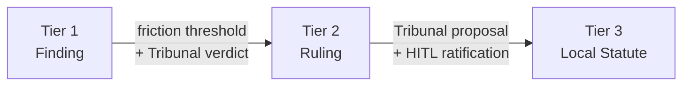
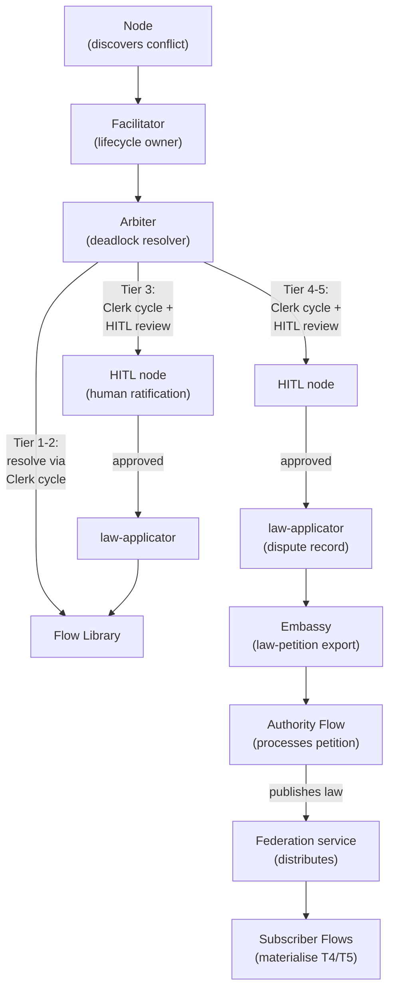

# Governance

A [Flow](./00-overview.md) is a sovereign micro-state. It has a body of [law](./03-data-model.md#laws), a [Judiciary](./02-foundry-cycle.md#the-judiciary--standard-subsystem) that resolves disputes, and a legislative authority that codifies policy. Governance is the runtime's constitutional structure.

---

## The Legal Metaphor

| Authority | Function | Institutional Counterpart |
|--------|----------|--------------------------|
| **Common Law** | Establishes norms through practice | Nodes with `WRITE:law/tier1` capability ([Appraise](./02-foundry-cycle.md#appraise-reviewer), [Refine](./02-foundry-cycle.md#refine-refiner) in the reference arrangement) — Tier 1 [Findings](./03-data-model.md#law-tiers) |
| **Judiciary** | Resolves disputes, codifies precedent | [Judiciary](./02-foundry-cycle.md#the-judiciary--standard-subsystem) — [Facilitator](./02-foundry-cycle.md#facilitator) (lifecycle), [Arbiter](./02-foundry-cycle.md#arbiter-deadlock-resolver) (disputes), [Tribunal](./02-foundry-cycle.md#tribunal-hearing-conductor) (hearings), [HITL nodes](./02-foundry-cycle.md#hitl-nodes) (human review) — Tier 2 [Rulings](./03-data-model.md#law-tiers) |
| **Legislature** | Enacts statute through ratified process | Flow Architect (Tier 3), [Federation authority publishers](#federation-and-published-law-distribution) (Tier 4/5) |
| **Executive** | Enforces compliance | Gate node ([Sort](./02-foundry-cycle.md#sort-gate) in the reference arrangement), [Exit Contract](./03-data-model.md#entry-and-exit-contracts), [Sidecar](../03-node/01-sidecar.md) |

Law hardens through these branches in sequence. Nodes observe patterns during work and record [Findings](./03-data-model.md#law-tiers) — common law that emerges from practice. When Findings conflict or accumulate enough [friction](./00-overview.md#friction), the [Arbiter](./02-foundry-cycle.md#arbiter-deadlock-resolver) adjudicates and codifies the result as a binding Tier 2 Ruling — precedent forged through judicial process. Rulings that prove durable can be proposed as Tier 3 statutes, but statute requires human ratification. The executive enforces whatever law exists at each tier, without interpretation.

---

## Standalone Governance

A standalone Flow (no [federation membership](#federation-and-published-law-distribution)) manages its own governance through complementary mechanisms.

### Organic Discovery (Tiers 1–2)

Laws emerge from work. When a node encounters a situation that warrants a rule — a pattern, a constraint, a quality standard — it records a Tier 1 Finding through the [SDK](../04-sdk/01-sdk-core.md). Findings are ephemeral. They decay if unused. Nodes that use a law [cite](../04-sdk/03-sdk-legal.md#citation) it through the SDK, which records a low-magnitude [friction](./00-overview.md#friction) event attributed to that law. The [Friction Ledger](../02-flow/04-system-services.md#friction-ledger) aggregates these events, and the [Librarian](../02-flow/04-system-services.md) periodically queries the accumulated friction on each law.

Findings that prove useful — cited frequently across [Workitems](./03-data-model.md#workitems) — accumulate friction that can trigger a **review hearing**. The [Friction Watcher](./02-foundry-cycle.md#friction-watcher) node detects when a Finding's friction crosses a configurable threshold and creates a Workitem for review-hearing processing, routed to the [Tribunal](./02-foundry-cycle.md#tribunal-hearing-conductor) node.

The Tribunal evaluates the Finding's friction level and goal, and renders a verdict:

| Verdict | Effect |
|---------|--------|
| **Retire** | Finding is deleted. History preserved in the audit log. |
| **Promote** | Finding is minted as a Tier 2 Ruling — binding precedent |

A Finding that does not accumulate enough friction to trigger a review hearing will enter a review hearing when its tier's configured review TTL expires, detected by the [TTL Watcher](./02-foundry-cycle.md#ttl-watcher) node.

### Administered Policy (Tier 3)

Tier 3 Local Statutes are the Flow's own legislative authority. For standalone Flows, these are [laws](./03-data-model.md#laws) applied by an administrator — typically via declarative configuration. They have no automatic decay.

The [Librarian](../02-flow/04-system-services.md) admits externally applied laws into the active law body only after governance checks complete. Integration sequencing and activation mechanics are defined in [System Services](../02-flow/04-system-services.md).

### Judicial Review

The [Judiciary](./02-foundry-cycle.md#the-judiciary--standard-subsystem) is the judicial branch. It is invoked when governance reaches an impasse:

1. **Feedback deadlock.** When a gate node determines that a [feedback](./03-data-model.md#feedback) item's history depth warrants escalation, it transitions the item to `deadlocked` and routes the Workitem to the [Facilitator](./02-foundry-cycle.md#facilitator). In the [reference arrangement](./02-foundry-cycle.md), this gate role is performed by [Sort](./02-foundry-cycle.md#sort-gate). The Facilitator assembles an evidence bundle, creates a child Workitem for the [Arbiter](./02-foundry-cycle.md#arbiter-deadlock-resolver), and suspends. The Arbiter fans out to [Juror](./02-foundry-cycle.md#juror-judicial-agent) nodes for multi-agent deliberation — examining the investigative history (the forced-choice justifications, the citations, the novel arguments) — and tallies the verdicts internally. On consensus, the Arbiter creates a child Workitem for the [Clerk cycle](./02-foundry-cycle.md#clerk-cycle), which drafts a petition to retire the conflicting laws and mint a new Tier 2 Ruling. The petition goes through the Clerk cycle's quality process before the law is applied via the Librarian by [law-applicator](./02-foundry-cycle.md#law-applicator). The feedback item's `linkedRuling` is set to this Ruling regardless of which side the Arbiter favours.

    Juror deliberation is itself a friction source. Each deliberation round emits [friction](./03-data-model.md#friction) with magnitude = depth ^ (round + 1), where depth is the feedback depth at escalation. A depth-5 item costs 25 on the first round, 125 on the second, 625 on the third. If the Arbiter cannot reach consensus and the dispute escalates to a [HITL node](./02-foundry-cycle.md#hitl-nodes) for human intervention, a single friction event is emitted with magnitude = depth ^ (rounds * 2) — a depth-5 item after 3 rounds produces 15,625. The cost curve ensures that disputes reaching the Arbiter are visibly expensive, and disputes reaching humans are dramatically so.

2. **Review hearing.** When a law's accumulated friction crosses its tier's configured threshold, or when a Tier 1-2 law's age exceeds its configured review TTL, the [Friction Watcher](./02-foundry-cycle.md#friction-watcher) or [TTL Watcher](./02-foundry-cycle.md#ttl-watcher) node triggers a review hearing. Friction thresholds are configurable for every law tier; review TTLs apply only to Tier 1 Findings and Tier 2 Rulings in the FoundryFlow [governance policy](../05-reference/crds.md#governance-policy). The law remains active during the hearing. The [Tribunal](./02-foundry-cycle.md#tribunal-hearing-conductor) fans out to Jurors, tallies internally, and on consensus creates a child Workitem for the [Clerk cycle](./02-foundry-cycle.md#clerk-cycle) with a `verdict-context` artefact (fire-and-forget). Friction hearings can target any tier, including imported Tier 4-5 laws — a hearing verdict on a T4-5 law feeds a Clerk cycle that later routes through [law-applicator](./02-foundry-cycle.md#law-applicator) and the [Embassy](../02-flow/06-cross-flow.md) as a `law-petition` to the authority. On hung jury, the Tribunal routes to a [HITL node](./02-foundry-cycle.md#hitl-nodes). Hearing Workitems carry a `law-reference` artefact containing the law ID under review. They do not introduce a Workitem subtype or a `spec.type` discriminator.

The Judiciary's verdicts are enforced by the [Contempt Guard](./03-data-model.md#contempt-guard). Once a ruling is linked to a feedback item, the losing side must accept the verdict — [Archivist](../02-flow/04-system-services.md) rejects contradictory transitions with `CONTEMPT_VIOLATION`.

---

## Precedent

Precedent is the mechanism by which governance hardens over time. A Tier 1 Finding is soft — it decays, it can be ignored at the cost of friction. A Tier 2 Ruling is binding — it was forged in adversarial review, and its authority derives from the judicial process that produced it.

### Promotion

The promotion path runs upward through the tiers:



Tier 1 to Tier 2 is automatic upon the Tribunal's verdict. Tier 2 to Tier 3 is never automatic — the Tribunal can propose a statute, but a human must ratify it via [HITL review](./02-foundry-cycle.md#hitl-nodes) in the Clerk cycle. This boundary is absolute. Statutes auto-retire conflicting lower-tier laws, and that power requires human judgement.

Promotion is also where governance can harden in *form*, not just authority. When promoted, a Finding can gain new [representations](./03-data-model.md#representations) — for example, formal logic alongside the original prose — increasing enforceability without changing its goal. Representation lifecycle responsibilities — including specialised [translation services](../02-flow/04-system-services.md#codification-services) that translate goals into formal representations — are defined in [System Services](../02-flow/04-system-services.md).

### Decay and Retirement

All law tiers can be reviewed, but not all tiers use the same trigger. Tier 1-2 laws can be reviewed by TTL expiry or friction thresholds; Tier 3-5 laws are reviewed through friction-triggered hearings or explicit authority action. The law remains active during the hearing. The Tribunal evaluates the case — considering the law's accumulated [friction](./00-overview.md#friction) (queried from the [Friction Ledger](../02-flow/04-system-services.md#friction-ledger)) and the law's goal — and renders a tier-specific verdict:

**Tier 1 Finding — review hearing:**

| Verdict | Effect |
|---------|--------|
| **Retire** | Finding is deleted. History preserved in the audit log. |
| **Promote** | Finding is minted as a Tier 2 Ruling. |

**Tier 2 Ruling — review hearing:**

| Verdict | Effect |
|---------|--------|
| **Retire** | Ruling is deleted. History preserved in the audit log. |
| **Promote** | Ruling is petitioned for HITL ratification via [hitl-appraise](./02-foundry-cycle.md#hitl-nodes) in the Clerk cycle for Tier 3 Local Statute ratification. |
| **Demote** | Ruling drops to Tier 1 Finding. |

Every review hearing produces a decisive outcome — promote, retire, or demote.

Retired laws are deleted. The full history — creation, citations, conflicts, retirement — is preserved in the audit log.

### Conflict Resolution During Work

When nodes cite conflicting laws during Workitem processing — not at integration time, but during the adversarial loop — the conflict is routed to the [Arbiter](./02-foundry-cycle.md#arbiter-deadlock-resolver) for judicial review. Supremacy heavily informs the outcome but does not bypass deliberation. Resolution depends on the tiers involved:

| Conflict | Resolution |
|----------|------------|
| **Tier 1 vs Tier 2** (cross-tier) | The Arbiter fans out to [Juror](./02-foundry-cycle.md#juror-judicial-agent) nodes for deliberation. Supremacy heavily informs the outcome — the higher-tier law carries greater authority — but the Arbiter still adjudicates. The [Clerk cycle](./02-foundry-cycle.md#clerk-cycle) drafts a petition for a new Tier 2 Ruling consolidating the surviving position. Originals retired after the petition is approved. |
| **Same tier** (Tier 1 vs Tier 1, or Tier 2 vs Tier 2) | The Arbiter fans out to Juror nodes and the Clerk cycle drafts a petition for a new Tier 2 Ruling consolidating the conflicting laws. Originals retired after the petition is approved. |
| **Tier 1–2 vs Tier 3** | The lower-tier law is retired. If the conflict reveals ambiguity or a gap in the Tier 3 statute, the Clerk cycle drafts a T3 petition routed to [HITL review](./02-foundry-cycle.md#hitl-nodes) for a proposed clarification or amendment. |
| **Tier 3 vs Tier 3** | The Clerk cycle drafts a *proposal* for a consolidated Tier 3 statute, routed to [HITL review](./02-foundry-cycle.md#hitl-nodes). On rejection, the conflict persists — every future Workitem that encounters the same conflict generates another HITL escalation and more friction until the humans act. |
| **Tier 4 or Tier 5 involvement** | The Clerk cycle drafts a `law-petition` that [law-applicator](./02-foundry-cycle.md#law-applicator) routes to the [Embassy](../02-flow/06-cross-flow.md) for export to the relevant authority Flow. A [dispute record](./03-data-model.md#dispute-records) is created, and affected Workitems are held in `pending-hold` until the authority responds. |

### Judiciary Authority Ceiling

The Judiciary's power is constitutionally bounded. The Arbiter and Tribunal share the same authority ceiling:

| Tier range | Authority | Action |
|------------|-----------|--------|
| Tier 1 | **None** (by convention) | The Arbiter and Tribunal hold `WRITE:law/tier2` (which covers Tier 1), but do not write Findings — their role is judicial, not observational. Tier 2 Rulings are the exclusive output of their authority, drafted by the [Clerk cycle](./02-foundry-cycle.md#clerk-cycle) and applied by [law-applicator](./02-foundry-cycle.md#law-applicator) via the Librarian. |
| Tier 2 | **Resolve** | Full judicial authority. Can retire, consolidate, and mint new Tier 2 Rulings through the petition process (Clerk cycle drafts, reviews, law-applicator applies). |
| Tier 3 | **Propose** | Drafts a proposal. Routes to [HITL review](./02-foundry-cycle.md#hitl-nodes) in the Clerk cycle for ratification. |
| Tier 4–5 | **Petition** | Drafts a `law-petition`. [law-applicator](./02-foundry-cycle.md#law-applicator) creates a [dispute record](./03-data-model.md#dispute-records) and routes to the [Embassy](../02-flow/06-cross-flow.md) for export to the relevant authority Flow. Cannot directly modify. |

When a human rejects a Tier 3 proposal via HITL review, the conflicting statutes remain active. Every future Workitem that hits the same conflict generates another Judiciary invocation, another HITL escalation, and more [friction](./00-overview.md#friction). The system does not force the humans' hand. It measures the cost of the decision until someone acts.

---

## Federation and Published Law Distribution

There is no special Governance Flow runtime. Ordinary Flows join a [Federation](../02-flow/08-federation.md) that defines trust, membership, and role / relationship policy. The federation model replaces the previous Governance Flow design entirely.

### Federation Membership

When a Flow joins a federation, it gains:

- **Identity** — a verified Flow identity within the federation namespace.
- **Trust root** — the federation root CA. The federation issues intermediate CA certificates to each member Flow's Operator, establishing a shared trust hierarchy.
- **Endpoint discovery** — the ability to discover and communicate with other member Flows.
- **State membership** — assignment to one or more states (federation-defined groups of Flows that share organisational relationships).

```text
Federation (Root CA)
  ├─ Flow A Operator (Intermediate CA)
  │   ├─ Forge Node (Leaf)
  │   └─ Quench Node (Leaf)
  ├─ Flow B Operator (Intermediate CA)
  │   ├─ Deploy Node (Leaf)
  │   └─ Monitor Node (Leaf)
  └─ Flow C Operator (Intermediate CA)
      └─ Optimize Node (Leaf)
```

Member Flows share a common trust root. A [stamp](./03-data-model.md#passports-and-stamps) produced by any node in any member Flow is cryptographically verifiable by tracing the certificate chain back to the federation root — without direct peer relationships between the members. Adding a new member requires a single certificate exchange with the federation, not reconfiguration of every existing Flow.

### States and Organisational Units

**States** are federation-defined groups of Flows. Sibling relationships derive from shared state membership, not a dedicated state Flow. A state might represent a business unit, a department, or a geographic region. Flows may belong to multiple states.

### Authority Publisher Roles

Federation policy designates **authority publisher** roles that determine which Flows may publish local Tier 3 laws outward:

- **State-level authority** — publishes laws that materialise as Tier 4 in subscriber Flows within the same state.
- **Federation-level authority** — publishes laws that materialise as Tier 5 across the entire federation.

Authority Flows are ordinary Flows. They run the same runtime and the same governance model as any other Flow. The only distinction is a federation-assigned publisher role that grants the right to publish laws outward.

### Publication Lifecycle

When an authority Flow marks an approved local Tier 3 law as `published`, the following sequence occurs:

1. **Submission** — the law is submitted to the [Federation service](../02-flow/08-federation.md) for publication admission.
2. **Validation** — the Federation service validates role / scope / relationship constraints and runs conflict detection against other published laws.
3. **Acceptance or rejection** — if accepted, the law is distributed to subscriber Flows. If rejected, a structured conflict / authorisation report is returned to the source Flow.
4. **Materialisation** — accepted state publications materialise as Tier 4 laws in subscriber Flows. Accepted federation-wide publications materialise as Tier 5 laws. The law remains Tier 3 in its source Flow.

### Higher-Authority Escalation

Escalation flows in the opposite direction from publication. When a Flow's Clerk cycle produces a T4-5 petition (challenging or requesting changes to an imported law), the [law-applicator](./02-foundry-cycle.md#law-applicator) creates a [dispute record](./03-data-model.md#dispute-records) and routes to the [Embassy](../02-flow/06-cross-flow.md) for export as a `law-petition` to the relevant authority Flow (determined by federation policy).

The originating Flow does not wait for remote deliberation. The local Workitem completes after handoff, and affected Workitems are held in `pending-hold` (suspended, keyed on the `petition_id`) until the authority accepts or rejects the petition.

The authority Flow receives the `law-petition` through its Embassy and processes it through its own governance cycle. If the authority approves and publishes a new or amended law, the `petition_id` is carried in the law's provenance metadata, enabling the originating Flow's [petition-outcome-watcher](../02-flow/08-federation.md#petition-outcome-watcher) to match the published law to the active dispute record.

### The Escalation Chain



Nodes raise issues. The Facilitator assembles evidence and delegates to the Arbiter. The Arbiter adjudicates within its tier — fanning out to Juror nodes for deliberation, with the Clerk cycle drafting petitions and law-applicator applying approved laws. HITL nodes provide human review for T3+ petitions. For T4-5 petitions, law-applicator creates a dispute record and routes to the Embassy for export to the authority Flow. The authority Flow legislates within its scope. The Federation service distributes accepted publications. The escalation path sends the conflict to the institution with the authority to resolve it.

### Law Integration Protocol

When published laws are distributed to a subscriber Flow, the receiving [Librarian](../02-flow/04-system-services.md) runs a two-stage conflict check before integration.

#### Stage 1: Semantic Search

The Librarian queries its semantic index for all existing laws above a configurable similarity threshold. This finds laws that are *semantically related* to the incoming law — potential conflicts, overlaps, or redundancies.

#### Stage 2: Conflict Evaluation

Each candidate from the semantic search is evaluated by an LLM for actual contradiction. Semantic similarity does not always mean conflict. Two laws about code style may be related but compatible. The LLM determines whether there is a genuine contradiction.

#### Resolution by Tier

If a conflict is confirmed, resolution depends on the tier of the conflicting local law:

| Conflicting Local Law | Resolution |
|-----------------------|------------|
| **Tier 1 or Tier 2** | Immediate retirement. The lower-tier law is replaced by the incoming higher-tier law. No human intervention. The local law is retired; history is preserved in the audit log. |
| **Tier 3** | Integration paused. HITL notification. Supremacy is not optional — the local statute *must* change — but the Flow can request a **grace period**. |

#### Grace Period

The grace period is a formalised exemption. It acknowledges that organisations need time to adapt. Foundry Flow makes this formal and trackable.

During the grace period:

- The **old Tier 3 law remains enforced** in the Flow's Library
- The **incoming higher-tier law is queued but not active**
- The exemption has a **deadline** and is fully auditable

When the grace period expires:

- The incoming law is **integrated automatically**
- The conflicting Tier 3 law is **retired** (CRD deleted, audit log retained)
- If the Flow has not adapted, its work **starts failing governance checks** — Workitems cannot exit if they violate the now-active higher-tier law

The [exit contract](./03-data-model.md#entry-and-exit-contracts) enforces compliance organically. [Friction](./00-overview.md#friction) spikes, and the data tells the story.

---

## Standalone vs Federated

| Capability | Standalone Flow | Federated Flow |
|------------|----------------|----------------|
| **Law tiers** | Tiers 1, 2, 3 | Tiers 1, 2, 3, 4, 5 |
| **Tier 3 authority** | Administrator (declarative configuration) | Administrator or local legislative cycle. May publish for distribution. |
| **Tier 4–5** | Do not exist | Materialised from authority Flow publications via Federation service |
| **Trust root** | Flow Operator (self-signed) | Federation Root CA |
| **Cross-Flow stamps** | Treaty crossings: Embassy verifies and applies `imported-*` attestations | Federation member crossings: same Embassy naturalisation with federation trust root; Treaty crossings: same protocol with pinned certificate |
| **Escalation ceiling** | Arbiter resolves at Tier 2, HITL proposes Tier 3, no higher | HITL approves T4-5 petitions → Embassy exports `law-petition` to authority Flow |
| **Dispute records** | Not applicable (no T4-5 laws) | Created by law-applicator for T4-5 petitions; Sort routes to `pending-hold` |

A standalone Flow is fully self-contained. It can be deployed, operated, and governed without any external dependency. Federation adds higher-tier governance, cross-Flow trust, and published law distribution, but the core governance model — organic discovery, judicial review, administered policy — is identical in both configurations.

---

## Treaties

[Treaties](../02-flow/06-cross-flow.md) enable collaboration between Flows that do not share federation membership — typically across organisational boundaries. Where federation provides implicit trust through a shared root CA, a Treaty provides explicit trust through a directed trust policy with constrained import types.

A Treaty is a directed trust policy — the receiving Flow defines which `importType`s the remote Flow may use. Two-way exchange requires two separate Treaties.

The governance implication at Treaty boundaries is **naturalisation**: when a [Workitem](./03-data-model.md#workitems) crosses via the [Embassy](../02-flow/06-cross-flow.md), foreign [stamps](./03-data-model.md#passports-and-stamps) are preserved for provenance and audit. The receiving Embassy verifies required foreign stamps and applies local `imported-<stamp>` attestations. Downstream local contracts rely on these attested local stamps; foreign stamps remain for audit only. Federation-member crossings use the same Embassy protocol with the federation trust root instead of a pinned certificate. The structural details and the full Embassy transfer protocol are covered in [Cross-Flow Collaboration](../02-flow/06-cross-flow.md).

---

## Friction as Governance Signal

Friction is governance's economic conscience. The system emits friction transparently at every governance touchpoint: each law [citation](../04-sdk/03-sdk-legal.md#citation) records a small signal, each round of [feedback](./03-data-model.md#feedback) escalates the cost, and judicial and human escalation compound it exponentially. The [Friction Ledger](../02-flow/04-system-services.md#friction-ledger) aggregates these events post-hoc across whatever axes operators need. The friction signal reflects the real cost of the governance each Workitem encountered.

Friction data is law-attributable and tier-attributable. A team lead sees their local friction — which of *their* rules generate the most heat. A compliance officer sees the federated friction — which Tier 4 State Constitution laws generate the most resistance across the organisation. Every layer of governance carries a measurable price tag.

Friction data feeds back into the governance process. Laws that generate disproportionate friction surface for review — the [Friction Watcher](./02-foundry-cycle.md#friction-watcher) node subscribes to friction threshold-crossing signals and triggers hearings. Patterns of constitutional resistance point to laws that need amendment, consolidation, or repeal. The system surfaces the cost of its own governance, creating pressure toward improvement.
