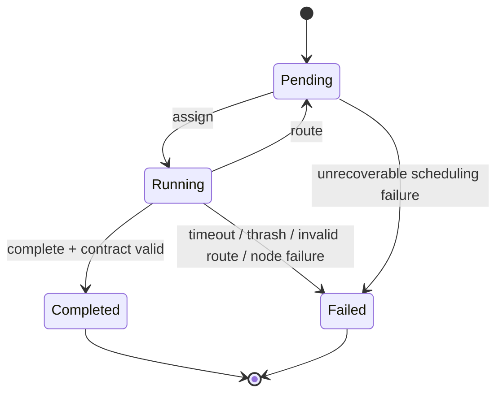
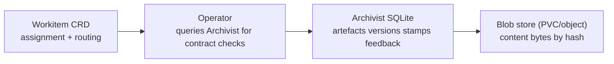
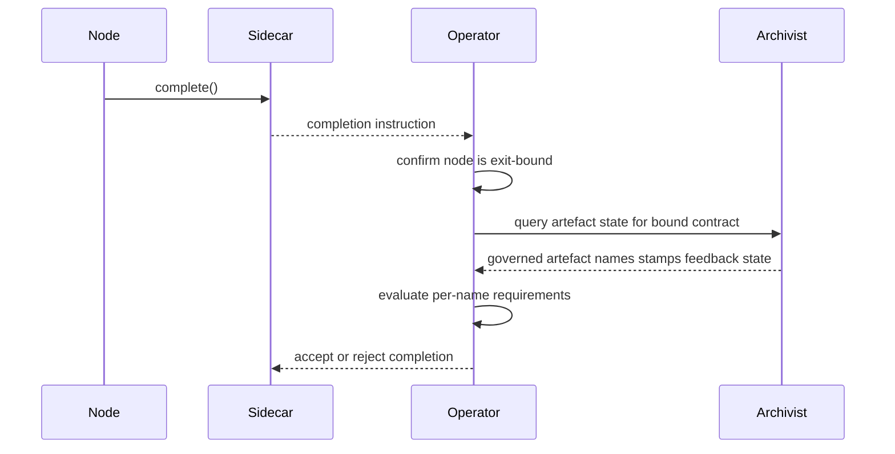

# Workitems

Workitems are the Flow control-plane state machine for work execution. They carry assignment state and routing outcomes while work moves through the runtime. Artefacts are associated with Workitems through a reverse reference in the [Archivist](../02-flow/04-system-services.md#archivist) — each artefact records the `workitem_id` it belongs to.

## Runtime Role

A Workitem is the unit of orchestration state, not the unit of provenance storage.

- It anchors assignment lifecycle in the control plane.
- It carries node routing instructions between assignments.
- It does not store artefact references, version history, stamps, or feedback bodies.
- Artefacts are associated with the Workitem in the Archivist, which records the `workitem_id` each artefact belongs to.

The Workitem state machine is single-assignee: one Workitem is assigned to exactly one node at a time.

## Ownership and Mutability Boundaries

Workitem mutability is partitioned by actor. Ownership is strict and non-overlapping.

| Surface | Owner | Mutability | Purpose |
|---|---|---|---|
| lifecycle state | Operator | Managed transitions | `Pending`, `Running`, terminal states |
| assignment fields | Operator | Managed transitions | Current and previous assignee tracking |
| routing instruction | Operator from Sidecar-submitted result | Overwrite per assignment | Next action requested by node |
| thrash counters | Operator | Increment-only | Loop budget enforcement |
| parent Workitem ID | Operator | Immutable after creation | Child-to-parent link for scoped access |

Nodes do not mutate Workitem state directly. All node-originated state changes are mediated by the [Sidecar](../03-node/01-sidecar.md), then validated and persisted by the [Flow Operator](./01-operator.md).

## Lifecycle States and Transitions

Workitem lifecycle uses deterministic control-plane states:

- `Pending`: waiting for assignment.
- `Running`: currently assigned to a node.
- `Completed`: terminal success after contract validation.
- `Failed`: terminal failure due to runtime guard or processing error.

Transition guards are fixed:

- `Pending -> Running` requires a valid target node and records current assignment ownership on the Workitem.
- `Running -> Pending` requires a valid non-terminal routing instruction.
- `Running -> Completed` requires exit-node `complete()` and successful contract validation.
- Any guard violation or runtime failure transitions to `Failed` when recovery budget is exhausted.

## Routing Instruction Contract

Each assignment ends with exactly one routing instruction.

- `route_to_output`: route by named output configured on the current node.
- `route_to`: route directly to a specific node.
- `complete`: request exit completion.

Instruction validity checks:

- Output and direct targets must resolve in current configuration.
- `complete` is valid only from exit nodes.
- Invalid instructions are rejected with structured errors and do not advance completion.

Routing semantics are runtime-level control behaviour; schema-level instruction fields are defined in [CRD Reference](../05-reference/crds.md). Error mappings are defined in [Error Catalogue](../05-reference/error-catalogue.md).

## Thrash Guard and Feedback Deadlock

Thrash and deadlock are distinct mechanisms with different sources and outcomes.

- **Thrash Guard** is infrastructure loop control on Workitem assignment history.
  - Enforcement key: total visits across all nodes.
  - Diagnostic signal: per-node counters.
  - Outcome: Workitem fails when aggregate visit budget is exceeded.

- **Feedback deadlock** is governance dispute detection on artefact feedback history.
  - Source of truth: Archivist feedback records via SDK queries.
  - Enforcement actor: gate node routing logic under configured deadlock threshold policy (the reference [Sort](../01-concepts/02-foundry-cycle.md#sort-gate) node in the standard arrangement).
  - Outcome: Workitem routes to the [Facilitator](./03-nodes-external.md#the-judiciary--standard-subsystem) for deadlock lifecycle management, which delegates to the Arbiter via child Workitems.

Thrash failure and governance deadlock escalation are never treated as equivalent transitions.

## Artefact Association Model

Workitems do not carry artefact references. The [Archivist](../02-flow/04-system-services.md#archivist) is the single source of truth for artefact-to-Workitem relationships.

- Each artefact in the Archivist records the `workitem_id` it belongs to.
- Each artefact has an `id` (unique within the Workitem) and a `governed_artefact` (immutable for a given `id`).
- Multiple artefacts with the same `governed_artefact` are supported through distinct `id` values.
- The Archivist enforces identity rules: existing `id` with a different `governed_artefact` is rejected as `ARTEFACT_KIND_CONFLICT`.

Nodes interact with artefacts through SDK abstractions (for example, storing artefact content by `id`). The Sidecar submits requests to the Archivist, which persists content and maintains the artefact-to-Workitem association.

Provenance ownership is entirely within the Archivist:

- artefact identity and association -> Archivist
- version history -> Archivist
- stamps/passports -> Archivist
- feedback -> Archivist

This split keeps Workitem objects bounded and watch-efficient while preserving complete governance history.

## Entry and Exit Boundary Interaction

Entry admission and exit completion are Workitem boundary transitions controlled by configuration and Operator validation.

- Only nodes bound to an entry contract can admit Workitems into a Flow lifecycle.
- Entry checks validate the bound entry contract against current artefact state in the Archivist.
- Entry and exit contracts use the same per-name validation shape.
- Cross-flow import admission is handled by the [Embassy](./06-cross-flow.md), which creates Workitems in `Pending` and routes to the node configured for the import type in `crossFlow.importTypes` when capacity allows.
- Review-hearing admission uses the Tribunal's hearing entry binding, then Operator schedules first assignment to the Tribunal when capacity allows.

## Exit Completion Interaction

Exit completion is a Workitem state transition controlled by configuration and Operator validation.

- Only exit nodes may emit `complete()`.
- Exit binding is fixed in node configuration.
- The node does not choose a contract at runtime.
- Operator validates the bound exit contract against current artefact state in the Archivist.
- In the reference arrangement, governed artefact completion is user-configured through Sort, while review-hearing Workitems complete through the Tribunal's hearing exit binding.

Contract evaluation rules:

- Requirements are keyed by governed artefact name.
- Required stamp lists are name-based governance checkpoints.
- Empty stamp list means presence-only for that governed artefact name.
- Empty contract means no artefact requirements.
- If multiple artefacts with a required governed artefact name exist, all must satisfy the requirement.

If validation fails, completion is rejected and the Workitem does not transition to `Completed`.

Cross-flow export is not triggered by arbitrary node completion. Export becomes possible only when a Workitem is routed to the [Embassy](./06-cross-flow.md), whose bound exit contract defines which governed artefact names are export-eligible. An empty contract exports metadata only.

## No Workitem Context Bag

Workitems have no freeform context object. There is no `status.context` and no reserved key namespace for bag-style metadata.

All relevant work context must be represented by explicit Workitem state and governed artefacts.

## Child Workitems

Child Workitems are a platform primitive for parallel work decomposition. A node processing a parent Workitem can create one or more child Workitems, attach artefacts to them, route them for independent processing, and later collect results from the completed children.

### Parent-Child Relationship

A child Workitem is linked to its parent through the `ParentWorkitemID` field on the child's `status` block. This field is Operator-managed and set at creation time. The Operator also applies a `flow.gideas.io/parent` label to the child Workitem CRD for efficient querying.

Child Workitems are internal implementation details of the parent's processing. They are not governed work units — they do not participate in Flow-level entry or exit contracts and are not independently observable by other nodes unless those nodes hold the parent Workitem.

### Child Workitem Lifecycle

Child Workitems follow the same state machine as root Workitems (`Pending`, `Running`, `Completed`, `Failed`) with simplified boundary semantics:

- **Creation**: a node calls `CreateChildWorkitem()` during its assignment on the parent Workitem. The child is created in `Pending` with `ParentWorkitemID` set to the parent's ID and no assignee.
- **Setup**: the creating node can store artefacts on the child Workitem (via the `ChildWorkitem` handle) before routing it.
- **Routing**: the creating node calls `RouteTo()` or `RouteToOutput()` on the child handle, which submits a routing instruction to the Operator. Once routed, the child proceeds through normal assignment processing.
- **Completion**: child Workitems use simple `Complete()` — no exit contract validation. They are internal work decomposition, not governed output boundaries.
- **Collection**: the parent-assigned node (which may be a different node than the creator, if the parent has been routed) can read artefacts from completed children via cross-Workitem artefact access.

### ChildWorkitem Handle

`CreateChildWorkitem()` returns a `ChildWorkitem` handle — a scoped client with the same operational surface as the parent's SDK Client but targeted at the child Workitem. The handle supports:

- `ID()` — the child's Workitem identifier.
- `StoreArtefact()` — store artefact content on the child.
- `StampArtefact()` — apply a stamp to a child artefact.
- `RouteTo()` / `RouteToOutput()` — submit a routing instruction for the child.
- `Complete()` — simple completion with no exit contract validation.

Once a child has been routed, the creating node can no longer write artefacts to it or re-route it. The child is now under normal Workitem assignment processing.

### Completion Guard

A parent Workitem cannot transition to `Completed` while any of its children are in non-terminal state (`Pending` or `Running`). When a node calls `Complete()` on a parent Workitem, the Operator queries for children by the `flow.gideas.io/parent` label. If any child is non-terminal, completion is rejected with `CHILDREN_NOT_TERMINAL`.

Children in `Completed` or `Failed` state do not block parent completion. The parent-assigned node is responsible for interpreting child outcomes — a failed child may be acceptable depending on the node's business logic.

### Cross-Workitem Artefact Access

A node assigned to a parent Workitem can read artefacts from the parent's completed children. This access is:

- **Read-only** — no cross-Workitem writes through this path.
- **Parent-scoped** — the caller's current Workitem must be the parent of the target child.
- **Completion-gated** — the target child must be in `Completed` state.

Cross-Workitem reads use an optional `target_workitem_id` parameter on [Archivist](../02-flow/04-system-services.md#archivist) read operations. The Archivist validates the parent-child relationship before serving the request.

### Child Workitem Observability

Nodes can observe child Workitem lifecycle through two mechanisms:

- **Polling**: `GetChildren()` returns the current state of all children for the caller's parent Workitem, including phase, current assignee, and artefact references.
- **Streaming**: `WatchChildren()` subscribes to the [Flow Event Bus](../02-flow/04-system-services.md#flow-event-bus) `WORKITEM` channel, filtered by `parent_workitem_id`. The node receives `ChildLifecycleEvent` messages as children transition through lifecycle phases.

## Retention and Finalisation

`Completed` and `Failed` are terminal states. Terminal Workitems are retained according to configured retention policy and then cleaned up by operational policy.

- Retention duration is configuration-driven.
- Cleanup sequencing must preserve required audit and provenance visibility.
- Operational procedures are defined in [Operations](./07-operations.md).

## Workitem Invariants

All Flow runtimes preserve these Workitem invariants:

1. The Workitem CRD has no `spec` block. All state is Operator-managed.
2. A Workitem has one current assignee at a time.
3. Node mutations are Sidecar-mediated; nodes do not write Workitem state directly.
4. Routing advances only on valid, resolvable instructions.
5. Thrash enforcement uses aggregate visit count across all nodes.
6. Feedback deadlock decisions are based on Archivist-backed feedback state.
7. Artefact-to-Workitem association is Archivist-owned. The Workitem CRD carries no artefact references.
8. Exit completion is exit-node-only and Operator-validated.
9. Exit contract checks query the Archivist for governed artefact names and stamps.
10. Cross-flow export scope follows bound exit-contract governed artefact name entries.
11. Workitems expose no freeform context bag.
12. Workitem admission is constrained by bound entry-contract governed artefact name entries.
13. Imported Workitems are created in `Pending` by the Embassy and routed to the node configured for the import type in `crossFlow.importTypes`.
14. Child Workitems carry `ParentWorkitemID` and a `flow.gideas.io/parent` label, both Operator-managed and immutable after creation.
15. Child Workitems use simple `Complete()` with no exit contract validation.
16. A parent Workitem cannot complete while any child is in non-terminal state (`CHILDREN_NOT_TERMINAL` guard).
17. Cross-Workitem artefact access is read-only, parent-scoped, and completion-gated.

These invariants are consumed by [Flow Operator](./01-operator.md), [External Nodes](./03-nodes-external.md), [System Services](./04-system-services.md), and [Configuration Semantics](./05-configuration.md).
