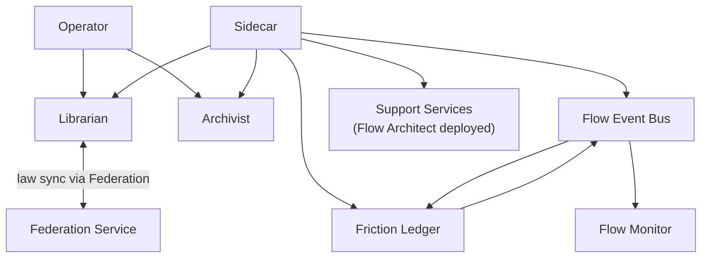
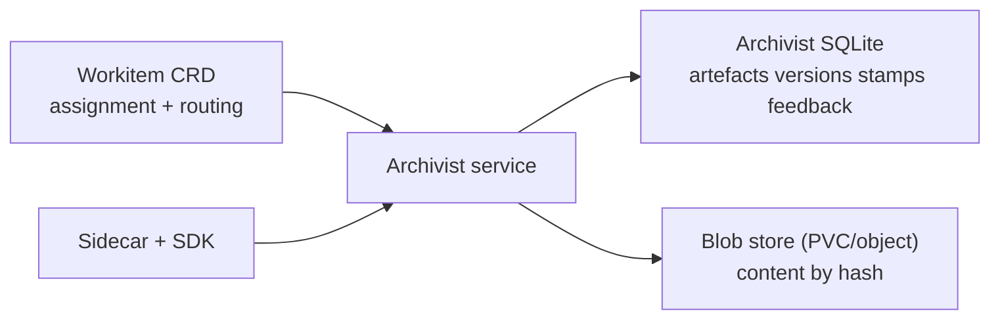
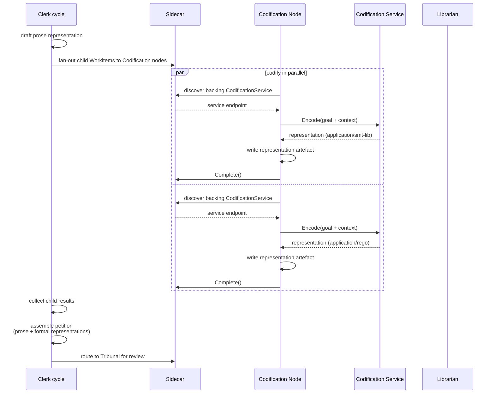
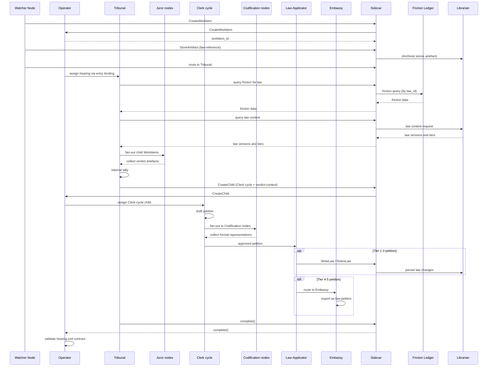

# System Services

System services provide the runtime substrate for law lifecycle, artefact lifecycle, governance signals, and operational resilience.

## Service Landscape and Boundaries

Each service owns one primary concern:

- **Flow Event Bus**: durable event distribution across telemetry, audit, friction, and workitem channels.
- **Friction Ledger**: friction aggregation, threshold evaluation, and friction query surface.
- **Librarian**: law storage, retrieval, representation lifecycle, and tier integration.
- **Archivist**: artefact lifecycle and provenance beyond Workitem references.
- **Flow Monitor**: pipeline adapter for metrics export (Prometheus) and audit log emission (JSON Lines to stdout).
- **Backup surfaces**: service-owned backup scope for embedded stores and content stores, coordinated with infrastructure-level backup ownership.
- **Flow Support Services**: optional, Flow-Architect-deployed containers that expose pluggable gRPC capabilities consumed by nodes (via [Sidecar](../03-node/01-sidecar.md) mediation) and system services (directly). Codification Services are the worked example in this spec.
- **Federation Service**: cross-Flow law distribution, federation membership management, and federation trust root (federation root CA) coordination. Covered in detail in [Federation](./08-federation.md).

No service duplicates another service's source of truth.

## Flow Event Bus

The Flow Event Bus is a durable event distribution service in the Control Plane. It receives
events from producers, persists them to a SQLite append-only log, and fans them out to all
active subscribers.

### Channels

The Bus is channel-agnostic. Channels are free-form strings — adding a new channel requires no code changes, proto regeneration, or rebuilds. The reference implementation uses four channels:

- **`telemetry`**: friction events, custom telemetry events, metrics, traces, and cost
  accounting signals. Produced by Sidecars (on behalf of nodes) and by system services.
  Subscribers: Friction Ledger (friction aggregation), Flow Monitor (metrics export), future
  operational dashboards.

- **`audit`**: authoritative state transition records emitted by the service that
  accepted, rejected, or applied a mutation. The Archivist publishes artefact version creation,
  stamp application, and feedback transitions. The Operator publishes lifecycle transitions,
  routing decisions, and contract evaluations. The Librarian publishes law creation, retirement,
  and integration events. Subscribers: Flow Monitor (JSON Lines to stdout for log pipeline),
  future compliance tooling.

- **`friction`**: aggregated friction signals published by the Friction Ledger.
  Threshold-crossing alerts indicate that a law's accumulated friction has crossed its tier's
  configured hearing threshold. Subscribers: [Friction Watcher](./03-nodes-external.md#the-judiciary--standard-subsystem) node (reactive hearing triggers via Sidecar).

- **`workitem`**: Workitem lifecycle events published by the Operator on every phase
  transition. Each event carries labels for `workitem_id`, `phase`, `node_id`, and
  `parent_workitem_id` (if the Workitem is a child). The namespace is carried in attributes.
  Subscribers filter by `parent_workitem_id` to observe child Workitem progress during
  fan-out/fan-in processing. Subscribers: nodes (via SDK `WatchChildren()`).

### Labels and Filtering

Events carry two key-value structures:

- **Labels**: repeated key-value pairs (`repeated Label`) designed for server-side filtering.
  Filtering-relevant dimensions go in labels (e.g. `law_id`, `parent_workitem_id`, `phase`,
  `workitem_id`, `node_id`). Labels use a repeated message (not a map) so that a single event
  can carry multiple values for the same key (e.g. `law_id=law-1` and `law_id=law-2`). The
  server stores labels in a separate indexed table for efficient filtering.

- **Attributes**: a `map<string, string>` for arbitrary unfiltered metadata (e.g. `magnitude`,
  `threshold`, `accumulated_friction`, `namespace`). Not used for server-side filtering.

Subscribers filter using `SubscribeFilter`, which supports an `event_type` convenience field
and `repeated Label match_labels` with AND semantics: every label in the filter must have at
least one matching label on the event.

### Persistence and Retention

The Bus persists all events to a SQLite append-only log before fan-out. Each channel has a
configurable retention window. Events within the retention window are available for subscriber
replay; events beyond the window are evicted. Retention windows are configured per channel in
the FoundryFlow configuration resource.

The Bus is a reliable delivery layer, not a long-term storage layer. Long-term retention is
downstream: Prometheus for metrics and friction time-series, log pipeline for audit records.

### Publish and Subscribe Semantics

- **Publish** is write-ahead. The producer receives an acknowledgement when the Bus has
  persisted the event to its log and accepted it for distribution.
- **Async publishing model**: all publishers use a shared `AsyncPublisher` abstraction that
  buffers events in a channel and drains them in a background goroutine with
  exponential-backoff retry. The non-blocking `Submit()` method decouples Event Bus latency
  from RPC critical paths — audit events, lifecycle events, and telemetry events never block
  the RPC response to the caller. If the buffer is full, events are dropped with a counter
  increment. This is a latency optimisation and a consistency pattern: one well-tested async
  mechanism replaces ad-hoc synchronous publish helpers.
- **Subscribe** opens a server-side stream filtered by channel and optional labels.
  The subscriber receives events as they are published. If the subscriber falls behind, the Bus
  applies backpressure per subscriber — slow subscribers do not block fast ones.
- **Replay**: reconnecting subscribers provide a last-seen sequence number. The Bus replays
  events from that point if they are still within the channel's retention window. Beyond the
  window, the subscriber must catch up from its downstream store.

### Deployment

The Flow Event Bus is Operator-provisioned — always present in every Flow alongside the
Operator, Friction Ledger, and Flow Monitor. It is not a FlowSupportService; it is Control
Plane infrastructure.

## Friction Ledger

The Friction Ledger is the friction aggregation and threshold evaluation service. It subscribes
to friction events on the Flow Event Bus's telemetry channel, maintains running totals per law,
per node, and per tier, and publishes threshold-crossing signals to the friction channel.

### Aggregation

The Friction Ledger maintains running friction aggregates in SQLite:

- Per-law totals — used for hearing threshold evaluation.
- Per-node totals — used for operational analysis.
- Per-tier totals — used for governance-level analysis.
- Per-topology-path totals — used for routing cost analysis.

Aggregation is post-hoc. The Ledger receives raw friction events and computes aggregates across
whatever axes are needed. Callers emit a magnitude and optional law attribution; the Ledger does
the rest.

### Threshold-Crossing Signals

When a law's accumulated friction crosses its tier's configured hearing threshold, the Friction
Ledger publishes a threshold-crossing event to the Flow Event Bus's friction channel. This event
includes the law identifier, the tier, the accumulated friction, and the threshold that was
crossed.

The [Friction Watcher](./03-nodes-external.md#the-judiciary--standard-subsystem) node subscribes to the friction channel and triggers review hearings reactively in
response to these signals.

### QueryFriction API

The Friction Ledger serves `QueryFriction` as a direct gRPC API for point-to-point queries.
This is the query surface for friction data, used by:

- The Tribunal (via Sidecar) for hearing evidence retrieval.
- The Librarian (direct service-to-service) for law lifecycle queries.

### Deployment

The Friction Ledger is Operator-provisioned — always present in every Flow. It is Control Plane
infrastructure, not a FlowSupportService.

### Recovery

The Friction Ledger persists its last-seen Event Bus sequence number alongside its aggregation data in its SQLite store. On startup, it resumes Event Bus subscription from the persisted checkpoint. If the checkpoint is missing or the sequence is beyond the Event Bus retention window, it starts from the earliest available event.

## Librarian

The Librarian is the law lifecycle service for a Flow.

### Law Model

- A law is one object with one textual goal and one-or-more representations.
- Representations express the same goal in different forms (prose, formal logic, executable forms, and others).
- Any mutation to goal, representations, or lifecycle metadata creates a new whole-law version identified by content hash.
- Representations are not independently versioned laws and are not linked sibling-law objects.

### Retrieval and Serving

Each law carries an `appliesTo` field — a list of zero or more governed artefact names. An empty `appliesTo` means the law is global and applies to all governed artefact names in the Flow.

The Librarian serves law queries through the [Sidecar](../03-node/01-sidecar.md) (for nodes) and direct service-to-service gRPC (for system actors). Three query modes are supported:

- **All laws** — no filter. Returns every law in the Flow's Library.
- **By governed artefact name** — returns laws whose `appliesTo` includes the queried name, plus all global laws.
- **By governed artefact name + representation type** — same name filter, plus the law must have at least one representation of the requested type. Laws without a matching representation type are excluded.

All query modes support an optional **division filter**. When a division is specified in the `LawFilter`, only laws with that exact division value are returned. An empty division filter means no division filtering — laws from all divisions are included. Division filtering composes with the other query modes (governed artefact name, representation type).

All query modes return full law objects (goal, all representations, tier, division, metadata). Filters gate which laws are included in the result; they never strip representations from returned law objects.

Tier is part of legal authority, but retrieval remains one law body with one identity model — all tiers are returned together.

### Integration and Conflict Checks

When higher-tier laws arrive from Federation service distribution, the Librarian performs a two-stage conflict protocol:

1. Semantic search for candidate contradictions, scoped by `appliesTo` — a law governing `"haiku"` is not conflict-checked against a law governing `"python-source"`. Global laws are conflict-checked against all laws regardless of scope.
2. LLM contradiction evaluation of candidates to determine actual contradiction.

Integration outcomes follow tiered supremacy semantics:

- Conflicting local Tier 1-2 laws retire immediately.
- Conflicting local Tier 3 laws enter HITL-controlled grace period flow when requested.
- On grace expiry, incoming law integrates automatically and conflicting Tier 3 law retires.
- If the LLM evaluator is unavailable or returns an indeterminate result, incoming higher-tier laws remain queued and inactive until evaluation succeeds.

### Law Lifecycle

The Librarian is a pure law store and lifecycle service. It does not own hearing trigger logic — hearing triggers are owned by dedicated watcher nodes ([Friction Watcher](./03-nodes-external.md#the-judiciary--standard-subsystem) and [TTL Watcher](./03-nodes-external.md#the-judiciary--standard-subsystem)) that create hearing Workitems via generic `CreateWorkitem` and route to the Tribunal.

The Librarian's law lifecycle responsibilities:

- Store, index, and serve laws to nodes and services.
- Manage integration conflict checks for Federation service law distribution.
- Persist law writes and retirements requested by nodes such as [law-applicator](./03-nodes-external.md#the-judiciary--standard-subsystem).
- Create, query, and retire dispute records for T4-5 petition tracking.
- Manage law version history and content-hash versioning.

## Archivist

The Archivist is the artefact lifecycle service and authoritative provenance store.

### Storage Split

Archivist storage is normatively split:

- **Embedded Relational Database**: artefact version history, passport stamps, and feedback. SQLite is the reference implementation choice.
- **Blob store**: raw artefact bytes keyed by content hash, typically on fast PVC-backed storage and optionally on cloud object storage.

### Workitem Boundary

- Workitem CRDs carry no artefact references. Artefacts record the `workitem_id` they belong to in the Archivist.
- Feedback does not live on Workitem status.
- Passports and stamps do not live on Workitem status.
- Artefact version history does not live on Workitem status.

### Access Contract

- Nodes never call Archivist directly.
- SDK calls are mediated by the [Sidecar](../03-node/01-sidecar.md).
- Query and write operations enforce capability boundaries configured in FoundryNode.
- `StoreArtefact` validates that the `governed_artefact` name matches a registered [GovernedArtefact](../05-reference/crds.md#governedartefact) CRD. Writes with an unregistered name are rejected with `UNKNOWN_GOVERNED_ARTEFACT`.
- The [Flow Operator](./01-operator.md) maintains a direct service-level query path to the Archivist for exit contract validation and Workitem lifecycle coordination — this is distinct from the Sidecar-mediated path that nodes use.

## Flow Monitor

Flow Monitor is a pipeline adapter that subscribes to the Flow Event Bus's telemetry and audit channels and exports signals to external observability systems:

- Metrics from Operator, Sidecars, nodes, and services — exported via a `/metrics` endpoint for Prometheus scraping.
- Audit event stream for governance-relevant state transitions — emitted as JSON Lines to stdout for log pipeline consumption (Logstash, ELK, or equivalent).

The Flow Monitor does not persist events or serve query APIs. It is a stateless pipeline adapter. It may persist a lightweight replay checkpoint (last-seen sequence number per channel) to avoid delivery gaps across restarts; this is not an event store. Long-term metrics are queryable through Prometheus; long-term audit records are queryable through the log pipeline.

## Flow Support Services

Flow Support Services are optional containers deployed by the Flow Architect that expose gRPC capabilities to nodes and system services. They run in the Flow namespace — pluggable, replaceable, and Flow-Architect-owned.

Support Services do not process Workitems — they expose gRPC capabilities consumed by nodes and system services through different access paths:

- Nodes consume Support Services through [Sidecar](../03-node/01-sidecar.md) mediation, preserving the platform invariant that nodes never call services directly. Judiciary nodes (Arbiter, Tribunal) and HITL nodes are nodes and access Support Services through their Sidecars.
- System services discover and consume Support Services via the Flow configuration and direct service-to-service gRPC.

Support Services are declared via their own CRD, which specifies:

- The capabilities the service provides (e.g., `encode` for Codification Services).
- Infrastructure configuration: PVC mounts, deployment strategy (ReplicaSet default, StatefulSet as an option), resource limits.
- Health and readiness endpoints (`healthz`/`readyz`).

The [Operator](./01-operator.md) manages Support Service deployments. Default deployment strategy is ReplicaSet with minimum replicas of 0, allowing the Operator to scale services down when unused. Stateful services or services that cannot scale to zero can override the minimum replica count. Support Services must implement standard `healthz`/`readyz` endpoints for Operator health management and pod lifecycle.

Nodes consume Support Service capabilities via `USE:support/<service>/<capability>` grants on their [FoundryNode](../05-reference/crds.md#foundrynode) `capabilities` field (e.g., `USE:support/codify-smt/encode`). Support Services use the [SDK](../04-sdk/00-overview.md)'s `FlowSupportService` base class and have a simplified permission model distinct from the full node capability envelope. Specialised subtypes (such as `CodificationService`) extend subtype-specific base classes that inherit from `FlowSupportService`.

Support Services are not required to be stateless. A Codification Service might cache model weights on a PVC; a notification relay might maintain connection pools. Infrastructure state is Support-Service-owned and not part of the Workitem provenance boundary.

Support Services emit context-specific telemetry relevant to their capability. No mandatory generic telemetry schema is imposed beyond standard health signals.

CRD field-level definitions are in [CRD Reference](../05-reference/crds.md).

### Codification Services

Codification Services are a Flow Support Service specialisation for governance hardening. They translate a [law](../01-concepts/03-data-model.md#laws)'s natural-language goal into formal representations — formal logic, executable validators, policy-as-code — increasing enforceability without changing the law's intent.

Each Codification Service is declared via its own [CodificationService CRD](../05-reference/crds.md#codificationservice), which specifies exactly one `outputFormat` — the MIME type of the representation the service produces (e.g., `application/smt-lib` for formal logic, `application/rego` for policy-as-code). The Operator manages CodificationService deployments identically to other Support Services.

Codification Services are consumed by the [Clerk cycle](./03-nodes-external.md#the-judiciary--standard-subsystem) (clerk-forge) during petition drafting. The Clerk cycle fans out to Codification nodes (which wrap Codification Services) via child Workitems. Each Codification node receives a child Workitem, invokes its backing Codification Service's `Encode` method, and returns the formal representation.

Codification Services expose a single `Encode` [gRPC method](../05-reference/grpc-api.md#codification-service-api):

1. The [Clerk cycle](./03-nodes-external.md#the-judiciary--standard-subsystem) (clerk-forge) receives a verdict and context artefacts and drafts the petition's prose representation — the goal and its `text/markdown` content.
2. The Clerk cycle fans out to [Codification nodes](../01-concepts/02-foundry-cycle.md#codification-nodes) via child Workitems. Each Codification node discovers its backing Codification Service and probes the service's `readyz` endpoint.
3. Each Codification node dispatches an `Encode` request to its backing service. Each request carries the law goal and context. Each service returns a single typed representation in its declared `outputFormat`.
4. The Codification node produces the representation as an artefact on its child Workitem and calls `Complete()`.
5. The Clerk cycle collects child results. If a Codification node fails, the Clerk cycle logs the failure and omits that representation — the petition proceeds without it.
6. The Clerk cycle assembles the petition with the prose representation plus all successfully returned formal representations.

The Judiciary (via the [Clerk cycle](./03-nodes-external.md#the-judiciary--standard-subsystem)) decides what the petition says; each Codification Service translates the goal into its declared formal syntax.

Flow Architects deploy zero or more CodificationService CRDs. Each declares exactly one `outputFormat` — `codify-smt` outputs `application/smt-lib`, `codify-rego` outputs `application/rego`. If no CodificationService is registered or none are ready at the time of petition drafting, the Clerk cycle assembles petitions with prose representations only — governance hardening through codification is optional, not a platform requirement.

## Hearing Lifecycle as Cross-Component Protocol

Hearings are implemented as a protocol across services and Judiciary nodes, not as a standalone hearing service.

Hearing processing uses standard Workitems with explicit governed artefacts and contract bindings. No hearing-specific Workitem subtype or `spec.type` discriminator is introduced.

Hearing Workitems carry a single `law-reference` artefact — a built-in GovernedArtefact provisioned by the Operator alongside the Tribunal with an empty stamp vocabulary. The `law-reference` artefact's content is a plain-text string containing the law ID under review. The hearing entry contract requires this artefact to be present; the hearing exit contract requires only that it is still present. The Tribunal retrieves all other context — law content, friction data, citation history — from the Librarian and Flow Monitor via standard SDK calls.

The hearing follows the node-based Judiciary topology:

1. A watcher node ([Friction Watcher](./03-nodes-external.md#the-judiciary--standard-subsystem) or [TTL Watcher](./03-nodes-external.md#the-judiciary--standard-subsystem)) creates a hearing Workitem via `CreateWorkitem`, stores a `law-reference` artefact, and routes to the Tribunal.
2. The Tribunal assembles evidence and fans out to [Juror](./03-nodes-external.md#the-judiciary--standard-subsystem) nodes.
3. Juror verdicts are collected and the Arbiter/Tribunal performs an internal tally.
4. On consensus, the Tribunal creates a child Workitem for the [Clerk cycle](./03-nodes-external.md#the-judiciary--standard-subsystem), attaching a `verdict-context` artefact that captures the hearing decision.
5. The Clerk cycle drafts and reviews the resulting petition, then applies local T1-3 changes via the [law-applicator](./03-nodes-external.md#the-judiciary--standard-subsystem) or exports approved T4-5 petitions through the [Embassy](./03-nodes-external.md#the-judiciary--standard-subsystem) as `law-petition`s.
6. The Tribunal calls `complete()` after handing the work to the Clerk cycle. The hearing completes locally; the downstream Clerk cycle runs independently.

Trigger ownership is distributed to dedicated watcher nodes:

- Friction-threshold trigger (all tiers) -> [Friction Watcher](./03-nodes-external.md#the-judiciary--standard-subsystem) subscribes to friction channel (via Sidecar), receives threshold-crossing signal from Friction Ledger, creates a hearing Workitem via `CreateWorkitem`, and routes to Tribunal. On consensus, the Tribunal creates a Clerk-cycle child Workitem; if that petition later targets T4-5 law, the Clerk cycle exits through Embassy as a `law-petition`.
- Review-TTL-expiry trigger -> [TTL Watcher](./03-nodes-external.md#the-judiciary--standard-subsystem) polls Librarian for laws exceeding tier's configured review TTL. Creates hearing Workitem via `CreateWorkitem` and routes to Tribunal. The law remains active during the hearing.

Execution and adjudication path:

1. Watcher node (Friction Watcher or TTL Watcher) creates hearing Workitem via `CreateWorkitem`, stores `law-reference` artefact with the `lawId`, and routes to Tribunal.
2. Operator admits and assigns the hearing Workitem to the Tribunal using the Tribunal's bound hearing entry contract.
3. The Tribunal retrieves the law's friction data from the Friction Ledger (via Sidecar) and legal context from the Librarian.
4. The Tribunal fans out to [Juror](./03-nodes-external.md#the-judiciary--standard-subsystem) nodes for deliberation using child Workitems.
5. Juror verdicts are collected and the Arbiter/Tribunal performs an internal tally for consensus.
6. On consensus, the Tribunal creates a Clerk-cycle child Workitem carrying a `verdict-context` artefact. The child Workitem enters the judiciary inner cycle for petition drafting, codification, review, tier-based routing, and law application or Embassy export.
7. The Tribunal calls `complete()`. Operator validates the hearing exit contract and applies completion state. Any resulting law lifecycle actions occur in the downstream Clerk-cycle child.

Review hearing verdicts are tier-specific:

- **Tier 1 under review:** `Promote` (petition for Tier 2 Ruling) or `Retire`.
- **Tier 2 under review:** `Promote` (petition HITL for Tier 3 Local Statute), `Retire`, or `Demote` (drop to Tier 1 Finding).

The Tribunal considers the law's accumulated friction and goal when rendering verdicts. Hearings produce a decisive outcome.

## Backup and Recovery Boundaries

Service backup scope is explicit:

- Librarian embedded stores and indexes: service-owned backup process.
- Archivist SQLite provenance store: service-owned backup process.
- Archivist blob store (PVC-backed or object storage): service-owned backup and restore process consistent with storage backend.
- Flow Event Bus SQLite log: service-owned backup process. Backup scope includes all events within the configured retention window. The Event Bus is a durable delivery layer, not a long-term store — downstream consumers (Prometheus, log pipelines) own long-term retention.
- Friction Ledger SQLite aggregation store and subscriber checkpoint: service-owned backup process. Backup scope includes the full aggregation state and the last-seen Event Bus sequence number.

Infrastructure-owned scope remains external to services:

- Kubernetes etcd backup/restore (including Workitem and configuration CRDs) is cluster-admin responsibility.

Recovery ordering must preserve referential integrity:

1. Restore control-plane CRDs (infrastructure domain).
2. Restore Flow Event Bus stores.
3. Restore Friction Ledger stores.
4. Restore Librarian stores.
5. Restore Archivist SQLite provenance.
6. Restore Archivist blob content.
7. Reconcile and verify provenance references and governance continuity.

The Event Bus must be restored and available before the Friction Ledger starts, because the Friction Ledger replays from its persisted checkpoint on startup. The Flow Monitor has no persistence to restore (aside from its optional replay checkpoint file, which is ephemeral and reconstructable).

Detailed runbooks are specified in [Operations](./07-operations.md).

## Inter-Service Contracts

Core call paths are stable:

- Federation service <-> Librarian: published law distribution and integration handoff.
- Operator <-> Archivist: completion validation queries and artefact presence checks.
- Sidecar <-> Archivist: artefact read/write/query lifecycle operations.
- Sidecar <-> Librarian: law retrieval and legal-context queries.
- Sidecar -> Flow Event Bus: friction emission and telemetry signals (publish to telemetry channel).
- Services -> Flow Event Bus: audit events (publish to audit channel).
- Flow Event Bus -> Friction Ledger: friction events (telemetry channel subscription).
- Friction Ledger -> Flow Event Bus: threshold-crossing signals (publish to friction channel).
- Flow Event Bus -> Friction Watcher (via Sidecar): threshold-crossing signals (friction channel subscription).
- TTL Watcher (via Sidecar) -> Librarian: QueryLaws for TTL expiry detection.
- Librarian -> Friction Ledger: QueryFriction for law lifecycle queries.
- Tribunal (via Sidecar) -> Friction Ledger: friction queries for hearing evidence.
- Flow Event Bus -> Flow Monitor: telemetry and audit channel subscriptions for metrics export and audit log emission.
- Sidecar <-> Support Services: capability-gated operations on Flow-Architect-deployed services.
- Codification nodes (via Sidecar) <-> Codification Services: encode requests during petition drafting.
- Operator -> Flow Event Bus: Workitem lifecycle events (publish to workitem channel on every phase transition).

Contract failures must return structured errors aligned with [Error Catalogue](../05-reference/error-catalogue.md).

## Failure and Degradation Semantics

Service outages degrade behaviour predictably:

- Archivist unavailable: artefact mutation and provenance queries fail closed; Workitems cannot progress through affected steps.
- Librarian unavailable: law retrieval and law lifecycle actions fail closed. TTL Watcher polling pauses until the Librarian recovers.
- LLM contradiction evaluator unavailable: higher-tier law activation pauses in queued state; integration retries with backoff and raises operational alerts.
- Flow Monitor unavailable: metrics export and audit log emission pause. Friction aggregation and hearing threshold evaluation are unaffected (those are Friction Ledger-owned). Alerting is raised.
- Flow Event Bus unavailable: event distribution pauses. Sidecars buffer events locally and retry. Friction Ledger's `QueryFriction` continues to serve from persisted aggregation data. Friction Watcher hearing threshold evaluation is paused for new events but the Friction Watcher's subscription will replay missed events within the retention window on Bus recovery.
- Friction Ledger unavailable: friction aggregation pauses. Raw friction events accumulate in the Bus's telemetry channel log within the retention window. On Friction Ledger recovery, it replays from its last-seen sequence number. Threshold-crossing signals are delayed but not lost. `QueryFriction` calls from the Tribunal return errors; hearing evidence retrieval is blocked until recovery.
- Support Service unavailable: operations requiring that service's capability fail closed for the requesting actor. Codification degrades gracefully — individual Codification Service failures are logged and their representations omitted; the Clerk cycle (clerk-forge) proceeds with whatever representations succeeded (prose at minimum).

Fail-open behaviour is prohibited for governance integrity paths.

## Service Invariants

All deployments preserve these service invariants:

1. Archivist is the source of truth for artefact provenance beyond raw bytes.
2. Workitem CRD carries no artefact references. Artefact-to-Workitem associations are Archivist-owned.
3. Laws are single objects with one goal and multiple representations under whole-law versioning.
4. Friction-threshold hearing triggers are owned by the [Friction Watcher](./03-nodes-external.md#the-judiciary--standard-subsystem) node, which subscribes to the Friction Ledger's threshold-crossing signals on the Flow Event Bus's friction channel (via Sidecar) and creates hearing Workitems via generic `CreateWorkitem`.
5. Review-TTL-expiry hearing triggers are owned by the [TTL Watcher](./03-nodes-external.md#the-judiciary--standard-subsystem) node, which polls the Librarian for laws exceeding their tier's review TTL and creates hearing Workitems via generic `CreateWorkitem`.
6. Tribunal evidence retrieval includes friction data from the Friction Ledger.
7. Hearing adjudication remains a Tribunal responsibility, not a service-local shortcut.
8. Friction is first-class and queryable by source attribution.
9. Backup ownership boundaries are explicit between services and cluster administration.
10. Federation service law distribution preserves tiered supremacy, grace-period semantics, and audit continuity.
11. Flow Support Services are optional, Flow-Architect-deployed, and do not process Workitems.
12. Codification Services are optional; their absence degrades governance hardening to prose-only petitions.
13. The Flow Event Bus is durable. Events are persisted to SQLite before fan-out. Retention is per-channel and operator-configurable.
14. Audit events are published by the authoritative service, not by nodes.
15. The Friction Ledger is the sole aggregation and query surface for friction data.
16. The Flow Monitor is a stateless pipeline adapter. It does not persist events or serve query APIs. It may persist a lightweight replay checkpoint (last-seen sequence number per channel) to avoid delivery gaps across restarts; this is not an event store.
17. The Workitem channel publishes lifecycle events for every Workitem phase transition. Filtering by `parent_workitem_id` enables child Workitem observability.

Node-facing implications of these services are detailed in [SDK Core](../04-sdk/01-sdk-core.md), [SDK Artefacts](../04-sdk/02-sdk-artefacts.md), [SDK Legal](../04-sdk/03-sdk-legal.md), [SDK Feedback](../04-sdk/04-sdk-feedback.md), and [SDK Telemetry](../04-sdk/06-sdk-telemetry.md).
