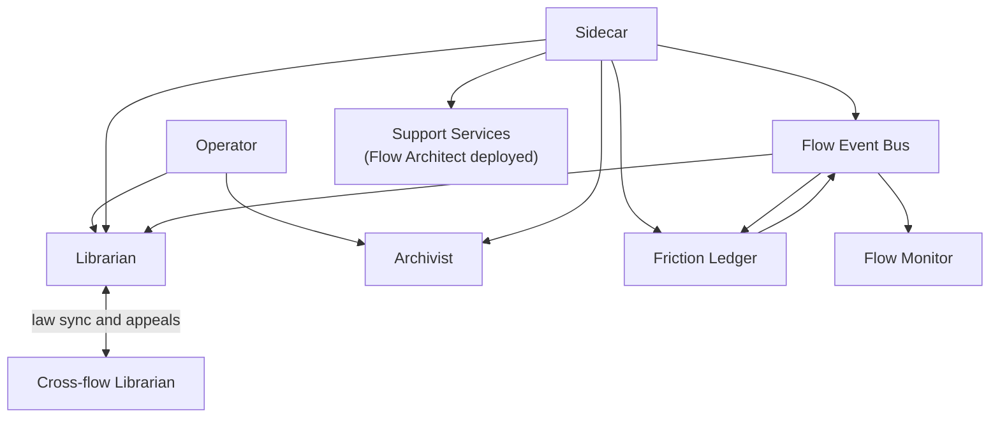
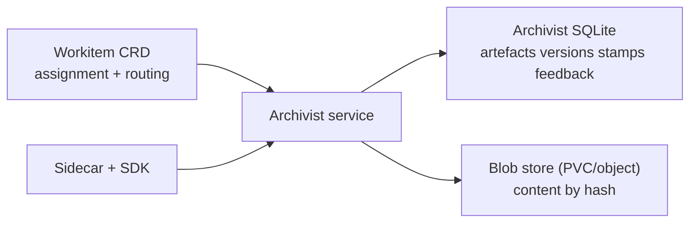
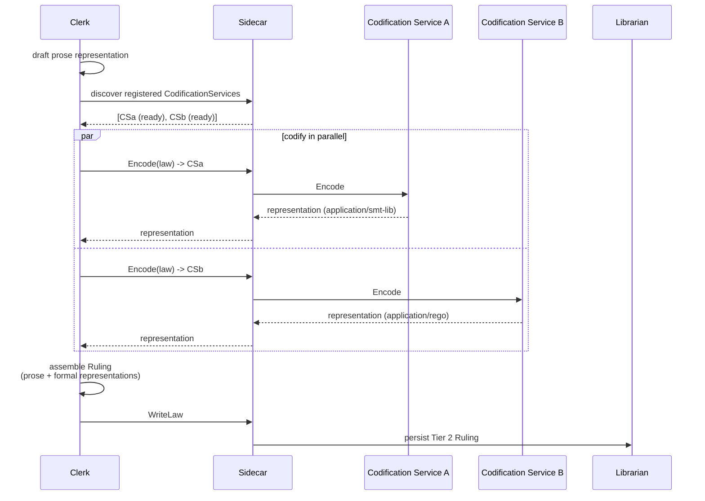
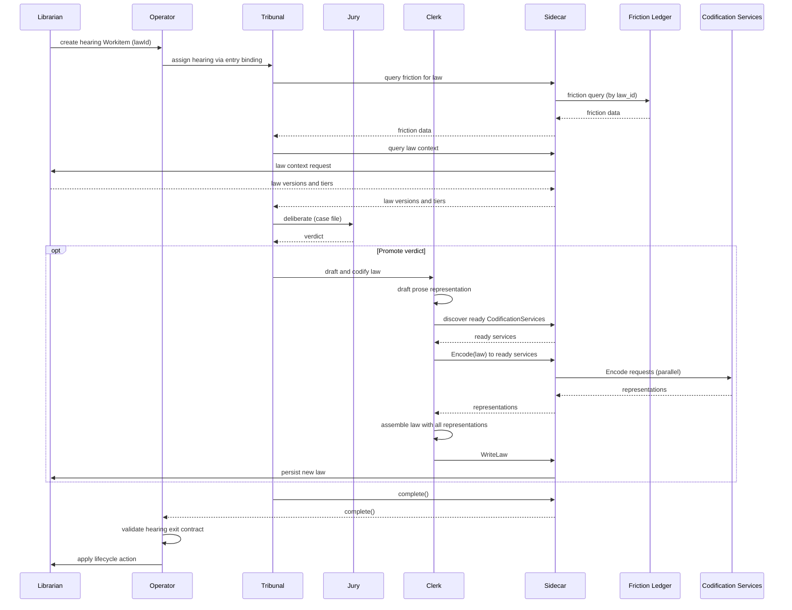

# System Services

System services provide the runtime substrate for law lifecycle, artefact lifecycle, governance signals, and operational resilience.

## Service Landscape and Boundaries

Each service owns one primary concern:

- **Flow Event Bus**: durable event distribution across telemetry, audit, and friction channels.
- **Friction Ledger**: friction aggregation, threshold evaluation, and friction query surface.
- **Librarian**: law storage, retrieval, representation lifecycle, tier integration, and law lifecycle hearing triggers (friction-threshold and review-TTL-expiry).
- **Archivist**: artefact lifecycle and provenance beyond Workitem references.
- **Flow Monitor**: pipeline adapter for metrics export (Prometheus) and audit log emission (JSON Lines to stdout).
- **Backup surfaces**: service-owned backup scope for embedded stores and content stores, coordinated with infrastructure-level backup ownership.
- **Flow Support Services**: optional, Flow-Architect-deployed containers that expose pluggable gRPC capabilities consumed by nodes (via [Sidecar](../03-node/01-sidecar.md) mediation) and system services (directly). Codification Services are the worked example in this spec.

No service duplicates another service's source of truth.

## Flow Event Bus

The Flow Event Bus is a durable event distribution service in the Control Plane. It receives
events from producers, persists them to a SQLite append-only log, and fans them out to all
active subscribers.

### Channels

The Bus operates three channels:

- **Telemetry channel**: friction events, custom telemetry events, metrics, traces, and cost
  accounting signals. Produced by Sidecars (on behalf of nodes) and by system services.
  Subscribers: Friction Ledger (friction aggregation), Flow Monitor (metrics export), future
  operational dashboards.

- **Audit channel**: authoritative state transition records emitted by the service that
  accepted, rejected, or applied a mutation. The Archivist publishes artefact version creation,
  stamp application, and feedback transitions. The Operator publishes lifecycle transitions,
  routing decisions, and contract evaluations. The Librarian publishes law creation, retirement,
  and integration events. Subscribers: Flow Monitor (JSON Lines to stdout for log pipeline),
  future compliance tooling.

- **Friction channel**: aggregated friction signals published by the Friction Ledger.
  Threshold-crossing alerts indicate that a law's accumulated friction has crossed its tier's
  configured hearing threshold. Subscribers: Librarian (reactive hearing triggers).

### Persistence and Retention

The Bus persists all events to a SQLite append-only log before fan-out. Each channel has a
configurable retention window. Events within the retention window are available for subscriber
replay; events beyond the window are evicted. Retention windows are configured per channel in
the FoundryFlow configuration resource.

The Bus is a reliable delivery layer, not a long-term storage layer. Long-term retention is
downstream: Prometheus for metrics and friction time-series, log pipeline for audit records.

### Publish and Subscribe Semantics

- **Publish** is write-ahead. The producer receives an acknowledgement when the Bus has
  persisted the event to its log and accepted it for distribution.
- **Subscribe** opens a server-side stream filtered by channel and optional event attributes.
  The subscriber receives events as they are published. If the subscriber falls behind, the Bus
  applies backpressure per subscriber — slow subscribers do not block fast ones.
- **Replay**: reconnecting subscribers provide a last-seen sequence number. The Bus replays
  events from that point if they are still within the channel's retention window. Beyond the
  window, the subscriber must catch up from its downstream store.

### Deployment

The Flow Event Bus is Operator-provisioned — always present in every Flow alongside the
Operator, Friction Ledger, and Flow Monitor. It is not a FlowSupportService; it is Control
Plane infrastructure.

## Friction Ledger

The Friction Ledger is the friction aggregation and threshold evaluation service. It subscribes
to friction events on the Flow Event Bus's telemetry channel, maintains running totals per law,
per node, and per tier, and publishes threshold-crossing signals to the friction channel.

### Aggregation

The Friction Ledger maintains running friction aggregates in SQLite:

- Per-law totals — used for hearing threshold evaluation.
- Per-node totals — used for operational analysis.
- Per-tier totals — used for governance-level analysis.
- Per-topology-path totals — used for routing cost analysis.

Aggregation is post-hoc. The Ledger receives raw friction events and computes aggregates across
whatever axes are needed. Callers emit a magnitude and optional law attribution; the Ledger does
the rest.

### Threshold-Crossing Signals

When a law's accumulated friction crosses its tier's configured hearing threshold, the Friction
Ledger publishes a threshold-crossing event to the Flow Event Bus's friction channel. This event
includes the law identifier, the tier, the accumulated friction, and the threshold that was
crossed.

The Librarian subscribes to the friction channel and triggers review hearings reactively in
response to these signals.

### QueryFriction API

The Friction Ledger serves `QueryFriction` as a direct gRPC API for point-to-point queries.
This is the query surface for friction data, used by:

- The Tribunal (via Sidecar) for hearing evidence retrieval.
- The Librarian (direct service-to-service) for catch-up on startup or reconnection.

### Deployment

The Friction Ledger is Operator-provisioned — always present in every Flow. It is Control Plane
infrastructure, not a FlowSupportService.

## Librarian

The Librarian is the law lifecycle service for a Flow.

### Law Model

- A law is one object with one textual goal and one-or-more representations.
- Representations express the same goal in different forms (prose, formal logic, executable forms, and others).
- Any mutation to goal, representations, or lifecycle metadata creates a new whole-law version identified by content hash.
- Representations are not independently versioned laws and are not linked sibling-law objects.

### Retrieval and Serving

Each law carries an `appliesTo` field — a list of zero or more governed artefact names. An empty `appliesTo` means the law is global and applies to all governed artefact names in the Flow.

The Librarian serves law queries through the [Sidecar](../03-node/01-sidecar.md) (for nodes) and direct service-to-service gRPC (for system actors). Three query modes are supported:

- **All laws** — no filter. Returns every law in the Flow's Library.
- **By governed artefact name** — returns laws whose `appliesTo` includes the queried name, plus all global laws.
- **By governed artefact name + representation type** — same name filter, plus the law must have at least one representation of the requested type. Laws without a matching representation type are excluded.

All query modes return full law objects (goal, all representations, tier, metadata). Filters gate which laws are included in the result; they never strip representations from returned law objects.

Tier is part of legal authority, but retrieval remains one law body with one identity model — all tiers are returned together.

### Integration and Conflict Checks

When higher-tier laws arrive from cross-flow replication, the Librarian performs a two-stage conflict protocol:

1. Semantic search for candidate contradictions, scoped by `appliesTo` — a law governing `"haiku"` is not conflict-checked against a law governing `"python-source"`. Global laws are conflict-checked against all laws regardless of scope.
2. LLM contradiction evaluation of candidates to determine actual contradiction.

Integration outcomes follow tiered supremacy semantics:

- Conflicting local Tier 1-2 laws retire immediately.
- Conflicting local Tier 3 laws enter HITL-controlled grace period flow when requested.
- On grace expiry, incoming law integrates automatically and conflicting Tier 3 law retires.
- If the LLM evaluator is unavailable or returns an indeterminate result, incoming higher-tier laws remain queued and inactive until evaluation succeeds.

### Law Lifecycle Hearing Triggers

The Librarian owns all hearing trigger emission for law lifecycle events. It monitors two signals and triggers review hearings by requesting Workitem creation through the Operator.

**Friction-threshold triggers:** The Librarian subscribes to the [Friction Ledger](#friction-ledger)'s threshold-crossing signals on the Flow Event Bus's friction channel. When a threshold-crossing event is received for a law, the Librarian triggers a review hearing. On startup or reconnection, the Librarian queries the Friction Ledger's `QueryFriction` API to determine whether any laws have crossed their thresholds during the disconnection window. Thresholds are configurable per law tier (`tier1` through `tier5`) in the FoundryFlow [configuration](./05-configuration.md). For Tiers 1-2, the [Tribunal](./03-nodes-external.md#the-judiciary--standard-subsystem) adjudicates directly. For Tiers 3-5, the hearing outcome is a petition to the Flow Architect or Governance Flow via the [Advocate](./03-nodes-external.md#the-judiciary--standard-subsystem).

**Review-TTL-expiry triggers:** When a law's age exceeds its tier's configured review TTL (from the FoundryFlow's [governance policy](./05-configuration.md)), the Librarian triggers a review hearing. The law remains active during the hearing — expiry is the trigger, not a demotion event.

Every review hearing produces a decisive outcome — promote, retire, or demote.

Librarian does not adjudicate hearings.

## Archivist

The Archivist is the artefact lifecycle service and authoritative provenance store.

### Storage Split

Archivist storage is normatively split:

- **Embedded Relational Database**: artefact version history, passport stamps, and feedback. SQLite is the reference implementation choice.
- **Blob store**: raw artefact bytes keyed by content hash, typically on fast PVC-backed storage and optionally on cloud object storage.

### Workitem Boundary

- Workitem CRDs carry no artefact references. Artefacts record the `workitem_id` they belong to in the Archivist.
- Feedback does not live on Workitem status.
- Passports and stamps do not live on Workitem status.
- Artefact version history does not live on Workitem status.

### Access Contract

- Nodes never call Archivist directly.
- SDK calls are mediated by the [Sidecar](../03-node/01-sidecar.md).
- Query and write operations enforce capability boundaries configured in FoundryNode.
- The [Flow Operator](./01-operator.md) maintains a direct service-level query path to the Archivist for exit contract validation and Workitem lifecycle coordination — this is distinct from the Sidecar-mediated path that nodes use.

## Flow Monitor

Flow Monitor is a pipeline adapter that subscribes to the Flow Event Bus's telemetry and audit channels and exports signals to external observability systems:

- Metrics from Operator, Sidecars, nodes, and services — exported via a `/metrics` endpoint for Prometheus scraping.
- Audit event stream for governance-relevant state transitions — emitted as JSON Lines to stdout for log pipeline consumption (Logstash, ELK, or equivalent).

The Flow Monitor does not persist events or serve query APIs. It is a stateless pipeline adapter. Long-term metrics are queryable through Prometheus; long-term audit records are queryable through the log pipeline.

## Jury

The Jury is the multi-agent deliberation engine for the [Judiciary](./03-nodes-external.md#the-judiciary--standard-subsystem). It is an Operator-provisioned core service — always present in every Flow.

The Jury runs parallel [FoundryAgent](../04-sdk/07-sdk-agent.md) instances as jurors, collects structured votes, applies a configured consensus strategy, and returns a verdict. It is consumed by the [Arbiter](./03-nodes-external.md#the-judiciary--standard-subsystem) (for deadlock disputes) and the [Tribunal](./03-nodes-external.md#the-judiciary--standard-subsystem) (for review hearings) through Sidecar-mediated gRPC calls.

### Deliberation Protocol

The Jury exposes a `Deliberate` gRPC method. The calling node (Arbiter or Tribunal) constructs a case file containing the dispute evidence and submits it to the Jury. The Jury then:

1. Selects juror profiles from the configured jury policy (based on dispute severity).
2. Constructs per-juror FoundryAgent instances with the appropriate system prompts and output schemas.
3. Executes all jurors in parallel — each produces an independent structured verdict.
4. Counts votes against the configured consensus strategy (`SimpleMajority`, `SuperMajority`, or `Unanimity`).
5. If consensus is reached, synthesises the justifications into a verdict and returns it.
6. If hung, and rounds remain under `maxRounds`, re-executes with peer arguments from the prior round.
7. If hung after `maxRounds`, returns a hung-jury verdict — the calling node escalates to the Advocate.

### Cost Accounting

Per-juror cost accounting is automatic. Each juror's FoundryAgent instance emits `foundry.cost.llm` telemetry events with attribution tags: `juror`, `round`, `severity`, `feedback_id`. The Jury also emits friction per round with magnitude = depth ^ (round + 1), attributed to the disputed laws.

### Configuration

Jury policy is configured in the FoundryFlow governance policy:

- `consensusStrategy`: `SimpleMajority`, `SuperMajority`, or `Unanimity` (configurable per severity).
- `maxRounds`: maximum deliberation rounds before hung-jury escalation.
- `juryProfiles`: named juror configurations (system prompt, model) matched to dispute severity.

## Clerk

The Clerk is the law drafting and codification service for the [Judiciary](./03-nodes-external.md#the-judiciary--standard-subsystem). It is an Operator-provisioned core service — always present in every Flow.

The Clerk handles the mechanical process of creating, codifying, and persisting laws. It is consumed by the Arbiter and Tribunal (after a verdict is reached) and separates judicial decision-making (what the law says) from legal drafting (how the law is recorded).

### Drafting and Codification

When a Promote verdict is rendered, the Clerk:

1. Drafts the Ruling's prose representation from the verdict justification — the goal and its `text/markdown` content.
2. Discovers registered [Codification Services](#codification-services) through its Sidecar and probes readiness.
3. Dispatches `Encode` requests in parallel to all ready Codification Services.
4. Collects results — failed or unavailable services are logged and their representations omitted.
5. Assembles the law as a single object: prose representation plus all successfully returned formal representations.
6. Persists the law via `WriteLaw` to the Librarian.

For Retire or Demote verdicts, the Clerk calls `RetireLaw` or modifies the law's tier via the Librarian without codification.

### Capabilities

The Clerk's capabilities are fixed by the runtime:

- `WRITE:law/tier2` — persist Tier 2 Rulings on behalf of the Arbiter and Tribunal.
- `READ:law` — query existing laws for context during drafting.
- `USE:support/<name>/encode` — access to all registered CodificationService instances (Operator-managed).

## Flow Support Services

Flow Support Services are optional containers deployed by the Flow Architect that expose gRPC capabilities to nodes and system services. They run in the Flow namespace — pluggable, replaceable, and Flow-Architect-owned.

Support Services do not process Workitems — they expose gRPC capabilities consumed by nodes and system services through different access paths:

- Nodes consume Support Services through [Sidecar](../03-node/01-sidecar.md) mediation, preserving the platform invariant that nodes never call services directly. Judiciary nodes (Arbiter, Tribunal, Advocate) are nodes and access Support Services through their Sidecars.
- System services discover and consume Support Services via the Flow configuration and direct service-to-service gRPC.

Support Services are declared via their own CRD, which specifies:

- The capabilities the service provides (e.g., `encode` for Codification Services).
- Infrastructure configuration: PVC mounts, deployment strategy (ReplicaSet default, StatefulSet as an option), resource limits.
- Health and readiness endpoints (`healthz`/`readyz`).

The [Operator](./01-operator.md) manages Support Service deployments. Default deployment strategy is ReplicaSet with minimum replicas of 0, allowing the Operator to scale services down when unused. Stateful services or services that cannot scale to zero can override the minimum replica count. Support Services must implement standard `healthz`/`readyz` endpoints for Operator health management and pod lifecycle.

Nodes consume Support Service capabilities via `USE:support/<service>/<capability>` grants on their [FoundryNode](../05-reference/crds.md#foundrynode) `capabilities` field (e.g., `USE:support/codify-smt/encode`). Support Services use the [SDK](../04-sdk/00-overview.md)'s `FlowSupportService` base class and have a simplified permission model distinct from the full node capability envelope. Specialised subtypes (such as `CodificationService`) extend subtype-specific base classes that inherit from `FlowSupportService`.

Support Services are not required to be stateless. A Codification Service might cache model weights on a PVC; a notification relay might maintain connection pools. Infrastructure state is Support-Service-owned and not part of the Workitem provenance boundary.

Support Services emit context-specific telemetry relevant to their capability. No mandatory generic telemetry schema is imposed beyond standard health signals.

CRD field-level definitions are in [CRD Reference](../05-reference/crds.md).

### Codification Services

Codification Services are a Flow Support Service specialisation for governance hardening. They translate a [law](../01-concepts/03-data-model.md#laws)'s natural-language goal into formal representations — formal logic, executable validators, policy-as-code — increasing enforceability without changing the law's intent.

Each Codification Service is declared via its own [CodificationService CRD](../05-reference/crds.md#codificationservice), which specifies exactly one `outputFormat` — the MIME type of the representation the service produces (e.g., `application/smt-lib` for formal logic, `application/rego` for policy-as-code). The Operator manages CodificationService deployments identically to other Support Services and internally manages the Clerk's access to each registered instance.

Codification Services expose a single `Encode` [gRPC method](../05-reference/grpc-api.md#codification-service-api) consumed during law promotion:

1. The Clerk receives a law-drafting request from the Arbiter or Tribunal (after a Promote verdict) and drafts the Ruling's prose representation — the goal and its `text/markdown` content.
2. The Clerk discovers registered CodificationService instances through its Sidecar (the [Operator](./01-operator.md) internally manages the Clerk's `USE:support/<name>/encode` capability for each registered instance) and probes each service's `readyz` endpoint. Services that are not ready are skipped.
3. The Clerk dispatches `Encode` requests in parallel to all ready Codification Services. Each request carries the full law object (goal, existing representations, tier, metadata). Each service returns a single typed representation in its declared `outputFormat`.
4. The Clerk collects the results. If a Codification Service fails, the Clerk logs the failure and omits that representation — the Ruling proceeds without it.
5. The Clerk assembles the Tier 2 Ruling as a single law object: the prose representation plus all successfully returned formal representations.

The Judiciary (via the Clerk) decides what the ruling says; each Codification Service translates the goal into its declared formal syntax.

Flow Architects deploy zero or more CodificationService CRDs. Each declares exactly one `outputFormat` — `codify-smt` outputs `application/smt-lib`, `codify-rego` outputs `application/rego`. If no CodificationService is registered or none are ready at the time of promotion, the Clerk mints rulings with prose representations only — governance hardening through codification is optional, not a platform requirement.

## Hearing Lifecycle as Cross-Component Protocol

Hearings are implemented as a protocol across services and runtime actors, not as a standalone hearing service.

Hearing processing uses standard Workitems with explicit governed artefacts and contract bindings. No hearing-specific Workitem subtype or `spec.type` discriminator is introduced.

Hearing Workitems carry a single `law-reference` artefact — a built-in GovernedArtefact provisioned by the Operator alongside the Tribunal with an empty stamp vocabulary. The `law-reference` artefact's content is a plain-text string containing the law ID under review. The hearing entry contract requires this artefact to be present; the hearing exit contract requires only that it is still present. The Tribunal retrieves all other context — law content, friction data, citation history — from the Librarian and Flow Monitor via standard SDK calls.

The Tribunal writes its verdict through the [Clerk](#clerk): directly to the Library as a Tier 2 Ruling (for Tier 1 promotion), or routes to the [Advocate](./03-nodes-external.md#the-judiciary--standard-subsystem) for HITL petition (for Tier 2 promotion to Tier 3). The Judiciary's output is a law in the Library, not a stamp on an artefact. After the Tribunal calls `complete()`, the Operator notifies the Librarian via `ApplyLifecycleAction` to apply the verdict outcome (promote, retire, or demote) to the original law.

Trigger ownership is consolidated in the Librarian:

- Friction-threshold trigger (all tiers) -> Librarian subscribes to friction channel, receives threshold-crossing signal from Friction Ledger. For Tiers 1-2, the Tribunal adjudicates directly. For Tiers 3-5, the hearing outcome is a petition to the Flow Architect or Governance Flow via the Advocate.
- Review-TTL-expiry trigger -> Librarian detects law age exceeding tier's configured review TTL. The law remains active during the hearing.

Execution and adjudication path:

1. Librarian requests hearing Workitem creation through the Operator, supplying the `lawId`.
2. Operator admits and assigns the hearing Workitem to the Tribunal using the Tribunal's bound hearing entry contract.
3. The Tribunal retrieves the law's friction data from the Friction Ledger (via Sidecar) and legal context from the Librarian.
4. The Tribunal invokes the [Jury](#jury) for deliberation and issues a tier-appropriate verdict.
5. For a **Promote** verdict, the Tribunal delegates to the [Clerk](#clerk), which drafts the prose representation and codifies formal representations in parallel via registered [Codification Services](#codification-services). Services that are not ready or that fail are skipped with logging. For Retire or Demote verdicts, this step is skipped.
6. The Clerk writes the new law to the Librarian (via `WriteLaw`) and the Tribunal calls `complete()`. The law is created in a pending state and remains inactive until ratification.
7. Operator validates the Tribunal's bound hearing exit contract and applies completion state; Librarian applies resulting law lifecycle actions, activating the new law.

Review hearing verdicts are tier-specific:

- **Tier 1 under review:** `Promote` (mint Tier 2 Ruling) or `Retire`.
- **Tier 2 under review:** `Promote` (petition HITL for Tier 3 Local Statute), `Retire`, or `Demote` (drop to Tier 1 Finding).

The Tribunal considers the law's accumulated friction and goal when rendering verdicts. Hearings produce a decisive outcome.

## Backup and Recovery Boundaries

Service backup scope is explicit:

- Librarian embedded stores and indexes: service-owned backup process.
- Archivist SQLite provenance store: service-owned backup process.
- Archivist blob store (PVC-backed or object storage): service-owned backup and restore process consistent with storage backend.

Infrastructure-owned scope remains external to services:

- Kubernetes etcd backup/restore (including Workitem and configuration CRDs) is cluster-admin responsibility.

Recovery ordering must preserve referential integrity:

1. Restore control-plane CRDs (infrastructure domain).
2. Restore Librarian stores.
3. Restore Archivist SQLite provenance.
4. Restore Archivist blob content.
5. Reconcile and verify provenance references and governance continuity.

Detailed runbooks are specified in [Operations](./07-operations.md).

## Inter-Service Contracts

Core call paths are stable:

- Operator <-> Librarian: law lifecycle events, hearing Workitem creation coordination.
- Operator <-> Archivist: completion validation queries and artefact presence checks.
- Sidecar <-> Archivist: artefact read/write/query lifecycle operations.
- Sidecar <-> Librarian: law retrieval and legal-context queries.
- Sidecar -> Flow Event Bus: friction emission and telemetry signals (publish to telemetry channel).
- Services -> Flow Event Bus: audit events (publish to audit channel).
- Flow Event Bus -> Friction Ledger: friction events (telemetry channel subscription).
- Friction Ledger -> Flow Event Bus: threshold-crossing signals (publish to friction channel).
- Flow Event Bus -> Librarian: threshold-crossing signals (friction channel subscription).
- Librarian -> Friction Ledger: QueryFriction for catch-up on startup/reconnection.
- Tribunal (via Sidecar) -> Friction Ledger: friction queries for hearing evidence.
- Flow Event Bus -> Flow Monitor: telemetry and audit channel subscriptions for metrics export and audit log emission.
- Sidecar <-> Support Services: capability-gated operations on Flow-Architect-deployed services.
- Clerk (via Sidecar) <-> Codification Services: encode requests during law promotion.

Contract failures must return structured errors aligned with [Error Catalogue](../05-reference/error-catalogue.md).

## Failure and Degradation Semantics

Service outages degrade behaviour predictably:

- Archivist unavailable: artefact mutation and provenance queries fail closed; Workitems cannot progress through affected steps.
- Librarian unavailable: law retrieval and law lifecycle actions fail closed. Hearing trigger evaluation pauses until the Librarian recovers.
- LLM contradiction evaluator unavailable: higher-tier law activation pauses in queued state; integration retries with backoff and raises operational alerts.
- Flow Monitor unavailable: metrics export and audit log emission pause. Friction aggregation and hearing threshold evaluation are unaffected (those are Friction Ledger-owned). Alerting is raised.
- Flow Event Bus unavailable: event distribution pauses. Sidecars buffer events locally and retry. Friction Ledger's `QueryFriction` continues to serve from persisted aggregation data. Hearing threshold evaluation is paused for new events but the Librarian's subscription will replay missed events within the retention window on Bus recovery.
- Friction Ledger unavailable: friction aggregation pauses. Raw friction events accumulate in the Bus's telemetry channel log within the retention window. On Friction Ledger recovery, it replays from its last-seen sequence number. Threshold-crossing signals are delayed but not lost. `QueryFriction` calls from the Tribunal return errors; hearing evidence retrieval is blocked until recovery.
- Support Service unavailable: operations requiring that service's capability fail closed for the requesting actor. Codification degrades gracefully — individual Codification Service failures are logged and their representations omitted; the Clerk proceeds with whatever representations succeeded (prose at minimum).

Fail-open behaviour is prohibited for governance integrity paths.

## Service Invariants

All deployments preserve these service invariants:

1. Archivist is the source of truth for artefact provenance beyond raw bytes.
2. Workitem CRD carries no artefact references. Artefact-to-Workitem associations are Archivist-owned.
3. Laws are single objects with one goal and multiple representations under whole-law versioning.
4. Friction-threshold hearing triggers are evaluated reactively by the Librarian via Friction Ledger threshold-crossing signals on the Flow Event Bus's friction channel.
5. Review-TTL-expiry hearing triggers are emitted by the Librarian.
6. Tribunal evidence retrieval includes friction data from the Friction Ledger.
7. Hearing adjudication remains a Tribunal responsibility, not a service-local shortcut.
8. Friction is first-class and queryable by source attribution.
9. Backup ownership boundaries are explicit between services and cluster administration.
10. Cross-flow law integration preserves tiered supremacy, grace-period semantics, and audit continuity.
11. Flow Support Services are optional, Flow-Architect-deployed, and do not process Workitems.
12. Codification Services are optional; their absence degrades governance hardening to prose-only rulings.
13. The Flow Event Bus is durable. Events are persisted to SQLite before fan-out. Retention is per-channel and operator-configurable.
14. Audit events are published by the authoritative service, not by nodes.
15. The Friction Ledger is the sole aggregation and query surface for friction data.
16. The Flow Monitor is a stateless pipeline adapter. It does not persist events or serve query APIs.

Node-facing implications of these services are detailed in [SDK Core](../04-sdk/01-sdk-core.md), [SDK Artefacts](../04-sdk/02-sdk-artefacts.md), [SDK Legal](../04-sdk/03-sdk-legal.md), [SDK Feedback](../04-sdk/04-sdk-feedback.md), and [SDK Telemetry](../04-sdk/06-sdk-telemetry.md).
