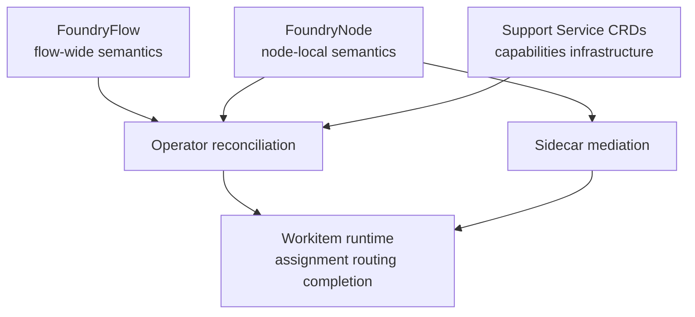
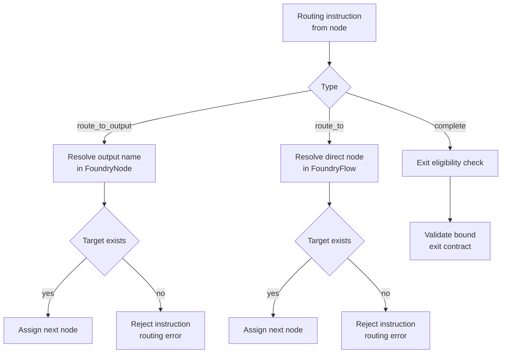
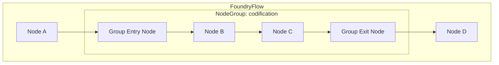
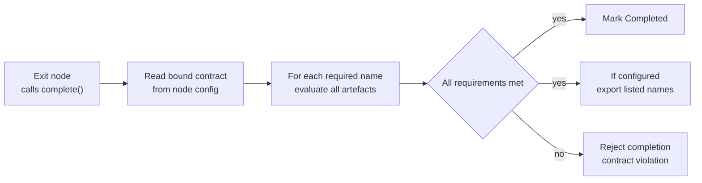

# Configuration Semantics

Flow configuration defines runtime behaviour and is the normative source for behavioural semantics in the Flow layer. Field names, types, defaults, and schema constraints are specified in [CRD Reference](../05-reference/crds.md).

## Configuration Authority Model

Configuration is expressed through three resource types with distinct authority boundaries:

- [FoundryFlow](../05-reference/crds.md#foundryflow) defines Flow-wide behaviour: contracts (`entryContracts`, `exitContracts`), governance policy limits, and cross-flow policy.
- [FoundryNode](../05-reference/crds.md#foundrynode) defines node-local behaviour and permissions: routing outputs, capabilities, timeout budget, and entry/exit bindings (`entry`, `exit`).
- Support Service CRDs define per-service provided capabilities, infrastructure requirements, and deployment policy. Nodes consume Support Service capabilities via `USE:support/...` grants on their FoundryNode `capabilities` field.

Behaviour precedence is deterministic:

1. Flow-wide invariants and policies from FoundryFlow.
2. Node-local configuration from FoundryNode.
3. Runtime state evaluation and authorisation by Operator and system services, with node calls mediated by [Sidecar](../03-node/01-sidecar.md).

Node configuration cannot override Flow invariants.



## Flow-Level Behaviour Surface

FoundryFlow defines the executable shape of a Flow:

- Entry behaviour: named entry contracts and required entry conditions.
- Topology: optional `importNode`, NodeGroups, and routing validity constraints.
- Completion behaviour: named exit contracts and export implications.
- Governance policy limits: thresholds and timers used by runtime guards.
- Cross-flow policy: trust topology and naturalisation requirements.

The Operator treats FoundryFlow as the source of reconciliation truth for behaviour-shaping runtime decisions.

## Routing Semantics

Routing is valid only when the target is discoverable in Flow configuration.

- `route_to_output` resolves through the assigned node's configured outputs.
- `route_to` resolves by explicit node identity.
- Resolution failures are terminal for that assignment attempt and return an error.

The Flow graph is configurable, but it must remain internally coherent:

- Every referenced routing target must exist.
- If `importNode` is configured, it must exist and be entry-bound.
- Cycles are allowed and controlled by timeout and thrash policies.



## NodeGroups

NodeGroups define sub-topology boundaries within a Flow. A NodeGroup is a named collection of nodes with optional entry and exit contracts that govern work crossing the group boundary. NodeGroups are defined inline on the FoundryFlow CRD — they are a topology concern, not a node concern. Nodes do not need to know which group they belong to.

### Definition

Each NodeGroup is a named entry in the FoundryFlow's `nodeGroups` map. A NodeGroup declares:

- **Nodes** — the set of FoundryNode names that belong to this group. A node can belong to at most one group.
- **Entry contracts** — optional contracts validated when a root Workitem is routed to an entry-bound node within the group from outside the group. Uses the same [Contract shape](../05-reference/crds.md#contract-shape) as Flow-level contracts.
- **Exit contracts** — optional contracts validated when a Workitem leaves the group via an exit-bound node within the group. Uses the same [Contract shape](../05-reference/crds.md#contract-shape) as Flow-level contracts.

### Routing Isolation

NodeGroups enforce routing boundaries:

- **Internal routing** — nodes within a group can route to other nodes in the same group without restriction.
- **Entry bridging** — a root Workitem enters a NodeGroup by routing to a specific entry-bound node within the group. The Operator validates the group's entry contract against artefact state before admitting the Workitem.
- **Exit bridging** — a Workitem exits a NodeGroup when an exit-bound node within the group completes its assignment. The Operator validates the group's exit contract.
- **Routing denial** — routing from outside a group to a non-entry-bound node inside the group is rejected with `GROUP_ROUTING_DENIED`.

Child Workitems routed into a group are not subject to the group's entry contract — group contracts apply to root Workitem routing only.

### Reconcile-Time Validation

The Operator validates NodeGroup configuration during reconciliation:

- Every node listed in a group must exist as a FoundryNode.
- A node can belong to at most one group.
- Routing outputs from nodes inside a group must target nodes in the same group (except for entry/exit bridging points).
- Group entry and exit contract stamp references must resolve against [GovernedArtefact](../05-reference/crds.md#governedartefact) stamp vocabularies.



## Exit Node Semantics

Exit status is explicit and configuration-bound. A node is an exit node only when bound to a named exit contract in configuration.

- Only exit nodes may call `complete()`.
- Non-exit `complete()` calls are rejected.
- Contract selection is fixed by node binding; the node does not choose at runtime.
- Contract validation is performed by the Operator.

Exit status is not inferred from empty outputs.

In the reference arrangement, [Sort](../01-concepts/02-foundry-cycle.md#sort-gate) is the only user-configured exit node for governed artefact processing. The [Tribunal](./03-nodes-external.md#the-judiciary--standard-subsystem) is runtime-mandated and uses dedicated hearing entry/exit bindings for review-hearing processing.

## Tribunal Hearing Bindings

Review-hearing processing is configured through mandatory Tribunal bindings:

- The Tribunal is entry-bound for hearing admission.
- The Tribunal is exit-bound for hearing completion.
- Hearing Workitems are standard Workitems carrying a `law-reference` artefact — the law ID under review.
- Hearing processing does not introduce `WorkitemType`, `spec.type`, or type-gated admission.

Deadlock-escalated governed-work Workitems remain separate from hearing Workitems and continue through Sort after Arbiter adjudication in the reference arrangement.

## Import Node Semantics

`importNode` defines where imported Workitems enter execution in the receiving Flow.

- `importNode` must reference an existing FoundryNode.
- The referenced node must be bound to an entry contract.
- Successful import creates the Workitem in `Pending`.
- The Operator schedules the imported Workitem to `importNode` immediately when capacity allows.
- If `importNode` is missing, unknown, or not entry-bound, import admission is rejected.

## Entry and Exit Contract Semantics

Entry and exit contracts are defined per governed artefact name. Each name maps to a required list of stamp names.

- `{"petition-draft": ["linter", "security-review"]}` means artefacts with governed artefact name `petition-draft` must exist and carry both named stamps.
- `{"audit-log": []}` means artefacts with governed artefact name `audit-log` must exist, with no stamp requirement.
- `{}` means no artefact requirements.

Contract usage by boundary:

- Entry contracts gate Workitem admission for entry-bound nodes (local creation), for configured `importNode` (cross-flow import), and for the Tribunal's hearing entry binding (review-hearing processing).
- Exit contracts gate `complete()` for exit-bound nodes.

If multiple artefacts with a required governed artefact name exist, all must satisfy that name's requirements.

Admission uses this same per-name evaluation at the entry boundary.

Completion succeeds only when every required governed artefact name passes validation. Otherwise completion is rejected and the Workitem does not transition to `Completed`.



## Stamp Grant and Capability Semantics

Stamp authority is configured through capability grants on FoundryNode.

- Stamp grant format is `STAMP:artefact/<governed-artefact-name>/<stamp-name>`.
- Grant scope is exact for governed artefact name and stamp name.
- A node may apply only stamps it is granted.

Stamp names are governance conventions chosen by the [Flow Architect](../05-reference/glossary.md#flow-architect). The platform does not attach special system semantics to names.

Stamp application is write-once per artefact version hash:

- A given stamp name can be applied once to a specific content hash.
- A second attempt for the same name on the same version is rejected.
- If independent sign-off is required from different actors, configure different stamp names.

The reference arrangement uses `approval` as the final checkpoint applied by Sort, but `approval` is not a privileged keyword.

### Topology Discovery

Nodes granted `READ:flow` capability can call [`GetFlowTopology`](../05-reference/grpc-api.md#node-facing-methods-via-sidecar) to discover the Flow's runtime topology at assignment time. The response includes:

- **Self** — the calling node's name, capabilities, and configured outputs.
- **Nodes** — all peer nodes in the Flow, each with name, capabilities, and outputs.
- **Exit contract** — the exit contract bound to the calling node (if exit-bound), as a map of governed artefact name to required stamp names.

Gate nodes use this information to build stamp-to-provider mappings dynamically: for each node in the topology, inspect its capabilities for `STAMP:artefact/<governed-artefact-name>/<stamp>` grants to determine which node can provide which stamp. Combined with the calling node's configured outputs, this enables fully dynamic routing without hardcoded node names or stamp associations.

The `NODE_ORDER` environment variable (comma-separated node names, set via FoundryNode CRD container env) controls the order in which the gate evaluates stamp phases. This gives the Flow Architect explicit control over evaluation order without coupling gate logic to specific topologies.

## Child Workitem Contracts

FoundryNode CRDs can optionally declare child Workitem contracts via the `childWorkitems` configuration section. These contracts are developer-side validation aids — they do not affect the platform's child Workitem lifecycle (which uses simple `Complete()` without exit contract validation).

- **Entry contract** — if set, the Operator validates the child Workitem's artefact state against this contract when the child is routed (via `RouteChild`). This ensures the creating node has populated the child with the expected artefacts before sending it for processing.
- **Exit contract** — if set, the Operator validates the child Workitem's artefact state when the child calls `Complete()`. This elevates the child's simple completion to a contract-validated completion for nodes that need structured output guarantees.

Stamp references in child contracts must resolve against [GovernedArtefact](../05-reference/crds.md#governedartefact) stamp vocabularies, validated at reconcile time.

Child contracts are configured on the FoundryNode that creates and routes child Workitems, not on the nodes that process them.

## Reference Arrangement Defaults and Custom Topology

The [Foundry Cycle](../01-concepts/02-foundry-cycle.md) is the reference arrangement and standard recommendation for governed workflows. [Flow Architects](../05-reference/glossary.md#flow-architect) can adapt topology while preserving platform invariants.

Reference arrangement expectations:

- [Forge](../01-concepts/02-foundry-cycle.md#forge-creator) performs creation and reads laws only.
- [Quench](../01-concepts/02-foundry-cycle.md#quench-deterministic-validator) performs deterministic checks.
- [Appraise](../01-concepts/02-foundry-cycle.md#appraise-reviewer) performs subjective review.
- [Sort](../01-concepts/02-foundry-cycle.md#sort-gate) performs gate routing and final approval checkpoint in the reference arrangement.
- [Refine](../01-concepts/02-foundry-cycle.md#refine-refiner) addresses unresolved feedback.

Custom topologies can split, merge, or replace these responsibilities. Runtime semantics remain invariant-driven.

The [Judiciary](./03-nodes-external.md#the-judiciary--standard-subsystem) is always present as a standard runtime subsystem and cannot be omitted.

## Support Service Configuration

Flow Support Services are declared via dedicated CRDs that define provided capabilities and infrastructure requirements.

- Each [FlowSupportService](../05-reference/crds.md#flowsupportservice) CRD declares the capabilities it provides via `providesCapabilities`. [CodificationService](../05-reference/crds.md#codificationservice) CRDs do not declare `providesCapabilities` — their `encode` capability is implicit and enforced by the Operator.
- Infrastructure configuration includes PVC mounts, deployment strategy (ReplicaSet default, StatefulSet option), resource limits, and replica count.
- Default minimum replicas is 0, allowing the Operator to scale services down when unused. Stateful services or services that cannot scale to zero can override the minimum.
- Support Services must implement standard `healthz`/`readyz` endpoints.
- Nodes consume Support Service capabilities via `USE:support/<service>/<capability>` grants on their FoundryNode `capabilities` field, following the same capability-grant pattern as stamp and law capabilities.

The [Clerk node](./03-nodes-external.md#the-judiciary--standard-subsystem) discovers available Codification Services from Flow configuration and fans out to [Codification nodes](../01-concepts/02-foundry-cycle.md#codification-nodes) via child Workitems. Other nodes discover Support Services through their granted capabilities.

Support Service CRD field-level definitions are in [CRD Reference](../05-reference/crds.md).

## Cross-Flow Configuration Semantics

Cross-flow configuration defines trust relationships and authority treatment at boundaries.

- Sibling flows under a shared State Root can accept imported stamps as immediately authoritative after chain verification when names satisfy local requirements.
- Treaty and non-sibling crossings preserve imported stamps for provenance and audit only; local authority begins with naturalisation and required local checks.

Treaty trust is directed. A configured edge from Flow A to Flow B does not imply Flow B to Flow A.

Export scope at exit completion is constrained by bound exit-contract governed artefact names:

- Only artefacts whose governed artefact names are listed in the bound exit contract are exported.
- Empty contract exports metadata only.

## Operational Policy Knobs

Configuration exposes policy limits that bound runtime behaviour:

- Assignment timeout budgets for node execution windows.
- Thrash limits for aggregate Workitem visit budgets.
- Retention windows for completed and failed Workitems.
- Review TTL expiry and friction threshold values driving review hearing triggers.
- Flow Event Bus per-channel retention windows.

### Flow Event Bus Retention

The Flow Event Bus maintains per-channel configurable retention limits. Events within the retention window are available for subscriber replay; events beyond the window are evicted. Each channel supports both duration-based and size-based retention limits. When both are specified, the Event Bus evicts when either limit is exceeded (whichever triggers first). Duration limits use Go `time.Duration` format. Size limits use byte-count strings with unit suffix (e.g. `100MB`, `1GB`). The workitem channel uses the same retention model as other channels.

```yaml
eventBus:
  retention:
    telemetryDuration: "24h"
    telemetrySize: "100MB"
    auditDuration: "168h"
    auditSize: "1GB"
    frictionDuration: "72h"
    frictionSize: "100MB"
    workitemDuration: "24h"
    workitemSize: "100MB"
```

Audit channels will typically have longer retention than telemetry channels. The Bus is a reliable delivery layer, not a long-term storage layer — long-term retention is downstream (Prometheus for metrics, log pipeline for audit records). See [CRD Reference](../05-reference/crds.md#event-bus-configuration) for the full field specification.

These policies are behavioural inputs to Operator and service runtime logic and must be deterministic under reconciliation.

## Validation and Admission Invariants

Configuration is admitted only when invariants hold:

- Every routing reference resolves to a valid target.
- If import is configured, `importNode` is present, routable, and entry-bound.
- Entry and exit bindings reference existing entry/exit contracts.
- Capability grants are syntactically valid and enforceable.
- Cross-flow trust declarations are structurally complete for the configured topology.
- NodeGroup nodes exist as FoundryNodes and each node belongs to at most one group.
- NodeGroup entry and exit contract stamp references resolve against GovernedArtefact stamp vocabularies.
- Child Workitem contract stamp references on FoundryNodes resolve against GovernedArtefact stamp vocabularies.

The runtime rejects invalid configuration instead of applying partial behaviour.

## Configuration Evolution in v1

Configuration evolves without changing invariant meaning:

- Additive changes are preferred: new nodes, outputs, contracts, and capabilities that do not invalidate existing routes.
- Breaking changes require an explicit migration path that keeps Workitems processable during rollout.
- Runtime semantics in this document remain stable across v1 revisions.

## Behavioural Invariants

All Flow configurations must preserve these invariants:

1. Exit status is explicit and contract-bound.
2. Only exit nodes can complete Workitems.
3. Exit validation is Operator-enforced against per-name stamp requirements.
4. Stamp names are conventions; system semantics are capability and contract driven.
5. Stamp-provider routing is configuration-discovered, not hardcoded by node name.
6. The Judiciary is mandatory and bounded to resolve Tier 1-2, propose Tier 3, appeal Tier 4-5.
7. Cross-flow verifiability and local authority remain distinct and topology-dependent.
8. Export scope is constrained by bound exit-contract governed artefact name entries.
9. Workitem admission is constrained by bound entry-contract governed artefact name entries.
10. Imported Workitems begin in `Pending` and are first-scheduled to configured `importNode` when capacity allows.
11. Support Service capabilities are node-granted and Sidecar-mediated.
12. NodeGroups enforce routing isolation — routing from outside a group to a non-entry-bound node inside the group is rejected.
13. A node can belong to at most one NodeGroup.
14. Child Workitem contracts on FoundryNode are optional developer-side validation aids.

These semantics are consumed by [Flow Operator](./01-operator.md), [Workitems](./02-workitem.md), [External Nodes](./03-nodes-external.md), [System Services](./04-system-services.md), [Cross-Flow Collaboration](./06-cross-flow.md), and [Operations](./07-operations.md).

Node-level implementation patterns that realise this configuration model are detailed in [Node Configuration](../03-node/02-configuration.md) and [Node Patterns](../03-node/03-patterns.md). Runtime rejection outcomes map to [Error Catalogue](../05-reference/error-catalogue.md).
