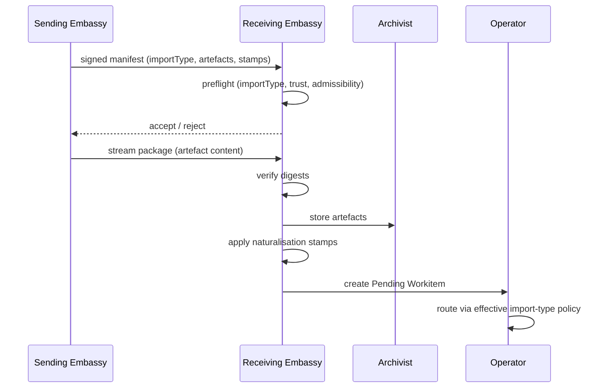
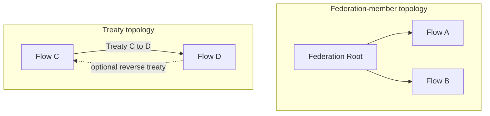
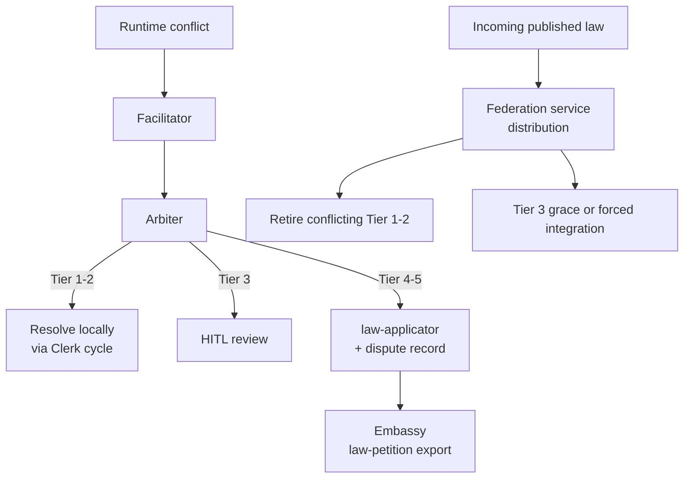

# Cross-Flow Collaboration

Cross-flow collaboration defines how sovereign Flows exchange work and provenance without collapsing control-plane boundaries. The [Embassy](#embassy) handles Workitem transfer. The [Federation service](./08-federation.md) handles published-law distribution. These are separate runtime paths.

## Boundary Model

Each Flow is a sovereignty boundary for [Workitems](./02-workitem.md) and governance execution.

- Intra-flow routing moves one Workitem between nodes in one Flow.
- Cross-flow transfer exports a package via the Embassy and creates a new Workitem lifecycle in the receiving Flow.
- Cross-flow collaboration is copy-on-write by design.

The source Workitem and imported Workitem are related by provenance, not shared lifecycle ownership.

## Embassy

The Embassy is the standard cross-flow boundary node, present in every Flow. It is operator-provisioned and runs as a persistent entry node (watcher-style `StartEntry` process) with two jobs:

- **Outbound export** — package local work for another Flow, send a signed manifest first, and stream the full package only after the remote Embassy accepts it.
- **Inbound import** — receive a signed manifest, preflight the declared `importType`, request the full package, verify it, create a new local Workitem, unpack artefacts, apply naturalisation stamps, and route onward.

### Transfer Protocol

Embassy-to-Embassy transfer follows a header-first protocol:

1. **Manifest** — the sending Embassy sends a signed manifest containing: `importType`, source/target Flow identity, transfer ID and expiry, artefact inventory (governed name, digest, size, representation metadata), and the foreign stamps for each artefact.
2. **Preflight** — the receiving Embassy validates the manifest: does the `importType` exist in the effective import-type registry (built-in system import types plus flow-authored `crossFlow.importTypes`)? Does the trust source (federation membership or Treaty) authorise this sender? Are the declared artefacts admissible?
3. **Package streaming** — if preflight passes, the receiving Embassy requests the full package. The sending Embassy streams artefact content.
4. **Verification** — the receiving Embassy verifies content digests against the manifest inventory.
5. **Materialisation** — the receiving Embassy creates a new local Workitem, unpacks artefacts into the Archivist, and applies naturalisation stamps.
6. **Routing** — the receiving Embassy routes the new Workitem according to the resolved effective import-type policy.



### Import Types

The receiving Flow publishes `crossFlow.importTypes` as the flow-authored extension set of import types:

```yaml
crossFlow:
  importTypes:
    external-submission:
      node: intake-triage
      requireForeignStamps:
        submission:
          - approval
```

`law-petition` is the only currently defined built-in system `importType`. It exists in the same effective namespace as flow-authored import types, but it is always present/configured per Flow by the platform and is not declared in YAML. Additional `importType`s are flow-defined through `crossFlow.importTypes`. For flow-authored entries, the `node` value is receiver-defined and must reference an existing entry-bound FoundryNode. Senders target public `importType`s, never the receiving Flow's private node names.

Embassy resolves imports against the merged effective import-type registry: built-in system import types plus the receiving Flow's published `crossFlow.importTypes`.

### Naturalisation

Embassy naturalisation converts imported provenance into locally attested governance state:

- For each required foreign stamp declared in `requireForeignStamps`, the Embassy verifies the stamp's cryptographic chain against the trust source (federation root or Treaty-pinned CA).
- If all required stamps validate, the Embassy applies a local `imported-<stamp>` attestation stamp for each verified foreign stamp on the imported artefact.
- Foreign stamps remain attached for provenance and audit.
- Downstream local contracts rely on the `imported-*` attestation stamps, not on the foreign stamps directly.

Naturalisation is a per-stamp local attestation process. The Embassy does not re-sign foreign content — it attests that specific foreign stamps were valid at import time.

### Scope Boundary

Embassy handles Workitem transfer (built-in `law-petition` plus any flow-authored import types). Published law distribution is a [Federation service](./08-federation.md) responsibility, not an Embassy `importType`.

## Trust Topologies

Cross-flow trust has two runtime topologies that share the same Embassy protocol:

- **Federation-member topology**: Flows that share federation membership and a common trust root.
- **Treaty topology**: non-federation or cross-organisation exchange through directed trust policies.

Federation-member Flows do not require Treaties for exchange under shared-root trust.



### Federation-Member Exchange

Federation membership establishes the trust root. The Embassy verifies manifests against the federation root CA. Embassy-to-Embassy connections use mTLS. Federation membership or Treaty policy authorises the remote Flow and its import types; this is not embedded in the certificate and does not require a JWT-style bearer token.

### Treaty-Based Exchange

A Treaty is a directed trust policy that enables collaboration between Flows that do not share federation membership. Treaties are receiver-enforced:

- The receiving Flow defines a Treaty CRD referencing the remote Flow and pinning the remote Flow's CA certificate.
- The Treaty may constrain `allowedImportTypes` — which effective import types on the receiving Flow (built-in system or flow-authored) the remote Flow may use.
- Reverse direction requires a distinct Treaty.

Treaties use the same Embassy manifest + package protocol. The only difference from federation-member exchange is the trust source: Treaty-pinned CA instead of federation root CA.

## Exit Export Scope

Export scope is constrained by exit contract semantics.

- Only governed artefact names listed in the bound exit contract are export-eligible.
- Names omitted from the contract are not exported.
- An empty contract exports metadata only.

This behaviour is consistent with exit-completion semantics in [Workitems](./02-workitem.md) and [Configuration Semantics](./05-configuration.md).

## Law Integration Protocol

Higher-tier law integration occurs through [Federation service](./08-federation.md) distribution, not through Embassy import.

Integration at the receiving Flow's [Librarian](./04-system-services.md#librarian) performs two stages before activation:

1. Semantic search for potentially conflicting local laws.
2. LLM contradiction evaluation for true conflict determination.

Tier-dependent conflict outcomes:

- Conflicting local Tier 1-2 laws retire immediately.
- Conflicting local Tier 3 laws trigger HITL intervention with optional grace period.
- During grace period, old Tier 3 law remains active and incoming higher-tier law is queued.
- At grace expiry, integration proceeds automatically and conflicting Tier 3 law retires.
- If LLM contradiction evaluation is unavailable or indeterminate, incoming higher-tier law remains queued and cannot activate.

Retired laws are removed from active CRD state while preserving full history in audit records.

## Runtime Escalation Across Flows

Integration-time law conflict handling and runtime dispute escalation are distinct paths.

- **Integration-time conflicts** are handled by the law integration protocol above.
- **Runtime conflicts** discovered during Workitem processing route to the [Judiciary](./03-nodes-external.md#the-judiciary--standard-subsystem) for judicial review.

Judiciary authority remains bounded across boundaries:

- Resolve at Tier 2 by minting rulings via the [Clerk cycle](../01-concepts/02-foundry-cycle.md#clerk-cycle).
- Propose Tier 3 changes for human ratification via [HITL review](../01-concepts/02-foundry-cycle.md#hitl-nodes).
- Petition Tier 4-5 changes via [law-applicator](../01-concepts/02-foundry-cycle.md#law-applicator) and Embassy `law-petition` export.

Runtime conflict outcomes are tier-pair specific and align with [Governance](../01-concepts/04-governance.md):

| Conflict tier combination | Runtime outcome |
|---------------------------|-----------------|
| Tier 1 vs Tier 2 | The Arbiter fans out to Juror nodes for deliberation with supremacy weighting, the Clerk cycle drafts a Tier 2 Ruling petition that consolidates the surviving position, and retires the originals. |
| Tier 1 vs Tier 1, Tier 2 vs Tier 2 | The Arbiter fans out to Juror nodes, the Clerk cycle drafts a Tier 2 Ruling petition that consolidates the conflicting laws and retires the originals. |
| Tier 1-2 vs Tier 3 | The lower-tier law retires. If the conflict exposes ambiguity or a gap in Tier 3, the Clerk cycle drafts a T3 petition routed to HITL review for a proposed clarification or amendment. |
| Tier 3 vs Tier 3 | The Clerk cycle drafts a consolidated Tier 3 proposal routed to HITL review. If rejected, the conflict persists — every future Workitem that hits the same conflict generates another HITL escalation and more friction until the humans act. |
| Tier 4 or Tier 5 involvement | The Clerk cycle drafts a `law-petition`. law-applicator creates a [dispute record](../01-concepts/03-data-model.md#dispute-records), routes to the Embassy for export to the relevant authority Flow. |

Supremacy heavily informs outcomes, but does not bypass Judiciary deliberation in runtime disputes.



## Failure Modes and Retry Semantics

Cross-flow operations fail and recover through explicit policies:

- Transfer interruption: manifest remains retriable; package streaming is resumable without duplicate effective import.
- Partial import failure: receiving Embassy rejects activation and records structured failure.
- Validation failure: package is quarantined or rejected according to policy.
- Import type misconfiguration (a flow-authored `crossFlow.importTypes` node is missing, unknown, or not entry-bound): import is rejected as configuration error.
- Unknown import type (sender requests a type not in the effective import-type registry): manifest rejected at preflight.
- Foreign stamp validation failure: naturalisation fails and import is rejected.
- Package digest mismatch: import rejected after content verification.
- Destination unavailability: retries with backoff until retry budget exhaustion.
- LLM contradiction evaluator unavailability: law integration retries with backoff while keeping incoming law inactive in queued state.

Every stage must produce auditable events with correlation identifiers spanning export, transfer, and import.

## Cross-Flow Invariants

All cross-flow deployments preserve these invariants:

1. Cross-flow exchange is copy-on-write and starts a separate Workitem lifecycle.
2. Intra-flow routing and cross-flow transfer are distinct mechanisms.
3. Every Flow has an operator-provisioned Embassy for cross-flow boundary management.
4. Embassy transfer uses a header-first protocol: signed manifest, preflight, then package streaming.
5. Import types live in one effective namespace composed of built-in system import types plus flow-authored `crossFlow.importTypes`. `law-petition` is the only currently defined built-in system import type.
6. Federation-member and Treaty exchange use the same Embassy protocol; only the trust source differs.
7. Embassy applies `imported-<stamp>` attestation stamps for verified foreign stamps; foreign stamps remain for provenance.
8. Treaty trust edges are directed; bidirectional exchange requires two treaties. Treaties may constrain `allowedImportTypes`.
9. Bound exit-contract governed artefact name entries constrain export scope.
10. Empty exit contracts export metadata only.
11. Published law distribution is a Federation service responsibility, not an Embassy import type.
12. Higher-tier law integration uses semantic search plus LLM contradiction evaluation.
13. Tier 3 integration conflicts support grace-period semantics before forced integration.
14. Runtime law conflicts route through the Judiciary's judicial process.
15. Cross-flow events are audit-visible and retry-safe.

Schema and wire definitions are specified in [CRD Reference](../05-reference/crds.md) and [gRPC API](../05-reference/grpc-api.md). Error outcomes map to [Error Catalogue](../05-reference/error-catalogue.md). Node-level implementation patterns are detailed in [Node Configuration](../03-node/02-configuration.md) and [Node Patterns](../03-node/03-patterns.md).
