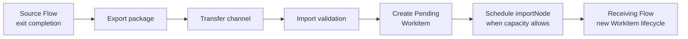
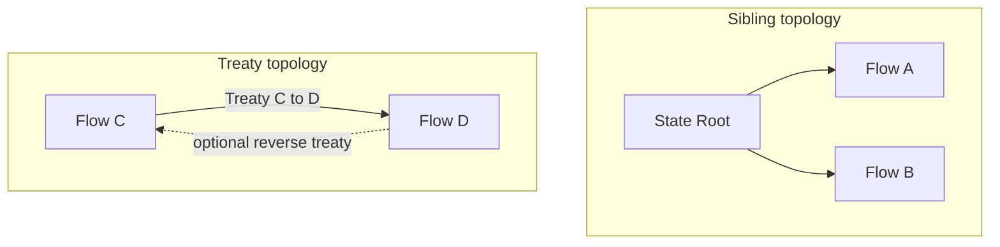
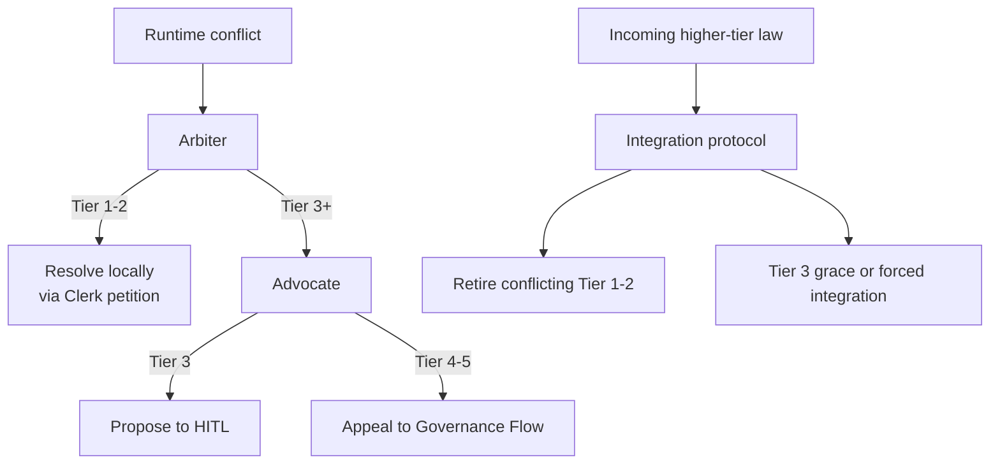

# Cross-Flow Collaboration

Cross-flow collaboration defines how sovereign Flows exchange work, provenance, and higher-tier [governance](../01-concepts/04-governance.md) without collapsing control-plane boundaries.

## Boundary Model

Each Flow is a sovereignty boundary for [Workitems](./02-workitem.md) and governance execution.

- Intra-flow routing moves one Workitem between nodes in one Flow.
- Cross-flow transfer exports a package and creates a new Workitem lifecycle in the receiving Flow.
- Cross-flow collaboration is copy-on-write by design.

The source Workitem and imported Workitem are related by provenance, not shared lifecycle ownership.

## Export, Transfer, and Import Lifecycle

Cross-flow exchange follows a three-stage lifecycle:

1. **Export**: an exit path in the source Flow emits an export package.
2. **Transfer**: package is transmitted over configured trust channel.
3. **Import**: receiving Flow validates and materialises a new Workitem.

Import is idempotent. Replayed packages must not create duplicate effective outcomes.

Import admission is entry-contract bound.

- The receiving Flow resolves `importNode` from Flow configuration.
- `importNode` must exist and be bound to an entry contract.
- The receiving Flow validates the imported Workitem against that bound entry contract.
- On success, the Workitem is created in `Pending`.
- The Operator then schedules the Workitem to `importNode` immediately when capacity allows.

## Trust Topologies

Cross-flow trust has two runtime topologies:

- **Sibling topology**: Flows under a shared Governance Flow trust root.
- **Treaty topology**: non-sibling or cross-organisation exchange through directed agreements.

Sibling Flows do not require Treaties for exchange under shared-root trust.

## Stamp Verifiability and Local Authority

Imported stamp handling separates verifiability from authority:

1. **Verifiability**: can the stamp chain be cryptographically validated?
2. **Authority**: does this imported stamp satisfy local governance requirements?

Verifiability is chain-validation dependent and topology-agnostic. Authority is topology-dependent:

- Sibling/shared-root crossing: imported stamps are authoritative when chain validation succeeds and names satisfy local requirements.
- Treaty/non-sibling crossing: imported stamps are preserved for provenance and audit, but are not authoritative for local requirement satisfaction until naturalisation and local checks complete.

## Naturalisation

Naturalisation converts imported provenance into locally authoritative governance state where required.

- Required for treaty/non-sibling imports.
- Applies local validation and local checkpointing before imported work can satisfy local exit requirements.
- Preserves foreign provenance while establishing local chain-of-custody.

Naturalisation is a governance process, not a cryptographic replacement. Original imported evidence remains queryable.

## Treaties and Directionality

A Treaty is a directed trust policy and execution path.

- A Treaty from Flow A to Flow B grants one-way import authority in that direction. In this configuration, Flow B defines a Treaty CRD with `direction: import` (referencing Flow A) to authorize admission.
- Reverse direction requires a distinct Treaty from Flow B to Flow A.
- Directed edges allow bilateral collaboration without implicit reciprocal trust.

Treaties are receiver-enforced policy boundaries for non-sibling collaboration.

## Exit Export Scope

Export scope is constrained by exit contract semantics.

- Only governed artefact names listed in the bound exit contract are export-eligible.
- Names omitted from the contract are not exported.
- An empty contract exports metadata only.

This behaviour is consistent with exit-completion semantics in [Workitems](./02-workitem.md) and [Configuration Semantics](./05-configuration.md).

## Export Package Structure

The export package is the unit of cross-flow transfer. It carries the Workitem's portable state and a cryptographic chain tying the package to its source Flow.

An export package contains:

| Component | Description |
|-----------|-------------|
| Workitem metadata | Identifier, provenance chain (parent Workitem references). |
| Artefact content | Content bytes for each governed artefact name listed in the bound exit contract. Names not listed are excluded. |
| Passport stamps | All stamps on exported artefacts — the full provenance record. |
| Package signature | The source Flow's Operator signs the package using the Flow's identity material. |
| Certificate chain | The Operator's certificate chain, rooted in the Flow's CA (or the State Root CA for sibling Flows). |

The Operator signs the export package because it represents the Flow as a sovereign authority. The Operator's identity is the Flow's identity — the same certificate that authenticates inter-service and cross-flow communication. Node identities are internal to the Flow and are not exposed across Flow boundaries.

### Verification at Import

The receiving Flow validates the export package before materialising a Workitem:

1. **Chain verification** — the package signature is verified against the certificate chain. For sibling imports, the chain traces to the shared State Root CA. For treaty imports, the chain traces to the CA certificate pinned in the Treaty CRD's `caCert` field.
2. **Subject filtering** — if the Treaty CRD specifies `allowedSubjects`, the signing certificate's subject must match one of the listed values. If `allowedSubjects` is empty, any subject under the pinned CA is accepted.
3. **Bundle size enforcement** — if the Treaty CRD specifies `maxBundleSize`, the package must not exceed it.
4. **Entry contract validation** — the receiving Flow validates the materialised Workitem against the configured `importNode`'s bound entry contract.

## Law Integration Protocol

Higher-tier law integration occurs through [Librarian](./04-system-services.md#librarian)-to-Librarian replication.

Integration performs two stages before activation:

1. Semantic search for potentially conflicting local laws.
2. LLM contradiction evaluation for true conflict determination.

Tier-dependent conflict outcomes:

- Conflicting local Tier 1-2 laws retire immediately.
- Conflicting local Tier 3 laws trigger HITL intervention with optional grace period.
- During grace period, old Tier 3 law remains active and incoming higher-tier law is queued.
- At grace expiry, integration proceeds automatically and conflicting Tier 3 law retires.
- If LLM contradiction evaluation is unavailable or indeterminate, incoming higher-tier law remains queued and cannot activate.

Retired laws are removed from active CRD state while preserving full history in audit records.

## Runtime Escalation Across Flows

Integration-time law conflict handling and runtime dispute escalation are distinct paths.

- **Integration-time conflicts** are handled by the law integration protocol above.
- **Runtime conflicts** discovered during Workitem processing route to the [Judiciary](./03-nodes-external.md#the-judiciary--standard-subsystem) for judicial review.

Judiciary authority remains bounded across boundaries:

- Resolve at Tier 2 by minting rulings via Clerk petition.
- Propose Tier 3 changes for human ratification via the Advocate.
- Appeal Tier 4-5 conflicts through the Advocate to governance channels.

Runtime conflict outcomes are tier-pair specific and align with [Governance](../01-concepts/04-governance.md):

| Conflict tier combination | Runtime outcome |
|---------------------------|-----------------|
| Tier 1 vs Tier 2 | The Arbiter fans out to Juror nodes for deliberation with supremacy weighting, the verdict flows to the Clerk to draft a Tier 2 Ruling petition that consolidates the surviving position, and retires the originals. |
| Tier 1 vs Tier 1, Tier 2 vs Tier 2 | The Arbiter fans out to Juror nodes, the verdict flows to the Clerk to draft a Tier 2 Ruling petition that consolidates the conflicting laws and retires the originals. |
| Tier 1-2 vs Tier 3 | The lower-tier law retires. If the conflict exposes ambiguity or a gap in Tier 3, the Arbiter routes to the Advocate to petition HITL with a proposed clarification or amendment. |
| Tier 3 vs Tier 3 | The Arbiter drafts a consolidated Tier 3 proposal and routes to the Advocate to petition HITL. If rejected, the conflict persists — every future Workitem that hits the same conflict generates another HITL escalation and more friction until the humans act. |
| Tier 4 or Tier 5 involvement | The Advocate files an appeal through the Librarian to Governance Flow authorities. Tier 4 can be repealed or amended by Governance Flow; Tier 5 appeals escalate to the relevant Federal authority. |

Supremacy heavily informs outcomes, but does not bypass Judiciary deliberation in runtime disputes.

## Failure Modes and Retry Semantics

Cross-flow operations fail and recover through explicit policies:

- Transfer interruption: package remains retriable without duplicate effective import.
- Partial import failure: receiving Flow rejects activation and records structured failure.
- Validation failure: package is quarantined or rejected according to policy.
- Import-node misconfiguration (`importNode` missing, unknown, or not entry-bound): import is rejected as configuration error.
- Destination unavailability: retries with backoff until retry budget exhaustion.
- LLM contradiction evaluator unavailability: law integration retries with backoff while keeping incoming law inactive in queued state.

Every stage must produce auditable events with correlation identifiers spanning export, transfer, and import.

## Cross-Flow Invariants

All cross-flow deployments preserve these invariants:

1. Cross-flow exchange is copy-on-write and starts a separate Workitem lifecycle.
2. Intra-flow routing and cross-flow transfer are distinct mechanisms.
3. Imported stamp verifiability and local authority are separate concerns.
4. Sibling/shared-root imports can be immediately authoritative after valid chain verification.
5. Treaty/non-sibling imports require naturalisation for local authority.
6. Treaty trust edges are directed; bidirectional exchange requires two treaties.
7. Bound exit-contract governed artefact name entries constrain export scope.
8. Empty exit contracts export metadata only.
9. Higher-tier law integration uses semantic search plus LLM contradiction evaluation.
10. Tier 3 integration conflicts support grace-period semantics before forced integration.
11. Runtime law conflicts route through the Judiciary's judicial process.
12. Cross-flow events are audit-visible and retry-safe.
13. Successful imports create `Pending` Workitems and first-schedule them to configured `importNode` when capacity allows.

Schema and wire definitions are specified in [CRD Reference](../05-reference/crds.md) and [gRPC API](../05-reference/grpc-api.md). Error outcomes map to [Error Catalogue](../05-reference/error-catalogue.md). Node-level implementation patterns are detailed in [Node Configuration](../03-node/02-configuration.md) and [Node Patterns](../03-node/03-patterns.md).
