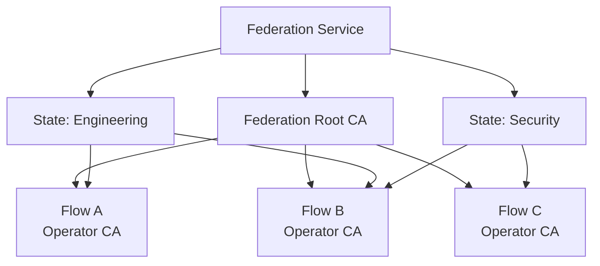

# Federation

The Federation service is the control-plane authority that sits above individual Flows. It manages inter-flow trust, membership, state groupings, authority publisher roles, and published-law distribution. It is a platform service, not a node in the Flow topology.

## Federation Membership

Joining a federation establishes:

- **Flow identity** — a verified Flow identity within the federation namespace.
- **Trust-root discovery** — the federation root CA. The federation issues intermediate CA certificates to each member Flow's Operator, establishing a shared trust hierarchy.
- **Endpoint discovery** — the ability to discover and communicate with other member Flows' [Embassies](./06-cross-flow.md#embassy).
- **State membership** — assignment to one or more states (federation-defined groups).

### Trust Bootstrap

A Flow authenticates to the Federation service to join. The federation provides the trust root after the Flow's identity is verified through the bootstrap process. Trust bootstrap details (shared secret, manual certificate exchange, or bootstrap token model) are deployment-specific.

### Membership Lifecycle

Federation membership is explicit and revocable:

- **Join** — a Flow registers with the Federation service, receives an intermediate CA certificate, and is assigned to states.
- **Active** — the Flow participates in discovery, publication, and `law-petition` routing.
- **Leave / Revoke** — membership is withdrawn. Trust material is rotated. The Flow retains any previously materialised laws but receives no further publications.

## States and Organisational Units

**States** are federation-defined groups of Flows. They represent organisational boundaries — a business unit, a department, a geographic region. Flows may belong to multiple states. Sibling relationships derive from shared state membership.

States serve three purposes:

1. **Scope for Tier 4 publication** — a state-level authority publisher's laws materialise as Tier 4 in subscriber Flows within the same state.
2. **Petition routing** — federation policy determines which authority Flow receives `law-petition`s for a given relationship and scope.
3. **Organisational grouping** — states provide a natural grouping for operational visibility and policy boundaries.

## Authority Publisher Roles

Federation policy designates **authority publisher** roles:

| Role | Scope | Publication tier |
|------|-------|-----------------|
| State-level authority | Flows within the same state | Published laws materialise as Tier 4 |
| Federation-level authority | All Flows in the federation | Published laws materialise as Tier 5 |

Authority Flows are ordinary Flows. They run the same runtime and the same governance model as any other Flow. The only distinction is a federation-assigned publisher role that grants the right to publish laws outward.

A publisher role may be scoped to specific domains (e.g. security, architecture, compliance) to prevent authority overlap.

## Published Law Distribution

### Publication Lifecycle

When an authority Flow marks an approved local Tier 3 law as `published`:

1. **Submission** — the law is submitted to the Federation service via its publication API.
2. **Validation** — the Federation service validates:
   - The submitting Flow holds the appropriate publisher role.
   - The law's scope falls within the publisher's authorised domain.
   - The law does not conflict with other published laws at the same or higher tier.
3. **Acceptance** — the law is accepted for distribution. The Federation service distributes it to subscriber Flows.
4. **Materialisation** — subscriber Flows' [Librarians](./04-system-services.md#librarian) receive the law and materialise it at the appropriate tier (Tier 4 for state-level, Tier 5 for federation-level). The law remains Tier 3 in its source Flow.
5. **Integration** — the receiving Librarian runs the [law integration protocol](./06-cross-flow.md#law-integration-protocol) (semantic search + conflict evaluation) before activating the law.

### Publication Rejection

If the Federation service rejects a publication, it returns a structured report containing:

- Rejection reason (unauthorised publish, scope violation, conflicting published law).
- Conflicting law references (if applicable).
- Suggested remediation.

The rejection is surfaced to the source Flow. If the publication originated from a cross-flow `law-petition`, the [petition-outcome-watcher](#petition-outcome-watcher) in the originating Flow receives the rejection event.

### Petition-ID Correlation

When a published law originated from a cross-flow `law-petition`, the `petition_id` is carried in the law's provenance metadata throughout the publication lifecycle:

1. clerk-forge generates the `petition_id` at drafting time.
2. The Embassy transfers the petition with `petition_id` intact.
3. The authority Flow's governance cycle processes the petition; the `petition_id` survives as an artefact field.
4. law-applicator copies the `petition_id` into the law's provenance when writing via the Librarian.
5. The Federation service distributes the law with provenance intact, including the `petition_id`.

Subscriber Flows use the `petition_id` to match published laws to active [dispute records](../01-concepts/03-data-model.md#dispute-records).

## Petition Routing

Federation policy defines which authority Flow receives `law-petition` imports for a given scope and relationship. When a Flow's [Embassy](./06-cross-flow.md#embassy) needs to export a `law-petition`, it queries the Federation service for the appropriate authority Flow endpoint.

Routing is scope-aware: a petition about security laws routes to the security authority, not the architecture authority. If no authority is configured for a scope, the petition is rejected at the Embassy with a structured error.

## Petition-Outcome-Watcher

The petition-outcome-watcher is an entry-bound node that monitors Federation events for petition outcomes. It bridges the gap between the fire-and-forget `law-petition` export and the eventual publication or rejection outcome:

- **On acceptance** — the authority publishes a law carrying the `petition_id` in provenance. The watcher receives the publication event, retires the associated [dispute record](../01-concepts/03-data-model.md#dispute-records) via the Librarian, and resumes any Workitems held in `pending-hold` against that `petition_id`. The published law materialises as T4/T5 via normal distribution.
- **On rejection** — the Federation service returns a rejection event. The watcher retires the dispute record, creates a new Clerk cycle Workitem with the rejection report as context (so the petition can be revised and resubmitted), and resumes held Workitems.

## Federation Invariants

All federation deployments preserve these invariants:

1. The Federation service is a platform service, not a node in the Flow topology.
2. Federation membership establishes identity, trust root, endpoint discovery, and state assignment.
3. States are federation-defined groups; sibling relationships derive from shared state membership.
4. Authority publisher roles are federation-assigned and scope-constrained.
5. Published law distribution is a Federation service responsibility, not an Embassy import type.
6. Publication admission validates role, scope, and conflict constraints before distribution.
7. Rejected publications return structured reports to the source Flow.
8. Published laws carry `petition_id` provenance for dispute-record correlation.
9. Subscriber Flows materialise published laws at the appropriate tier (T4 for state, T5 for federation) and run the standard integration protocol.
10. The petition-outcome-watcher retires dispute records and resumes held Workitems on petition resolution.
11. Federation membership is explicit and revocable; trust material rotation accompanies membership changes.

Schema and wire definitions are specified in [CRD Reference](../05-reference/crds.md) and [gRPC API](../05-reference/grpc-api.md). Error outcomes map to [Error Catalogue](../05-reference/error-catalogue.md).
