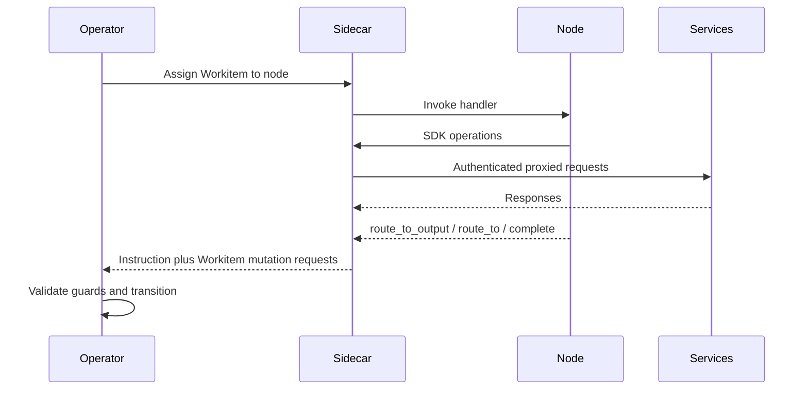

# Node Runtime Overview

[Nodes](../01-concepts/00-overview.md) execute assignment-scoped work inside a Flow while preserving [Flow Operator](../02-flow/01-operator.md) control-plane authority. Node code performs business execution; lifecycle transitions, routing guard enforcement, and completion validation remain Operator responsibilities.

## Node Runtime Boundary

Nodes are data-plane executors. They process assigned work, evaluate artefact state, and decide the next routing outcome. They do not persist [Workitem](../02-flow/02-workitem.md) control-plane state.

Boundary responsibilities are fixed:

- [Flow Operator](../02-flow/01-operator.md) owns assignment state, lifecycle transitions, and routing/exit guard evaluation.
- [Sidecar](./01-sidecar.md) is the mandatory mediation path for node-originated runtime operations.
- [Archivist](../02-flow/04-system-services.md) owns artefact provenance (versions, feedback, stamps, content bytes).
- [Librarian](../02-flow/04-system-services.md) owns law storage and law retrieval surfaces.

Node pods can remain warm for efficiency, but execution state is rebuilt per assignment from Workitem and Archivist state. A node that sees the same Workitem again treats it as fresh runtime input.

## Assignment Lifecycle from the Node Perspective

Assignment handling is single-owner and single-outcome.

1. Operator selects a `Pending` Workitem and assigns it to one node.
2. Sidecar invokes the node handler for the assigned Workitem.
3. Node executes using SDK abstractions for artefact, feedback, and legal reads/writes.
4. Node returns exactly one routing instruction: `route_to_output`, `route_to`, or `complete`.
5. Sidecar submits the routing instruction and Workitem mutation requests to Operator.
6. Operator validates guards and applies the next lifecycle transition or rejects with structured errors.

## Runtime Interaction Model

Runtime interactions separate business execution from persistence authority:

- Node <-> Sidecar: assignment-scoped SDK calls and routing outcomes.
- Sidecar -> Operator: control-plane mutation requests and routing instructions.
- Sidecar -> Archivist: artefact versions, feedback, and stamp operations.
- Sidecar -> Librarian: law retrieval and legal context queries.
- Sidecar -> telemetry surfaces: metrics, traces, and mediation logs.
- Sidecar -> Flow Support Services: capability-gated operations on Flow-Architect-deployed services.

Node code may call external business services over the data-plane network path. That does not change Flow runtime authority boundaries: authenticated runtime operations still pass through Sidecar mediation.

## Node Categories

Nodes fall into five categories based on their runtime role:

- **Business nodes** — execute assignment-scoped work (content generation, review, refinement). Examples: [Forge](../01-concepts/02-foundry-cycle.md#forge-creator), [Appraise](../01-concepts/02-foundry-cycle.md#appraise-reviewer), [Refine](../01-concepts/02-foundry-cycle.md#refine-refiner).
- **Gate nodes** — evaluate governance state and route accordingly. Example: [Sort](../01-concepts/02-foundry-cycle.md#sort-gate).
- **Judiciary nodes** — resolve disputes, conduct hearings, codify rulings, and apply law changes. Examples: [Facilitator](../01-concepts/02-foundry-cycle.md#facilitator), [Arbiter](../01-concepts/02-foundry-cycle.md#arbiter-deadlock-resolver), [Tribunal](../01-concepts/02-foundry-cycle.md#tribunal-hearing-conductor), [Juror](../01-concepts/02-foundry-cycle.md#juror-judicial-agent), [Clerk cycle](../01-concepts/02-foundry-cycle.md#clerk-cycle) nodes, [Rule Router](../01-concepts/02-foundry-cycle.md#rule-router), [law-applicator](../01-concepts/02-foundry-cycle.md#law-applicator).
- **HITL nodes** — human-in-the-loop decision points using the [generic config-driven HITL pattern](../04-sdk/08-sdk-hitl.md). Examples: hitl-appraise, arbiter-hitl-resolve, tribunal-hitl-resolve.
- **Embassy** — the standard [cross-flow boundary node](../02-flow/06-cross-flow.md), present in every Flow. Handles outbound export and inbound import of Workitems using a signed manifest and streamed package protocol. The Embassy is a first-class node pattern because it owns a node-to-node transfer protocol (Embassy-to-Embassy) that operates outside Sidecar mediation for the cross-flow transfer itself, while still using Sidecar-mediated paths for local service access (Archivist, Operator).

[Federation service](../02-flow/08-federation.md) interactions (membership, published-law distribution, authority endpoint discovery) are external platform-service relationships, not node-local routing. Nodes do not interact with the Federation service directly — the Embassy queries it for authority endpoints, and the Librarian receives distributed laws from it.

## Ownership and Mutation Boundaries

Mutation authority is intentionally split and enforced at runtime boundaries:

- Workitem lifecycle and routing persistence are Operator-owned.
- Artefact provenance persistence is Archivist-owned.
- Law lifecycle persistence is Librarian-owned.

Nodes express intent through SDK operations. Sidecar mediates authenticated service calls, and Operator/Archivist/Librarian authorise and validate effects on their owned state surfaces.

Completion semantics are configuration-bound:

- `complete()` is accepted only for exit-bound nodes.
- Operator validates completion against the node's bound exit contract.
- Non-exit completion attempts are rejected.

Law and stamp access is capability-gated:

- A node without a `WRITE:law/tierN` capability grant cannot write laws regardless of its role. In the [reference arrangement](../01-concepts/02-foundry-cycle.md), the standard [Forge](../01-concepts/02-foundry-cycle.md#forge-creator) node reads laws for context seeding and does not write them.
- The [Judiciary](../02-flow/03-nodes-external.md#the-judiciary--standard-subsystem) resolves Tier 1-2 conflicts (via the Arbiter with internal tally), proposes Tier 3 changes (via [HITL nodes](../01-concepts/02-foundry-cycle.md#hitl-nodes)), petitions Tier 4-5 changes (via [law-applicator](../01-concepts/02-foundry-cycle.md#law-applicator) and [Embassy](../02-flow/06-cross-flow.md) `law-petition` export), and codifies rulings (via the [Clerk cycle](../01-concepts/02-foundry-cycle.md#clerk-cycle), which drafts petitions, fans out to [Codification nodes](../01-concepts/02-foundry-cycle.md#codification-nodes), and routes through [Rule Router](../01-concepts/02-foundry-cycle.md#rule-router) for tier-based dispatch).

## Relationship to SDK Documents

This document defines runtime authority and boundary semantics. API-level behaviour lives in:

- [SDK Core](../04-sdk/01-sdk-core.md)
- [SDK Artefacts](../04-sdk/02-sdk-artefacts.md)
- [SDK Legal](../04-sdk/03-sdk-legal.md)
- [SDK Feedback](../04-sdk/04-sdk-feedback.md)
- [SDK Workitems](../04-sdk/05-sdk-workitems.md)
- [SDK Telemetry](../04-sdk/06-sdk-telemetry.md)

Wire and schema references remain in [gRPC API](../05-reference/grpc-api.md) and [CRD Reference](../05-reference/crds.md).

## Runtime Invariants

1. One assignment has one active assignee and one routing outcome.
2. Nodes do not mutate Workitem lifecycle fields directly.
3. Sidecar mediation is mandatory for node-originated runtime operations.
4. Operator is the sole authority for lifecycle transition persistence.
5. `complete()` is exit-node-only and Operator-validated against bound exit contract.
6. Workitems do not use `WorkitemType`, `spec.type`, or a freeform context bag.
7. Stamp-provider routing and gate logic are configuration-driven, not hardcoded by node name.
8. Stamp authority is capability-scoped and write-once per artefact version.
9. External service integration does not bypass Sidecar for authenticated Flow runtime operations.
