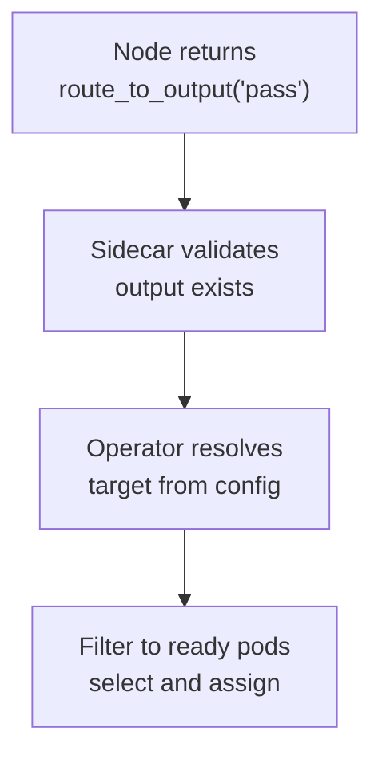

# Node Configuration Semantics

Node behaviour is shaped by two configuration surfaces: the [FoundryFlow](../02-flow/05-configuration.md) CRD defines Flow-wide invariants and policy limits; the [FoundryNode](../05-reference/crds.md) CRD defines node-local behaviour, permission envelope, and routing topology. Runtime resolution is deterministic — Flow-level constraints always take precedence, and node configuration cannot override them. Field-level schema detail lives in [CRD Reference](../05-reference/crds.md).

## Configuration Precedence

Configuration resolves through a fixed hierarchy:

1. **FoundryFlow** — Flow-wide policy limits, entry/exit contract definitions, thrash budgets, timeout defaults, and cross-flow settings.
2. **FoundryNode** — Node-local capability grants, routing outputs, contract bindings, timeout overrides, concurrency, and storage.
3. **Runtime evaluation** — Operator reconciliation and service-side validation on [Sidecar](./01-sidecar.md)-mediated requests.

A node's configured timeout cannot exceed the Flow-level [`maxTimeout`](../05-reference/crds.md#governance-policy). A node's capability grants cannot exceed the Flow-level permission envelope. When node configuration conflicts with Flow-level constraints, the Flow-level constraint wins — silently, at reconciliation time, not at request time.

The [Operator](../02-flow/01-operator.md) reconciles both CRDs into the effective runtime state. Services evaluate requests against the reconciled state, not against raw CRD fields.

## Routing Outputs and Target Resolution

Each node declares named routing outputs that map to target nodes or target resolution rules. When a node handler returns `route_to_output`, the Operator resolves the named output from the node's configuration and selects the target.

Each output maps a name to a target node. When the handler returns `route_to_output("pass")`, the Operator looks up `"pass"` in the node's output configuration and resolves the declared target.

`route_to` bypasses output configuration entirely and names a target node directly. The Operator validates that the target exists as a FoundryNode in the namespace.

Resolution failures are terminal for the routing instruction:

- An output name that does not exist in the node's configuration is rejected synchronously by the Sidecar.
- An output whose declared target resolves to zero available pods causes Workitem failure after Operator retry policy is exhausted.
- A `route_to` target that does not exist as a FoundryNode is rejected by the Operator.

Configuration must keep routes coherent: every declared output target must be resolvable under normal operating conditions. The Operator surfaces unresolvable configurations through reconciliation warnings and telemetry.

## Capability Grants

Capability strings define what actions a node may request through [SDK](../04-sdk/01-sdk-core.md) surfaces. Grants are declared in the FoundryNode CRD and enforced by the target service when the [Sidecar](./01-sidecar.md#authorisation-enforcement) presents the node's identity.

The capability grammar follows a `VERB:RESOURCE[/QUALIFIER]` pattern:

- `READ:artefact`, `WRITE:artefact`, `WRITE:artefact/<governed-artefact-name>` — artefact access. `WRITE:artefact` grants write access to all governed artefact names; `WRITE:artefact/<governed-artefact-name>` scopes to a specific governed artefact name. See [SDK Artefacts](../04-sdk/02-sdk-artefacts.md#capability-gated-actions) for the specific SDK operations each capability enables.
- `READ:law`, `WRITE:law/tier1` through `WRITE:law/tier5` — law access. Each tier grant is a ceiling: `WRITE:law/tier2` authorises writes at Tier 2 and below.
- `WRITE:friction` — friction emission. Required for `AddFriction` and its convenience wrapper [`Cite`](../04-sdk/03-sdk-legal.md#citation). Enforced by the Sidecar before publishing to the [Flow Event Bus](../02-flow/04-system-services.md#flow-event-bus).
- `STAMP:artefact/<governed-artefact-name>/<stamp-name>` — stamp authority scoped to a specific governed artefact name and stamp name.
- `READ:flow` — topology discovery, enabling a node to query stamp-to-node mappings at runtime.
- `READ:workitem` — Workitem state access beyond the current assignment.
- `READ:feedback` — feedback read access on artefacts.
- `WRITE:feedback/<status>` — feedback write access scoped to a target status. Each feedback state transition requires its own capability grant: `WRITE:feedback/new`, `WRITE:feedback/actioned`, `WRITE:feedback/wont_fix`, `WRITE:feedback/rejected`, `WRITE:feedback/resolved`, `WRITE:feedback/deadlocked`.
- `USE:support/<service>/<capability>` — access to a specific [Flow Support Service](../02-flow/04-system-services.md#flow-support-services) capability.
- `USE:queue/server` — enables [HITL queue features](../04-sdk/08-sdk-hitl.md): persistent queue, REST API, Federated Queue Mesh. Requires `spec.storage`. Triggers StatefulSet deployment and Headless Service creation.

Enforcement is exact. A node granted `STAMP:artefact/petition-draft/linter` can stamp `linter` on `petition-draft` artefacts. It cannot stamp `security-review` on `petition-draft` artefacts, and it cannot stamp `linter` on `audit-log` artefacts. Missing grants produce deterministic denial with structured errors — the node receives a permission error, not a silent no-op.

Some operations do not require explicit capability grants. For example, `ListArtefacts` (listing artefacts associated with the assigned Workitem, queried from the Archivist) is implicitly available to all nodes by virtue of the assignment scope.

Malformed capability strings (invalid verb, missing resource qualifier where required, unknown verb) are rejected at configuration admission. The Operator does not reconcile a FoundryNode with syntactically invalid capabilities.

## Entry and Exit Bindings

Entry and exit bindings connect a node to named [contracts](../02-flow/05-configuration.md#entry-and-exit-contract-semantics) defined in the FoundryFlow CRD. Bindings are fixed at configuration time and cannot be chosen dynamically by node code.

**Entry binding** (`entry`) connects a node to a named entry contract. Entry-bound nodes participate in Workitem admission paths:

- Local Workitem creation admits through the creating node's entry binding.
- Cross-flow import admits through the configured [`importNode`](../02-flow/05-configuration.md#import-node-semantics), which must be entry-bound.
- Review-hearing admission uses the [Tribunal](../02-flow/03-nodes-external.md#the-judiciary--standard-subsystem)'s hearing entry binding.

**Exit binding** (`exit`) connects a node to a named exit contract and grants `complete()` eligibility. Only exit-bound nodes may call `complete()` — non-exit nodes that attempt completion receive a synchronous error. When an exit node calls `complete()`, the [Operator validates](../02-flow/01-operator.md#exit-contract-enforcement) the Workitem against the bound exit contract. The node does not choose which contract to validate.

In the [reference arrangement](../01-concepts/02-foundry-cycle.md), Sort is the user-configured exit node for governed artefact processing, and the [Tribunal](../02-flow/03-nodes-external.md#the-judiciary--standard-subsystem) is runtime-mandated as the exit node for review-hearing processing. Custom topologies can bind any node as an exit node provided the contract and capability configuration is consistent.

Contract references must resolve. A node binding that references a contract name not defined in the FoundryFlow CRD is rejected at configuration admission.

## Timeout and Execution Budget

The timeout budget bounds the inactivity window for each assignment. The [Sidecar](./01-sidecar.md#heartbeat-and-activity-tracking) enforces timeout as an inactivity timer — the timer resets on every SDK call and explicit heartbeat. Timeout measures idle time, not total execution time.

Timeout resolution follows the configuration precedence hierarchy:

1. Node-specific timeout in FoundryNode (if set).
2. Flow-level default timeout in FoundryFlow.
3. System fallback.

Timeout behaviour composes with Operator failure policy:

- When timeout fires, the Sidecar reports failure to the Operator with a timeout reason.
- The Operator applies its configured failure policy (retry, reroute to a timeout output if configured, or fail the Workitem).
- Thrash guard enforcement runs independently — a Workitem that times out and retries consumes visit budget.

Long-running node patterns (multi-step LLM inference, complex external integrations) must maintain activity signals within the configured timeout window. The [FoundryAgent pattern](./03-patterns.md#long-running-and-agent-patterns) provides automatic heartbeat management for inference workloads.

## Concurrency

The concurrency setting controls how many Workitems a single pod processes simultaneously.

| Value | Behaviour |
|---|---|
| `1` (default) | Sequential processing. One Workitem at a time per pod. |
| `N > 1` | Concurrent processing. Up to N active assignments per pod. |
| `0` | Unlimited concurrency. Pod accepts all assigned Workitems. |

The Sidecar's [readiness endpoint](./01-sidecar.md#health-and-readiness) reflects capacity — it returns unavailable when active assignments reach the concurrency limit, preventing the Operator from assigning additional work. Node handlers operating under concurrency greater than one must be safe for concurrent execution.

## Storage and Volumes

Node storage configuration determines deployment strategy:

- When persistent storage is declared, the Operator deploys the node as a StatefulSet.
- When no persistent storage is declared, the Operator deploys the node as a ReplicaSet (default).

Volume mounts declared on the node are injected into both the node container and the Sidecar container, enabling shared ephemeral storage patterns. The diplomatic pouch pattern (an `emptyDir` volume mounted at a well-known path) provides shared ephemeral storage for large bundle operations during [cross-flow exchange](../02-flow/06-cross-flow.md).

## Validation and Rejection

The Operator validates configuration at admission time and rejects invalid configurations before they affect runtime state:

- Unknown contract references (entry or exit binding names not defined in FoundryFlow).
- Missing or unresolvable routing targets.
- Invalid `importNode` reference (node does not exist or is not entry-bound).
- Syntactically invalid capability strings.
- Configurations that violate entry/exit binding invariants (e.g., exit binding without a valid contract).

Rejected configurations produce structured errors suitable for operational triage and audit. Partial application is never attempted — a FoundryNode with invalid configuration is not reconciled.

Runtime denial (as opposed to admission rejection) occurs when a valid configuration encounters unexpected state: a routing target that existed at configuration time becomes unavailable, or a capability grant references a governed artefact name that no [GovernedArtefact CRD](../05-reference/crds.md#governedartefact) defines. These are operational failures, not configuration errors.

## Rollout and Configuration Evolution

Operator reconciliation is convergent. When configuration changes, the Operator drives the runtime toward the new declared state:

- In-flight Workitems complete under the configuration that was active when they were assigned. Assignment-level configuration is captured at assignment time.
- Queued (`Pending`) Workitems are processed under the new configuration when they are next assigned.
- Routing topology changes take effect for new assignments. Existing routing instructions that have not yet been evaluated are resolved against current configuration.

Configuration drift between declared and observed runtime state is surfaced through reconciliation telemetry. The Operator does not silently tolerate drift — it continuously reconciles toward the declared state and reports divergence.

Behavioural changes are applied through configuration evolution (CRD updates), not through ad hoc runtime mutation or imperative commands. The configuration CRDs are the single source of truth for node behaviour.

## Configuration Invariants

1. Node behaviour is subordinate to Flow-level invariants; node configuration cannot override FoundryFlow constraints.
2. Exit status is explicit through `exit` binding — never inferred from topology shape or output absence.
3. Entry admission and exit completion are contract-bound; contracts are fixed by binding, not chosen at runtime.
4. Capability enforcement is exact by verb, resource, governed artefact name, and stamp name.
5. Stamp authority is capability-scoped (`STAMP:artefact/<governed-artefact-name>/<stamp-name>`) and write-once per artefact version.
6. Import intake starts at configured `importNode`, which must exist and be entry-bound.
7. Timeout measures inactivity, not total execution time.
8. Invalid configuration is rejected at admission; partial application does not occur.
9. No configuration path reintroduces `WorkitemType`, `spec.type`, or freeform context bag semantics.
