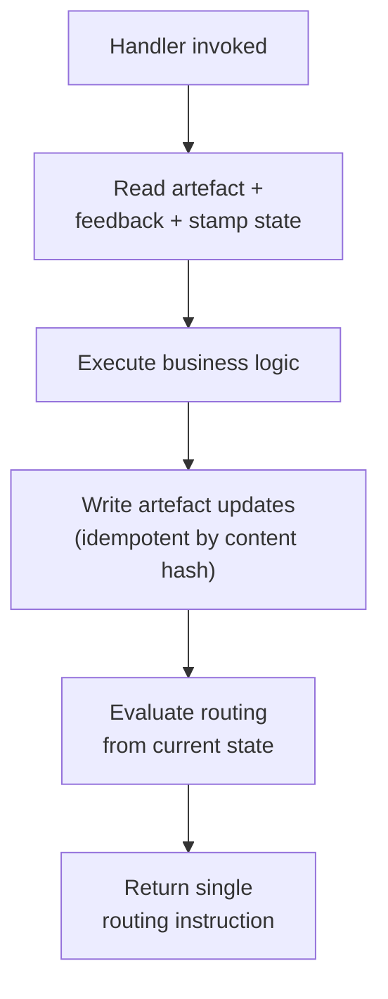
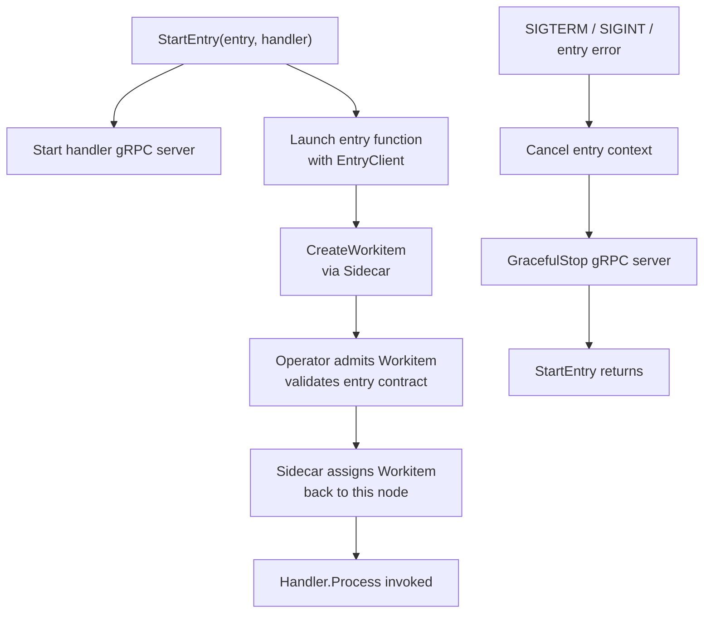
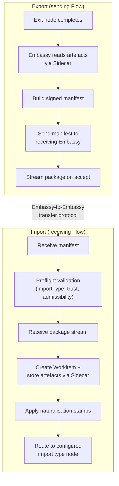

# Node Implementation Patterns

Node handlers execute within strict runtime boundaries: single-assignment scope, [Sidecar](./01-sidecar.md)-mediated operations, [Operator](../02-flow/01-operator.md)-owned lifecycle transitions, and capability-gated governance. Correct implementations handle retries, reassignment, and adversarial governance within these constraints.

## Pattern Principles

- **Deterministic at boundaries.** Routing decisions and side-effect commits must produce the same outcome when replayed against the same state. Non-determinism in business logic (LLM inference, heuristic evaluation) is acceptable; non-determinism in control-flow decisions is not.
- **Auditable by construction.** Every material decision — artefact mutation, feedback state change, routing outcome — must be reconstructable from the audit trail. Hidden state that affects outcomes without leaving a trace violates the [auditability axiom](../01-concepts/00-overview.md).
- **Capability-aware.** Handlers must anticipate permission denial as a normal control path, not an exceptional one. A node that lacks `WRITE:law/tier1` capability will receive a structured error if it attempts to record a Finding. The handler decides what that means for routing.
- **Assignment-scoped.** All execution state is rebuilt from [Workitem](../02-flow/02-workitem.md) and [Archivist](../02-flow/04-system-services.md#archivist) state at the start of each assignment. Pod-local memory from a previous assignment is not a valid input.

## Idempotent Assignment Handlers

A handler may be invoked more than once for the same Workitem — after timeout, pod restart, or reassignment. Correct handlers produce the same effective outcome regardless of how many times they execute against the same state.

**Rebuild context from durable state.** At the start of every assignment, read artefact versions, feedback state, and stamps from the Archivist through [SDK](../04-sdk/01-sdk-core.md) calls. Do not depend on in-memory state from a previous invocation or a previous assignment to a different Workitem.

**Use stable artefact identifiers.** When updating an artefact, use the same `id` that was established when the artefact was first introduced on the Workitem. The Archivist treats a store operation on an existing `id` with unchanged content as a no-op (same content hash, no new version). Changed content produces a new version. Either outcome is safe under replay.

**Return a single routing instruction from explicit state checks.** The handler evaluates current artefact and governance state and returns one of `route_to_output`, `route_to`, or `complete`. The routing decision must be derivable from the state the handler observes — not from whether this is the "first" or "second" invocation.

## Retry-Safe External Side Effects

Nodes that call external services (APIs, databases, third-party platforms) must ensure that retried invocations do not duplicate irreversible effects.

**Anchor idempotency keys to Workitem identity.** Construct external request identifiers from the Workitem ID and operation identity so that replayed requests are recognised as duplicates by the external service. If the external service does not support idempotency keys, the handler must check for existing results before issuing a new request.

**Separate intent from commitment.** Perform the external operation, capture the response, then write the result to artefacts through the SDK. If the handler is interrupted between the external call and the artefact write, the next invocation detects that the artefact has not been updated and re-executes the external call. If the external service processed the original request, the idempotency key ensures no duplication.

**Map external responses to deterministic routing.** Define explicit mappings from external response classes (success, transient failure, permanent failure, ambiguous) to routing outcomes. Ambiguous external outcomes that could compromise governance integrity should route to an error or escalation path — not silently proceed.

## Gate Routing and Governance Feedback Loops

Gate nodes evaluate governance state and route accordingly. In the [reference arrangement](../01-concepts/02-foundry-cycle.md), [Sort](../01-concepts/02-foundry-cycle.md#sort-gate) implements this pattern. Any node with the appropriate capabilities can implement gate logic.

The reference arrangement gate decision order:

1. **Deadlocked feedback** (dispute depth exceeds configured threshold) — route toward the [Arbiter](../02-flow/03-nodes-external.md#the-judiciary--standard-subsystem) for judicial review. Deadlock must be checked first because deadlocked items route to the Arbiter, not to refinement.
2. **Stamp evaluation in configured order** — for each stamp phase (ordered by `NODE_ORDER` env var), check whether the stamp is present. If the stamp is present but the providing node left unresolved feedback (identified via `FeedbackItem.source`), route to refinement. If the stamp is missing, route to the providing node via the gate's configured output.
3. **All governance satisfied** (all stamps present, no per-phase unresolved feedback) — apply any stamps the gate itself can provide (discovered from its own `STAMP` capabilities and the exit contract), call `complete()`, and let the Operator validate the bound [exit contract](../02-flow/05-configuration.md#exit-node-semantics).

Gate nodes discover stamp-to-node mappings at runtime via [`GetFlowTopology`](../05-reference/grpc-api.md#node-facing-methods-via-sidecar) (requires `READ:flow` capability). The response provides all peer nodes with their capabilities and outputs, enabling the gate to build provider maps dynamically. The `NODE_ORDER` environment variable (set via FoundryNode CRD container env) controls the evaluation order of stamp phases, giving the Flow Architect explicit sequencing control without coupling gate logic to specific topologies.

Deadlocked feedback is a special case of unresolved feedback. Gate implementations must check for deadlock before evaluating stamp phases, because deadlocked items route to the [Arbiter](../02-flow/03-nodes-external.md#the-judiciary--standard-subsystem) rather than to refinement. The SDK provides feedback-depth queries and `FeedbackItem.source` to support per-phase feedback attribution.

**Contempt Guard awareness.** After the [Arbiter](../02-flow/03-nodes-external.md#the-judiciary--standard-subsystem) renders a verdict with a linked ruling, that verdict is binding. The [Contempt Guard](../01-concepts/03-data-model.md#contempt-guard) enforced by the Archivist prevents nodes from refusing feedback that carries a linked ruling. Gate implementations that route based on feedback state must account for the possibility that a previously deadlocked item has been resolved by the Arbiter and now carries a binding ruling — the normal refinement path applies, and the refining node cannot mark it `wont_fix`.

**Stamp-provider discovery is configuration-driven.** Gate nodes do not hardcode which node provides which stamp. They call [`GetFlowTopology`](../05-reference/grpc-api.md#node-facing-methods-via-sidecar) (via `READ:flow` capability) to discover stamp-to-node mappings from node capabilities at runtime. This preserves topology freedom — a Flow Architect can reassign stamp authority without modifying gate logic.

## Human-in-the-Loop Pattern

Human decision points are modelled as explicit runtime states within the assignment lifecycle, not as hidden thread-local waits or out-of-band processes.

**Hold assignment ownership.** The Workitem remains assigned to the HITL node while awaiting human input. The node maintains [heartbeat](./01-sidecar.md#heartbeat-and-activity-tracking) signals to prevent inactivity timeout. HITL nodes typically configure longer timeout windows to accommodate human response latency.

**Persist decision evidence on artefacts.** When the human provides input, the node records the decision and any supporting evidence as artefact updates or feedback state changes through the SDK. The decision becomes part of the governed audit trail, not a transient in-memory value.

**Resume with deterministic routing.** After receiving and recording human input, the handler evaluates the recorded state and returns a routing instruction. The routing decision is derivable from the persisted evidence, making it replay-safe.

**Expose a queue interface.** HITL nodes that serve multiple human reviewers expose a queue surface (REST API or equivalent) that allows humans to claim, review, and decide on pending assignments. The queue state is node-local persistence (typically SQLite with a PVC). The Sidecar does not mediate the human-facing API — it mediates the SDK calls the node makes after receiving human input.

Escalation patterns (manager/director chains, delegation, pool-based routing) are built on top of the basic HITL pattern by composing queue management with routing logic.

The SDK provides the [`USE:queue/server` capability and HITL pattern](../04-sdk/08-sdk-hitl.md) — a managed infrastructure for queue persistence, REST API exposure, federated queue mesh, and escalation chains. The Judiciary's [HITL nodes](../02-flow/03-nodes-external.md#hitl-nodes) (hitl-appraise, arbiter-hitl-resolve, tribunal-hitl-resolve) are concrete instances using this SDK pattern. User-defined HITL nodes compose the same SDK pattern with domain-specific logic.

## Long-Running and Agent Patterns

Nodes that perform extended computation — multi-step LLM chains, complex reasoning, long-running inference — must maintain [activity signals](./01-sidecar.md#heartbeat-and-activity-tracking) within the configured timeout window.

The [FoundryAgent](../04-sdk/07-sdk-agent.md) pattern is the recommended approach for all LLM-backed nodes. It wraps inference execution with three managed guarantees:

1. **Managed Liveness** — automatic `Heartbeat()` calls at regular intervals during inference, freeing the developer from manual timer management. The heartbeat loop runs continuously while the `Infer` method executes.
2. **Schema-First Output Validation** — structured output is validated against a declared schema before it can be written to artefacts or returned as a routing decision. Malformed inference output fails fast and never enters the governed pipeline.
3. **Atomic Cost Accounting** — each inference step emits a `foundry.cost.llm` telemetry event immediately via `RecordTelemetry`. If the handler is interrupted, the accounting record reflects actual work performed, not batched totals.

The [SDK Agent](../04-sdk/07-sdk-agent.md) document is the authoritative contract for FoundryAgent behaviour, including handler structure, output validation semantics, and the relationship to [Juror nodes](../01-concepts/02-foundry-cycle.md#juror-judicial-agent) in the Judiciary's deliberation topology.

**Manual alternative.** Nodes that perform inference without FoundryAgent must manage these concerns explicitly:

- Call `Heartbeat()` at intervals well within the configured timeout during any computation that does not make SDK calls.
- Validate structured output before writing artefacts or returning routing instructions.
- Emit cost telemetry through `RecordTelemetry()` after each inference step rather than batching at handler exit.

## External Integration Pattern

Nodes that integrate with external systems follow the same runtime contract as any other node, with additional emphasis on boundary management.

**Bounded retry policy.** External calls should have explicit timeout and retry budgets that compose with the node's configured [execution budget](./02-configuration.md#timeout-and-execution-budget). An external call that retries indefinitely can exhaust the node's timeout even with regular heartbeats.

**Correlation identifiers.** External requests should carry identifiers traceable back to the Workitem ID and assignment context. This enables end-to-end audit reconstruction across Flow and external system boundaries.

**Cross-flow sovereignty transfer uses the Embassy.** When work needs to move to another Flow, use the [Embassy](../02-flow/06-cross-flow.md) transfer protocol (export via the sending Embassy, import via the receiving Embassy which routes to the node configured for the `importType` in `crossFlow.importTypes`). Do not simulate cross-flow transfer with local routing shortcuts or direct service calls between Flows.

**Fail closed on ambiguous outcomes.** If an external response is ambiguous (partial success, unknown status, timeout without confirmation), route to an error or escalation path rather than assuming success. Governance integrity depends on deterministic state — an optimistic assumption about an ambiguous external outcome can produce an artefact state that appears governed but is not.

## Entry Node Pattern

Entry-bound nodes admit new Workitems into a Flow from event-driven or time-driven triggers rather than from upstream routing. The node runs two concurrent concerns: an **entry loop** that watches for external signals and creates Workitems, and a **handler server** that processes the Workitems it created when the Operator assigns them back.

This pattern is used by the Judiciary's [Friction Watcher](../02-flow/03-nodes-external.md#watcher-nodes) and [TTL Watcher](../02-flow/03-nodes-external.md#watcher-nodes). Any node bound to an [entry contract](../02-flow/05-configuration.md#entry-and-exit-contract-semantics) can implement it.

### StartEntry Lifecycle

The SDK provides `StartEntry(entry, handler)` to launch both concerns:

1. **Handler server starts.** A gRPC server begins listening for `Process` calls from the [Sidecar](./01-sidecar.md), identical to `Start(handler)`.
2. **Entry function launches.** The entry function runs concurrently in a background goroutine with a cancellable context and an `EntryClient`.
3. **Steady state.** Both run concurrently. The entry loop creates Workitems; the Operator assigns them; the Sidecar invokes the handler.
4. **Shutdown.** On `SIGTERM`/`SIGINT` or entry function return, the entry context is cancelled and the gRPC server performs a graceful stop.

### EntryClient Capabilities

The `EntryClient` provides two operations:

**`CreateWorkitem(ctx, metadata)`** — creates a new Workitem through the Sidecar. The Sidecar enriches the request with the node's identity (namespace and node name) via its identity fallback mechanism. The Operator validates the new Workitem against the node's bound [entry contract](../02-flow/05-configuration.md#entry-and-exit-contract-semantics) before admitting it. Returns the created Workitem ID.

**`Subscribe(ctx, channel, eventType)`** — opens a streaming subscription to the [Flow Event Bus](../02-flow/04-system-services.md#flow-event-bus). The connection goes directly to the Event Bus service (same pattern as the existing `WatchChildren` client connection). Returns an `EventStream` that yields events matching the channel and event type filter.

### Metadata Passing

The entry loop attaches metadata to each Workitem at creation time via the `metadata` parameter on `CreateWorkitem`. This metadata is stored on the Workitem CRD status and propagated through to the handler via `WorkitemContext.Metadata` when the Workitem is assigned.

Metadata enables the handler to correlate the assignment with the trigger event without querying external state. For example, the Friction Watcher passes the law ID from the friction event as metadata so the handler can store the `law-reference` artefact without re-querying the Event Bus.

### Concurrency Model

The entry loop and handler server run concurrently within the same pod, but they are not coupled by shared in-memory state:

- The entry loop creates Workitems through the Sidecar. The Operator schedules them.
- The handler receives assignments through the Sidecar. It rebuilds context from the Workitem and metadata.
- In a multi-replica deployment, the entry loop on one replica may create a Workitem that the Operator assigns to a different replica's handler. Handler logic must not depend on being co-located with the entry loop that created the Workitem.

The entry loop's context is cancelled on shutdown. Long-running subscriptions or polling loops should select on context cancellation to exit cleanly.

### Deduplication

Entry loops that react to events or periodic scans may encounter the same trigger condition multiple times. Duplicate Workitem creation is tolerable but wasteful.

**Per-replica in-memory tracking is acceptable.** The entry loop can maintain a set of recently created trigger identifiers (e.g., law IDs with pending hearings) and skip duplicates. This tracking is best-effort — pod restarts clear the set, and different replicas maintain independent sets.

**Downstream nodes handle duplicates gracefully.** The handler and downstream nodes are designed for idempotent assignment processing. A duplicate Workitem that enters the Flow produces redundant but correct work. Governance integrity is not compromised by duplicate admission.

**Durable deduplication is not required.** The cost of occasional duplicate Workitems is bounded and measurable through friction accounting. Engineering complex distributed deduplication would add more friction than it prevents.

### Graceful Shutdown

Shutdown is ordered to prevent data loss:

1. Signal received (`SIGTERM`/`SIGINT`) or entry function returns (with or without error).
2. Entry context is cancelled. The entry loop should observe cancellation and stop creating new Workitems.
3. The gRPC server performs `GracefulStop` — in-flight handler invocations complete, but no new assignments are accepted.
4. `StartEntry` returns.

If the entry function returns an error, shutdown is still graceful — the error is logged, and the same ordered shutdown proceeds. The error does not propagate as a panic or abrupt termination.

### Example: Friction Watcher

The [Friction Watcher](../02-flow/03-nodes-external.md#watcher-nodes) is the canonical entry node:

- **Entry loop**: subscribes to the Event Bus friction channel for `friction.threshold_crossed` events. On each event, checks an in-memory set of pending law IDs. If the law ID is new, calls `CreateWorkitem` with `{"law_id": "<id>"}` metadata and adds the ID to the pending set.
- **Handler**: receives the assigned hearing Workitem, reads `law_id` from `WorkitemContext.Metadata`, stores a `law-reference` artefact containing the law ID, and routes to the Tribunal via the `default` output.
- **Shutdown**: on `SIGTERM`, the Event Bus subscription is cancelled, in-flight handler calls complete, and the pod exits cleanly.

## Embassy Import/Export Pattern

The [Embassy](../02-flow/06-cross-flow.md) is the standard cross-flow boundary node. It implements a distinct transfer protocol that operates directly between Embassy instances (not through the Sidecar for the Embassy-to-Embassy wire protocol), while using Sidecar-mediated paths for all local service access.

### Export Path

When a Workitem completes at an exit node and routes to the Embassy for export:

1. The Embassy reads governed artefacts and stamps from the Archivist (via Sidecar) for the artefact names listed in the bound exit contract.
2. The Embassy constructs a signed manifest containing: `importType`, source/target Flow identity, transfer ID, artefact inventory (governed name, digest, size), and foreign stamps.
3. For `law-petition` exports, the Embassy queries the [Federation service](../02-flow/08-federation.md) for the appropriate authority Flow endpoint (scope-aware routing).
4. The Embassy sends the manifest to the receiving Embassy and awaits preflight acceptance.
5. On acceptance, the Embassy streams the artefact package to the receiving Embassy.

### Import Path (`law-petition` and Other Import Types)

When the receiving Embassy receives an inbound transfer:

1. **Signed manifest preflight** — the Embassy validates the manifest: is the `importType` declared in `crossFlow.importTypes`? Does the trust source (federation membership or Treaty) authorise this sender? Are the declared artefacts admissible?
2. **Streamed package transfer** — on preflight acceptance, the Embassy requests and receives the full artefact package from the sending Embassy.
3. **Local Workitem materialisation** — the Embassy creates a new local Workitem via the Operator (Sidecar-mediated), unpacks artefacts into the Archivist (Sidecar-mediated).
4. **Naturalisation stamps** — the Embassy verifies required foreign stamps against the trust source and applies local `imported-<stamp>` attestation stamps for each verified foreign stamp.
5. **Routing to configured import type node** — the Embassy routes the new Workitem to the node configured for the `importType` in `crossFlow.importTypes`. The target node must be entry-bound.

### `law-petition` Import Type

`law-petition` is the only reserved built-in import type. It is used for higher-authority escalation when the Clerk cycle produces a T4-5 petition. The [law-applicator](../01-concepts/02-foundry-cycle.md#law-applicator) creates a [dispute record](../01-concepts/03-data-model.md#dispute-records) and routes to the Embassy, which exports the petition as a `law-petition` to the authority Flow. The receiving Flow's `crossFlow.importTypes` configuration determines which entry-bound node receives the petition.

### Federation Service Interactions

[Federation service](../02-flow/08-federation.md) interactions are external platform-service relationships, not node-local routing. The Embassy queries the Federation service for authority endpoints; the Librarian receives distributed laws from it. Neither path is an Embassy `importType` — published law distribution is a Federation service responsibility.

## Anti-Patterns

**Hidden mutable state across assignments.** Pod-local memory, files, or caches that persist across assignments and change handler outcomes without being reflected in Archivist-managed state. This breaks idempotent replay and audit reconstruction.

**Direct CRD field mutation.** Node code that assumes it can write to Workitem CRD fields or read internal CRD structures. Nodes program against [SDK abstractions](../04-sdk/01-sdk-core.md); the Sidecar and Operator manage CRD state.

**Direct service calls bypassing Sidecar.** Node code that calls Archivist, Librarian, or other runtime services directly, bypassing Sidecar authentication and mediation. Even if network connectivity exists, bypass paths violate the trust boundary and produce operations without verifiable provenance.

**Hardcoded stamp-provider routing.** Gate logic that routes to a specific node name for a specific stamp instead of discovering the provider from Flow configuration. This couples the gate implementation to a specific topology and breaks when the Flow Architect reassigns stamp authority.

**Treating stamp names as platform keywords.** Node logic that assigns special semantics to stamp names like "approval" or "linter." The platform treats all stamp names identically — they are [naming conventions](../02-flow/05-configuration.md#stamp-grant-and-capability-semantics) chosen by the Flow Architect, not system-privileged identifiers.

**Optimistic governance assumptions.** Handlers that assume a stamp or feedback state will be in a particular condition without checking. Current state must be read from the Archivist through the SDK at the start of each assignment.

**Shared mutable state between entry loop and handler.** Entry-bound nodes that pass data from the entry loop to the handler through in-memory channels or shared variables instead of through Workitem metadata. This breaks when the Operator assigns the Workitem to a different replica and makes handler behaviour non-reproducible from Workitem state alone.

## Pattern Invariants

1. Handler remains correct under replay, retry, and reassignment.
2. Execution context is rebuilt from Workitem and Archivist state each assignment.
3. External side effects are idempotent or safely deduplicated.
4. Feedback-state handling preserves deadlock escalation and ruling finality.
5. Routing decisions are deterministic, resolvable, and single-outcome.
6. Gate routing discovers stamp providers from configuration, not hardcoded names.
7. Human decision evidence is persisted on governed artefacts, not freeform context.
8. All node-originated runtime operations remain Sidecar-mediated and service-authorised.
9. Entry-bound nodes pass trigger context through Workitem metadata, not shared memory.
10. Entry node handlers do not depend on co-location with the entry loop that created the Workitem.
11. Cross-flow transfer uses the Embassy protocol (manifest preflight, package streaming, naturalisation), not direct service calls or local routing shortcuts.
12. Federation service interactions are external platform-service relationships, not node-local routing or Embassy import types.
