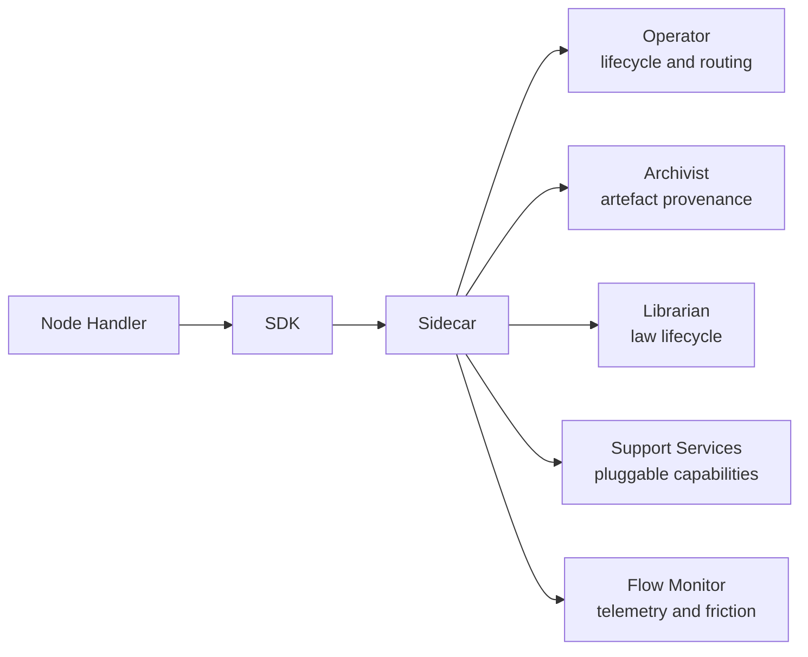

# SDK Overview

The SDK is the programming interface between node handler code and the Foundry Flow runtime. All runtime operations originating from a node — artefact reads and writes, law queries, feedback, stamp applications, routing decisions, and telemetry — pass through the SDK to the [Sidecar](../03-node/01-sidecar.md), which mediates authenticated access to runtime services.

A separate SDK surface, the [`FlowSupportService`](#flowsupportservice-base-class) base class, serves developers building [Flow Support Services](../02-flow/04-system-services.md#flow-support-services). Support Service development does not use the Workitem-scoped handler contract. For inference workloads, the [`FoundryAgent`](./07-sdk-agent.md) wrapper provides a managed handler contract with automatic heartbeat, output validation, and cost accounting.

## SDK Runtime Role

The SDK occupies the boundary between business logic and platform enforcement. Node handlers call SDK methods to express intent; the [Sidecar](../03-node/01-sidecar.md) authenticates and proxies those calls to the service that owns the affected state; the owning service authorises and persists the result.

The SDK abstracts transport, identity injection, and service topology from node code. Handlers program against SDK types (`Workitem`, `Artefact`, routing results) and never depend on Kubernetes CRD field paths, gRPC service addresses, or direct service credentials.

## Execution Scope Model

Every handler invocation is scoped to a single [Workitem](../02-flow/02-workitem.md) assignment. The Sidecar establishes an assignment session when the [Operator](../02-flow/01-operator.md) assigns a Workitem to the node, and all SDK calls within that session are automatically scoped to the assigned Workitem.

Assignment scoping is enforced at every layer:

- **SDK surface** — no parameter exists for targeting a foreign Workitem. Operations are implicitly scoped to the current assignment.
- **Sidecar** — injects `node_id`, `workitem_id`, and `flow_id` into every outgoing request. Requests referencing artefacts or state outside the current assignment are rejected before they reach a service.
- **Runtime services** — validate that incoming requests match the declared assignment context.

When a node is configured for concurrent processing (`concurrency > 1`), each assignment runs an independent session with its own Workitem scope, activity timer, and handler context. Thread safety within node code is the developer's responsibility.

## Trust and Authority Boundaries

The SDK expresses intent. It does not persist state, enforce governance, or make authoritative decisions.

| Layer | Responsibility |
|-------|---------------|
| SDK | Intent expression. Structured API for node business logic. |
| Sidecar | Authentication. Identity injection. Local validation (malformed requests, scope violations). |
| Operator | Workitem lifecycle persistence. Routing guard evaluation. Entry and exit contract enforcement. |
| [Archivist](../02-flow/04-system-services.md#archivist) | Artefact provenance persistence. Stamp authorisation (capability + write-once). Feedback state machine enforcement. Contempt guard. |
| [Librarian](../02-flow/04-system-services.md#librarian) | Law storage and retrieval. Law write authorisation. Integration and conflict detection. |
| [Flow Monitor](../02-flow/04-system-services.md#flow-monitor-and-friction-surface) | Telemetry and friction event ingestion. |
| Support Services | Capability-specific authorisation for pluggable operations. |

Node containers hold no Flow runtime credentials. The Sidecar holds identity material and attaches it to outgoing requests. This strict separation prevents credential leakage into node code and guarantees that all runtime attribution is Sidecar-authoritative.

## SDK Surface Map

The SDK is organised into domain-specific surfaces, each backed by a runtime service:

| Surface | Scope | Backing Service | Detail |
|---------|-------|-----------------|--------|
| [Core](./01-sdk-core.md) | Handler lifecycle, routing, completion | Operator (via Sidecar) | Handler contract, routing instructions, heartbeat |
| [Artefacts](./02-sdk-artefacts.md) | Read, write, version, stamp, inspect | Archivist (via Sidecar) | Content addressing, passport, stamp application |
| [Legal](./03-sdk-legal.md) | Law retrieval, citation, finding creation | Librarian (via Sidecar) | Query modes, citation friction, Tier 1 writes |
| [Feedback](./04-sdk-feedback.md) | Create, transition, query, resolve | Archivist (via Sidecar) | State machine, justification, contempt guard |
| [Workitems](./05-sdk-workitems.md) | Read state, create locally, inspect | Operator (via Sidecar) | Assignment-scoped access, snapshot semantics |
| [Telemetry](./06-sdk-telemetry.md) | Friction, metrics, traces, custom events | Flow Monitor (via Sidecar) | Additive friction, identity-injected signals |
| [Agent](./07-sdk-agent.md) | Managed inference wrapper | Operator + Flow Monitor (via Sidecar) | Automatic heartbeat, schema validation, atomic cost accounting |
| [HITL](./08-sdk-hitl.md) | Queue management, REST API, Federated Queue Mesh | Node-local (queue) + Operator (via Sidecar) | `QUEUE:server` capability, persistent queue, escalation |

All surfaces share the same trust model: SDK calls transit the Sidecar, which authenticates and proxies to the authoritative service.

## FlowSupportService Base Class

[Flow Support Services](../02-flow/04-system-services.md#flow-support-services) are optional, Flow-Architect-deployed containers that expose gRPC capabilities consumed by nodes (through Sidecar mediation) and by system services (through direct service-to-service calls). The SDK provides `FlowSupportService` as the base class for building these services.

`FlowSupportService` covers:

- **Capability declaration** — the service registers which capabilities it provides (e.g. `encode` for a [Codification Service](../02-flow/04-system-services.md#codification-services)).
- **gRPC endpoint registration** — capabilities are exposed as gRPC methods on the service's endpoint.
- **Health reporting** — mandatory `healthz` and `readyz` endpoints for [Operator](../02-flow/01-operator.md) lifecycle management and pod health checks.
- **Simplified permission model** — Support Services validate capability grants on incoming requests. A node must hold the `USE:support/<service>/<capability>` grant to invoke a capability. The permission model is distinct from the full node capability envelope.

`FlowSupportService` does not include Workitem, Artefact, or routing abstractions. Support Services do not process Workitems and do not participate in Workitem mutation flow or artefact provenance flow.

Specialised subtypes extend `FlowSupportService` with domain-specific contracts. `CodificationService` inherits from `FlowSupportService` and adds the `encode` capability contract for translating law goals into formal representations during [governance hardening](../01-concepts/04-governance.md#precedent).

## Failure and Error Model

SDK operations produce structured errors with stable error codes. Errors originate from the Sidecar (local validation) and from runtime services (authoritative enforcement):

**Sidecar-local rejections** — caught before the request reaches a service:

- Missing or malformed request parameters.
- Requests outside current Workitem assignment scope.
- Authentication failures (expired or invalid identity material).

**Service-side authorisation denials** — returned through the Sidecar as structured errors with no state change:

- Missing capability for the requested operation.
- Write-once stamp violation (same stamp name on same artefact version).
- Contempt violation (attempt to override a judicially-linked ruling).
- Invalid routing instruction (unresolvable output or target).

The SDK does not implement built-in error routing. When an SDK call fails, the handler receives a structured error and decides what failure means in its domain — retry, route elsewhere, or fail the assignment. Error classification utilities (`IsRetryable`, `IsError`) help handlers distinguish transient failures from permanent rejections.

Telemetry emission failures are non-blocking. If the telemetry sink is degraded, the SDK logs a warning and continues processing. Work execution never fails because telemetry delivery failed.

Stable error codes and their semantics are catalogued in the [Error Catalogue](../05-reference/error-catalogue.md). Wire-level error mappings are in the [gRPC API Reference](../05-reference/grpc-api.md).

## Relationship to Reference Documents

The SDK documents define behavioural contracts and API semantics. Implementation-level details live in reference documents:

- [gRPC API Reference](../05-reference/grpc-api.md) — wire-level service and method definitions, request/response shapes, status code mappings.
- [CRD Reference](../05-reference/crds.md) — Kubernetes resource schemas, field constraints, validation rules.
- [Error Catalogue](../05-reference/error-catalogue.md) — complete error code inventory, causes, and caller response guidance.
- [Glossary](../05-reference/glossary.md) — canonical term definitions.

## SDK Invariants

1. All SDK operations are scoped to the current Workitem assignment.
2. All node-originated runtime operations transit the Sidecar.
3. The SDK expresses intent; authoritative state persistence belongs to runtime services.
4. Node containers hold no Flow runtime credentials.
5. Structured errors with stable codes are the sole failure signalling mechanism.
6. Capability gates are enforced by the owning service, not by the SDK or the node.
7. Telemetry failures do not block or fail work execution.
8. The SDK does not expose Kubernetes CRD field paths or direct service addresses.
9. `FlowSupportService` is a distinct SDK surface from the Workitem-scoped handler contract.
10. No SDK surface provides a freeform context bag, `WorkitemType`, or `spec.type` discriminator.
