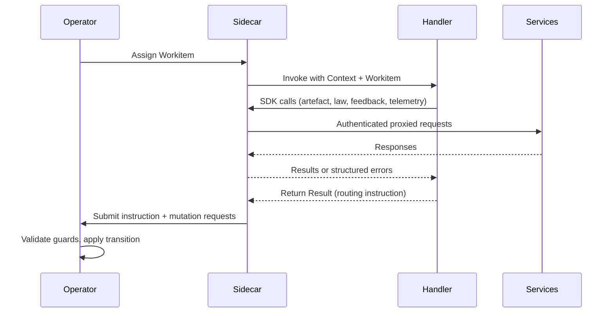

# SDK Core

The core SDK contract defines handler invocation, routing outcomes, and the behavioural rules that all [domain-specific SDK surfaces](./00-overview.md#sdk-surface-map) inherit.

## Core Types

The SDK exposes a small set of first-class types. Node handlers program against these abstractions and never depend on CRD field paths or service wire formats.

| Type | Role | Detail |
|------|------|--------|
| `Workitem` | Read surface for the assigned Workitem's state — identity, lifecycle state, and assignment tracking. | [SDK Workitems](./05-sdk-workitems.md) |
| `Artefact` | Read/write surface for artefact content, versions, feedback, and stamps. One `Artefact` object per artefact associated with the Workitem in the Archivist. | [SDK Artefacts](./02-sdk-artefacts.md) |
| `Context` | Handler execution context. Carries assignment identity and a cancellation signal. Cancelled on inactivity timeout or graceful termination. | [Sidecar lifecycle](../03-node/01-sidecar.md) |
| `Result` | The handler's single return value: one of three [routing instructions](#routing-instruction-model). | Below |

## Handler Lifecycle Contract

A handler is invoked once per [Workitem](../02-flow/02-workitem.md) assignment. The [Sidecar](../03-node/01-sidecar.md) calls the handler when the [Operator](../02-flow/01-operator.md) assigns a Workitem to the node.

The handler contract:

1. **Receive** — the handler receives a `Context` and a `Workitem`. The `Workitem` is a snapshot of state at assignment time.
2. **Execute** — the handler uses SDK domain surfaces to read and write artefacts, query laws, create feedback, apply stamps, and emit telemetry. Every SDK call transits the Sidecar.
3. **Return** — the handler returns exactly one `Result` containing a routing instruction. This is the handler's sole output to the platform.

A handler that returns without a `Result` (panic, unhandled error) leaves the Workitem in `Running` state. The Sidecar's inactivity timeout eventually fires, cancels the handler context, reports the failure to the Operator, and the Operator transitions the Workitem to `Failed` with a timeout reason. The pod remains alive for subsequent assignments.

## Routing Instruction Model

Every handler returns one routing instruction. The instruction tells the [Operator](../02-flow/01-operator.md) where the Workitem goes next.

| Instruction | Semantics | Constraint |
|-------------|-----------|------------|
| `RouteToOutput(name)` | Route the Workitem through a named output channel defined on the [FoundryNode](../05-reference/crds.md). The Operator resolves the output name to a target node using the node's [routing configuration](../02-flow/05-configuration.md#routing-semantics). | Output name must exist in the node's configured outputs. |
| `RouteTo(node)` | Route the Workitem directly to a specific node by name. | Target node must exist as a FoundryNode in the namespace. |
| `Complete()` | Signal exit completion. The Workitem is ready for [exit contract](../02-flow/05-configuration.md#entry-and-exit-contract-semantics) validation. | Node must be bound to an exit contract. Non-exit nodes receive an error. |

Invalid instructions — unresolvable output names, nonexistent target nodes, `Complete()` from a non-exit node — are rejected with structured errors. The Workitem state does not advance on rejection; the handler receives the error and decides how to respond.

Only one instruction is accepted per assignment. There is no partial routing, no conditional branching within a single handler return, and no deferred instruction.

## Completion Semantics

`Complete()` is a submission of work, not a declaration of validity. When a node calls `Complete()`, it signals that processing is finished and hands control to the platform. The node makes no assertion about whether artefacts satisfy any governance contract.

Exit contract validation happens after the SDK call, within the [Operator](../02-flow/01-operator.md). The SDK does not pre-validate against the contract locally. If artefacts lack required stamps as defined by the node's bound [exit contract](../02-flow/05-configuration.md#entry-and-exit-contract-semantics), the Operator rejects the completion and returns a structured error. The node does not choose which contract to validate — the binding is fixed in [FoundryNode configuration](../03-node/02-configuration.md#entry-and-exit-bindings).

All governance decisions are made in a single, authoritative location — the Operator — and never duplicated in node code.

When exit completion triggers [cross-flow export](../02-flow/06-cross-flow.md), only governed artefact names listed in the bound exit contract are exported. An empty contract exports metadata only.

## Heartbeat and Activity Tracking

The Sidecar tracks handler liveness through an inactivity timer. Every SDK call that transits the Sidecar implicitly resets this timer. For handlers that perform long-running computation without SDK calls, the SDK exposes an explicit `Heartbeat()` method to reset the timer.

Timeout enforcement is inactivity-based, not wall-clock-based. The timer resolves from the most specific configuration available: node-level timeout, Flow-level default, then system fallback.

On timeout expiry:

1. Sidecar cancels the handler `Context`.
2. Sidecar reports the timeout to the Operator.
3. Operator transitions the Workitem to `Failed` with a timeout reason.
4. The pod remains alive for subsequent assignments.

For inference workloads that perform long-running LLM calls, the [FoundryAgent](./07-sdk-agent.md) wrapper automates heartbeat management entirely — the developer implements an `Infer` method and FoundryAgent maintains the heartbeat loop throughout inference execution. Nodes that do not use FoundryAgent must call `Heartbeat()` explicitly during extended computation.

## Error Taxonomy and Recovery

SDK errors fall into categories based on where they originate.

**Sidecar-local rejections** — caught before the request reaches a service:

| Cause | Behaviour |
|-------|-----------|
| Missing or malformed parameters | Rejected with validation error |
| Request outside assignment scope | Rejected with scope violation error |
| Expired or invalid identity material | All requests fail until certificate renewal |

**Service-side denials** — returned through the Sidecar as structured errors with no state change:

| Cause | Behaviour |
|-------|-----------|
| Missing capability | `CAPABILITY_DENIED` |
| Write-once stamp violation | Stamp already applied to this version |
| [Contempt violation](./04-sdk-feedback.md#contempt-guard-behaviour) | `CONTEMPT_VIOLATION` |
| Invalid routing instruction | Unresolvable output or target |
| Non-exit `Complete()` | Node not bound to exit contract |
| Artefact identity conflict | Existing `id` with different `governedArtefact` |
| Service unavailable | Transient unavailability error |

Error classification utilities:

- `IsRetryable(err)` — returns `true` for transient failures (service unavailable, deadline exceeded, resource exhausted). Transient errors can be retried with exponential backoff.
- `IsError(err, code)` — checks whether the error matches a specific stable error code.

The SDK does not implement built-in error routing. When an operation fails, the handler receives a structured error and decides what failure means in its business domain. A handler may retry, route to a different node, or let the assignment fail. The stable error code inventory is in the [Error Catalogue](../05-reference/error-catalogue.md).

## Concurrency and Idempotency

When a node is configured with `concurrency > 1`, the Sidecar manages multiple assignment sessions simultaneously. Each session has its own `Context`, `Workitem` scope, activity timer, and handler invocation. SDK calls from concurrent handlers are routed to the correct session by Workitem identity.

Thread safety within handler code is the developer's responsibility. The SDK provides per-assignment isolation at the Sidecar boundary but does not coordinate shared in-process state between concurrent handlers.

Handlers should be designed for replay safety. If a Workitem is reassigned after a failure (timeout, pod eviction, transient error), the replacement handler sees the same Workitem with whatever artefact state was persisted by prior processing. Artefact writes are content-addressed: storing identical content is a no-op (same hash, no new version). Stamp applications are write-once: re-applying the same stamp to the same version produces an error. Handlers that account for these idempotency properties are naturally replay-safe.

## Core Invariants

1. One handler invocation per assignment. One routing instruction per invocation.
2. All SDK calls are scoped to the current Workitem assignment.
3. All node-originated runtime operations transit the [Sidecar](../03-node/01-sidecar.md).
4. `Complete()` is accepted only from exit-bound nodes; the [Operator](../02-flow/01-operator.md) validates the bound exit contract.
5. The SDK does not pre-validate governance contracts.
6. Structured errors with stable codes are the sole failure signalling mechanism.
7. Inactivity timeout, not wall-clock duration, governs handler liveness.
8. A handler that terminates without returning a `Result` leaves the Workitem in `Running` until timeout.
9. Concurrent assignments are isolated at the Sidecar boundary; thread safety is the developer's responsibility.
10. Content-addressed writes and write-once stamps provide natural idempotency for replay-safe handler design.
