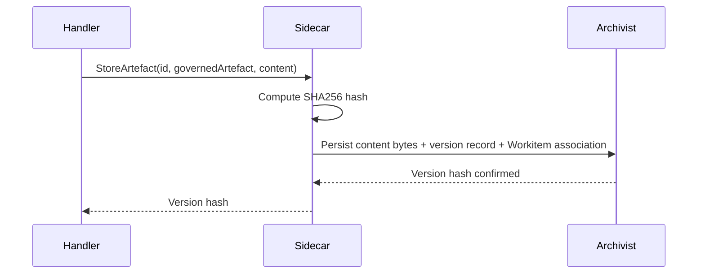

# SDK Artefacts

The artefact SDK surface provides read, write, versioning, and stamp operations for [governed artefacts](../01-concepts/03-data-model.md#governed-artefacts). All artefact state — version history, passport stamps, feedback, and raw content bytes — is persisted by the [Archivist](../02-flow/04-system-services.md#archivist). The SDK mediates access through the [Sidecar](../03-node/01-sidecar.md); nodes never interact with the Archivist directly.

## Artefact Identity Semantics

Each artefact on a [Workitem](../02-flow/02-workitem.md) is identified by two fields:

| Field | Behaviour |
|-------|-----------|
| `id` | Unique within the Workitem. Fixed once introduced — the same `id` refers to the same artefact for the Workitem's lifetime. Used as the primary key for all Archivist lookups. |
| `governedArtefact` | Immutable for a given `id`. Matches a [GovernedArtefact](../05-reference/crds.md#governedartefact) `metadata.name` declared in the Flow. Determines which [laws](./03-sdk-legal.md), [stamps](#stamp-operations), and [contract requirements](../02-flow/05-configuration.md#entry-and-exit-contract-semantics) apply. |

Multiple artefacts of the same `governedArtefact` are supported — each has a distinct `id`.

The [Archivist](../02-flow/04-system-services.md#archivist) is the single source of truth for artefact-to-Workitem associations. Each artefact records the `workitem_id` it belongs to. The Archivist stores full version history, stamps, and feedback, keyed by `workitem_id` and artefact `id`. This keeps the Workitem CRD small and watchable regardless of version depth or feedback volume.

## Read and Query Operations

Artefact reads are scoped to the current [assignment](./01-sdk-core.md#handler-lifecycle-contract). No parameter exists for targeting artefacts on a different Workitem.

| Operation | Returns |
|-----------|---------|
| `GetArtefact(id)` | The latest version's content bytes for the specified artefact. |
| `GetArtefactVersion(id, versionHash)` | Content bytes for a specific version, identified by content hash. |
| `GetArtefactMetadata(id)` | Version history list and passport (stamps) without content bytes. |
| `ListArtefacts()` | All artefacts (`id`, `governedArtefact`) associated with the current Workitem, queried from the Archivist. |

The Sidecar verifies content integrity on fetch: `SHA256(content) == storedHash`. A hash mismatch produces an `ARTEFACT_CORRUPTED` error.

The Sidecar caches artefact content for the duration of the handler invocation. Repeated reads of the same version within one handler do not generate additional Archivist requests. The cache is discarded when the assignment completes.

The `Workitem` object returned at handler invocation is a snapshot of state at assignment time. Artefact content, versions, and stamps are fetched from the Archivist on demand through the operations above.

## Write and Versioning Operations

Artefact writes are content-addressed. Every version is identified by a SHA256 hash of its content.

| Operation | Behaviour |
|-----------|-----------|
| `StoreArtefact(id, governedArtefact, content)` | Writes content to the Archivist. For a new `id`, the Archivist creates the artefact record associated with the current Workitem. |

Write outcomes depend on whether the `id` already exists on the Workitem:

| Scenario | Outcome |
|----------|---------|
| New `id` | Archivist stores content, version record, and artefact-to-Workitem association (`id`, `governedArtefact`, `workitem_id`). |
| Existing `id`, same `governedArtefact`, new content | Archivist stores a new version. Workitem reference unchanged. |
| Existing `id`, same `governedArtefact`, identical content | No-op. Content hash matches an existing version — no new version is created. |
| Existing `id`, different `governedArtefact` | **Rejected.** `governedArtefact` is immutable for a given `id`. Returns an identity conflict error. |

The Sidecar computes the content hash before sending the write to the Archivist. The node does not compute or supply hashes.

A new version starts with an empty passport — no stamps carry over from previous versions. Stamps are bound to a specific content hash; changing content invalidates all prior governance sign-off.

## Stamp Operations

[Stamps](../01-concepts/03-data-model.md#passports-and-stamps) are named governance checkpoints on an artefact's passport. The SDK provides inspection and application operations.

### Stamp Inspection

| Operation | Returns |
|-----------|---------|
| `GetStamps(id)` | Full list of stamps on the artefact's current version. |
| `HasStamp(id, name)` | `true` if the named stamp exists on the current version. |

Stamp inspection methods are factual queries. The SDK exposes what stamps exist, not what they mean. Governance semantics — which stamps are required, whether an artefact is "approved" — belong to the [Operator](../02-flow/01-operator.md) and [exit contract](../02-flow/05-configuration.md#entry-and-exit-contract-semantics) configuration.

Methods that interpret stamp semantics are intentionally absent:

- No `IsValid()`, `IsCompliant()`, or `Satisfies(contract)` — the node does not judge artefact validity.
- No `IsApproved()` or `IsSecurityReviewed()` — stamp names are conventions chosen by the [Flow Architect](../02-flow/05-configuration.md), not privileged system constants.

### Stamp Application

| Operation | Behaviour |
|-----------|-----------|
| `StampArtefact(id, stampName)` | Apply a named stamp to the artefact's current version. |

Stamp application is capability-gated. The node must hold `STAMP:artefact/<governed-artefact-name>/<stamp-name>` for the artefact's governed artefact name and the specific stamp name. The stamp name must also be declared in the artefact's [GovernedArtefact](../05-reference/crds.md#governedartefact) stamp vocabulary — stamp names not in the vocabulary are rejected at configuration admission. The [Archivist](../02-flow/04-system-services.md#archivist) validates the capability grant and records the stamp with the applying node's identity, the artefact's current content hash, and a cryptographic signature from the Sidecar's identity material.

Stamps are write-once per artefact version. Applying the same stamp name to the same content hash a second time — whether from the same node or a different one — produces an error. If two different nodes need to independently sign off on the same artefact, define two different stamp names.

The platform attaches no special semantics to any stamp name. "approval", "linter", "security-review" are naming conventions. The [reference arrangement](../01-concepts/02-foundry-cycle.md) uses an "approval" stamp applied by Sort as the final gate, but this is convention, not system behaviour.

## Capability-Gated Actions

Artefact operations map to capability requirements enforced by the backing service:

| Operation | Required Capability | Enforcing Service |
|-----------|-------------------|-------------------|
| Read operations (`GetArtefact`, `GetArtefactVersion`, `GetArtefactMetadata`) | `READ:artefact` | Archivist |
| `ListArtefacts` | Assignment scope (implicit) | Archivist |
| `StoreArtefact` | `WRITE:artefact` or `WRITE:artefact/<governed-artefact-name>` | Archivist |
| `StampArtefact` | `STAMP:artefact/<governed-artefact-name>/<stamp-name>` | Archivist |
| Feedback operations | See [SDK Feedback](./04-sdk-feedback.md#capability-and-error-semantics) | Archivist |

Missing capabilities produce a `CAPABILITY_DENIED` error from the service. The Sidecar forwards the denial to the handler as a structured error with no state change.

## Provenance and Audit

The [Archivist](../02-flow/04-system-services.md#archivist) is the sole authority for artefact provenance. Version history, stamp records, and feedback state are persisted in the Archivist's SQLite database. Raw content bytes are stored in the blob store, keyed by content hash.

Audit trails for artefact mutations — version creation, stamp application, feedback transitions — are emitted by the Archivist, not by node code. The Archivist records the acting node's identity (injected by the Sidecar), the affected artefact, the operation, and a timestamp. Nodes do not need to emit supplementary audit telemetry for artefact operations; the authoritative record is service-owned.

## Artefact Invariants

1. `id` is unique and stable within a Workitem; `governedArtefact` is immutable for a given `id`.
2. All artefact operations are scoped to the current Workitem assignment.
3. Content is addressed by SHA256 hash. Identical content produces no new version.
4. New versions start with an empty passport. Stamps do not carry over.
5. Stamps are write-once per artefact version per stamp name.
6. Stamp application requires `STAMP:artefact/<governed-artefact-name>/<stamp-name>` capability.
7. The SDK does not expose methods that interpret stamp semantics (no `IsValid`, no `IsApproved`).
8. The [Archivist](../02-flow/04-system-services.md#archivist) is the sole persistence authority for artefact provenance.
9. The Sidecar verifies content integrity on read and computes hashes on write.
10. Artefact content is cached by the Sidecar for the handler invocation duration.
